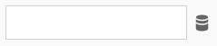

# Viste nelle estensioni Web

>[!NOTE]
>
>Con il suo rebranding, Adobe Experience Platform Launch viene riproposto come una suite di tecnologie per la raccolta dati all’interno di Experience Platform. Di conseguenza, sono state introdotte diverse modifiche terminologiche nella documentazione del prodotto. Consulta questo [documento](../../term-updates.md) come riferimento consolidato delle modifiche terminologiche.

Ogni evento, condizione, azione o tipo di elemento dati può offrire una vista mediante la quale l’utente potrà specificare alcune impostazioni. L’estensione può anche avere una [vista di livello superiore per la configurazione dell’estensione](../configuration.md), mediante la quale gli utenti possono specificare impostazioni globali per tutta l’estensione. Il processo di creazione è identico per tutti i tipi di vista.

## Inclusione di un tipo di documento

Assicurati di includere un tag `doctype` nel file HTML. Generalmente il file HTML dovrà iniziare con il codice seguente:

```xml
<!DOCTYPE html>
```

## Inclusione dello script iframe dei tag

Includi lo script iframe dei tag nell’HTML della visualizzazione:

```html
<script src="https://assets.adobedtm.com/activation/reactor/extensionbridge/extensionbridge.min.js"></script>
```

Questo script fornisce un’API di comunicazione per consentire alla visualizzazione di comunicare con l’applicazione tag.

## Registrazione con l’API di comunicazione bridge per l’estensione

Una volta caricato lo script iframe, dovrai fornire alcuni metodi ai tag che userà per la comunicazione. Richiama `window.extensionBridge.register` e trasmettilo come oggetto nel modo seguente:

```js
window.extensionBridge.register({
  init: function(info) {
    // Populate view with info.settings which will exist if the user is editing something
    // that was previously saved.
    if (info.settings) {
      document.getElementById('name').value = info.settings.name;
    }
  },
  validate: function() {
    // Return whether the view is valid.
    return document.getElementById('name').value.length > 0;
  },
  getSettings: function() {
    // Return user-provided settings.
    return {
      name: document.getElementById('name').value
    };
  }
});
```

Il contenuto di ciascun metodo dovrà essere modificato in base ai requisiti specifici della vista.

### [!DNL init]

Il metodo `init` viene richiamato dai tag non appena la visualizzazione viene caricata nell’iframe. Verrà trasmesso un singolo argomento (`info`) che dovrà essere un oggetto contenente le seguenti proprietà:

| Proprietà | Descrizione |
| --- | --- |
| `settings` | Oggetto contenente le impostazioni precedentemente salvate dalla vista. Se `settings` corrisponde a `null`, indica che l’utente sta creando le impostazioni iniziali anziché caricare una versione salvata. Se `settings` corrisponde a un oggetto, utilizzalo per compilare la vista, poiché l’utente sta scegliendo di modificare le impostazioni persistenti precedenti. |
| `extensionSettings` | Impostazioni salvate dalla vista di configurazione dell’estensione. Questa proprietà può essere utile per accedere alle impostazioni dell’estensione in altre viste, diverse da quella di configurazione dell’estensione. Se la vista corrente è quella di configurazione dell’estensione, utilizza `settings`. |
| `propertySettings` | Oggetto contenente le impostazioni della proprietà. Per informazioni dettagliate sul contenuto di questo oggetto, consulta la [guida agli oggetti “turbine”](../turbine.md#property-settings). |
| `tokens` | Oggetto contenente token API. Per accedere alle API di Adobe dall’interno della vista, in genere si utilizza un token IMS in `tokens.imsAccess`. Questo token sarà disponibile solo per le estensioni sviluppate da Adobe. Se sei un dipendente Adobe che rappresenta un&#39;estensione creata da Adobe, invia un&#39;e-mail al team di ingegneria della raccolta dati](mailto:reactor@adobe.com) e specifica il nome dell&#39;estensione in modo che possiamo aggiungerla all&#39;elenco Consentiti.[ |
| `company` | Oggetto contenente una singola proprietà, `orgId`, che rappresenta il tuo Adobe Experience Cloud ID (stringa alfanumerica di 24 caratteri). |
| `schema` | Oggetto in formato [JSON Schema](http://json-schema.org/). Questo oggetto proviene dal [manifesto dell’estensione](../manifest.md) e può essere utile per convalidare il modulo. |

La tua vista deve utilizzare queste informazioni per riprodurre e gestire il modulo. Probabilmente dovrai usare solo `info.settings`, ma le altre informazioni vengono fornite nel caso siano necessarie.

### [!DNL validate]

Il metodo `validate` viene richiamato dopo che l’utente ha premuto il pulsante Salva. Deve restituire uno dei seguenti valori:

* Valore booleano che indica se quanto immesso dall’utente è valido.
* Promessa da risolvere successivamente con un valore booleano che indica se quanto immesso dall’utente è valido.

In quanto sviluppatore di estensioni, sta a te determinare cosa costituisce un valore immesso valido, poiché il modulo libreria agirà in base a tale input.

Se l’utente immette un valore non valido, fai in modo che nella vista venga visualizzato qualcosa che segnali all’utente che è necessario correggerlo.

### [!DNL getSettings]

Il metodo `getSettings` verrà richiamato dopo che l’utente avrà premuto il pulsante Salva e che la vista sarà stata convalidata. La funzione deve restituire uno dei seguenti valori:

* Oggetto contenente le impostazioni basate su quanto immesso dall’utente.
* Promessa da risolvere successivamente con un oggetto contenente impostazioni basate su quanto immesso dall’utente.

Questo oggetto delle impostazioni verrà successivamente emesso nella libreria di runtime di tag. Il contenuto di questo oggetto è a tua discrezione. L’oggetto deve essere serializzabile e deserializzabile in e da JSON. Valori come funzioni o istanze [RegExp](https://developer.mozilla.org/en-US/docs/Web/JavaScript/Reference/Global_Objects/RegExp) non soddisfano questi criteri e pertanto non sono consentiti.

## Riutilizzo delle viste condivise

L’oggetto `window.extensionBridge` dispone di diversi metodi che consentono di sfruttare le visualizzazioni esistenti disponibili tramite i tag, in modo da non doverle riprodurre all’interno della visualizzazione. Sono disponibili i seguenti metodi:

### [!DNL openCodeEditor]

```js
window.extensionBridge.openCodeEditor().then(function(code) { 
  console.log(code);
});
```

Quando si richiama questo metodo viene visualizzata una finestra modale che consente all’utente di modificare uno snippet di codice. Una volta completata la modifica del codice, la promessa verrà risolta con il codice aggiornato. Se l’utente chiude l’editor del codice senza salvare le modifiche, la promessa non verrà mai risolta. L’oggetto `options` deve essere strutturato nel modo seguente:

| Proprietà | Descrizione |
| --- | --- |
| `code` | Codice che deve essere mostrato nell’editor. Questo generalmente viene fornito quando l’utente modifica del codice esistente. In caso contrario, all’apertura l’editor del codice si presenta vuoto. |
| `language` | Linguaggio del codice che verrà modificato. Le opzioni valide sono `javascript`, `html`, `css`, `json` e `plaintext`. Se non viene specificato, verrà utilizzato `javascript`. |

### [!DNL openRegexTester]

```js
window.extensionBridge.openRegexTester().then(function(pattern) { 
  console.log(pattern);
});
```

Quando si richiama questo metodo, verrà visualizzata una finestra modale che consente all’utente di verificare e modificare un pattern di espressione regolare. Quando l’utente ha finito di modificare l’espressione regolare, la promessa verrà risolta con il pattern di espressione regolare aggiornato. Se l’utente chiude il regex tester senza salvare le modifiche, la promessa non verrà mai risolta. L’oggetto `options` deve contenere le seguenti proprietà:

| Proprietà | Descrizione |
| --- | --- |
| `pattern` | Pattern di espressione regolare da utilizzare come valore iniziale del campo del pattern all’interno del tester. Questo generalmente viene fornito quando l’utente modifica un’espressione regolare esistente. In caso contrario, inizialmente il campo del pattern sarà vuoto. |
| `flags` | Flag di espressione regolare che devono essere utilizzati dal tester. Ad esempio, `gi` potrebbe indicare il flag di corrispondenza globale e il flag di esclusione della distinzione tra maiuscole e minuscole. Questi flag non possono essere modificati dall’utente nel tester, ma vengono utilizzati per dimostrare i flag specifici che l’estensione utilizzerà durante l’esecuzione dell’espressione regolare. Se non vengono speficati, nel test non verrà utilizzato alcun flag. Per ulteriori informazioni sui flag per espressioni regolari, consulta la [documentazione RegExp di MDN](https://developer.mozilla.org/en-US/docs/Web/JavaScript/Reference/Global_Objects/RegExp).<br><br>Un esempio d’uso comune è dato da un’estensione che consente agli utenti di attivare o disattivare la distinzione tra maiuscole e minuscole per un’espressione regolare. Per supportare questo, l’estensione fornisce in genere una casella di controllo all’interno della relativa visualizzazione dell’estensione che, se selezionata, abilita l’insensibilità alle maiuscole/minuscole (rappresentata dal flag `i` ). L’oggetto impostazioni salvato dalla vista deve indicare se la casella di controllo è stata selezionata, affinché il modulo libreria che esegue l’espressione regolare possa sapere se utilizzare il flag `i`. Inoltre, quando la visualizzazione dell&#39;estensione desidera aprire il tester dell&#39;espressione regolare, deve passare il flag `i` se la casella di controllo relativa all&#39;insensibilità alla maiuscole/minuscole è selezionata. Questo consente all’utente di testare correttamente l’espressione regolare con l’opzione di distinzione tra maiuscole e minuscole attivata. |

### [!DNL openDataElementSelector] {#open-data-element}

```js
window.extensionBridge.openDataElementSelector().then(function(dataElement) { 
  console.log(dataElement);
});
```

Quando si richiama questo metodo, viene visualizzata una finestra modale che consente all’utente di selezionare un elemento dati. Una volta selezionato un elemento dati, la promessa viene risolta con il nome dell’elemento dati selezionato (per impostazione predefinita il nome è racchiuso tra simboli di percentuale). Se l’utente chiude il selettore di elementi senza salvare le modifiche, la promessa non verrà mai risolta.

L&#39;oggetto `options` deve contenere una singola proprietà booleana, `tokenize`. Questa proprietà indica se il nome dell’elemento dati selezionato deve essere racchiuso tra simboli di percentuale prima di risolvere la promessa. Per informazioni sull’utilità di questa proprietà, consulta la sezione relativa agli [elementi dati di supporto](#supporting-data-elements). L’impostazione predefinita di questa opzione è `true`.

## Elementi dati di supporto {#supporting-data-elements}

Le visualizzazioni dispongono probabilmente di campi modulo in cui gli utenti desiderano sfruttare gli elementi dati. Ad esempio, se nella visualizzazione è presente un campo di testo in cui l’utente deve immettere un nome di prodotto, potrebbe non avere senso digitare un valore hardcoded nel campo. Sarà invece preferibile usare un valore dinamico (determinato in fase di esecuzione), e questo sarà possibile tramite l’utilizzo di un elemento dati.

Ad esempio, supponiamo di voler creare un’estensione che invia un beacon per tenere traccia di una conversione. Supponiamo inoltre che uno dei dati che il beacon invia sia un nome di prodotto. La visualizzazione dell&#39;estensione che consente all&#39;utente di configurare il beacon avrà probabilmente un campo di testo per il nome del prodotto. In genere sarà megliio evitare che l’utente di Platform debba immettere un nome di prodotto statico come “Calzone Oven XL”, perché il nome del prodotto dipenderà dalla pagina da cui verrà inviato il beacon. In situazioni di questo tipo si può ricorrere all’utilizzo di un elemento dati.

Se un utente desidera utilizzare l’elemento dati denominato `productname` per il valore del nome del prodotto, può digitare il nome dell’elemento dati racchiuso tra simboli di percentuale (`%productname%`). Ci riferiamo al nome dell’elemento dati con wrapping di segno percentuale come &quot;token elemento dati&quot;. Gli utenti di Platform hanno spesso familiarità con questo costrutto. L’estensione, a sua volta, dovrà salvare il token di elemento dati nell’oggetto `settings` esportato. L’oggetto impostazioni si presenterà quindi così:

```js
{
  productName: '%productname%'
}
```

In fase di runtime, prima di passare l’oggetto settings al modulo libreria, viene eseguita la scansione dell’oggetto settings e tutti i token degli elementi dati vengono sostituiti con i rispettivi valori. Se in fase di esecuzione il valore dell&#39;elemento dati `productname` era `Ceiling Medallion Pro 2000`, l&#39;oggetto impostazioni che verrebbe passato al modulo libreria sarebbe il seguente:

```js
{
  productName: 'Ceiling Medallion Pro 2000'
}
```

Per indicare dove può essere utile per l’utente utilizzare gli elementi dati e per facilitarne l’immissione, si consiglia di aggiungere ai campi un pulsante di icona, come illustrato di seguito:



Quando un utente fa clic sul pulsante accanto al campo di testo, richiama `window.extensionBridge.openDataElementSelector` come [indicato sopra](#open-data-element). L’utente potrà quindi scegliere uno degli elementi dati elencati, anziché dover ricordare il nome e immetterlo tra simboli di percentuale. Una volta selezionato un elemento dati, riceverai il nome di tale elemento dati racchiuso tra simboli di percentuale (a meno che l’opzione `tokenize` non sia stata impostata su `false`). È quindi consigliabile compilare il campo di testo con il risultato.

### Sostituzione dei token di elementi dati

Come descritto in precedenza, se un oggetto impostazioni persistente è costituito dai seguenti elementi:

```js
{
  productName: '%productname%'
}
```

e se, in fase di esecuzione, il valore dell’elemento dati `productname` e `Ceiling Medallion Pro 2000`, l’oggetto impostazioni nel modulo libreria si presenta come segue:

```js
{
  productName: 'Ceiling Medallion Pro 2000'
}
```

Ogni volta che in un oggetto impostazioni viene rilevato un valore costituito _solo_ da un simbolo di percentuale seguito da una stringa e da un altro simbolo di percentuale, questo viene sostituito dal valore dell’elemento dati _senza modificare il tipo di valore dell’elemento dati_.

Ad esempio, se in fase di esecuzione il valore di `productname` fosse invece il numero `538` (non una stringa di testo), l’oggetto impostazioni trasmesso al modulo libreria sarebbe il seguente:

```js
{
  productName: 538
}
```

Tieni presente che il risultato `538` qui corrisponde a un numero e non a una stringa. Analogamente, se il valore dell’elemento dati in fase di esecuzione fosse una funzione (un caso di utilizzo raro, ma possibile), l’oggetto impostazioni risultante sarebbe il seguente:

```js
{
  productName: function() { … }
}
```

Oppure, supponiamo che l’oggetto impostazioni persistente sia il seguente:

```js
{
  productName: '%productname% - %modelnumber%'
}
```

In questo caso, poiché il valore di `productName` è più di un singolo token di elemento dati, il risultato sarà sempre una stringa. Ciascun token di elemento dati verrà sostituito dal relativo valore dopo essere stato trasmesso a una stringa. Se in fase di esecuzione il valore di `productname` era `Ceiling Medallion Pro` (una stringa) e `modelnumber` era `2000` (un numero), l&#39;oggetto impostazioni risultante passato nel modulo libreria sarebbe:

```js
{
  productName: 'Ceiling Medallion Pro - 2000'
}
```

## Evitare la navigazione

La comunicazione tra la vista dell&#39;estensione e l&#39;interfaccia utente di raccolta dati contenitore è subordinata al fatto che non si verifica alcuna navigazione all&#39;interno della vista dell&#39;estensione. Pertanto, evita di aggiungere alla vista dell’estensione elementi che consentano all’utente di allontanarsi dalla rispettiva pagina HTML. Ad esempio, se all’interno della vista dell’estensione inserisci un collegamento, accertati che questo venga aperto in una nuova finestra del browser (in generale aggiungendo `target="_blank"` al tag di ancoraggio). Se utilizzi un elemento `form` all’interno della vista dell’estensione, assicurati che il modulo non venga mai inviato. L’invio del modulo può avvenire accidentalmente se nel modulo è presente un elemento `button` ma non vi è stato aggiunto `type="button"`. L’invio di un modulo all’interno della vista dell’estensione potrebbe causare l’aggiornamento del documento HTML, con conseguente errore nell’esperienza di utilizzo.
