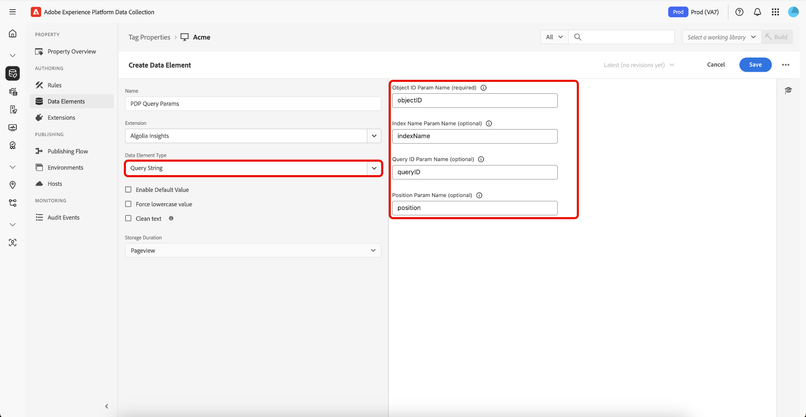

# Panoramica dell&#39;estensione tag [!DNL Algolia]

L&#39;estensione tag [!DNL Algolia] consente agli addetti al marketing di impostare facilmente regole che inviano dati di interazione dell&#39;utente a [!DNL Algolia], consentendoti di fornire esperienze di ricerca e individuazione basate su IA più personalizzate.

Questa estensione è basata su una funzione chiave:

* **[!DNL Algolia]Approfondimenti**: acquisisce e invia automaticamente gli eventi di interazione dell&#39;utente a [!DNL Algolia], consentendo potenti funzionalità di analisi, esperienze personalizzate e una maggiore rilevanza della ricerca.

## Prerequisiti {#prerequisites}

Per utilizzare questa estensione, è necessario disporre di un account [!DNL Algolia] valido. Vai alla [[!DNL Algolia] pagina di registrazione](https://dashboard.algolia.com/users/sign_up) per creare un account, se non ne hai già uno.

### Raccogliere i dettagli di configurazione richiesti {#configuration-details}

Per connettere [!DNL Algolia] a Adobe Experience Platform, sono necessarie le seguenti informazioni:

| Credenziali | Descrizione | Esempio |
| --- | --- | --- |
| ID applicazione | Il tuo ID applicazione si trova nella sezione [Chiavi API](https://www.algolia.com/account/api-keys/all) del tuo dashboard [!DNL Algolia]. | 0ABCDEFG12 |
| Chiave API di ricerca | La chiave API di ricerca si trova nella sezione [Chiavi API](https://www.algolia.com/account/api-keys/all) del dashboard [!DNL Algolia]. | 1234a12345678901b1234567890c1ab1 |

## Installa e configura l&#39;estensione [!DNL Algolia] Insights {#install-configure}

Per installare l&#39;estensione [!DNL Algolia] Insights, passa alla [!UICONTROL interfaccia utente di Data Collection] e seleziona **[!UICONTROL Tag]** dal menu di navigazione a sinistra. Da qui, seleziona una proprietà a cui aggiungere l’estensione o creane una nuova.

Dopo aver selezionato o creato la proprietà desiderata, seleziona **[!UICONTROL Estensioni]** nel menu di navigazione a sinistra, quindi seleziona la scheda **[!UICONTROL Catalogo]**. Cerca la scheda Approfondimenti [!DNL Algolia], quindi seleziona **[!UICONTROL Installa]**.


Nella vista di configurazione visualizzata, è necessario fornire i dettagli seguenti:

| Proprietà | Descrizione |
| --- | --- |
| ID applicazione | Immetti l&#39;[!UICONTROL ID applicazione] raccolto in precedenza nella sezione [dettagli configurazione](#configuration-details). |
| Chiave API di ricerca | Immetti la [!UICONTROL Chiave API di ricerca] raccolta in precedenza nella sezione [dettagli configurazione](#configuration-details). |
| Nome indice | Il [!UICONTROL Nome indice] contiene i prodotti o il contenuto.  Questo indice verrà utilizzato come valore predefinito. |
| Elemento dati token utente | Elemento dati che restituirà il token utente. |
| Elemento dati token utente autenticato | Imposta l’elemento dati che restituirà il token utente autenticato. |
| Valuta | Selezionare un tipo di valuta.  Il valore predefinito è `USD`. |


## Tipi di azioni dell&#39;estensione [!DNL Algolia] Insights {#action-types}

[!DNL Algolia] supporta un set di eventi standard predefiniti, ciascuno con contesti e proprietà specifici. Le azioni disponibili nell&#39;estensione [!DNL Algolia] si allineano a questi tipi di eventi, semplificando la classificazione e la configurazione degli eventi inviati a [!DNL Algolia] in base al tipo.

### Carica approfondimenti {#load-insights}

>[!NOTE]
>
>Nella maggior parte dei casi, si consiglia di caricare [!DNL Algolia] Insights su ogni pagina del sito.

Aggiungi l&#39;azione **[!UICONTROL Carica approfondimenti]** alla regola tag in tutti i casi in cui ha più senso caricare [!DNL Algolia] approfondimenti in base al contesto della regola. Questa azione carica la libreria `search-insights.js` sulla pagina.

Crea una nuova regola di tag o aprirne una esistente. Definisci le condizioni in base alle tue esigenze, quindi seleziona **[!UICONTROL Algolia]** come [!UICONTROL Estensione] e seleziona **[!UICONTROL Carica approfondimenti]** come [!UICONTROL Tipo azione].

| Proprietà | Descrizione |
| --- | --- |
| [!UICONTROL Versione libreria Insight] | Versione di [!DNL Algolia] Insights. Il valore predefinito è `2.13.0`. |
| [!UICONTROL Elemento dati rinuncia utente] | L’elemento dati che acquisisce la preferenza di tracciamento dell’utente. |
| [!UICONTROL Usa cookie token utente] | Selezionare questa casella per consentire a [!DNL Algolia] di generare un cookie token utente. Per impostazione predefinita, questa opzione è impostata su `false`. |


### Clic effettuato {#clicked}

Aggiungi l&#39;azione **[!UICONTROL Clic]** alla regola di tag per inviare gli eventi con clic a [!DNL Algolia]. Crea una nuova regola di tag o aprirne una esistente. Definisci le condizioni in base alle tue esigenze, quindi seleziona **[!UICONTROL Algolia]** come [!UICONTROL Estensione] e seleziona **[!UICONTROL Selezionato]** come [!UICONTROL Tipo azione].

| Proprietà | Descrizione |
| --- | --- |
| [!UICONTROL Nome evento] | Il Nome evento che può essere utilizzato per perfezionare ulteriormente questo evento di clic. |
| Elemento dati Dettagli evento | Elemento dati che recupererà i dettagli dell&#39;evento inclusi `indexName`, `objectIDs` e facoltativamente `queryID`, `position`. Se sono inclusi sia `queryID` che `position`, l&#39;evento verrà classificato come *ID oggetto selezionato dopo la ricerca*. In caso contrario verrà trattato come *ID oggetto selezionato*. Se l’elemento dati non fornisce un nome di indice, per inviare l’evento verrà utilizzato il nome di indice predefinito. |


### Convertito {#converted}

Aggiungi l&#39;azione **[!UICONTROL Convertito]** alla regola di tag per inviare gli eventi convertiti a [!DNL Algolia]. Crea una nuova regola di tag o aprirne una esistente. Definisci le condizioni in base alle tue esigenze, quindi seleziona **[!UICONTROL Algolia]** come [!UICONTROL Estensione] e seleziona **[!UICONTROL Convertito]** come [!UICONTROL Tipo azione].

| Proprietà | Descrizione |
| --- | --- |
| Nome evento | Nome evento che verrà utilizzato per perfezionare ulteriormente l&#39;evento **convert**. |
| Elemento dati Dettagli evento | Elemento dati che recupererà i dettagli dell&#39;evento, inclusi `indexName`, `objectId` e facoltativamente `queryId`. Se l&#39;elemento dati contiene `queryId`, l&#39;evento verrà classificato come *Convertito dopo la ricerca* altrimenti verrà considerato una classe di evento *Convertito*. Se l’elemento dati non fornisce un nome di indice, per inviare l’evento verrà utilizzato il nome di indice predefinito. |


### Aggiunto al carrello {#added-to-cart}

Aggiungi l&#39;azione **[!UICONTROL Aggiunto al carrello]** alla regola di tag per inviare gli eventi aggiunti al carrello a [!DNL Algolia]. Crea una nuova regola di tag o aprirne una esistente. Definisci le condizioni in base alle tue esigenze, quindi seleziona **[!UICONTROL Algolia]** come [!UICONTROL Estensione] e seleziona **[!UICONTROL Aggiunto al carrello]** come [!UICONTROL Tipo azione].

| Proprietà | Descrizione |
| --- | --- |
| Nome evento | Nome evento che verrà utilizzato per perfezionare ulteriormente l&#39;evento **convert**. |
| Elemento dati Dettagli evento | Elemento dati che recupererà i dettagli dell&#39;evento inclusi `indexName`, `objectId` e facoltativamente `queryId`, `objectData`. Se l&#39;elemento dati contiene `queryId`, l&#39;evento verrà classificato come *Aggiunto agli ID dell&#39;oggetto carrello dopo la ricerca* altrimenti verrà considerato come *Aggiunto agli ID dell&#39;oggetto carrello* classe dell&#39;evento. Se l’elemento dati non fornisce un nome di indice, per inviare l’evento verrà utilizzato il nome di indice predefinito. |
| Valuta | Specifica il tipo di valuta, ad esempio `USD`. |


### Acquistato {#purchased}

Aggiungi l&#39;azione **[!UICONTROL Aggiunto al carrello]** alla regola di tag per inviare gli eventi acquistati a [!DNL Algolia]. Crea una nuova regola di tag o aprirne una esistente. Definisci le condizioni in base alle tue esigenze, quindi seleziona **[!UICONTROL Algolia]** come [!UICONTROL Estensione] e seleziona **[!UICONTROL Acquistato]** come [!UICONTROL Tipo azione].

| Proprietà | Descrizione |
| --- | --- |
| Nome evento | Il Nome evento che verrà utilizzato per perfezionare ulteriormente questo evento **acquisto**. |
| Elemento dati Dettagli evento | Elemento dati che recupererà i dettagli dell&#39;evento, inclusi `indexName`, `objectId` e facoltativamente `queryId`. Se l&#39;elemento dati contiene `queryId`, l&#39;evento verrà classificato come *ID oggetto acquistato dopo la ricerca*. In caso contrario verrà considerato una classe di evento *ID oggetto acquistato*. Se l’elemento dati non fornisce un nome di indice, per inviare l’evento verrà utilizzato il nome di indice predefinito. |


### Visualizzato {#viewed}

Aggiungi l&#39;azione **[!UICONTROL Aggiunto al carrello]** alla regola di tag per inviare gli eventi acquistati a [!DNL Algolia]. Crea una nuova regola di tag o aprirne una esistente. Definisci le condizioni in base alle tue esigenze, quindi seleziona **[!UICONTROL Algolia]** come [!UICONTROL Estensione] e seleziona **[!UICONTROL Visualizzato]** come [!UICONTROL Tipo azione].


| Proprietà | Descrizione |
| --- | --- |
| Nome evento | Il nome dell&#39;evento che verrà utilizzato per perfezionare ulteriormente l&#39;evento **view**. |
| Elemento dati Dettagli evento | Elemento dati che recupererà i dettagli dell&#39;evento inclusi `indexName` e `objectId`. Se `indexName` non è disponibile, durante l&#39;invio degli eventi verrà utilizzato il nome di indice predefinito. |

## Elementi dati dell&#39;estensione Insights [!DNL Algolia] {#data-elements}

[!DNL Algolia] supporta un insieme di elementi dati predefiniti, ciascuno con contesti e proprietà specifici. Nelle sezioni seguenti sono descritti gli elementi dati disponibili nell&#39;estensione Insights [!DNL Algolia].

### Set di dati {#dataset}

L&#39;elemento dati DataSet recupera i dati associati agli elementi HTML, che vengono quindi utilizzati nelle azioni [!DNL Algolia].

| Proprietà | Descrizione |
| --- | --- |
| Nome classe/div elemento hit | Il nome dell&#39;elemento HTML e/o il nome della classe CSS contenente gli attributi del set di dati incluso `data-insights-object-id` e facoltativamente `data-insights-query-id` e `data-insights-position` nell&#39;elemento HTML. |
| Nome indice Div elemento/nome classe | Il nome dell&#39;elemento HTML e/o il nome della classe CSS con gli attributi del set di dati (`data-indexname`) nell&#39;elemento HTML. |


Questo elemento dati restituisce:

```javascript
{
  timestamp,
    queryID,
    indexName,
    objectIDs,
    positions
}
```

Esempio di HTML che contiene il set di dati:

```html
<div data-indexname="acme_master_default_products" class="instant-search-comp__hits">
  <div class="hit-card"
    data-insights-object-id="${hit.objectID}"
    data-insights-position="${hit.__position}"
    data-insights-query-id="${hit.__queryID}">
    <h4 class="hit-name">...</h4>   
  </div>
</div>
```

### Stringa di query {#query-string}

L&#39;elemento dati stringa di query estrae i dati dalla stringa di query URL da utilizzare nelle azioni [!DNL Algolia].

| Proprietà | Descrizione |
| --- | --- |
| Nome parametro ID oggetto | Nome del parametro di query che contiene l&#39;ID oggetto. |
| Nome parametro nome indice (facoltativo) | Nome del parametro di query che contiene il nome dell&#39;indice. |
| Nome parametro ID query (facoltativo) | Il nome del parametro di query che contiene l’ID della query. |
| Nome parametro posizione (facoltativo) | Il nome del parametro di query che contiene la posizione. |



Questo elemento dati restituisce:

```javascript
{
  timestamp,
    queryID,
    indexName,
    objectIDs
}
```

Esempio di HTML contenente i parametri di query.

```
<a href="product.html?objectID=${hit.objectID}&queryID=${hit.__queryID}&indexName=${indexName}&position=${hit.position}">Read More</a>
```

### Archiviazione {#storage}

L&#39;elemento dati di archiviazione recupera i dati dall&#39;archiviazione sessione per utilizzarli nelle azioni [!DNL Algolia].

Questo elemento dati recupera i dettagli dell’evento dall’archiviazione sessione. Non è richiesta alcuna configurazione. I dati vengono aggiunti automaticamente durante l&#39;azione evento *click* e rimossi durante l&#39;azione evento *convert*.


Questo elemento dati restituisce ciò che è memorizzato nell’archiviazione della sessione.

```javascript
{
  timestamp,
    queryID,
    indexName,
    objectIDs
}
```

## Clic o conversione dopo la ricerca {#clicked-converted-after-search}

Gli eventi *Clic dopo la ricerca* o *Convertito dopo la ricerca* richiedono `queryId` e `position` sono necessari anche per *Clic dopo la ricerca*. Queste proprietà sono disponibili quando il flag `insights` è abilitato nei parametri di query InstantSearch e/o Autocomplete. Per informazioni su come configurare Insights per il sito, consulta le seguenti risorse:

* [Impostazione di Approfondimenti sul completamento automatico](https://www.algolia.com/doc/ui-libraries/autocomplete/api-reference/autocomplete-js/autocomplete/#param-insights)
* [Impostazione di Insights su InstantSearch.js](https://www.algolia.com/doc/guides/building-search-ui/events/js/#set-the-insights-option-to-true)
* [Introduzione agli eventi di clic e conversione](https://www.algolia.com/doc/guides/sending-events/implementing/how-to/sending-events-backend/)
* [Invio [!DNL Algolia] Eventi Approfondimenti](https://www.algolia.com/doc/ui-libraries/autocomplete/guides/sending-algolia-insights-events/)
* [[!DNL Algolia] Archivio GitHub dell&#39;estensione Launch](https://github.com/algolia/algolia-launch-extension)
* [Documentazione di InstantSearch.js](https://www.algolia.com/doc/guides/building-search-ui/what-is-instantsearch/js/)
* [[!DNL Algolia] Documentazione API approfondimenti](https://www.algolia.com/doc/rest-api/insights/)

## Passaggi successivi {#next-steps}

Questa guida illustra come inviare dati a [!DNL Algolia] utilizzando l&#39;estensione tag [!DNL Algolia Insights]. Se si prevede di inviare eventi lato server anche a [!DNL Algolia], è ora possibile procedere all&#39;installazione e alla configurazione dell&#39;[[!DNL Conversions API] estensione inoltro eventi](../../server/algolia/overview.md).

Per ulteriori informazioni sui tag in Experience Platform, consulta la [panoramica dei tag](../../../home.md).
