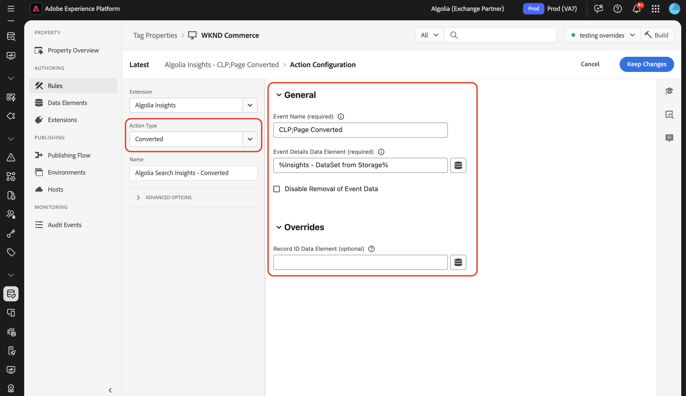

# Panoramica dell&#39;estensione tag [!DNL Algolia]

L&#39;estensione tag [!DNL Algolia] consente agli addetti al marketing di impostare facilmente regole che inviano dati di interazione dell&#39;utente a [!DNL Algolia], consentendoti di fornire esperienze di ricerca e individuazione basate su IA più personalizzate.

Questa estensione è basata su una funzione chiave:

* **[!DNL Algolia]Approfondimenti**: acquisisce e invia automaticamente gli eventi di interazione dell&#39;utente a [!DNL Algolia], consentendo potenti funzionalità di analisi, esperienze personalizzate e una maggiore rilevanza della ricerca.

## Prerequisiti {#prerequisites}

Per utilizzare questa estensione, è necessario disporre di un account [!DNL Algolia] valido. Vai alla [[!DNL Algolia] pagina di registrazione](https://dashboard.algolia.com/users/sign_up) per creare un account, se non ne hai già uno.

### Raccogliere i dettagli di configurazione richiesti {#configuration-details}

Per connettere [!DNL Algolia] a Adobe Experience Platform, sono necessarie le seguenti informazioni:

| Credenziali | Descrizione | Esempio |
| --- | --- | --- |
| ID applicazione | Il tuo ID applicazione si trova nella sezione [Chiavi API](https://www.algolia.com/account/api-keys/all) del tuo dashboard [!DNL Algolia]. | 0ABCDEFG12 |
| Chiave API di ricerca | La chiave API di ricerca si trova nella sezione [Chiavi API](https://www.algolia.com/account/api-keys/all) del dashboard [!DNL Algolia]. | 1234a12345678901b1234567890c1ab1 |

## Installa e configura l&#39;estensione [!DNL Algolia] Insights {#install-configure}

Per installare l&#39;estensione Insights [!DNL Algolia], passa a [!UICONTROL Data Collection UI] e seleziona **[!UICONTROL Tags]** dal menu di navigazione a sinistra. Da qui, seleziona una proprietà a cui aggiungere l’estensione o creane una nuova.

Dopo aver selezionato o creato la proprietà desiderata, selezionare **[!UICONTROL Extensions]** nel menu di navigazione a sinistra, quindi selezionare la scheda **[!UICONTROL Catalog]**. Cerca la scheda Approfondimenti [!DNL Algolia], quindi seleziona **[!UICONTROL Install]**.


Nella vista di configurazione visualizzata, è necessario fornire i dettagli seguenti:

| Proprietà | Descrizione |
| --- | --- |
| [!UICONTROL Application ID] | Immetti [!UICONTROL Application Id] precedentemente raccolti nella sezione [dettagli configurazione](#configuration-details). |
| [!UICONTROL Search API Key] | Immetti [!UICONTROL Search API Key] precedentemente raccolti nella sezione [dettagli configurazione](#configuration-details). |
| [!UICONTROL Index Name] | [!UICONTROL Index Name] contiene prodotti o contenuto.  Questo indice verrà utilizzato come valore predefinito. |
| [!UICONTROL User Token Data Element] | Elemento dati che restituirà il token utente. |
| [!UICONTROL Authenticated User Token Data Element] | Imposta l’elemento dati che restituirà il token utente autenticato. |
| [!UICONTROL Currency Code] | Immettere il codice valuta nel formato ISO-4217, ad esempio USD o EUR. Questo campo supporta gli elementi dati. |


## Tipi di azioni dell&#39;estensione [!DNL Algolia] Insights {#action-types}

[!DNL Algolia] supporta un set di eventi standard predefiniti, ciascuno con contesti e proprietà specifici. Le azioni disponibili nell&#39;estensione [!DNL Algolia] si allineano a questi tipi di eventi, semplificando la classificazione e la configurazione degli eventi inviati a [!DNL Algolia] in base al tipo.

### Carica approfondimenti {#load-insights}

>[!NOTE]
>
>Nella maggior parte dei casi, si consiglia di caricare [!DNL Algolia] Insights su ogni pagina del sito.

Aggiungi l&#39;azione **[!UICONTROL Load Insights]** alla regola di tag in tutti i casi in cui ha più senso caricare approfondimenti [!DNL Algolia] in base al contesto della regola. Questa azione carica la libreria `search-insights.js` sulla pagina.

Crea una nuova regola di tag o aprirne una esistente. Definisci le condizioni in base alle tue esigenze, quindi seleziona **[!UICONTROL Algolia]** come [!UICONTROL Extension] e seleziona **[!UICONTROL Load Insights]** come [!UICONTROL Action Type].

| Proprietà | Descrizione |
| --- | --- |
| [!UICONTROL Insight Library Version] | Versione di [!DNL Algolia] Insights. Il valore predefinito è `2.17.3`. |
| [!UICONTROL User Opt Out Data Element] | L’elemento dati che acquisisce la preferenza di tracciamento dell’utente. |
| [!UICONTROL Use User Token Cookie] | Selezionare questa casella per consentire a [!DNL Algolia] di generare un cookie token utente. Per impostazione predefinita, questa opzione è impostata su `true`. |


### Clic effettuato {#clicked}

Aggiungi l&#39;azione **[!UICONTROL Click]** alla regola di tag per inviare gli eventi con clic a [!DNL Algolia]. Crea una nuova regola di tag o aprirne una esistente. Definisci le condizioni in base alle tue esigenze, quindi seleziona **[!UICONTROL Algolia]** come [!UICONTROL Extension] e seleziona **[!UICONTROL Clicked]** come [!UICONTROL Action Type].

| Proprietà | Descrizione |
| --- | --- |
| [!UICONTROL Event Name] | Il Nome evento che può essere utilizzato per perfezionare ulteriormente questo evento di clic. |
| [!UICONTROL Event Details Data Element] | L’elemento dati restituisce i dettagli dell’evento in formato JSON, tra cui: <ul><li>`indexName`</li><li>`objectIDs`</li><li>`queryID` (facoltativo)</li><li>`positions` (facoltativo)</li><li>`price` (facoltativo)</li><li>`quantity` (facoltativo)</li><li>`discount` (facoltativo)</li><li>`objectData` (facoltativo)</li><li>`currency` (facoltativo)</li></ul> |


>[!NOTE]
>
>Se sono inclusi sia `queryID` che `positions`, l&#39;evento viene classificato come **ID oggetto selezionati dopo la ricerca**. In caso contrario, viene classificato come evento **ID oggetto selezionato**.
><br>
>Se l&#39;elemento dati non fornisce `indexName`, verrà utilizzato il **nome indice predefinito** al momento dell&#39;invio dell&#39;evento.


Per ulteriori informazioni sulle categorie di eventi, vedi [ID oggetto selezionati dopo la ricerca](https://www.algolia.com/doc/api-reference/api-methods/clicked-object-ids-after-search/)
e [guide oggetto selezionato](https://www.algolia.com/doc/api-reference/api-methods/clicked-object-ids/).

### Convertito {#converted}

Aggiungi l&#39;azione **[!UICONTROL Converted]** alla regola di tag per inviare eventi convertiti a [!DNL Algolia]. Crea una nuova regola di tag o aprirne una esistente. Definisci le condizioni in base alle tue esigenze, quindi seleziona **[!UICONTROL Algolia]** come [!UICONTROL Extension] e seleziona **[!UICONTROL Converted]** come [!UICONTROL Action Type].

| Proprietà | Descrizione |
| --- | --- |
| [!UICONTROL Event Name] | Nome evento che verrà utilizzato per perfezionare ulteriormente l&#39;evento **convert**. |
| [!UICONTROL Event Details Data Element] | L’elemento dati restituisce i dettagli dell’evento, tra cui: <ul><li>`indexName`</li><li>`objectIDs`</li><li>`queryID` (facoltativo)</li><li>`recordID` (facoltativo)</li></ul> |

>[!NOTE]
>
>Se l&#39;elemento dati contiene `queryId`, l&#39;evento viene classificato come **Convertito dopo la ricerca**. In caso contrario, verrà classificato come evento **Convertito**.
><br>
>Se l&#39;elemento dati non fornisce `indexName`, verrà utilizzato il **nome indice predefinito** al momento dell&#39;invio dell&#39;evento.



Per ulteriori informazioni sulle categorie di eventi, vedere le [guide degli oggetti convertiti dopo la ricerca](https://www.algolia.com/doc/api-reference/api-methods/converted-object-ids-after-search/) e [guide degli oggetti convertiti](https://www.algolia.com/doc/api-reference/api-methods/converted-object-ids/).

### Aggiunto al carrello {#added-to-cart}

Aggiungi l&#39;azione **[!UICONTROL Added to Cart]** alla regola di tag per inviare gli eventi aggiunti al carrello a [!DNL Algolia]. Crea una nuova regola di tag o aprirne una esistente. Definisci le condizioni in base alle tue esigenze, quindi seleziona **[!UICONTROL Algolia]** come [!UICONTROL Extension] e seleziona **[!UICONTROL Added to cart]** come [!UICONTROL Action Type].

| Proprietà | Descrizione |
| --- | --- |
| [!UICONTROL Event Name] | Il nome evento che verrà utilizzato per perfezionare ulteriormente questo evento **aggiungi al carrello**. |
| [!UICONTROL Event Details Data Element] | L’elemento dati restituisce i dettagli dell’evento in formato JSON, tra cui: <ul><li>`indexName`</li><li>`objectIDs`</li><li>`objectData`</li><li>`price`</li><li>`quantity`</li><li>`discount` (facoltativo)</li><li>`queryID` (facoltativo)</li><li>`currency` (facoltativo)</li></ul>. |

>[!NOTE]
>
>Se l&#39;elemento dati contiene `queryId`, l&#39;evento verrà classificato come **Aggiunto agli ID dell&#39;oggetto carrello dopo la ricerca**. In caso contrario, verrà classificato come evento **Aggiunto agli ID dell&#39;oggetto carrello**.
><br>
>Se l&#39;elemento dati non fornisce `indexName`, verrà utilizzato il **nome indice predefinito** al momento dell&#39;invio dell&#39;evento.
><br>
>Se gli elementi dati predefiniti non soddisfano le tue esigenze, puoi creare un elemento dati personalizzato per restituire i dettagli dell’evento desiderati.


Per ulteriori informazioni sulle categorie di eventi, consulta le guide [Aggiunto agli ID degli oggetti carrello dopo la ricerca](https://www.algolia.com/doc/api-reference/api-methods/added-to-cart-object-ids-after-search/) e [Aggiunto agli ID degli oggetti carrello](https://www.algolia.com/doc/api-reference/api-methods/added-to-cart-object-ids/).

### Acquistato {#purchased}

Aggiungi l&#39;azione **[!UICONTROL Purchased]** alla regola di tag per inviare gli eventi acquistati a [!DNL Algolia]. Crea una nuova regola di tag o aprirne una esistente. Definisci le condizioni in base alle tue esigenze, quindi seleziona **[!UICONTROL Algolia]** come [!UICONTROL Extension] e seleziona **[!UICONTROL Purchased]** come [!UICONTROL Action Type].

| Proprietà | Descrizione |
| --- | --- |
| [!UICONTROL Event Name] | Il Nome evento che verrà utilizzato per perfezionare ulteriormente questo evento **acquisto**. |
| [!UICONTROL Event Details Data Element] | L’elemento dati restituisce i dettagli dell’evento in formato JSON, tra cui: <ul><li>`indexName`</li><li>`objectIDs`</li><li>`objectData`</li><li>`price`</li><li>`quantity`</li><li>`discount` (facoltativo)</li><li>`queryID` (facoltativo)</li><li>`currency` (facoltativo)</li></ul>. |

>[!NOTE]
>
>L’azione Acquistato recupera i dati dell’evento dall’archiviazione del browser in base agli ID dell’articolo acquistato. Se uno degli articoli acquistati contiene `queryID` nei dati memorizzati, l&#39;evento verrà classificato come **ID oggetto acquistato dopo la ricerca**. In caso contrario, verrà classificato come evento **ID oggetto acquistato**.
><br>
>Questo approccio consente all’evento di acquisto di includere automaticamente tutti i contesti rilevanti (ID query, nome indice, prezzo, quantità, sconto) delle precedenti interazioni dell’utente con gli articoli.


Per ulteriori informazioni sulle categorie di eventi, vedi [ID oggetto acquistato dopo la ricerca](https://www.algolia.com/doc/api-reference/api-methods/purchased-object-ids-after-search/)
e [Guide degli oggetti acquistati](https://www.algolia.com/doc/api-reference/api-methods/purchased-object-ids/).

### Visualizzato {#viewed}

Aggiungi l&#39;azione **[!UICONTROL Viewed]** alla regola di tag per inviare gli eventi acquistati a [!DNL Algolia]. Crea una nuova regola di tag o aprirne una esistente. Definisci le condizioni in base alle tue esigenze, quindi seleziona **[!UICONTROL Algolia]** come [!UICONTROL Extension] e seleziona **[!UICONTROL Viewed]** come [!UICONTROL Action Type].

| Proprietà | Descrizione |
| --- | --- |
| [!UICONTROL Event Name] | Il nome dell&#39;evento che verrà utilizzato per perfezionare ulteriormente l&#39;evento **view**. |
| [!UICONTROL Event Details Data Element] | L’elemento dati restituisce i dettagli dell’evento in formato JSON, tra cui: <ul><li>`indexName`</li><li>`objectIDs`</li></ul> |

>[!NOTE]
>
>Se l&#39;elemento dati non fornisce un `indexName`, durante l&#39;invio dell&#39;evento verrà utilizzato il **nome indice predefinito**.


Per ulteriori informazioni sull&#39;evento di visualizzazione, vedere la guida [ID oggetto visualizzato](https://www.algolia.com/doc/api-reference/api-methods/viewed-object-ids/).

## Elementi dati dell&#39;estensione Insights [!DNL Algolia] {#data-elements}

[!DNL Algolia] supporta un insieme di elementi dati predefiniti, ciascuno con contesti e proprietà specifici. Nelle sezioni seguenti sono descritti gli elementi dati disponibili nell&#39;estensione Insights [!DNL Algolia].

### Set di dati {#dataset}

L&#39;elemento dati DataSet recupera i dati associati agli elementi HTML, che vengono quindi utilizzati nelle azioni [!DNL Algolia]. Questo elemento dati memorizza automaticamente i dati dell’evento recuperati nell’archiviazione del browser per un uso successivo (ad esempio in eventi di conversione o di acquisto).

**Configurazione generale:**

| Proprietà | Descrizione |
| --- | --- |
| [!UICONTROL Hit Element Div/Class Name] | Il nome dell&#39;elemento HTML e/o il nome della classe CSS contenente gli attributi del set di dati incluso `data-insights-object-id` e facoltativamente `data-insights-query-id` e `data-insights-position` nell&#39;elemento HTML. |
| [!UICONTROL Index Name Element Div/Class Name] | Il nome dell&#39;elemento HTML e/o il nome della classe CSS con gli attributi del set di dati (`data-indexname`) nell&#39;elemento HTML. |

**Configurazione Commerce (facoltativo):**

| Proprietà | Descrizione |
| --- | --- |
| [!UICONTROL Price Data Element] | Elemento dati che restituisce il prezzo dell&#39;elemento. Se fornito, verrà incluso nei dati evento memorizzati per gli eventi di e-commerce. |
| [!UICONTROL Quantity Data Element] | Elemento dati che restituisce la quantità per l’articolo. Se non specificato, il valore predefinito è 1. |
| [!UICONTROL Discount Data Element] | Elemento dati che restituisce il valore decimale dello sconto per l’elemento. |
| [!UICONTROL Currency Code] | Il codice valuta nel formato ISO-4217. Se non viene specificato alcun codice valuta, verrà utilizzata la valuta predefinita della configurazione dell’estensione. |

**Sostituzioni (facoltative):**

Questi campi ti consentono di ignorare il comportamento predefinito del recupero di dati dagli attributi del set di dati di HTML.

| Proprietà | Descrizione |
| --- | --- |
| [!UICONTROL Record ID Data Element] | Sostituisci l’approccio predefinito per utilizzare l’URL della pagina come ID record. L&#39;ID record viene utilizzato per archiviare e cercare i dati da inviare a [!DNL Algolia] per questo prodotto/pagina. |
| [!UICONTROL Query ID Data Element] | L’ID query viene recuperato dal set di dati sull’elemento HTML. Per ignorare questo comportamento, utilizza questa proprietà per fornire un elemento dati che restituisca l’ID query come stringa. |
| [!UICONTROL Object IDs Data Element] | Gli ID oggetto vengono recuperati dal set di dati sull’elemento HTML. Per ignorare questo comportamento, utilizza questa proprietà per fornire un elemento dati che restituisca gli ID oggetto come array. |
| [!UICONTROL Positions Data Element] | Le posizioni vengono recuperate dal set di dati sull’elemento HTML. Per ignorare questo comportamento, utilizza questa proprietà per fornire un elemento dati che restituirà le Posizioni come array. |
| [!UICONTROL Index Name Data Element] | Il nome dell’indice viene recuperato dal set di dati sull’elemento HTML. Per ignorare questo comportamento, utilizza questa proprietà per fornire un elemento dati che restituirà il Nome indice come stringa. |


Questo elemento dati restituisce:

```javascript
{
  timestamp,
  queryID,
  indexName,
  objectIDs,
  positions,
  objectData,  // Optional: commerce data if price is provided
  currency,    // Optional: if provided
  recordID
}
```

Esempio di HTML che contiene il set di dati:

```html
<div data-indexname="acme_master_default_products" class="instant-search-comp__hits">
  <div class="hit-card"
    data-insights-object-id="${hit.objectID}"
    data-insights-position="${hit.__position}"
    data-insights-query-id="${hit.__queryID}">
    <h4 class="hit-name">...</h4>   
  </div>
</div>
```

### Stringa di query {#query-string}

L&#39;elemento dati stringa di query estrae i dati dalla stringa di query URL da utilizzare nelle azioni [!DNL Algolia].

| Proprietà | Descrizione |
| --- | --- |
| [!UICONTROL Object ID Param Name] | Nome del parametro di query che contiene l&#39;ID oggetto. |
| [!UICONTROL Index Name Param Name] | Nome del parametro di query che contiene il nome dell&#39;indice. |
| [!UICONTROL Query ID Param Name] | Il nome del parametro di query che contiene l’ID della query. |
| [!UICONTROL Position Param Name] | Il nome del parametro di query che contiene la posizione. |


Questo elemento dati restituisce:

```javascript
{
  timestamp,
  queryID,
  indexName,
  objectIDs,
  positions
}
```

Esempio di HTML che contiene parametri di query:

```html
<a href="product.html?objectID=${hit.objectID}&queryID=${hit.__queryID}&indexName=${indexName}&position=${hit.position}">Read More</a>
```

### Archiviazione {#storage}

L&#39;elemento dati di archiviazione recupera i dati dall&#39;archiviazione della sessione del browser per utilizzarli nelle azioni [!DNL Algolia]. Questo elemento dati può essere utilizzato anche per incrementare i dati memorizzati con informazioni di e-commerce aggiuntive.

Questo elemento dati recupera i dettagli dell’evento precedentemente memorizzati nell’archiviazione della sessione (in genere dall’elemento dati DataSet durante gli eventi di clic). I dati vengono rimossi automaticamente durante gli eventi di conversione, a meno che la rimozione non sia esplicitamente disabilitata.

**Sostituzioni (facoltative):**

| Proprietà | Descrizione |
| --- | --- |
| [!UICONTROL Record ID Data Element] | L’ID record viene utilizzato come chiave per cercare i dati dell’evento memorizzati nell’archiviazione del browser. L&#39;URL della pagina è l&#39;ID record predefinito. Per ignorare questo comportamento, utilizza questa proprietà per fornire un elemento dati che restituisca l’ID record come stringa. |
| [!UICONTROL Price Data Element] | Elemento dati che restituisce il prezzo dell&#39;elemento. Se fornito, questo aggiorna i dati evento memorizzati con le informazioni sul prezzo. |
| [!UICONTROL Quantity Data Element] | Elemento dati che restituisce la quantità per l’articolo. Se fornito, questo aggiorna i dati evento memorizzati con le informazioni sulla quantità. |
| [!UICONTROL Discount Data Element] | Elemento dati che restituisce il valore decimale dello sconto per l’elemento. Se fornito, i dati evento memorizzati verranno aggiornati con le informazioni sugli sconti. |
| [!UICONTROL Currency Code] | Inserire il codice valuta nel formato ISO-4217. Se fornito, i dati evento memorizzati verranno aggiornati con le informazioni sulla valuta. |


Questo elemento dati restituisce ciò che è memorizzato nell’archiviazione della sessione, inclusi eventuali dati di e-commerce migliorati:

```javascript
{
  timestamp,
  queryID,
  indexName,
  objectIDs,
  positions,      // If available from original event
  objectData,     // Optional: commerce data if price is provided
  currency,       // Optional: if provided
  recordID
}
```

## Clic o conversione dopo la ricerca {#clicked-converted-after-search}

Gli eventi *Clic dopo la ricerca* o *Convertito dopo la ricerca* richiedono `queryID` e `positions` sono necessari anche per *Clic dopo la ricerca*. Queste proprietà sono disponibili quando il flag `insights` è abilitato nei parametri di query InstantSearch e/o Autocomplete. Per informazioni su come configurare Insights per il sito, consulta le seguenti risorse:

* [Impostazione di Approfondimenti sul completamento automatico](https://www.algolia.com/doc/ui-libraries/autocomplete/api-reference/autocomplete-js/autocomplete/#param-insights)
* [Impostazione di Insights su InstantSearch.js](https://www.algolia.com/doc/guides/building-search-ui/events/js/#set-the-insights-option-to-true)
* [Introduzione agli eventi di clic e conversione](https://www.algolia.com/doc/guides/sending-events/implementing/how-to/sending-events-backend/)
* [Invio [!DNL Algolia] Eventi Approfondimenti](https://www.algolia.com/doc/ui-libraries/autocomplete/guides/sending-algolia-insights-events/)
* [[!DNL Algolia] Archivio GitHub dell&#39;estensione Launch](https://github.com/algolia/algolia-launch-extension)
* [Documentazione di InstantSearch.js](https://www.algolia.com/doc/guides/building-search-ui/what-is-instantsearch/js/)
* [[!DNL Algolia] Documentazione API approfondimenti](https://www.algolia.com/doc/rest-api/insights/)
* [Archivio codice estensione di Algolia Launch](https://github.com/algolia/algolia-launch-extension)

## Passaggi successivi {#next-steps}

Questa guida illustra come inviare dati a [!DNL Algolia] utilizzando l&#39;estensione tag [!DNL Algolia Insights]. Se si prevede di inviare eventi lato server anche a [!DNL Algolia], è ora possibile procedere all&#39;installazione e alla configurazione dell&#39;[[!DNL Conversions API] estensione inoltro eventi](../../server/algolia/overview.md).

Per ulteriori informazioni sui tag in Experience Platform, consulta la [panoramica dei tag](../../../home.md).
