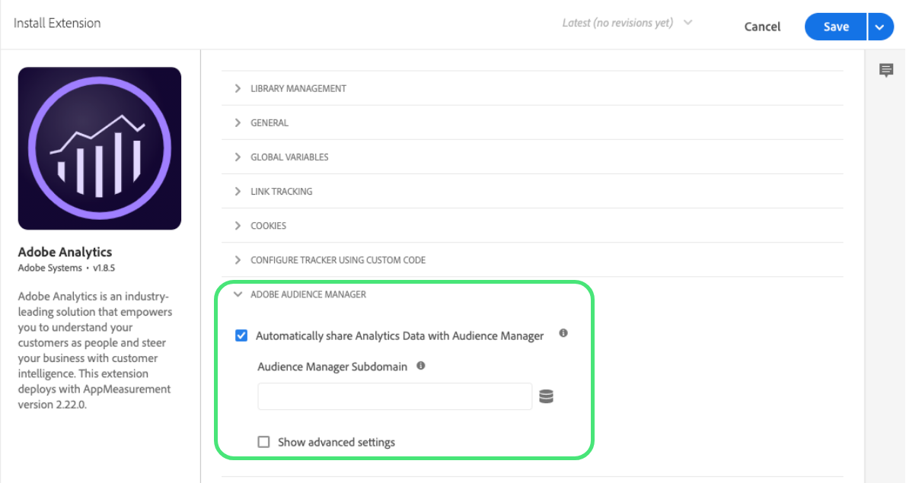

# Panoramica dell’estensione Adobe Analytics

>[!NOTE]
>
>Adobe Experience Platform Launch è stato ridefinito come suite di tecnologie di raccolta dati in Adobe Experience Platform. Di conseguenza, sono state introdotte diverse modifiche terminologiche nella documentazione del prodotto. Consulta questo [documento](../../../term-updates.md) come riferimento consolidato delle modifiche terminologiche.

Utilizza questo riferimento per informazioni sulla configurazione dell&#39;estensione Adobe Analytics e sulle opzioni disponibili quando utilizzi questa estensione per generare una regola.

## Configura l&#39;estensione Adobe Analytics

Questa sezione fornisce un riferimento per le opzioni disponibili durante la configurazione dell&#39;estensione Adobe Analytics.

Se l’estensione Adobe Analytics non è ancora installata, apri la proprietà, quindi seleziona **[!UICONTROL Estensioni > Catalogo]**, passa il puntatore sull’estensione Adobe Analytics e fai clic su **[!UICONTROL Installa]**.

Per configurare l’estensione, apri la scheda Estensioni, passa il puntatore sull’estensione e fai clic su **[!UICONTROL Configura]**.


## Gestione libreria

Seleziona un&#39;opzione dalla sezione Gestione della libreria della pagina di configurazione. Sono disponibili le seguenti configurazioni:

### Gestisci la libreria per conto mio

#### Suite di rapporti

Specifica una o più suite di rapporti per ciascuno dei seguenti ambienti:

* Sviluppo
* Staging
* Produzione

### Usa la libreria già installata nella pagina

#### Imposta le seguenti suite di rapporti sul tracker

Se selezioni questa opzione, specifica una o più suite di rapporti per ciascuno dei seguenti ambienti:

* Sviluppo
* Staging
* Produzione

#### Utilizzo del modulo Activity Map

Activity Map viene caricato come modulo separato (come il modulo AAM). Activity Map è attivato per impostazione predefinita, ma se preferisci disattivarlo puoi farlo deselezionando la casella nella configurazione.

#### Il tracker è accessibile nella variabile globale denominata

Selezionando questa casella, l&#39;oggetto tracker può essere usato globalmente. Ad esempio, puoi definire la variabile `window.s.pageName` in qualsiasi punto del sito.

### Carica la libreria da un URL personalizzato

#### URL HTTP

Specifica l&#39;URL in cui si trova la libreria.

#### URL HTTPS

Specifica l&#39;URL in cui si trova la libreria.

#### Imposta le seguenti suite di rapporti sul tracker

Se selezioni questa opzione, specifica una o più suite di rapporti per ciascuno dei seguenti ambienti:

* Sviluppo
* Staging
* Produzione

#### Il tracker è accessibile nella variabile globale denominata

Specifica l&#39;oggetto tracker da utilizzare globalmente.

### Desidero fornire un codice libreria personalizzato

#### Open Editor

Consente di inserire il codice principale [AppMeasurement.js](https://experienceleague.adobe.com/docs/analytics/implementation/js/overview.html?lang=it). Questo codice viene popolato automaticamente quando si usa il metodo di configurazione automatico.

>[!NOTE]
>
>La convalida utilizzata nell’editor di codice tag è progettata per individuare eventuali problemi nel codice scritto dallo sviluppatore. La convalida dei tag potrebbe erroneamente segnalare la presenza di errori in un codice che è stato sottoposto un processo di minimizzazione (come il codice AppMeasurement.js scaricato da Code Manager), ma in genere questo può essere ignorato.

#### Imposta le seguenti suite di rapporti sul tracker

Se selezioni questa opzione, specifica una o più suite di rapporti per ciascuno dei seguenti ambienti:

* Sviluppo
* Staging
* Produzione

#### Il tracker è accessibile nella variabile globale denominata

Specifica l&#39;oggetto tracker da utilizzare globalmente.

## Generale

Seleziona un&#39;opzione dalla sezione Generale della pagina di configurazione. Sono disponibili le seguenti configurazioni:

### Abilita la conformità UE per Adobe Analytics

Abilita o disabilita il tracciamento in base al cookie di privacy UE.

Quando selezioni la casella di controllo EU Compliance (Conformità UE), viene visualizzato il campo [!UICONTROL Nome del cookie di tracciamento]. Questo cookie di tracciamento sostituisce il nome predefinito del cookie di tracciamento. Puoi personalizzare il nome utilizzato dai tag per tenere traccia dello stato di rinuncia alla ricezione di altri cookie.

Quando viene caricata una pagina, il sistema controlla se è impostato un cookie chiamato sat\_track (o il nome del cookie personalizzato specificato nella pagina Modifica proprietà). Prendi in considerazione le seguenti informazioni:

* Se il cookie non esiste o se il cookie esiste ed è impostato su un valore diverso da true, il caricamento dello strumento viene ignorato quando questa impostazione è attivata. Ciò significa che non verrà applicata alcuna parte di una regola che utilizza lo strumento. Se una regola dispone di analisi con conformità UE e codice di terze parti e il cookie è impostato su false, il codice di terze parti continua a essere eseguito. Tuttavia, le variabili di analisi non saranno impostate.
* Se il cookie esiste ma è impostato su true, lo strumento viene caricato normalmente.

L&#39;utente è tenuto a impostare il cookie sat\_ track (o personalizzato) su false se un visitatore indica la rinuncia. Puoi eseguire questa operazione utilizzando un codice personalizzato:

```javascript
_satellite.cookie.set("sat_track", "false");
```

Devi inoltre disporre di un meccanismo per impostare il cookie su true se desideri che un visitatore sia in grado di indicare il proprio consenso in un secondo momento:

```javascript
_satellite.cookie.set("sat_track", "true");
```

### Set di caratteri

Determina la modalità di codifica della richiesta di immagine. Se l&#39;implementazione o il sito utilizzano caratteri non ASCII, è importante definire il set di caratteri qui. Puoi selezionare un set di caratteri predefinito o specificare un set di caratteri personalizzato. Adobe consiglia di utilizzare la stessa codifica caratteri del tuo sito. Generalmente questo valore è UTF-8.

Il set di caratteri può essere impostato nel codice personalizzato di Analytics utilizzando la variabile `s.charSet`.
Per ulteriori informazioni sui set di caratteri, consulta la [documentazione di charSet](https://experienceleague.adobe.com/docs/analytics/implementation/vars/config-vars/charset.html?lang=it).

### Codice della valuta

Determina il tasso di conversione da applicare alle entrate e agli eventi di valuta. Se il tuo sito consente ai visitatori di acquistare in più valute, l&#39;impostazione del codice della valuta assicura che l&#39;importo monetario sia convertito e memorizzato correttamente.

Per ulteriori informazioni sui codici valuta supportati consulta la sezione su [currencyCode](https://experienceleague.adobe.com/docs/analytics/implementation/vars/config-vars/currencycode.html?lang=it).

### Tracking Server

Utilizzato per implementazioni cookie di prima parte per determinare dove viene memorizzato il cookie di prima parte. Se utilizzi il servizio Experience Cloud ID, Adobe consiglia di non compilare il campo.

Il tracking server può essere impostato nel codice personalizzato di Analytics utilizzando la variabile `s.trackingServer`.

Consulta [trackingServer](https://experienceleague.adobe.com/docs/analytics/implementation/vars/config-vars/trackingserver.html?lang=it) nella guida all&#39;implementazione di Adobe Analytics.

### Server di tracciamento SSL

Utilizzato per implementazioni di cookie di prime parti SSL per determinare dove viene memorizzato il cookie di prime parti. Se utilizzi il servizio Experience Cloud ID, Adobe consiglia di non compilare il campo. Se non sono definiti, i dati SSL usano il tracking server.

Il tracking server SSL può essere impostato nel codice personalizzato di Analytics utilizzando la variabile `s.trackingServerSecure`.

Consulta [trackingServerSecure](https://experienceleague.adobe.com/docs/analytics/implementation/vars/config-vars/trackingserversecure.html?lang=it).

## Variabili globali

Usa questa sezione per configurare [eVar e proprietà](https://experienceleague.adobe.com/docs/analytics/implementation/vars/page-vars/evar.html?lang=it) e per creare gerarchie.

Le variabili globali sono variabili impostate sull&#39;oggetto di tracciamento Analytics quando tale oggetto è inizializzato sulla pagina. Tutte le variabili impostate in questo punto verranno impostate quando l&#39;oggetto di tracciamento viene creato sulla rispettiva pagina. Una volta che queste variabili sono impostate, sono come qualsiasi altra variabile impostata in qualsiasi altro modo. Specificamente, ciò significa che una regola può modificare, cambiare o cancellare queste variabili.

Se la tua applicazione Web invia in genere un beacon per pagina, questa sezione può facilitare la configurazione delle variabili in un&#39;unica posizione. Se la tua applicazione invia più di un beacon per pagina (ad esempio in un&#39;applicazione su una sola pagina) e devi cancellare le variabili e ripristinarle utilizzando lo stesso oggetto di tracciamento, è più semplice basarsi su regole per impostare e cancellare le variabili.

## Tracciamento dei collegamenti

Seleziona un&#39;opzione dalla sezione Link Tracking della pagina di configurazione. Sono disponibili le seguenti configurazioni:

### Abilita ClickMap

[ClickMap](https://experienceleague.adobe.com/docs/analytics/analyze/activity-map/activity-map.html?lang=it) è un plug-in per Internet Explorer e Firefox e un modulo di Reports &amp; Analytics.

### Traccia collegamenti di download

Tiene traccia dei collegamenti verso file scaricabili sul sito.

Consulta [s.trackDownLoadLinks](https://experienceleague.adobe.com/docs/analytics/implementation/vars/config-vars/trackdownloadlinks.html?lang=it).

### Download delle estensioni

Se l&#39;opzione Track Download Links è attivata, puoi selezionare le estensioni dei collegamenti dei file inclusi nel Downloads Report. Se il sito contiene collegamenti a file con una qualsiasi delle estensioni elencate, gli URL di tali collegamenti saranno visualizzati nel reporting.

Consulta [s.linkDownloadFileTypes](https://experienceleague.adobe.com/docs/analytics/implementation/vars/config-vars/linkdownloadfiletypes.html?lang=it).

### Traccia collegamenti in uscita

Decidi se un collegamento selezionato è un collegamento di uscita.

Consulta [s.trackExternalLinks](https://experienceleague.adobe.com/docs/analytics/implementation/vars/config-vars/trackexternallinks.html?lang=it).

**Considerazioni sulle app su una sola pagina (SPA):** a seconda del modo in cui alcuni siti Web SPA sono codificati, un collegamento interno a una pagina del sito SPA potrebbe sembrare un collegamento in uscita.

Puoi usare uno dei seguenti metodi per tenere traccia dei collegamenti in uscita dai siti SPA:

* Se non desideri tracciare collegamenti in uscita dalla SPA, inserisci una voce nella sezione Never Track. Ad esempio, `http://testsite.com/spa/\#`. Tutti i collegamenti \# a questo host vengono ignorati. Vengono tracciati tutti i collegamenti in uscita ad altri host, ad esempio [https://www.google.com](https://www.google.com).
* Se vi sono alcuni collegamenti che desideri tracciare nella SPA, utilizza la sezione Always Track.

Ad esempio, se hai una pagina spa/\#/about, puoi inserire &quot;about&quot; nella sezione Always Track.

La pagina &quot;Info&quot; è l&#39;unico collegamento in uscita tracciato. Qualsiasi altro collegamento sulla pagina (ad esempio, [https://www.google.com](https://www.google.com)) non è tracciato.

>[!NOTE]
>
>Queste due opzioni si escludono a vicenda.

### Mantieni parametri URL

Mantiene le stringhe di query.

Consulta [s.linkLeaveQueryString](https://experienceleague.adobe.com/docs/analytics/implementation/vars/config-vars/linkleavequerystring.html?lang=it).

## Cookie

Configura le descrizioni del campo per le impostazioni globali dei cookie utilizzate per distribuire l&#39;estensione Adobe Analytics. Sono disponibili le seguenti configurazioni:

### ID visitatore

Valore univoco che rappresenta un cliente nei sistemi online e offline.

Consulta [visitorID](https://experienceleague.adobe.com/docs/analytics/implementation/vars/config-vars/visitorid.html?lang=it).

### Spazio nomi visitatore

Variabile per identificare il dominio con cui sono impostati i cookie.

Consulta [visitorNamespace](https://experienceleague.adobe.com/docs/analytics/implementation/vars/config-vars/visitornamespace.html?lang=it).

### Periodi di dominio

Il dominio in cui il cookie di Analytics `s_cc` e `s_sq` è impostato determinando il numero di periodi nel dominio dell&#39;URL della pagina. Questa variabile viene utilizzata anche da alcuni plug-in per determinare il dominio corretto per impostare il cookie del plug-in.

Consulta [s.cookieDomainPeriods](https://experienceleague.adobe.com/docs/analytics/implementation/vars/config-vars/cookiedomainperiods.html?lang=it).

### Periodi di dominio di prime parti

La variabile `fpCookieDomainPeriods` è destinata ai cookie impostati da JavaScript (`s_sq`, `s_cc`, plug-in) che sono intrinsecamente cookie di prima parte, anche se la tua implementazione utilizza i domini di terze parti 2o7.net o omtrdc.net.

Consulta [s.fpCookieDomainPeriods](https://experienceleague.adobe.com/docs/analytics/implementation/vars/config-vars/fpcookiedomainperiods.html?lang=it).

### Durata cookie

Determina la durata di vita di un cookie.

Consulta [s.cookieLifetime](https://experienceleague.adobe.com/docs/analytics/implementation/vars/config-vars/cookielifetime.html?lang=it).

### Cookie protetti

Questa variabile consente ad AppMeasurement di scrivere cookie protetti.

Consulta [writeSecureCookies](https://experienceleague.adobe.com/docs/analytics/implementation/vars/config-vars/writesecurecookies.html?lang=it)


## Personalizza codice pagina

Usa l&#39;editor per personalizzare il codice della pagina.

## Adobe Audience Manager

Utilizza questa sezione della configurazione dell&#39;estensione per specificare in che modo Audience Manager funziona con Analytics.

Abilita **Automatically share Analytics data with Audience Manager** (Condividi automaticamente i dati di Analytics con Audience Manager).

Vengono visualizzate le seguenti opzioni:



Il sottodominio Audience Manager è assegnato da Adobe Audience Manager. A volte è denominato &quot;Partner Name&quot; (Nome partner) o &quot;Partner Subdomain&quot; (Sottodominio partner). Contatta il tuo consulente Adobe o l&#39;Assistenza clienti se non conosci il nome del tuo partner.

Per configurare le impostazioni avanzate, seleziona **Mostra impostazioni avanzate** e immetti le tue preferenze.


Per informazioni su ciascuna impostazione, fai clic sull&#39;icona delle informazioni o fai riferimento alla [documentazione di Adobe Audience Manager](https://docs.adobe.com/content/help/it-IT/experience-cloud/user-guides/home.translate.html).

## Tipi di azioni per l&#39;estensione di Analytics

In questa sezione sono descritti i tipi di azioni disponibili nell&#39;estensione Analytics.

L&#39;estensione Analytics fornisce le azioni seguenti:

* [Imposta variabili](#set-variables)
* [Invia beacon](#send-beacon)
* [Cancella variabili](#clear-variables)

### Imposta variabili {#set-variables}

Importante: l&#39;utilizzo di un&#39;azione &quot;Imposta variabili&quot; non invierà il beacon. È necessario utilizzare l&#39;azione &quot;Invia beacon&quot;.

#### eVar

Imposta una o più [eVar](https://experienceleague.adobe.com/docs/analytics/implementation/vars/page-vars/evar.html?lang=it).

1. Seleziona una eVar dal menu a discesa.
1. Specifica se impostare la eVar come valore (Set As) o copia (Duplicate From) di un&#39;altra eVar.
1. Fornisci un valore Set As oppure seleziona la eVar da duplicare.
1. (Facoltativo) Seleziona Aggiungi eVar per impostare altre eVar.
1. Seleziona **[!UICONTROL Mantieni modifiche]**.

#### Proprietà

Imposta una o più [proprietà](https://experienceleague.adobe.com/docs/analytics/implementation/vars/page-vars/prop.html?lang=it).

1. Seleziona una proprietà dal menu a discesa.
1. Specifica se impostare la proprietà come valore (Set As) o copia (Duplicate From) di un&#39;altra eVar.
1. Fornisci un valore Set As oppure seleziona la eVar da cui duplicare la proprietà.
1. (Facoltativo) Fai clic su **[!UICONTROL Aggiungi proprietà]** per impostare più proprietà.
1. Seleziona **[!UICONTROL Mantieni modifiche]**.

#### Eventi

Imposta uno o più [eventi](https://experienceleague.adobe.com/docs/analytics/implementation/vars/page-vars/events/events-overview.html?lang=it).

1. Seleziona un evento dal menu a discesa.
1. (Facoltativo) Seleziona o specifica un elemento dati usato per la [serializzazione degli eventi](https://experienceleague.adobe.com/docs/analytics/implementation/vars/page-vars/events/event-serialization.html?lang=it).
1. (Facoltativo) Fai clic su **[!UICONTROL Aggiungi evento]** per impostare altri eventi.
1. Seleziona **[!UICONTROL Mantieni modifiche]**.

#### Gerarchia

Imposta la variabile [Gerarchia](https://experienceleague.adobe.com/docs/analytics/implementation/vars/page-vars/hier.html?lang=it) di Analytics.

Specifica ogni livello nella gerarchia.

Se lo desideri, configura gerarchie aggiuntive.

#### Nome pagina

Questo valore fa riferimento al nome di una determinata pagina e corrisponde alla variabile [`pageName`](https://experienceleague.adobe.com/docs/analytics/implementation/vars/page-vars/pagename.html) in Analytics.

>[!IMPORTANT]
>
>Nelle implementazioni di Adobe Experience Manager, questa variabile indica all’AEM dove memorizzare il rapporto Analytics recuperato. Per garantire la corretta persistenza dei rapporti, la stringa del nome della pagina deve essere formattata come un percorso del sito separato da due punti.
>
>Ad esempio, una pagina Web in `content/we-retail/language-masters/en/men.html` deve avere il valore del nome pagina `content:we-retail:language-masters:en:men`.

#### Altre informazioni

Specifica altre informazioni utilizzate dalle pagine.

Queste impostazioni includono:

* URL della pagina
* Server
* Canale
* Referrer
* Campaign
* ID acquisto

  Specifica un valore o un parametro di query

* Stato
* ZIP
* ID transazione

Queste impostazioni si trovano nel menu &quot;Variabili globali&quot; selezionando la casella di controllo &quot;Impostazioni aggiuntive&quot;.

#### Codice pagina personalizzato

**Descrizione**

Usa l&#39;editor per specificare il codice pagina personalizzato.

**Impostazioni**

1. Seleziona **[!UICONTROL Apri editor]**.
1. Digita il codice personalizzato.
1. Seleziona **[!UICONTROL Salva]**.

### Invia beacon {#send-beacon}

#### Incremento di una visualizzazione di pagina - s.t()

Seleziona questa opzione per incrementare una visualizzazione di pagina.

#### Non incrementare una visualizzazione di pagina - s.tl()

Seleziona questa opzione se non desideri incrementare una visualizzazione di pagina.

**Impostazioni**

1. Seleziona un tipo di collegamento.

   Puoi scegliere uno dei seguenti:

   * Collegamento personalizzato.
   * Collegamento di download.
   * Collegamento di uscita.

1. Impostate il parametro per il collegamento selezionato.
   * Collegamento personalizzato: specifica il nome del collegamento.
   * Collegamento di download: specifica il nome di un file.
   * Collegamento di uscita: specifica l&#39;URL di destinazione.
1. Seleziona **[!UICONTROL Mantieni modifiche]**.

### Cancella variabili {#clear-variables}

Se il tipo di azione Cancella variabili è selezionato, non sono disponibili opzioni di configurazione.
