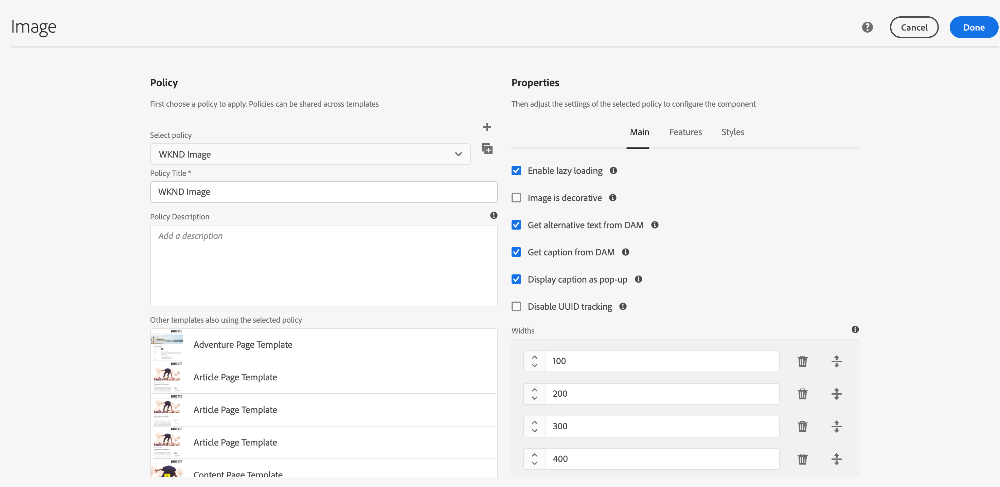

# Panoramica dell’estensione AEM Asset Insights

Questa estensione è pensata per essere utilizzata insieme a [AEM Asset Insights](https://experienceleague.adobe.com/docs/experience-manager-65/assets/managing/touch-ui-configuring-asset-insights.html?lang=it). In particolare, sostituisce il processo “pageTracker” e il codice da incorporare. Una volta configurata, questa estensione invia ad Adobe Analytics le metriche *Impressioni* e *Clic* delle risorse, che verranno poi importate nei rapporti di AEM Asset Insights. È quindi possibile generare rapporti sulle metriche delle risorse utilizzando AEM Asset Insights o Adobe Analytics Project Workspaces.

## Prerequisiti per l’estensione

### Analytics

I rapporti di AEM Assets in Analytics contengono tre dimensioni AEM:

* ID risorsa
* Origine risorsa
* Risorsa selezionata

Sono inoltre disponibili due metriche:

* Impression risorsa
* Clic su risorsa.

Prima di poter essere compilati dall&#39;estensione, questi rapporti devono essere abilitati dalla funzione di amministratore di Analytics (seleziona **[!UICONTROL Analytics]> [!UICONTROL Admin] > [!UICONTROL Report Suites] > `<report suite>` > [!UICONTROL Edit Settings] > [!UICONTROL AEM] >[!UICONTROL AEM Assets Reporting]**).

L’estensione tag “*Adobe Analytics*” per Adobe Experience Platform deve essere installata nella stessa proprietà web.

### Adobe Experience Manager (AEM)

1. Abilita [AEM Asset Insights](https://experienceleague.adobe.com/docs/experience-manager-65/assets/managing/touch-ui-configuring-asset-insights.html?lang=it). In AEM, seleziona **[!UICONTROL Tools > Assets]**, quindi apri il pannello **[!UICONTROL Insights Configuration]**.

1. Disabilita tracciamento UUID.

   >[!IMPORTANT]
   >
   >Questa estensione *non* funziona se è selezionata l’impostazione di configurazione **[!UICONTROL Disable UUID Tracking]** di AEM Assets. Per impostazione predefinita, questa impostazione è deselezionata.

   

## Configurare Adobe Experience Manager (AEM)

Questa sezione descrive come configurare AEM con i tag in Adobe Experience Platform, come abilitare Asset Insight in AEM e come abilitare il tracciamento UUID per le risorse.

### Integrare AEM con i tag

L&#39;integrazione consigliata di [Experience Platform](https://experienceleague.adobe.com/docs/experience-manager-learn/sites/integrations/experience-platform-launch/overview.html?lang=it) con Adobe Experience Manager viene eseguita tramite Adobe I/O.

1. [Connettere AEM con i tag utilizzando Adobe I/O](https://experienceleague.adobe.com/docs/experience-manager-learn/sites/integrations/experience-platform-launch/connect-aem-launch-adobe-io.html?lang=it).

2. [Crea una configurazione di Adobe Experience Platform Cloud Service](https://experienceleague.adobe.com/docs/experience-manager-learn/sites/integrations/experience-platform-launch/create-launch-cloud-service.html?lang=it).

### Abilitare Asset Insight in AEM

Per istruzioni su come abilitare Asset Insights, consulta la [guida utente di Experience Manager 6.5 Assets](https://experienceleague.adobe.com/docs/experience-manager-65/assets/managing/touch-ui-configuring-asset-insights.html?lang=it).

### Abilitare il tracciamento UUID per le risorse

Puoi tenere traccia delle risorse in Analytics utilizzando l’identificatore UUID delle risorse in AEM.

Per abilitare il tracciamento con l’UUID della risorsa, apri la console dei criteri dei componenti del modello modificabile e deseleziona la proprietà “Disabilita tracciamento UUID”. Per impostazione predefinita, questa proprietà è selezionata per il componente immagine fornito con la soluzione.

Dopo aver abilitato l’UUID, l’elemento dati “data-asset-id” viene popolato con l’UUID della risorsa. Analytics tiene traccia dei clic o delle impression della risorsa con questo UUID.

## Utilizzo dell’estensione

Questa estensione dispone di due eventi e una azione.

* **Risorsa selezionata:** _evento_ che viene attivato quando il visitatore seleziona una risorsa AEM abilitata per il tracciamento e con una destinazione (attributo href).

* **Risorsa selezionata (nessuna destinazione):** _evento_ che viene attivato quando il visitatore seleziona una risorsa AEM abilitata per il tracciamento e priva di destinazione (nessun attributo href).

* **Imposta variabili AA:** _azione_ che imposta le variabili di Analytics riservate ad AEM Assets (variabili di dati di contesto `a.assets.source`, `a.assets.idlist` e `a.asset.clickedid`) in base all’evento utilizzato e alla configurazione dell’evento e dell’azione. Questa estensione non utilizza alcun evento, proprietà o eVar di Analytics.

### Impression risorsa

Aggiungi l’azione “Imposta variabili AA” a una regola di tag nuova o esistente che si attiva su ogni pagina e invia una richiesta di immagine Analytics. L’azione “Imposta variabili AA” deve comparire **prima** dell’azione “Adobe Analytics - Invia beacon”. Se necessario, è possibile aggiungere altre azioni.

Nella pagina di configurazione di **[Imposta variabili AA]**, seleziona l’opzione **[Risorse visualizzate]** (impostazione predefinita). Con questa opzione l’evento Impression viene impostato solo per le risorse effettivamente visualizzate dal visitatore.

>[!NOTE]
>
>Sebbene non sia consigliato, l’azione “Imposta variabili AA” supporta anche l’opzione “caricato”, con cui vengono inviate le impression relative a ogni risorsa sulla pagina, anche per quelle che non sono state viste dal visitatore.

### Clic su risorsa

Configura una seconda regola utilizzando l’evento “Risorsa selezionata” e l’azione “Imposta variabili AA”. L’evento “Risorsa selezionata” deve essere configurato in modo che la “richiesta immagine Risorsa selezionata” sia impostata su “Al caricamento della pagina” (impostazione predefinita). Questa regola non richiede alcuna azione Adobe Analytics (come Invia beacon) perché l’ID della risorsa verrà salvato in `sessionStorage` e inviato dalla regola Impression successiva.

L’evento “Risorsa selezionata” supporta inoltre l’impostazione di “richiesta immagine Risorsa selezionata” su “Al clic”. Questa impostazione invia subito la metrica Clic ad Analytics e richiede un’azione “Invia beacon” di Analytics.

Configura una terza regola che verrà attivata quando la pagina contiene delle risorse prive di destinazione (senza alcun attributo `href`). Come minimo, la nuova regola deve utilizzare l’evento “Risorsa selezionata (nessuna destinazione)” e le azioni “Imposta variabili AA” e “Adobe Analytics - Invia beacon”. Se necessario, è possibile aggiungere altre condizioni e azioni.

### Suggerimenti per il test dell’estensione

Configura tre regole come descritto qui sopra:

* Impression risorsa
* Clic su risorsa
* Clic su risorsa priva di destinazione

**Impression**

1. Passa a una pagina contenente alcune risorse AEM.

1. Se nel browser non è visibile alcuna risorsa, scorri fino a visualizzare almeno una risorsa e selezionala oppure passa a un&#39;altra pagina.

1. Osserva la richiesta immagine di Analytics.

   Se `a.assets.idlist` contiene gli ID risorsa visibili nella pagina precedente, la regola funziona correttamente.

   Se la richiesta immagine non contiene `a.assets.idlist`, questo può essere dovuto a uno dei due motivi seguenti:

   * Nell’area di visualizzazione del browser non era presente alcuna risorsa.

   * Sulla pagina non era presente alcuna risorsa per la quale, in AEM, era stato abilitato [Asset Insights](https://experienceleague.adobe.com/docs/experience-manager-65/assets/managing/touch-ui-configuring-asset-insights.html?lang=it).

**Clic**

1. Passa a una pagina contenente alcune risorse AEM.

1. Fai clic su una delle risorse.

Nella richiesta immagine di Analytics risultante (dalla pagina successiva), se `a.assets.idlist` presenta gli ID risorsa della pagina di destinazione e `a.assets.clickedid` presenta l&#39;ID risorsa della risorsa selezionata sulla pagina di origine, la regola funziona correttamente.

Se la richiesta di immagine non contiene `a.assets.clickedid` è probabile che in AEM non sia stato abilitato [Asset Insights](https://experienceleague.adobe.com/docs/experience-manager-65/assets/managing/touch-ui-configuring-asset-insights.html?lang=it) per la risorsa selezionata.

**Clic senza destinazione**

1. Passa a una pagina contenente almeno una risorsa AEM priva di destinazione (senza l’attributo `href`).

1. Seleziona la risorsa.

Nella richiesta immagine di Analytics risultante, se `a.assets.clickedid` presenta l’ID risorsa significa che la regola funziona correttamente.

Se la richiesta di immagine non contiene `a.assets.clickedid` è probabile che in AEM non sia stato abilitato [Asset Insights](https://experienceleague.adobe.com/docs/experience-manager-65/assets/managing/touch-ui-configuring-asset-insights.html?lang=it) per la risorsa selezionata.
