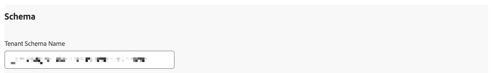

# Panoramica dell’estensione Adobe Content Analytics

L&#39;estensione tag [!DNL Adobe Content Analytics] consente il tracciamento di eventi relativi al contenuto su un sito Web. L’estensione invia i dati di contenuto (esperienze e risorse) a un flusso di dati in Adobe Experience Cloud dalle proprietà web tramite Experience Platform Edge Network.

L’estensione consente di inviare in streaming dati di eventi specifici relativi al contenuto in Experience Platform in modo da poter utilizzare tali dati nei rapporti di analisi dei contenuti in Customer Journey Analytics.

Questo documento spiega come configurare l’estensione tag nell’interfaccia utente Tag.

## Installare l’estensione tag Adobe Content Analytics {#install}

L&#39;estensione tag Adobe Content Analytics viene installata automaticamente come parte della proprietà tag creata automaticamente quando si utilizza la [configurazione guidata di Content Analytics](https://experienceleague.adobe.com/en/docs/analytics-platform/using/content-analytics/configuration/guided).

<!--
### Manual installation

In case of a manual configuration, the Adobe Content Analytics tag extension needs a property to be installed on. If you have not done so already, see the documentation on [creating a tag property](https://experienceleague.adobe.com/en/docs/platform-learn/implement-in-websites/configure-tags/create-a-property).

After you have created a property or when you select the property created using the [Content Analytics guided configuration wizard](https://experienceleague.adobe.com/en/docs/analytics-platform/using/content-analytics/configuration/guided), open the property and select the **[!UICONTROL Extensions]** tab on the left side bar.

Select the **[!UICONTROL Catalog]** tab. From the list of available extensions, find the **[!DNL Adobe Content Analytics]** extension and select **[!UICONTROL Install]**.

After selecting **[!UICONTROL Install]**, you must configure the Adobe Content Analytics tag extension and save the configuration.
-->

<!--
## Configure schema

The [Content Analytics guided configuration wizard](https://experienceleague.adobe.com/en/docs/analytics-platform/using/content-analytics/configuration/guided) automatically populates the proper value for the **[!UICONTROL Tenant Schema Name]**. 

>[!WARNING]
>
>Do not modify the value for **[!UICONTROL Tenant Schema Name]**.

-->

## Configurare i flussi di dati

La [Configurazione guidata di Content Analytics](https://experienceleague.adobe.com/en/docs/analytics-platform/using/content-analytics/configuration/guided) seleziona automaticamente il valore corretto per **[!UICONTROL Sandbox]** e **[!UICONTROL Production Datastream]**. Facoltativamente, puoi configurare un ulteriore **[!UICONTROL stream di dati di staging]** e **[!UICONTROL stream di dati di sviluppo]**.

Puoi sovrascrivere i valori selezionati automaticamente per **[!UICONTROL Sandbox]** e **[!UICONTROL Production Datastream]** nel caso in cui desideri utilizzare Content Analytics in una sandbox diversa e con flussi di dati diversi. Durante questa operazione, puoi selezionare una sandbox e gli stream di dati dai menu a discesa disponibili, oppure selezionare **[!UICONTROL Immetti i valori]** e immettere un ID dello stream di dati personalizzato per ogni ambiente.

>[!IMPORTANT]
>
>Quando configuri un’altra sandbox e altri flussi di dati, assicurati che
>
>* la sandbox selezionata non è già associata a un’altra configurazione Content Analytics e
>* per qualsiasi stream di dati selezionato, il servizio Experience Platform è configurato con un set di dati evento esperienza Content Analytics abilitato.

Per informazioni su come configurare uno stream di dati, consulta la guida sugli [stream di dati](../../../../datastreams/overview.md).

## Configurare l’acquisizione e la definizione dell’esperienza

Nella sezione **[!UICONTROL Acquisizione esperienze e definizione]**, puoi abilitare **[!UICONTROL Includi esperienze]** per includere le esperienze durante la raccolta dei dati per Content Analytics.

1. Abilita **[!UICONTROL Includi esperienze]**.
1. Facoltativamente. specifica i parametri per il rendering del contenuto sul sito web. I parametri sono zero o più combinazioni di **[!UICONTROL Espressione regolare dominio]** e **[!UICONTROL Parametri query]**.
   1. Immettere un&#39;espressione regolare **[!UICONTROL Dominio]**, ad esempio `^(?!.*\b(store|help|admin)\b)`.
   1. Specificare un elenco separato da virgole di **[!UICONTROL Parametri query]**, ad esempio `outdoors, patio, kitchen`.
Utilizza  per eliminare i singoli parametri, oppure **[!UICONTROL Cancella tutto]** per eliminare tutti i parametri.
1. Selezionare **[!UICONTROL Rimuovi]** se si desidera rimuovere una combinazione di espressioni regolari di dominio e parametri di query.
1. Selezionare **[!UICONTROL Aggiungi Regex]** se si desidera aggiungere un&#39;altra combinazione di un&#39;espressione regolare e parametri di query.

## Configurare il filtro degli eventi

Nella sezione **[!UICONTROL Filtro eventi]**, puoi modificare le espressioni regolari per filtrare **[!UICONTROL URL di pagina]** e **[!UICONTROL URL di Assets]** durante la raccolta di dati per Content Analytics. Le espressioni regolari definite nella [Configurazione guidata di Content Analytics](https://experienceleague.adobe.com/en/docs/analytics-platform/using/content-analytics/configuration/guided) vengono popolate automaticamente.

### Esempi

* Desideri escludere tutte le pagine della documentazione da Content Analytics. Utilizza la seguente espressione regolare: `^(?!.*documentation).*`
* Si desidera escludere da Content Analytics tutte le immagini JPEG e SVG con logo. Utilizza la seguente espressione regolare: `^(?!.*(logo\.jpg|)).*$`

Puoi usare **[!UICONTROL Test Regex]** per testare la tua espressione regolare nel **[!UICONTROL Tester espressioni regolari]**.

