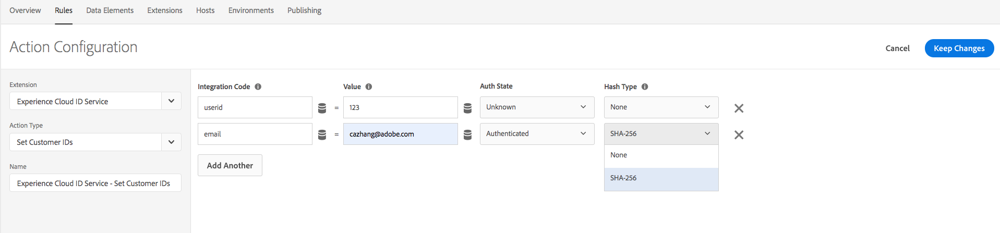

# Note sulla versione dell’estensione Adobe Experience Cloud Identity Service

>[!NOTE]
>
>Adobe Experience Platform Launch è stato ridefinito come suite di tecnologie di raccolta dati in Adobe Experience Platform. Di conseguenza, sono state introdotte diverse modifiche terminologiche nella documentazione del prodotto. Consulta questo [documento](../../../term-updates.md) come riferimento consolidato delle modifiche terminologiche.

Questo documento descrive le note sulla versione dell’estensione tag Adobe Experience Cloud Identity Service. Per le note sulla versione di Experience Cloud Identity Service, consulta [Documentazione del servizio Identity](https://experienceleague.adobe.com/docs/id-service/using/release-notes/release-notes.html?lang=it).

## 17 ottobre 2022

### Estensione Experience Cloud ID 5.5.0

* L&#39;estensione ora supporta la versione 5.5.0 di [Client JS visitatore](https://github.com/Adobe-Marketing-Cloud/id-service). Consulta la sezione [Note sulla versione del visitatore](https://github.com/Adobe-Marketing-Cloud/id-service/releases/tag/5.5.0) per aggiornamenti specifici.

## 9 marzo 2022

### Estensione Experience Cloud ID 5.4.0

* Questa versione contiene la versione più recente di Visitor 5.4.0, con i seguenti aggiornamenti:

   * Possibilità di configurare la durata del `s_ecid` cookie utilizzando cookieLifetime config
   * Aggiornamento per un problema del browser Firefox che si verifica quando una pagina viene caricata in un iFrame secondario

## 10 ottobre 2021

### Estensione Experience Cloud ID 5.3.1

* Questa versione contiene la versione più recente di Visitor 5.3.0, con i seguenti nuovi aggiornamenti:

   * Algoritmo aggiornato per generare ECID locale
   * Opt-in più recente con `Secure` e `SameSite` flag per il cookie di privacy
   * Risoluzione di un problema del browser Firefox quando una pagina viene caricata in un iFrame secondario

## 12 gennaio 2021

### Estensione Experience Cloud ID 5.2.0

* La patch VisitorJS 5.2.0 è stata aggiornata per correggere un problema a causa del quale ECID DataElement non veniva aggiornato dopo la ricezione del consenso.

## 3 novembre 2020

### Estensione Experience Cloud ID 5.2.1

* Questa patch contiene una correzione per la scrittura di cookie da un iFrame con attributo `SameSite=None` nel browser Google Chrome.

## 27 ottobre 2020

### Estensione Experience Cloud ID 5.1.0

* Aggiunta della configurazione `sameSiteCookie` per specificare l’attributo `SameSite` del cookie `AMCV`. La configurazione supporta i seguenti valori per l’attributo `SameSite`:

   * `Strict`
   * `Lax`
   * `None`

I dettagli dei valori dell’attributo sono reperibili su [web.dev](https://web.dev/samesite-cookies-explained/) e [chromium](https://www.chromium.org/updates/same-site)

## 13 agosto 2020

### Estensione Experience Cloud ID 5.0.1

* Aggiornamento alla patch VisitorJS 5.0.1 con una correzione per aggiungere il flag d_cf quando cambia la stringa di consenso IAB.

## 15 giugno 2020

### Estensione Experience Cloud ID 5.0.0

* È stato aggiunto supporto per `IAB TCF` (Transparency and Consent Framework) `Version 2.0`.

## 13 aprile 2020

### Estensione Experience Cloud ID 4.6.0

* È stato impostato il flag `loadSSL` per impostazione predefinita. Tutte le chiamate al servizio identità sono impostate su `https` per impostazione predefinita. I clienti possono impostarlo su false se desiderano chiamare i servizi identità su HTTP dalle proprie pagine non SSL.
* È stata aggiornata la funzione utilizzata per rilevare la versione di Internet Explorer (IE) per risolvere un problema segnalato da ESLint.
* Sono stati corretti i bug per un problema di prestazioni in Internet Explorer (IE) 11 in caso di pre-approvazione del consenso ECID e successivo aggiornamento.

## 22 gennaio 2020

### Estensione Experience Cloud ID 4.5.2

* Aggiornamento visitor.js a 4.5.2
* Il visitatore 4.5.1 include una correzione di bug per il plug-in IAB per l’opzione opt-in
* È stato aggiornato il metodo `setCustomerIDs` per rifiutare gli ID vuoti inviati.

## 7 gennaio 2020

### Estensione Experience Cloud ID 4.4.2

* Aggiornamento visitor.js a 4.4.2
* È stato migliorato il metodo `getVisitorValues` per recuperare più rapidamente i valori.

## 19 settembre 2019

### Estensione Experience Cloud ID 4.4.1

* Aggiornamento visitor.js a 4.4.1
* È stato corretto un bug per ottenere il consenso di input di pre-approvazione
* VIDEO_ANALYTICS rinominato in MEDIA_ANALYTICS in preOptInApprovals

   

## 17 luglio 2019

### Estensione Experience Cloud ID 4.4.0

* Aggiornamento visitor.js a 4.4.0
* Aggiunto supporto di hashing SHA-256 per setCustomerIDs

   

## 13 maggio 2019

### Estensione Experience Cloud ID 4.3.1

* Aggiornamento visitor.js a 4.3
* È stato aggiunto tipo di elemento dati per ECID come parte dell’estensione tag.

   

## 9 aprile 2019

### Estensione Experience Cloud ID 4.2.0

* Aggiornamento visitor.js a 4.2 che include il supporto per il plug-in IAB TCF di Audience Manager.

## 25 febbraio 2019

### Estensione Experience Cloud ID 4.1.0

* Aggiornato visitor.js a 4.1, che aggiornava publishDestinations in base alla nuova modifica API. Con questo aggiornamento le informazioni della pagina possono essere esposte durante la sincronizzazione ID, se si desidera.

## 15 febbraio 2019

### Estensione Experience Cloud ID 4.0.0

* Aggiornamento visitor.js a 4.0
* Sono state aggiunte opzioni di configurazione per il nuovo oggetto opt-in integrato. Le impostazioni Opt-In possono essere utilizzate per sopprimere cookie e le chiamate beacon di Adobe Solutions per supportare meglio normative come il RGPD.

   

## 20 marzo 2018

### Estensione Experience Cloud ID 3.1.0

* Aggiornamento visitor.js a 3.1
* Aggiunge due proprietà di configurazione: `resetBeforeVersion` e `serverState`.
