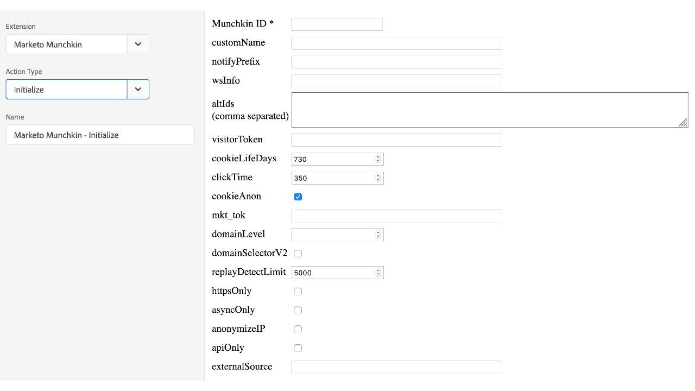

# Panoramica dell’estensione Marketo Munchkin

Utilizza l&#39;estensione per integrare il codice di tracciamento [!DNL Marketo Munchkin] JavaScript con la tua proprietà. [!DNL Marketo Munchkin] JavaScript consente di tracciare le visite degli utenti finali e di navigare sulle pagine di destinazione e sulle pagine web esterne Marketo.

## Installazione dell&#39;estensione Marketo Munchkin

Se l’estensione [!DNL Marketo Munchkin] non è ancora stata installata, apri la proprietà, quindi seleziona **[!UICONTROL Extensions > Catalog]**, passa il puntatore sull’estensione [!DNL Marketo Munchkin] e seleziona **[!UICONTROL Install]**.

Non ci sono configurazioni necessarie per questa estensione.

## Tipi di azioni dell&#39;estensione Marketo Munchkin

In questa sezione sono descritti i tipi di azioni disponibili nell&#39;estensione [!DNL Marketo Munchkin].

### Inizializza

**Munchkin ID: (obbligatorio)** l&#39;ID account Munchkin trovato nel menu Amministrazione > Integrazione > Munchkin.

**Configurations:** tutti i parametri configurabili sono indicati [qui](https://developers.marketo.com/javascript-api/lead-tracking/configuration/).

### Visita pagina web

**url: (obbligatorio)** il percorso file URL utilizzato per registrare una visita di pagina.

**params:** una stringa di query dei parametri desiderati da registrare.

**name:** il nome personalizzato della risorsa della pagina Web.

### Fai clic sul collegamento

**href: (obbligatorio)** Percorso del file URL utilizzato per registrare la selezione di un collegamento.
