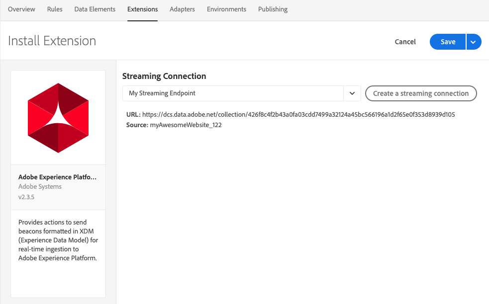

# Estensione Adobe Experience Platform Demo

>[!NOTE]
>
>Adobe Experience Platform Launch è stato ridefinito come suite di tecnologie di raccolta dati in Adobe Experience Platform. Di conseguenza, sono state introdotte diverse modifiche terminologiche nella documentazione del prodotto. Consulta questo [documento](../../../term-updates.md) come riferimento consolidato delle modifiche terminologiche.

>[!NOTE]
>
>Questa estensione diventerà obsoleta e sarà sostituita da [Adobe Experience Platform Web SDK](../sdk/overview.md).

Le funzioni di questa estensione verranno trasferite alla nuova estensione. Segue un rapido confronto delle funzioni correnti.

| Estensione Platform Demo | SDK Web per Platform |
| ------------------ | ----------- |
| Supporto di ID cliente personalizzati | Supporto di ID cliente personalizzati |
| Interfaccia utente di mappatura lato client per XDM | ECID integrato (non è necessario usare visitor.js) |
| Possibilità di creare una connessione in streaming | Supporto per consenso |
|  | Supporto XDM come elemento dati |
|  | Supporto dominio di prima parte |
|  | Strumenti di debug incorporati |
|  | Contenuto del browser raccolto automaticamente |
|  | Completamente open source |

## Configurare l&#39;estensione Adobe Experience Platform

Questa sezione fornisce un riferimento per le opzioni disponibili durante la configurazione dell&#39;estensione Adobe Experience Platform.

Se l’estensione Adobe Experience Platform non è ancora stata installata, apri la proprietà, quindi fai clic su **[!UICONTROL Estensioni > Catalogo]**, passa il puntatore sull’estensione Adobe Experience Platform e fai clic su **[!UICONTROL Installa]**.

Per configurare l’estensione, apri la scheda [!UICONTROL Estensioni], passa il puntatore sull’estensione e fai clic su **[!UICONTROL Configura]**.

### Connessione streaming

La scelta di una connessione in streaming è il primo passaggio che consente di avviare i dati in streaming ad Adobe Experience Platform. Puoi selezionarne uno dalla casella combinata per la connessione streaming. La connessione in streaming è un campo obbligatorio. Se non hai creato una connessione in streaming, puoi crearne una facendo clic sul pulsante **[!UICONTROL Crea una connessione in streaming]**.

Se selezioni **[!UICONTROL Crea una connessione in streaming]** verrà visualizzata una finestra modale.

La finestra modale contiene campi con valori precompilati che puoi modificare in base alle tue esigenze. Se prevedi di creare più di una connessione in streaming, tieni presente che il campo **[!UICONTROL Origine dati]** deve essere univoco. Il tentativo di creare un’altra connessione in streaming utilizzando una **[!UICONTROL Origine dati]** già in uso in un’altra connessione non avrà esito negativo.

Una volta selezionato un endpoint di streaming, l&#39;URL dell&#39;endpoint di streaming e la sorgente saranno visualizzati.

## Tipi di azioni estensione Adobe Experience Platform

In questa sezione sono descritti i tipi di azioni disponibili nell&#39;estensione Adobe Experience Platform.

### Invia beacon {#send-beacon}

Utilizzerai questo tipo di azione per inviare dati ad Adobe Experience Platform.

Devi innanzitutto selezionare il set di dati in cui memorizzare i dati. In genere, i set di dati rappresentano una tabella che memorizzerà i dati inviati tramite la connessione streaming. Prima di usare questo tipo di azione, devi creare i set di dati all&#39;interno di Adobe Experience Platform.

Una volta selezionato il set di dati in cui verranno memorizzati i dati, vengono visualizzati i dettagli dello schema collegato al set di dati selezionato.

### Mappatura schema

Dopo aver selezionato il set di dati puoi definire la mappatura schema.

Il campo del valore sorgente accetta un valore o un elemento dati. Puoi aggiungere un elemento dati facendo clic sul relativo pulsante accanto al campo del valore sorgente.

Il campo schema di destinazione contiene il percorso di un campo XDM definito nello schema del set di dati. Per i campi definiti più dettagliatamente nella gerarchia dello schema, puoi utilizzare il punto come separatore tra le parti del percorso (ad esempio, timeSeriesEvents.eventType).

### Selettore campo schema

L&#39;estensione consente anche di selezionare un campo schema di destinazione utilizzando un selettore visivo. Se fai clic sul pulsante di destinazione accanto all&#39;input del campo schema di destinazione, verrà mostrato un modale in cui potrai vedere la struttura dello schema del set di dati. Puoi scegliere un campo, quindi selezionare il pulsante **Seleziona** e l&#39;input del campo schema di destinazione sarà aggiornato in base al percorso XDM corretto.

### Campi di identità in Adobe Experience Platform

Gli schemi di dati record e gli schemi di dati di serie temporali possono contenere uno o più campi di identità. I campi di identità si uniscono a formare una singola rappresentazione di identità di un soggetto e includono informazioni quali un identificatore CRM, Experience Cloud ID (ECID), cookie del browser, AdvertisingId o altri ID in diversi domini.

I campi di identità possono essere definiti in due modi all&#39;interno dello schema:

1. Gli schemi di record e serie temporali contengono entrambi un campo speciale chiamato `xdm:identityMap` che può contenere una mappa di identità.
1. I campi chiave possono essere contrassegnati come campi &quot;Identity&quot; all&#39;interno dello schema.

### Campi di identità nell&#39;estensione Adobe Experience Platform

Per ogni campo di schema definito come campo di identità, viene aggiunta una riga alla sezione mappatura schema. Ogni riga aggiunta conterrà il campo dello schema di destinazione già compilato con il corrispondente percorso di schema XDM. Puoi riconoscere se un campo di schema è anche un campo identità se visualizzi un&#39;icona di profilo accanto al campo.

I campi di identità principali sono sempre obbligatori, pertanto puoi eliminare le righe che li contengono dalla sezione mappatura schema.

Un campo schema definito come campo di identità non principale viene aggiunto automaticamente alla sezione di mappatura dello schema, ma l&#39;input del valore sorgente può rimanere vuoto. Tale campo può essere eliminato. Il campo viene eliminato se l&#39;input del valore sorgente corrispondente è vuoto.

Visualizzerai un&#39;icona di avviso accanto a ogni campo di identità non principale che non contiene un valore.

Se lo schema contiene un campo `xdm:identityMap`, sarà visibile una sezione di identità. Puoi utilizzare questa sezione se preferisci inviare dati relativi alle identità utilizzando `xdm:identityMap`.

La sezione di mappatura identità può contenere più righe. Ogni riga può definire un determinato tipo di identità. Puoi definire i seguenti attributi per un’identità: tipo, stato autenticato, principale e valore.

Se all&#39;interno della sezione di mappatura identità hai più identità, puoi contrassegnare una sola identità come principale.

Se si dispone di uno schema con un campo `xdm:identityMap` e allo stesso tempo un altro campo è contrassegnato come campo di identità principale, la colonna principale nella sezione di mappatura identità non sarà visibile.

### Campi obbligatori

Alcuni schemi avranno campi obbligatori di livello superiore. I più comuni sono `timestamp` e `_id`. Senza definire questi campi, il beacon avrà esito negativo. Puoi definirli all’interno della sezione di mappatura dello schema.

Se la sezione di mappatura dello schema non contiene `timestamp` o `_id`, ma lo schema di set di dati li richiede, l&#39;estensione Adobe Experience Platform invia un beacon contenente i valori generati automaticamente in modo che il beacon abbia esito positivo. I valori generati automaticamente verranno aggiunti ai dati del beacon solo se non li hai definiti all&#39;interno della sezione di mappatura dello schema.
