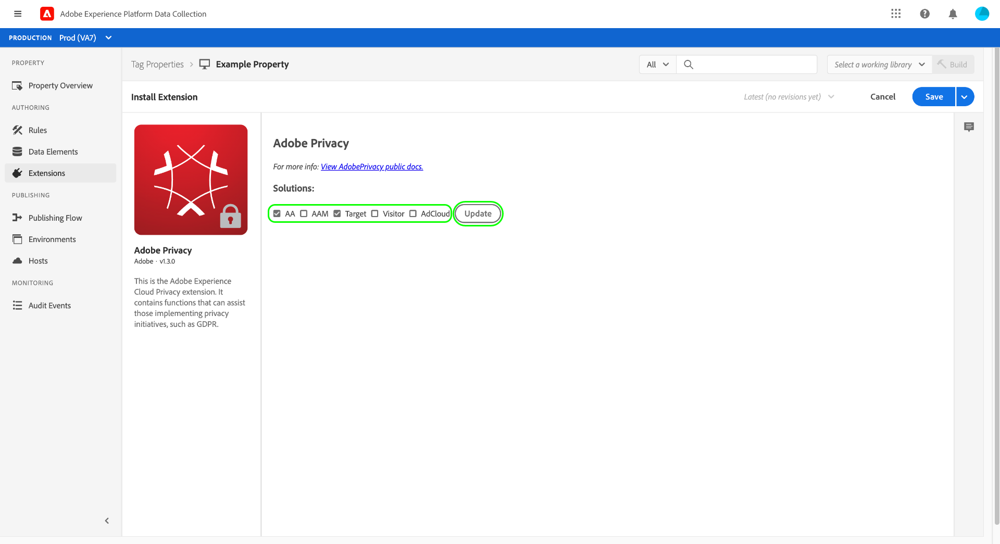

# Panoramica dell’estensione Adobe Privacy

>[!NOTE]
>
>Adobe Experience Platform Launch è stato classificato come una suite di tecnologie di raccolta dati in Adobe Experience Platform. Di conseguenza, sono state introdotte diverse modifiche terminologiche nella documentazione del prodotto. Consulta questo [documento](../../../term-updates.md) come riferimento consolidato delle modifiche terminologiche.

L’estensione Adobe di tag Privacy consente di raccogliere e rimuovere gli ID utente assegnati agli utenti finali dalle soluzioni Adobe sui dispositivi lato client. Gli ID raccolti possono quindi essere inviati a [Adobe Experience Platform Privacy Service](../../../../privacy-service/home.md) per accedere o eliminare i dati personali della persona correlata nelle applicazioni Adobe Experience Cloud supportate.

Questa guida illustra come installare e configurare l’estensione Adobe Privacy nell’interfaccia utente di Experience Platform o nell’interfaccia utente di raccolta dati.

>[!NOTE]
>
>Se preferisci installare queste funzionalità senza utilizzare tag, consulta la [Panoramica della libreria JavaScript sulla privacy](../../../../privacy-service/js-library.md) per i passaggi su come implementare utilizzando il codice non elaborato.

## Installa e configura l&#39;estensione 

Seleziona **[!UICONTROL Estensioni]** nella navigazione a sinistra, seguita dalla **[!UICONTROL Catalogo]** scheda . Utilizza la barra di ricerca per restringere l’elenco delle estensioni disponibili fino a individuare Privacy degli Adobi. Seleziona **[!UICONTROL Installa]** per continuare.

La schermata successiva ti consente di configurare da quali sorgenti e soluzioni desideri che l’estensione raccolga gli ID. L&#39;estensione supporta le seguenti soluzioni:

* Adobe Analytics (AA)
* Adobe Audience Manager (AAM)
* Adobe Target
* Servizio Adobe Experience Cloud Identity (Visitatore o ECID)
* Adobe Advertising Cloud (AdCloud)

Seleziona una o più soluzioni, quindi seleziona **[!UICONTROL Aggiorna]**.

Lo schermo viene aggiornato per mostrare gli input per i parametri di configurazione richiesti in base alle soluzioni selezionate.

Utilizzando il menu a discesa qui sotto, puoi anche aggiungere alla configurazione parametri aggiuntivi specifici della soluzione.

>[!NOTE]
>
>Vedi la sezione su [parametri di configurazione](../../../../privacy-service/js-library.md#config-params) nella panoramica della Libreria JavaScript per la privacy per informazioni sui valori di configurazione accettati per ogni soluzione supportata.

Dopo aver aggiunto i parametri per le soluzioni selezionate, seleziona **[!UICONTROL Salva]** per salvare la configurazione.

## Utilizzo dell&#39;estensione {#using}

L’estensione Adobe Privacy fornisce tre tipi di azione che possono essere utilizzati in un [regola](../../../ui/managing-resources/rules.md) quando si verifica un determinato evento e vengono soddisfatte le condizioni seguenti:

* **[!UICONTROL Recupera identità]**: Le informazioni di identità memorizzate dell&#39;utente vengono recuperate.
* **[!UICONTROL Rimuovi identità]**: Le informazioni di identità memorizzate dell&#39;utente vengono rimosse.
* **[!UICONTROL Recupera e rimuovi le identità]**: Le informazioni di identità memorizzate dell&#39;utente vengono recuperate e rimosse.

Per ciascuna delle azioni di cui sopra, è necessario fornire una funzione JavaScript di callback che accetta e gestisce i dati di identità recuperati come parametro di oggetto. Da qui puoi archiviare queste identità, visualizzarle o inviarle al [API Privacy Service](../../../../privacy-service/api/overview.md) come richiesto.

Quando utilizzi l’estensione tag Privacy di Adobe, devi fornire la funzione di callback richiesta sotto forma di un elemento dati. Consulta la sezione successiva per i passaggi su come configurare questo elemento dati.

### Definire un elemento dati per gestire le identità

Avvia il processo di creazione di un nuovo elemento dati selezionando **[!UICONTROL Elementi dati]** nella navigazione a sinistra, seguita da **[!UICONTROL Aggiungi elemento dati]**. Una volta nella schermata di configurazione, seleziona **[!UICONTROL Core]** per l&#39;estensione e **[!UICONTROL Codice personalizzato]** per il tipo di elemento dati. Da qui, seleziona **[!UICONTROL Open Editor]** nel pannello di destra.

Nella finestra di dialogo visualizzata, definisci una funzione JavaScript che gestirà le identità recuperate. Il callback deve accettare un singolo argomento di tipo oggetto (`ids` nell&#39;esempio seguente). La funzione può quindi gestire gli ID come desideri e può inoltre richiamare qualsiasi variabile e funzione disponibile a livello globale sul tuo sito per un’ulteriore elaborazione.

>[!NOTE]
>
>Per ulteriori informazioni sulla struttura del `ids` oggetto che la funzione di callback deve gestire, fare riferimento al [esempi di codice](../../../../privacy-service/js-library.md#samples) fornita nella panoramica della libreria JavaScript per la privacy.

Al termine, seleziona **[!UICONTROL Salva]**.

Puoi continuare a creare altri elementi di dati con codice personalizzato se hai bisogno di callback diversi per eventi diversi.

### Creare una regola con un&#39;azione di privacy

Dopo aver configurato un elemento dati di callback per gestire gli ID recuperati, puoi creare una regola che richiama l’estensione Adobe Privacy ogni volta che si verifica un determinato evento sul tuo sito, insieme a qualsiasi altra condizione necessaria.

Quando configuri l’azione per la regola, seleziona **[!UICONTROL Privacy degli Adobi]** per l&#39;estensione . Per il tipo di azione, seleziona una delle [tre funzioni](#using) fornito dall&#39;estensione.

Il pannello di destra chiede di selezionare un elemento dati che fungerà da callback dell’azione. Seleziona l’icona del database () e scegli dall’elenco l’elemento dati creato in precedenza. Seleziona **[!UICONTROL Mantieni modifiche]** per continuare.

Da qui puoi continuare a configurare la regola in modo che l’azione Privacy Adobe venga attivata in base agli eventi e alle condizioni richieste. Quando sei soddisfatto, seleziona **[!UICONTROL Salva]**.

Ora puoi aggiungere la regola a una libreria da distribuire come build sul sito web per i test. Vedi la panoramica sul [flusso di pubblicazione dei tag](../../../ui/publishing/overview.md) per ulteriori informazioni.

## Disabilita o disinstalla l&#39;estensione

Dopo aver installato l&#39;estensione, puoi disabilitarla o eliminarla. Fai clic su **[!UICONTROL Configura]** nella scheda Adobe Privacy nelle estensioni installate, quindi seleziona **[!UICONTROL Disabilita]** o **[!UICONTROL Disinstalla]**.

## Passaggi successivi

Questa guida riguardava l’utilizzo dell’estensione tag Privacy Adobe nell’interfaccia utente di . Per ulteriori informazioni sulle funzionalità fornite dall&#39;estensione, compresi esempi su come utilizzarla con codice non elaborato, consulta la sezione [Panoramica della libreria JavaScript sulla privacy](../../../../privacy-service/js-library.md) nella documentazione di Privacy Service.
