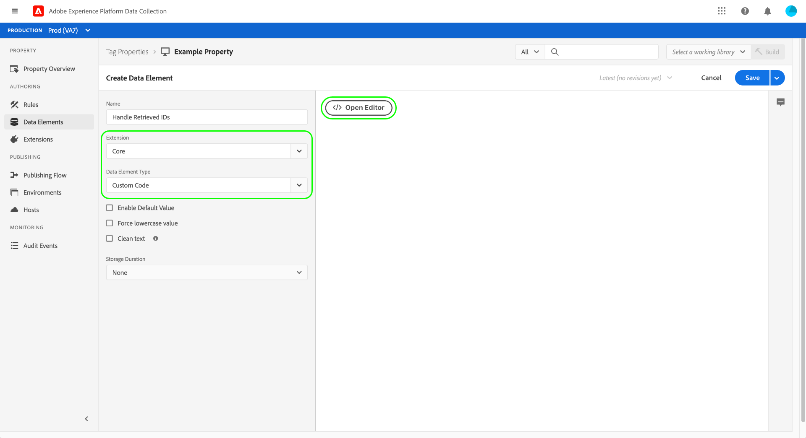

# Panoramica dell’estensione Adobe Privacy

>[!NOTE]
>
>Adobe Experience Platform Launch è stato ridefinito come suite di tecnologie di raccolta dati in Adobe Experience Platform. Di conseguenza, sono state introdotte diverse modifiche terminologiche nella documentazione del prodotto. Consulta questo [documento](../../../term-updates.md) come riferimento consolidato delle modifiche terminologiche.

L’estensione tag Adobe Privacy consente di raccogliere e rimuovere gli ID utente assegnati agli utenti finali dalle soluzioni Adobe sui dispositivi lato client. Gli ID raccolti possono quindi essere inviati a [Adobe Experience Platform Privacy Service](../../../../privacy-service/home.md) per accedere o cancellare i dati personali di un individuo correlato nelle applicazioni Adobe Experience Cloud supportate.

Questa guida illustra come installare e configurare l’estensione Adobe Privacy nell’interfaccia utente di Experienci Platform o nell’interfaccia utente di Data Collection.

>[!NOTE]
>
>Se preferisci installare queste funzionalità senza utilizzare i tag, consulta [Panoramica della libreria JavaScript per la privacy](../../../../privacy-service/js-library.md) per i passaggi su come implementare utilizzando il codice non elaborato.

## Installa e configura l&#39;estensione 

Seleziona **[!UICONTROL Estensioni]** nel menu di navigazione a sinistra, seguito da **[!UICONTROL Catalogo]** scheda. Utilizza la barra di ricerca per restringere l’elenco delle estensioni disponibili fino a individuare Adobe Privacy. Seleziona **[!UICONTROL Installa]** per continuare.

La schermata successiva consente di configurare da quali origini e soluzioni desideri che l&#39;estensione raccolga gli ID. Le seguenti soluzioni sono supportate per l&#39;estensione:

* Adobe Analytics (AA)
* Adobe Audience Manager (AAM)
* Adobe Target
* Servizio Adobe Experience Cloud Identity (Visitor o ECID)
* Adobe Advertising Cloud (AdCloud)

Seleziona una o più soluzioni, quindi seleziona **[!UICONTROL Aggiorna]**.

La schermata si aggiorna per mostrare gli input per i parametri di configurazione richiesti in base alle soluzioni selezionate.

Utilizzando il menu a discesa sottostante, puoi anche aggiungere parametri aggiuntivi specifici della soluzione alla configurazione.

>[!NOTE]
>
>Consulta la sezione su [parametri di configurazione](../../../../privacy-service/js-library.md#config-params) nella panoramica della libreria JavaScript Privacy per informazioni dettagliate sui valori di configurazione accettati per ciascuna soluzione supportata.

Dopo aver aggiunto i parametri per le soluzioni selezionate, seleziona **[!UICONTROL Salva]** per salvare la configurazione.

## Utilizzo dell’estensione {#using}

L&#39;estensione Adobe Privacy fornisce tre tipi di azioni che possono essere utilizzati in una [regola](../../../ui/managing-resources/rules.md) quando si verifica un determinato evento e vengono soddisfatte determinate condizioni:

* **[!UICONTROL Recupera identità]**: vengono recuperate le informazioni di identità memorizzate dell’utente.
* **[!UICONTROL Rimuovi identità]**: le informazioni di identità memorizzate dell’utente vengono rimosse.
* **[!UICONTROL Recupera e rimuovi identità]**: le informazioni di identità memorizzate dell’utente vengono recuperate e quindi rimosse.

Per ciascuna delle azioni di cui sopra, devi fornire una funzione di callback JavaScript che accetti e gestisca i dati di identità recuperati come parametro di oggetto. Da qui, puoi memorizzare queste identità, visualizzarle o inviarle al [API PRIVACY SERVICE](../../../../privacy-service/api/overview.md) secondo le tue esigenze.

Quando utilizzi l’estensione tag Adobe Privacy, devi fornire la funzione di callback richiesta sotto forma di un elemento dati. Consulta la sezione successiva per informazioni su come configurare questo elemento dati.

### Definire un elemento dati per gestire le identità

Avvia il processo di creazione di un nuovo elemento dati selezionando **[!UICONTROL Elementi dati]** nel menu di navigazione a sinistra, seguito da **[!UICONTROL Aggiungi elemento dati]**. Una volta visualizzata la schermata di configurazione, seleziona **[!UICONTROL Core]** per l&#39;estensione e **[!UICONTROL Codice personalizzato]** per il tipo di elemento dati. Da qui, seleziona **[!UICONTROL Apri editor]** nel pannello a destra.

Nella finestra di dialogo visualizzata, definisci una funzione JavaScript che gestirà le identità recuperate. Il callback deve accettare un singolo argomento di tipo oggetto (`ids` nell’esempio seguente). La funzione può quindi gestire gli ID in base alle tue preferenze e richiamare eventuali variabili e funzioni globalmente disponibili sul sito per ulteriori elaborazioni.

>[!NOTE]
>
>Per ulteriori informazioni sulla struttura del `ids` oggetto che la funzione di callback deve gestire, fare riferimento al [esempi di codice](../../../../privacy-service/js-library.md#samples) fornite nella panoramica della libreria JavaScript per la privacy.

Al termine, seleziona **[!UICONTROL Salva]**.

Puoi continuare a creare altri elementi dati con codice personalizzato se richiedi callback diversi per eventi diversi.

### Creare una regola con un’azione sulla privacy

Dopo aver configurato un elemento dati di callback per gestire gli ID recuperati, puoi creare una regola che richiama l&#39;estensione Adobe Privacy ogni volta che si verifica un determinato evento sul sito insieme a qualsiasi altra condizione richiesta.

Durante la configurazione dell’azione per la regola, seleziona **[!UICONTROL Privacy Adobe]** per l’estensione. Per il tipo di azione, seleziona una delle opzioni seguenti: [tre funzioni](#using) fornite dall&#39;estensione.

Il pannello di destra richiede di selezionare un elemento dati che fungerà da callback dell’azione. Selezionare l&#39;icona del database () e scegli l’elemento dati creato in precedenza dall’elenco. Seleziona **[!UICONTROL Mantieni modifiche]** per continuare.

Da qui puoi continuare a configurare la regola in modo che l’azione Privacy dell’Adobe venga attivata in base agli eventi e alle condizioni richieste. Quando sei soddisfatto, seleziona **[!UICONTROL Salva]**.

Ora puoi aggiungere la regola a una libreria da distribuire come build sul sito web per il test. Consulta la panoramica su [flusso di pubblicazione dei tag](../../../ui/publishing/overview.md) per ulteriori informazioni.

## Disattivare o disinstallare l’estensione

Dopo aver installato l&#39;estensione, puoi disabilitarla o eliminarla. Fai clic su **[!UICONTROL Configura]** nella scheda Adobe Privacy nelle estensioni installate, quindi seleziona **[!UICONTROL Disabilita]** o **[!UICONTROL Disinstalla]**.

## Passaggi successivi

Questa guida descrive l’utilizzo dell’estensione tag Adobe Privacy nell’interfaccia utente. Per ulteriori informazioni sulle funzionalità fornite dall’estensione, inclusi esempi di come utilizzarla utilizzando il codice non elaborato, vedi [Panoramica della libreria JavaScript per la privacy](../../../../privacy-service/js-library.md) nella documentazione di Privacy Service.
