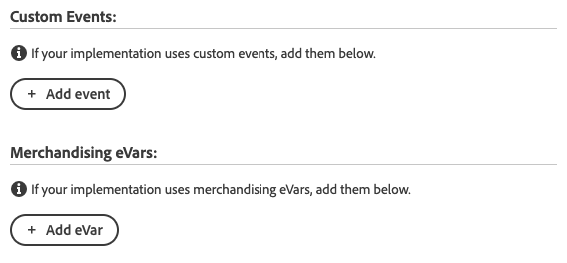

# Panoramica dell’estensione Adobe Analytics Product String

>[!NOTE]
>
>Adobe Experience Platform Launch è stato classificato come una suite di tecnologie di raccolta dati in Adobe Experience Platform. Di conseguenza, sono state introdotte diverse modifiche terminologiche nella documentazione del prodotto. Consulta questo [documento](../../../term-updates.md) come riferimento consolidato delle modifiche terminologiche.

La variabile `products` traccia il modo in cui gli utenti interagiscono con i prodotti sul sito. Ad esempio, la variabile `products` può tracciare il numero di volte in cui un prodotto viene visualizzato, aggiunto al carrello, estratto e acquistato. Può anche tracciare l’efficacia delle categorie di merchandising sul sito.

La variabile `products` deve sempre essere impostata insieme a un evento riuscito.

L’estensione [!DNL Adobe Analytics Product String Builder] imposta automaticamente la variabile `products` ripetendo il ciclo nel livello dati, acquisendo tutti i dati necessari relativi al prodotto e formattandola con la sintassi corretta riportata di seguito. Non è più necessario scrivere e gestire il codice JavaScript personalizzato per eseguire queste azioni complesse.

## Sintassi della variabile prodotti

```bash
Category;Product;Quantity;Price;eventN=X|eventN2=X2;eVarN=merch_category|eVarN2=merch_category2
```

Per consultare la documentazione completa, visita la sezione [Prodotti](https://experienceleague.adobe.com/docs/analytics/implementation/vars/page-vars/products.html?lang=it).

## Istruzioni di estensione

### Configurazione azione

Aggiungi l’azione “Adobe Analytics Product String - Imposta s.products” alla regola.


### Impostazione dei dati di prodotto standard

Poi definisci le variabili del livello dati. Dopo aver configurato l’azione come descritto nel passaggio precedente, viene visualizzata la seguente schermata:


Per ciascuno dei punti dati che desideri includere nella stringa di prodotto, immetti il percorso della variabile corretta del livello dati.

Ad esempio, se il livello dati è strutturato come segue:

```json
digitalData = {
  "transaction": {
    "item": [{
      "productInfo": {
        "productName": "My Product"
      }
    }]
  }
};
```

Immetti il seguente percorso nel campo “Variabile per ID/nome prodotto” per acquisire la variabile `productName`:

```json
digitalData.transaction.item.productInfo.productName
```

>[!NOTE]
>
>Se utilizzi un elemento dati per compilare il campo, questo deve essere configurato utilizzando il tipo di elemento dati costante o codice personalizzato e deve restituire il percorso indicato sopra come valore letterale stringa.

### Tipo di prezzo

Il parametro `price` nella stringa di prodotto [!DNL Adobe Analytics] deve riflettere il prezzo totale per il numero di unità acquistate, non il prezzo unitario, per quel prodotto. Quando abiliti il campo del prezzo nell’azione di estensione, è necessario specificare se il livello dati mostra il prezzo totale o il prezzo unitario. Quando utilizzi il prezzo unitario, l’estensione [!DNL Adobe Analytics Product String] lo moltiplica automaticamente per la quantità, in modo da ottenere il prezzo totale e impostare la stringa di prodotto nel modo corretto.


### Eventi personalizzati ed eVar per merchandising



Se la tua implementazione utilizza eventi personalizzati o eVar per merchandising, procedi come segue:

1. Seleziona il relativo pulsante **[!UICONTROL Aggiungi]**.
1. Scegli l’evento o l’eVar da impostare dal menu a discesa.
1. Immetti il percorso della variabile corretta del livello dati utilizzando la stessa sintassi descritta sopra.

### Sequenza azioni

Questa azione deve essere seguita da un’azione “Adobe Analytics - Imposta variabili”, che imposta gli eventi riusciti corrispondenti, e da un’azione “Adobe Analytics - Invia beacon”. Di seguito è illustrata la sequenza corretta delle azioni.


### Requisiti

* Un [livello dati](https://theblog.adobe.com/data-layers-buzzword-best-practice/) basato su oggetti con variabili per tutti i dati relativi al prodotto (ad esempio, ID prodotto, quantità, prezzo). Questa estensione non funziona con livelli dati basati sulla matrice.
* È necessario installare l’estensione [Adobe Analytics](../analytics/overview.md).
