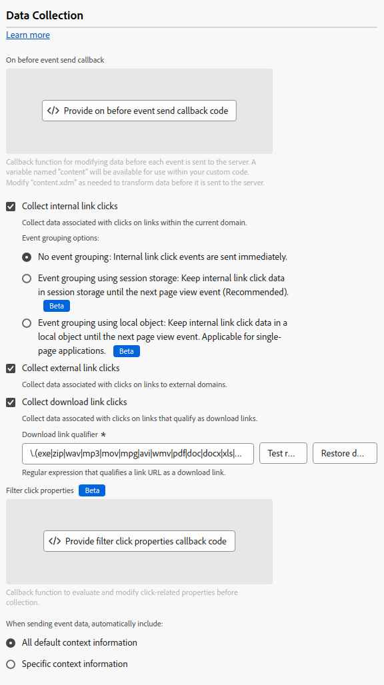

# Configurare l’estensione tag Web SDK

L&#39;estensione tag [!DNL Web SDK] invia i dati a Adobe Experience Cloud dalle proprietà Web tramite l&#39;Edge Network di Experience Platform.

L’estensione ti consente di inviare in streaming dati a Platform, sincronizzare le identità, elaborare i segnali di consenso dei clienti e raccogliere automaticamente i dati contestuali.

Questo documento spiega come configurare l’estensione tag nell’interfaccia utente Tag.

## Installare l’estensione tag Web SDK {#install}

L&#39;estensione tag Web SDK richiede una proprietà in cui installare. Se non lo hai già fatto, consulta la documentazione su [creazione di una proprietà tag](https://experienceleague.adobe.com/docs/platform-learn/implement-in-websites/configure-tags/create-a-property.html?lang=it).

Dopo aver creato una proprietà, apri la proprietà e seleziona la scheda **[!UICONTROL Estensioni]** sulla barra laterale sinistra.

Selezionare la scheda **[!UICONTROL Catalogo]**. Nell&#39;elenco delle estensioni disponibili, trovare l&#39;estensione [!DNL Web SDK] e selezionare **[!UICONTROL Installa]**.

Dopo aver selezionato **[!UICONTROL Installa]**, è necessario configurare l&#39;estensione tag Web SDK e salvare la configurazione.

>[!NOTE]
>
>L’estensione tag viene installata solo dopo il salvataggio della configurazione. Consulta le sezioni successive per scoprire come configurare l’estensione tag.

## Configurare le impostazioni delle istanze {#general}

Le opzioni di configurazione nella parte superiore della pagina indicano a Adobe Experience Platform dove instradare i dati e quali configurazioni utilizzare sul server.

* **[!UICONTROL Nome]**: l&#39;estensione Adobe Experience Platform Web SDK supporta più istanze nella pagina. Il nome viene utilizzato per inviare dati a più organizzazioni con una configurazione di tag. Il nome dell&#39;istanza predefinito è `alloy`. È tuttavia possibile modificare il nome dell&#39;istanza in qualsiasi nome di oggetto JavaScript valido.
* **[!UICONTROL ID organizzazione IMS]**: l&#39;ID dell&#39;organizzazione a cui si desidera inviare i dati in Adobe. Nella maggior parte dei casi, utilizza il valore predefinito compilato automaticamente. Se sulla pagina sono presenti più istanze, compila questo campo con il valore della seconda organizzazione a cui desideri inviare i dati.
* **[!UICONTROL Dominio Edge]**: dominio da cui l&#39;estensione invia e riceve i dati. Per questa estensione, Adobe consiglia di utilizzare un dominio di prima parte (CNAME). Il dominio predefinito di terze parti funziona per gli ambienti di sviluppo ma non è adatto per gli ambienti di produzione. Le istruzioni su come impostare un first party CNAME sono disponibili [qui](https://experienceleague.adobe.com/docs/core-services/interface/ec-cookies/cookies-first-party.html?lang=it).

## Configurare le impostazioni dello stream di dati {#datastreams}

Questa sezione consente di selezionare gli stream di dati da utilizzare per ciascuno dei tre ambienti disponibili (produzione, staging e sviluppo).

Quando viene inviata una richiesta all’Edge Network, viene utilizzato un ID dello stream di dati per fare riferimento alla configurazione lato server. Puoi aggiornare la configurazione senza dover apportare modifiche al codice sul tuo sito web.

Per informazioni su come configurare uno stream di dati, consulta la guida sugli [stream di dati](../../../../datastreams/overview.md).

Puoi scegliere uno stream di dati dai menu a discesa disponibili oppure selezionare **[!UICONTROL Immetti i valori]** e immettere un ID dello stream di dati personalizzato per ogni ambiente.

## Configurare le impostazioni della privacy {#privacy}

Questa sezione ti consente di configurare il modo in cui Web SDK gestisce i segnali di consenso degli utenti dal sito web. In particolare, consente di selezionare il livello predefinito di consenso presunto di un utente se non è stata fornita alcuna preferenza di consenso esplicito.

Il livello di consenso predefinito non viene salvato nel profilo utente.

| [!UICONTROL Livello di consenso predefinito] | Descrizione |
| --- | --- |
| [!UICONTROL In] | Raccogli eventi che si verificano prima che l’utente fornisca le preferenze di consenso. |
| [!UICONTROL Uscita] | Elimina gli eventi che si verificano prima che l’utente fornisca le preferenze di consenso. |
| [!UICONTROL In sospeso] | Metti in coda eventi che si verificano prima che l’utente fornisca le preferenze di consenso. Quando vengono fornite le preferenze di consenso, gli eventi vengono raccolti o eliminati in base alle preferenze fornite. |
| [!UICONTROL Fornito dall&#39;elemento dati] | Il livello di consenso predefinito è determinato da un elemento dati separato da te definito. Quando utilizzi questa opzione, devi specificare l’elemento dati utilizzando il menu a discesa fornito. |

>[!TIP]
>
>Utilizza **[!UICONTROL Out]** o **[!UICONTROL Pending]** se hai bisogno del consenso esplicito dell&#39;utente per le tue operazioni aziendali.

## Configurare le impostazioni di identità {#identity}

Questa sezione ti consente di definire il comportamento dell’SDK web quando si tratta di gestire l’identificazione dell’utente.

* **[!UICONTROL Migra ECID da VisitorAPI]**: questa opzione è abilitata per impostazione predefinita. Quando questa funzione è abilitata, l&#39;SDK può leggere i cookie `AMCV` e `s_ecid` e impostare il cookie `AMCV` utilizzato da [!DNL Visitor.js]. Questa funzione è importante durante la migrazione a Web SDK, poiché alcune pagine potrebbero usare ancora [!DNL Visitor.js]. Questa opzione consente all&#39;SDK di continuare a utilizzare lo stesso [!DNL ECID] in modo che gli utenti non vengano identificati come due utenti separati.
* **[!UICONTROL Usa cookie di terze parti]**: quando questa opzione è abilitata, Web SDK tenta di memorizzare un identificatore utente in un cookie di terze parti. In caso di esito positivo, l’utente viene identificato come un singolo utente mentre si sposta tra più domini, anziché essere identificato come un utente separato su ciascun dominio. Se questa opzione è abilitata, l’SDK potrebbe ancora non essere in grado di memorizzare l’identificatore utente in un cookie di terze parti se il browser non supporta i cookie di terze parti o se è stato configurato dall’utente per non consentire i cookie di terze parti. In questo caso, l’SDK memorizza l’identificatore solo nel dominio di prime parti.

  >[!IMPORTANT]
  >>I cookie di terze parti non sono compatibili con la funzionalità [ID dispositivo di prima parte](../../../../web-sdk/identity/first-party-device-ids.md) in Web SDK.
Puoi utilizzare gli ID dispositivo di prime parti oppure cookie di terze parti, ma non puoi utilizzare entrambe le funzioni contemporaneamente.
  >
## Configurare le impostazioni di personalizzazione {#personalization}

Questa sezione ti consente di configurare come nascondere determinate parti di una pagina durante il caricamento del contenuto personalizzato. In questo modo i visitatori potranno vedere solo la pagina personalizzata.

* **[!UICONTROL Migra Target da at.js a Web SDK]**: utilizza questa opzione per abilitare [!DNL Web SDK] alla lettura e scrittura dei cookie legacy `mbox` e `mboxEdgeCluster` utilizzati dalle librerie at.js `1.x` o `2.x`. In questo modo è possibile mantenere il profilo visitatore durante lo spostamento da una pagina che utilizza l’SDK per web a una pagina che utilizza le librerie at.js `1.x` o `2.x` e viceversa.

### Stile pre-hiding {#prehiding-style}

L’editor di stili che nasconde anticipatamente ti consente di definire regole CSS personalizzate per nascondere sezioni specifiche di una pagina. Quando la pagina viene caricata, Web SDK utilizza questo stile per nascondere le sezioni che devono essere personalizzate, recupera la personalizzazione e quindi rimuove le sezioni della pagina personalizzata. In questo modo, i visitatori visualizzano le pagine già personalizzate senza visualizzare il processo di recupero della personalizzazione.

### Frammento pre-hiding {#prehiding-snippet}

Il frammento pre-hiding è utile quando la libreria SDK Web viene caricata in modo asincrono. In questa situazione, per evitare sfarfallii, consigliamo di nascondere il contenuto prima che venga caricata la libreria dell’SDK web.

Per utilizzare il frammento pre-hiding, copiarlo e incollarlo nell&#39;elemento `<head>` della pagina.

>[!IMPORTANT]
>
Quando si utilizza il frammento pre-hiding, Adobe consiglia di utilizzare la stessa regola [!DNL CSS] utilizzata dallo stile [pre-hiding](#prehiding-style).

## Configurare le impostazioni di raccolta dati {#data-collection}

Gestisci le impostazioni di configurazione della raccolta dati. Impostazioni simili nella libreria JavaScript sono disponibili utilizzando il comando [`configure`](/help/web-sdk/commands/configure/overview.md).

* **[!UICONTROL Attivato prima del callback di invio dell&#39;evento]**: funzione di callback per valutare e modificare il payload inviato a Adobe. Utilizza la variabile `content` all&#39;interno della funzione di callback per modificare il payload. Questo callback è l&#39;equivalente del tag [`onBeforeEventSend`](/help/web-sdk/commands/configure/onbeforeeventsend.md) nella libreria JavaScript.
* **[!UICONTROL Raccogli clic sui collegamenti interni]**: casella di controllo che abilita la raccolta di dati di tracciamento dei collegamenti interni al sito o alla proprietà. Quando si attiva questa casella di controllo, vengono visualizzate le opzioni di raggruppamento degli eventi:
   * **[!UICONTROL Nessun raggruppamento di eventi]**: i dati di tracciamento dei collegamenti vengono inviati ad Adobe in eventi separati. I clic sui collegamenti inviati in eventi separati possono aumentare l’utilizzo contrattuale dei dati inviati a Adobe Experience Platform.
   * **[!UICONTROL Raggruppamento eventi tramite archiviazione sessione]**: archivia i dati di tracciamento dei collegamenti nell&#39;archiviazione sessione fino all&#39;evento pagina successivo. Nella pagina seguente, i dati di tracciamento dei collegamenti memorizzati e i dati di visualizzazione della pagina vengono inviati a Adobe contemporaneamente. Adobe consiglia di abilitare questa impostazione durante il tracciamento dei collegamenti interni.
   * **[!UICONTROL Raggruppamento eventi tramite oggetto locale]**: memorizzare i dati di tracciamento dei collegamenti in un oggetto locale fino all&#39;evento della pagina successivo. Se un visitatore passa a una nuova pagina, i dati di tracciamento dei collegamenti andranno persi. Questa impostazione è particolarmente utile nel contesto delle applicazioni a pagina singola.
* **[!UICONTROL Raccogli clic su un collegamento esterno]**: casella di controllo che abilita la raccolta di collegamenti esterni.
* **[!UICONTROL Raccogliere i clic sul collegamento di download]**: casella di controllo che abilita la raccolta dei collegamenti di download.
* **[!UICONTROL Qualificatore collegamento di download]**: espressione regolare che qualifica un URL collegamento come collegamento di download.
* **[!UICONTROL Proprietà clic filtro]**: funzione di callback per valutare e modificare le proprietà relative ai clic prima della raccolta. Questa funzione viene eseguita prima del [!UICONTROL On prima del callback di invio dell&#39;evento].
* **Impostazioni di contesto**: raccoglie automaticamente le informazioni sul visitatore, che compila specifici campi XDM. Puoi scegliere **[!UICONTROL Tutte le informazioni di contesto predefinite]** o **[!UICONTROL Informazioni di contesto specifiche]**. Equivale al tag [`context`](/help/web-sdk/commands/configure/context.md) nella libreria JavaScript.
   * **[!UICONTROL Web]**: raccoglie informazioni sulla pagina corrente.
   * **[!UICONTROL Dispositivo]**: raccoglie informazioni sul dispositivo dell&#39;utente.
   * **[!UICONTROL Ambiente]**: raccoglie informazioni sul browser dell&#39;utente.
   * **[!UICONTROL Contesto del luogo]**: raccoglie informazioni sulla posizione dell&#39;utente.
   * **[!UICONTROL Hint utente-agente entropici elevati]**: raccoglie informazioni più dettagliate sul dispositivo dell&#39;utente.

>[!TIP]
>
Il campo **[!UICONTROL Il prima del clic sul collegamento invia]** è un callback obsoleto visibile solo per le proprietà per le quali è già configurato. Equivale al tag [`onBeforeLinkClickSend`](/help/web-sdk/commands/configure/onbeforelinkclicksend.md) nella libreria JavaScript. Utilizza il callback **[!UICONTROL Proprietà clic filtro]** per filtrare o modificare i dati dei clic oppure utilizza il callback **[!UICONTROL Attivato prima dell&#39;invio dell&#39;evento]** per filtrare o modificare il payload complessivo inviato ad Adobe. Se sono impostati sia il callback **[!UICONTROL Proprietà clic filtro]** che il callback **[!UICONTROL Attivato prima del clic collegamento invia]**, verrà eseguito solo il callback **[!UICONTROL Proprietà clic filtro]**.

## Configurare le impostazioni della raccolta di file multimediali {#media-collection}

La funzione di raccolta multimediale consente di raccogliere i dati relativi alle sessioni multimediali sul sito web.

I dati raccolti possono includere informazioni su riproduzioni multimediali, pause, completamenti e altri eventi correlati. Una volta raccolti, puoi inviare questi dati a Adobe Experience Platform e/o Adobe Analytics, per generare rapporti. Questa funzione fornisce una soluzione completa per il tracciamento e la comprensione del comportamento di consumo dei contenuti multimediali sul sito web.

* **[!UICONTROL Canale]**: nome del canale in cui si verifica la raccolta multimediale. Esempio: `Video channel`.
* **[!UICONTROL Nome lettore]**: nome del lettore multimediale.
* **[!UICONTROL Versione applicazione]**: versione dell&#39;applicazione del lettore multimediale.
* **[!UICONTROL Intervallo ping principale]**: frequenza dei ping per il contenuto principale, in secondi. Il valore predefinito è `10`. I valori possono essere compresi tra `10` e `50` secondi.  Se non viene specificato alcun valore, viene utilizzato il valore predefinito quando si utilizzano [sessioni con tracciamento automatico](../../../../web-sdk/commands/createmediasession.md#automatic).
* **[!UICONTROL Intervallo ping annuncio]**: frequenza dei ping per il contenuto dell&#39;annuncio, in secondi. Il valore predefinito è `10`. I valori possono essere compresi tra `1` e `10` secondi. Se non viene specificato alcun valore, viene utilizzato il valore predefinito quando si utilizzano [sessioni con tracciamento automatico](../../../../web-sdk/commands/createmediasession.md#automatic)

## Configurare gli override dello stream di dati {#datastream-overrides}

Gli override dello stream di dati consentono di definire configurazioni aggiuntive per gli stream di dati, che vengono passate alla rete Edge tramite il Web SDK.

Questo consente di attivare comportamenti diversi dello stream di dati rispetto a quelli predefiniti, senza creare un nuovo stream di dati o modificare le impostazioni esistenti.

L’override della configurazione dello stream di dati è un processo costituito da due passaggi:

1. Innanzitutto, devi definire gli override della configurazione dello stream di dati nella [pagina di configurazione dello stream di dati](/help/datastreams/configure.md).
2. Quindi, devi inviare le sostituzioni all’Edge Network tramite un comando Web SDK o utilizzando l’estensione tag Web SDK.

Per istruzioni dettagliate su come ignorare le configurazioni dello stream di dati, consulta la [documentazione sulle sostituzioni della configurazione](/help/datastreams/overrides.md) dello stream di dati.

In alternativa al passaggio delle sostituzioni tramite un comando Web SDK, puoi configurare le sostituzioni nella schermata dell’estensione tag mostrata di seguito.

>[!IMPORTANT]
>
Le sostituzioni dello stream di dati devono essere configurate in base all’ambiente. Gli ambienti di sviluppo, staging e produzione hanno tutti sostituzioni separate. Puoi copiare le impostazioni tra di esse utilizzando le opzioni dedicate mostrate nella schermata seguente.

Per impostazione predefinita, la sostituzione della configurazione dello stream di dati è disabilitata. L&#39;opzione **[!UICONTROL Corrispondenza configurazione flusso di dati]** è selezionata per impostazione predefinita.

Per abilitare le sostituzioni dello stream di dati nell&#39;estensione tag, seleziona **[!UICONTROL Abilitato]** dal menu a discesa.

Dopo aver abilitato le sostituzioni della configurazione dello stream di dati, puoi configurare le sostituzioni per ciascun servizio descritto di seguito.

Le seguenti impostazioni di sostituzione dello stream di dati sovrascriveranno tutte le configurazioni e le regole dello stream di dati lato server per l’ambiente selezionato.

### Adobe Analytics {#analytics}

Utilizza le impostazioni in questa sezione per sostituire l’indirizzamento dei dati al servizio Adobe Analytics.

* **[!UICONTROL Abilitato]** / **[!UICONTROL Disabilitato]**: utilizza questo menu a discesa per abilitare o disabilitare il routing dei dati al servizio Adobe Analytics.
* **[!UICONTROL Suite di rapporti]**: gli ID delle suite di rapporti di destinazione in Adobe Analytics. Il valore deve essere una suite di rapporti di sostituzione preconfigurata (o un elenco di suite di rapporti separato da virgole) dalla configurazione dello stream di dati. Questa impostazione sostituisce le suite di rapporti principali.
* **[!UICONTROL Aggiungi suite di rapporti]**: seleziona questa opzione per aggiungere altre suite di rapporti.

### Adobe Audience Manager {#audience-manager}

Utilizzare le impostazioni di questa sezione per sostituire il routing dei dati al servizio Adobe Audience Manager.

* **[!UICONTROL Abilitato]** / **[!UICONTROL Disabilitato]**: utilizza questo menu a discesa per abilitare o disabilitare il routing dei dati al servizio Adobe Audience Manager.
* **[!UICONTROL Contenitore di sincronizzazione ID di terze parti]**: l&#39;ID del contenitore di sincronizzazione ID di terze parti di destinazione in Audience Manager. Il valore deve essere un contenitore secondario preconfigurato dalla configurazione dello stream di dati e sostituisce il contenitore principale.

### Adobe Experience Platform {#experience-platform}

Utilizzare le impostazioni di questa sezione per sostituire il routing dei dati al servizio Adobe Experience Platform.

* **[!UICONTROL Abilitato]** / **[!UICONTROL Disabilitato]**: utilizza questo menu a discesa per abilitare o disabilitare il routing dei dati al servizio Adobe Experience Platform.
* **[!UICONTROL Set di dati evento]**: l&#39;ID del set di dati dell&#39;evento di destinazione in Adobe Experience Platform. Il valore deve essere un set di dati secondario preconfigurato dalla configurazione dello stream di dati.
* **[!UICONTROL Offer decisioning]**: utilizzare questo menu a discesa per abilitare o disabilitare il routing dei dati al servizio [!DNL Offer Decisioning].
* **[!UICONTROL Segmentazione di Edge]**: utilizzare questo menu a discesa per abilitare o disabilitare il routing dei dati al servizio [!DNL Edge Segmentation].
* **[!UICONTROL Destinazioni Personalization]**: utilizza questo menu a discesa per abilitare o disabilitare il routing dei dati alle destinazioni di personalizzazione.
* **[!UICONTROL Adobe Journey Optimizer]**: utilizzare questo menu a discesa per abilitare o disabilitare il routing dei dati al servizio [!DNL Adobe Journey Optimizer].

### Inoltro eventi lato server di Adobe {#ssf}

Utilizzare le impostazioni di questa sezione per sostituire il routing dei dati al servizio di inoltro eventi lato server di Adobe.

* **[!UICONTROL Abilitato]** / **[!UICONTROL Disabilitato]**: utilizza questo menu a discesa per abilitare o disabilitare il routing dei dati al servizio di inoltro eventi lato server di Adobe.

### Adobe Target {#target}

Utilizza le impostazioni in questa sezione per sostituire l’indirizzamento dei dati al servizio Adobe Target.

* **[!UICONTROL Abilitato]** / **[!UICONTROL Disabilitato]**: utilizza questo menu a discesa per abilitare o disabilitare il routing dei dati al servizio Adobe Target.

## Configurare le impostazioni avanzate

Utilizza il campo **[!UICONTROL Percorso base Edge]** se devi modificare il percorso base utilizzato per interagire con l&#39;Edge Network. Questo non dovrebbe richiedere l’aggiornamento, ma nel caso in cui partecipi a una versione beta o alpha, Adobe potrebbe chiederti di modificare questo campo.

