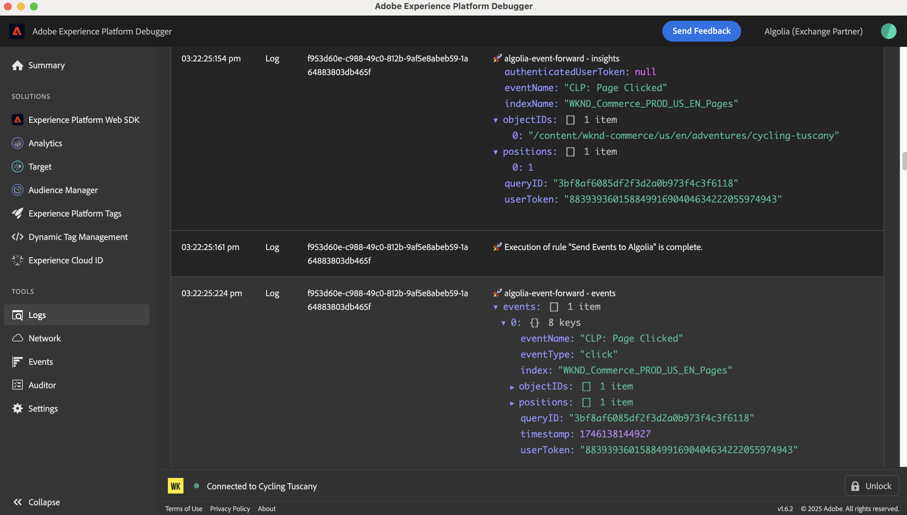

# Panoramica dell&#39;estensione per l&#39;inoltro degli eventi [!DNL Algolia] {#overview}

Utilizza [!DNL Algolia] per fornire esperienze di ricerca veloci, rilevanti e personalizzate. Con l’ottimizzazione basata sull’intelligenza artificiale, puoi migliorare i risultati della ricerca e i consigli per aiutare gli utenti a trovare rapidamente i prodotti, i contenuti o le informazioni di cui hanno bisogno.

Utilizzare l&#39;estensione di inoltro eventi [!DNL Algolia] per inviare eventi di comportamento utente a [!DNL Algolia] tramite [!DNL Insights API]. Questi dati comportamentali consentono consigli basati sull’intelligenza artificiale, esperienze personalizzate e funzionalità di ricerca intelligente.

## Prerequisiti {#prerequisites}

Prima di installare l&#39;estensione, verificare di disporre di un account [!DNL Algolia] con accesso a [!DNL Insights API]. Se non disponi di un account, [iscriviti](https://dashboard.algolia.com/users/sign_up) e abilita l&#39;accesso all&#39;API.

Assicurarsi inoltre di aver compreso come utilizzare [!DNL Algolia] [!DNL Insights API]. Per una panoramica su come inviare eventi, consulta [invio di eventi con API Insights](https://www.algolia.com/doc/guides/sending-events/getting-started/).

Raccogliere i valori seguenti dal dashboard dell&#39;account [!DNL Algolia]:
- **[!UICONTROL Application ID]**
- **[!UICONTROL Search API Key]**
- **[!UICONTROL Index Name]**

## Installare l’estensione {#install}

Per installare l&#39;estensione [!DNL Algolia], eseguire la procedura seguente:

Passare a **[!UICONTROL Data Collection]** in [!DNL Adobe Experience Platform]. Seleziona la scheda **[!UICONTROL Extensions]**.

Aprire **[!UICONTROL Catalog]** e individuare l&#39;estensione **[!UICONTROL Algolia Event Forwarding]**, quindi selezionare **[!UICONTROL Install]**.

### Configurare l&#39;estensione {#configure-extension}

Per configurare l&#39;estensione per l&#39;inoltro degli eventi [!DNL Algolia], passare alla scheda **[!UICONTROL Extensions]**, selezionare l&#39;estensione **[!UICONTROL Algolia]**, quindi selezionare **[!UICONTROL Configure]**.

| Proprietà | Descrizione |
|----------|-------------|
| **[!UICONTROL Application ID]** | Immetti [!UICONTROL Application ID] trovato nel dashboard Algolia nella sezione [Chiavi API](https://www.algolia.com/account/api-keys/all). |
| **[!UICONTROL Search API Key]** | Immetti [!UICONTROL Search API Key] trovato nel dashboard Algolia nella sezione [Chiavi API](https://www.algolia.com/account/api-keys/all). |
| **[!UICONTROL Index Name]** | Immettere [!UICONTROL Index Name] che contiene i prodotti o il contenuto. Questo indice viene utilizzato come valore predefinito. |

{style="table-layout:auto"}

## [!DNL Algolia] tipi di azioni dell&#39;estensione di inoltro eventi {#action-types}

L&#39;estensione di inoltro degli eventi [!DNL Algolia] offre un singolo tipo di azione che può essere utilizzato nella sezione **[!UICONTROL Then]** di una regola:

### Invia evento {#send-event}

Configurare l&#39;azione **[!UICONTROL Send event]** per inoltrare gli eventi a [!DNL Algolia]:

Selezionare **[!UICONTROL Rules]** > **[!UICONTROL Add Rule]** o selezionare una regola esistente. Nella sezione **[!UICONTROL Then]** della regola, aggiungere un&#39;azione e selezionare **[!UICONTROL Extension]**: [!DNL Algolia] Inoltro eventi > **[!UICONTROL Action Type]**: **[!UICONTROL Send Events]**.

## Implementa il gruppo di campi evento [!DNL Algolia] {#algolia-field-group}

Assicurarsi di aggiungere il gruppo di campi evento [!DNL Algolia] allo schema prima di utilizzare l&#39;estensione di inoltro eventi [!DNL Algolia]. È uno dei gruppi di campi standard forniti tramite Experience Platform.

### Aggiungi il gruppo di campi evento [!DNL Algolia] allo schema {#add-algolia-field-group}

Per aggiungere il gruppo di campi evento [!DNL Algolia]:

Passare a **[!UICONTROL Schemas]** e selezionare **[!UICONTROL Browse]**.

Aggiungi un nuovo schema o aggiorna uno schema esistente utilizzato per inviare eventi Web e passa il puntatore del mouse sull&#39;icona **[!UICONTROL Add]**. Immettere *[!DNL Algolia]* nella casella di ricerca per limitare i risultati.

Selezionare il gruppo di campi Dettagli evento **[!DNL Algolia]** > pulsante **[!UICONTROL Add field group]** > **[!UICONTROL Save]**.

### Mappare e inviare dati utilizzando il tag [!UICONTROL Data Collection]

L&#39;estensione di inoltro eventi [!DNL Algolia] può essere utilizzata con **[!DNL Adobe Experience Platform Web SDK]** per inviare dati dal sito Web a [!DNL Algolia]. A tale scopo, creare una proprietà tag, mappare i dati all&#39;oggetto [!DNL XDM] e configurare le regole per l&#39;invio di eventi.

#### Passaggio 1: creare una proprietà tag con il SDK web

1. Crea una proprietà tag.
2. Installa l&#39;estensione [!DNL Adobe Experience Platform Web SDK].
3. Utilizzare questa estensione per mappare i dati da HTML al gruppo di campi **[!DNL Algolia]Event**.

#### Passaggio 2: creare un elemento dati per la mappatura [!DNL XDM]

1. Crea un [!UICONTROL Data Element] utilizzando **[!DNL Adobe Experience Platform Web SDK]**.
2. Selezionare **[!UICONTROL XDM object]** come tipo di elemento dati.
3. Mappa i dati ai campi [!DNL XDM] appropriati, assicurandoti che i campi specifici di [!DNL Algolia] siano compilati.

#### Passaggio 3: creare una regola per inviare eventi

1. Crea una nuova regola nella proprietà tag.
2. Aggiungi i trigger di evento richiesti, ad esempio caricamento pagina, o eventi di clic.
3. Aggiungere un&#39;azione utilizzando **[!DNL Adobe Experience Platform Web SDK]**.
4. Selezionare **[!UICONTROL Send event]** come tipo di azione.
5. Configurare l&#39;azione per utilizzare l&#39;elemento dati [!DNL XDM].

#### Passaggio 4: pubblicare e testare

1. Pubblica le regole e le modifiche all’estensione nell’ambiente di destinazione.
2. Utilizzare [!DNL Adobe Experience Platform Debugger] per verificare che i dati vengano inviati a Adobe Experience Platform e inoltrati a [!DNL Algolia].

### Verifica eventi in [!DNL Algolia]

Dopo aver configurato l&#39;estensione di inoltro eventi [!DNL Algolia], è possibile verificare che gli eventi vengano inviati e ricevuti correttamente eseguendo la procedura seguente:

Passa alla dashboard di [!DNL Algolia] e passa a **[!UICONTROL Data Sources > Events > Debugger]**.

Selezionare l&#39;evento che corrisponde all&#39;evento inviato dall&#39;estensione di inoltro eventi di [!DNL Algolia] e verificare che i dati previsti siano presenti nell&#39;evento.

## Scenari di implementazione comuni

Utilizza l&#39;estensione di inoltro eventi [!DNL Algolia] per acquisire e inviare dati di interazione dell&#39;utente per vari casi d&#39;uso, migliorando la rilevanza della ricerca e la personalizzazione.

### Tracciare le visualizzazioni di prodotti o contenuti

Utilizza l&#39;estensione per tenere traccia di quando gli utenti visualizzano pagine di prodotti o contenuti, aiutando [!DNL Algolia] a comprendere gli interessi degli utenti.

### Tracciare gli eventi di conversione

Tieni traccia di eventi aggiuntivi al carrello, acquisti e altri eventi di conversione per ottimizzare i consigli basati sull&#39;intelligenza artificiale di [!DNL Algolia].

## Risoluzione dei problemi

In caso di problemi durante l&#39;implementazione dell&#39;estensione di inoltro degli eventi [!DNL Algolia], prendere in considerazione i seguenti passaggi per la risoluzione dei problemi:

### Gli eventi non vengono visualizzati in [!DNL Algolia]

Se gli eventi non vengono visualizzati in [!DNL Algolia], verificare quanto segue:

- **Verifica credenziali API**: verificare che **[!UICONTROL Application ID]** e **[!UICONTROL API Key]** corrispondano ai valori nel dashboard [!DNL Algolia].
- **Controlla Debugger eventi**: utilizza il debugger eventi [!DNL Algolia] per confermare se gli eventi vengono ricevuti. In caso contrario, verifica la configurazione della regola di inoltro degli eventi.
- **Verifica mapping XDM**: verificare che tutti i campi obbligatori nello schema [!DNL Algolia] siano mappati correttamente nell&#39;oggetto [!DNL XDM].

### Dati evento errati

- Verificare che l&#39;elemento dati dell&#39;oggetto [!DNL XDM] sia mappato con precisione allo schema [!DNL Algolia], con tutti i campi obbligatori.
- Verificare che i parametri dell&#39;evento corrispondano al formato e alla struttura previsti descritti nella documentazione API Insights di [!DNL Algolia].

## Passaggi successivi

Questa guida illustra come inviare dati a [!DNL Algolia] utilizzando [!DNL Algolia Event Forwarding Extension]. Per ulteriori informazioni sulle funzionalità di inoltro eventi in [!DNL Adobe Experience Platform], leggere la [panoramica sull&#39;inoltro eventi](../../../ui/event-forwarding/overview.md).

Per informazioni dettagliate su come eseguire il debug dell&#39;implementazione utilizzando lo strumento di monitoraggio di Experience Platform Debugger e inoltro eventi, leggere la [panoramica di Adobe Experience Platform Debugger](../../../../debugger/home.md) e le [attività di monitoraggio nell&#39;inoltro degli eventi](../../../ui/event-forwarding/monitoring.md).

## Risorse aggiuntive

- [[!DNL Algolia] Documentazione API approfondimenti](https://www.algolia.com/doc/rest-api/insights/)
- [[!DNL Algolia] Documentazione eventi](https://www.algolia.com/doc/guides/sending-events/getting-started/)
- [[!DNL Adobe Experience Platform] Documentazione sull&#39;inoltro degli eventi](https://experienceleague.adobe.com/docs/experience-platform/tags/event-forwarding/overview.html)
- [[!DNL Algolia] Panoramica delle funzionalità IA](https://www.algolia.com/products/ai-search/)
