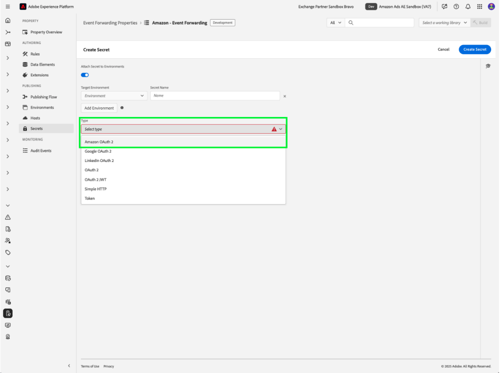

# Panoramica dell&#39;estensione API per [!DNL Amazon] eventi Web

L&#39;estensione API per le conversioni di [!DNL Amazon] crea una connessione diretta tra i dati di marketing dal server dell&#39;inserzionista e [!DNL Amazon]. Questo consente agli inserzionisti di valutare l’efficacia della campagna indipendentemente dalla posizione di conversione e di ottimizzare le campagne di conseguenza. L’estensione fornisce un’attribuzione più completa, una maggiore affidabilità dei dati e una distribuzione ottimizzata.

## [!DNL Amazon] prerequisiti {#prerequisites}

Prima di installare e configurare l&#39;estensione API per le conversioni di [!DNL Amazon], è necessario completare diversi passaggi preliminari per garantire l&#39;autenticazione e l&#39;accesso ai dati corretti.

### Creare un elemento segreto e dati {#secret}

L&#39;autenticazione con [!DNL Amazon] richiede un token protetto che deve essere archiviato correttamente e a cui si fa riferimento:

1. Crea un nuovo segreto di inoltro eventi [!DNL Amazon] con un nome univoco per l&#39;autenticazione.
2. Crea un elemento dati utilizzando l&#39;estensione **Core** con un tipo di elemento dati **Secret** per fare riferimento al segreto [!DNL Amazon].

Questo processo garantisce che le credenziali di autenticazione rimangano sicure pur essendo ancora accessibili all’estensione quando necessario.

## Installa e configura l&#39;estensione [!DNL Amazon]

L’installazione dell’estensione richiede l’accesso alla proprietà di inoltro degli eventi in Experience Platform:

- Crea o modifica una proprietà di inoltro degli eventi.
- Seleziona **Estensioni** nel menu di navigazione a sinistra, quindi seleziona l&#39;estensione [!DNL Amazon] nella scheda Catalogo.
- Selezionare **Installa**.

Estensione ![[!DNL Amazon] selezionata nel catalogo delle estensioni insieme al pulsante di installazione.](../../../images/extensions/server/amazon/amazon-extension.png)

- Configura con:

- **Token di accesso**: il segreto dell&#39;elemento dati contenente il token OAuth 2

- **ID entità**: l&#39;ID entità (trovato nell&#39;URL del portale di Campaign Manager con prefisso &quot;entity&quot;)

- Seleziona **Salva**.

Questi valori di configurazione stabiliscono la connessione tra Platform e l&#39;account [!DNL Amazon].

### [!DNL Amazon] OAuth 2 {#oauth}

Per creare un segreto OAuth 2 [!DNL Amazon]:

- Seleziona [!DNL Amazon] OAuth 2 dal menu a discesa **Tipo** e seleziona **Crea segreto**.

- Selezionare **Crea e autorizza segreto con Amazon** nel popover per autorizzare manualmente il segreto e continuare.

- Immetti le credenziali di [!DNL Amazon] nella finestra di dialogo visualizzata. Segui le istruzioni per concedere l’accesso ai tuoi dati con inoltro eventi.

Dopo il completamento, il segreto con il relativo stato e la data di scadenza verrà visualizzato nella scheda **Segreti**.

## Configurare una regola di inoltro degli eventi {#config-rule}

Una volta configurati tutti gli elementi dati, puoi creare regole di inoltro degli eventi che determinano quando e come gli eventi verranno inviati ad Amazon.

- Passa a **Regole** e crea una nuova regola di inoltro degli eventi.
- In **Azioni**, seleziona **Estensione API per conversioni Amazon**.
- Imposta **Tipo azione** su **Importa eventi di conversione**.

- Configura le proprietà dell’evento come descritto di seguito:

| Input | Descrizione |
| --- | --- |
| **Nome evento** | Nome dell’evento di conversione. |
| **Tipo evento** | Definisce il tipo di evento tracciato (ad esempio, acquisti, aggiunte al carrello). |
| **Timestamp** | Ora evento in formato ISO. |
| **ID deduplicazione client** | Un ID univoco per la deduplicazione. |
| **Corrispondenza chiavi** | Identificatori di utenti e dispositivi per l’attribuzione. |
| **Valore** | Valore monetario dell’evento. |
| **Codice valuta** | Valuta nel formato ISO-4217. |
| **Unità vendute** | Quantità di articoli acquistati. |
| **Codice paese** | Paese in cui si è verificato l’evento. |
| **Opzioni di elaborazione dati** | Flag per utilizzo limitato dei dati. |
| **Consenso** | Indica il consenso dell’utente per l’utilizzo dei dati pubblicitari. |

- Seleziona **Mantieni modifiche** per salvare la regola.

## Deduplicazione degli eventi {#deduplication}

Se utilizzi sia il tag Advertising (AAT) [!DNL Amazon] che l&#39;estensione API per le conversioni [!DNL Amazon] per gli stessi eventi, è necessaria la configurazione della deduplicazione. Includi `clientDedupeId` in ogni evento condiviso per garantire la deduplicazione corretta.
La deduplicazione non è necessaria se gli eventi client e server non si sovrappongono.

La deduplicazione corretta evita conteggi di conversione eccessivi e assicura la precisione dei dati di ottimizzazione.

Per ulteriori informazioni, consulta la [Guida alla deduplicazione degli eventi di Amazon](https://advertising.amazon.com/).

## Passaggi successivi

Questa guida illustra come configurare e inviare eventi di conversione a [!DNL Amazon] tramite l&#39;estensione API per le conversioni di [!DNL Amazon]. Per ulteriori informazioni sulle funzionalità di inoltro eventi in [!DNL Adobe Experience Platform], fare riferimento alla [panoramica sull&#39;inoltro eventi](../../../ui/event-forwarding/overview.md)

Per ulteriori dettagli su come eseguire il debug dell&#39;implementazione utilizzando lo strumento di monitoraggio di Experience Platform Debugger e inoltro eventi, leggere la [panoramica di Adobe Experience Platform Debugger](https://experienceleague.adobe.com/en/docs/experience-platform/debugger/home) e le [attività di monitoraggio](https://experienceleague.adobe.com/en/docs/experience-platform/tags/event-forwarding/monitoring) nell&#39;inoltro degli eventi.