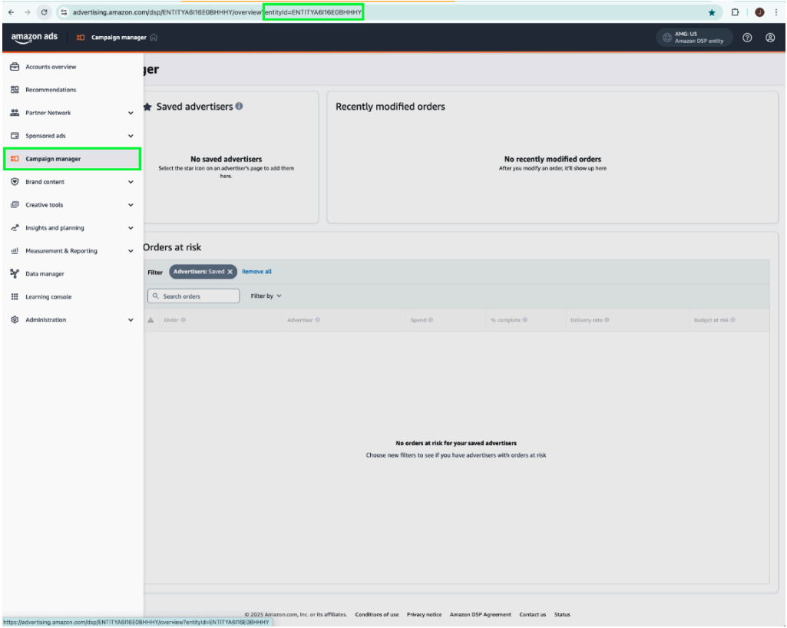

# Panoramica dell&#39;estensione API per [!DNL Amazon] eventi Web

L&#39;estensione API per le conversioni di [!DNL Amazon] crea una connessione diretta tra i dati di marketing dal server dell&#39;inserzionista e [!DNL Amazon]. Consente agli inserzionisti di valutare l’efficacia della campagna indipendentemente dalla posizione di conversione e di ottimizzare le campagne di conseguenza. Questa estensione fornisce attribuzione completa, affidabilità dei dati e consegna ottimizzata.

## [!DNL Amazon] prerequisiti {#prerequisites}

Prima di installare e configurare l&#39;estensione API per conversioni [!DNL Amazon], completare i seguenti passaggi preliminari per garantire l&#39;autenticazione e l&#39;accesso ai dati corretti:

### Creare un elemento segreto e dati {#secret}

Crea un nuovo [!DNL Amazon] [segreto di inoltro eventi](../../../ui/event-forwarding/secrets.md) e fornisci un nome univoco che indichi il membro che esegue l&#39;autenticazione. Verrà utilizzato per autenticare la connessione al tuo account mantenendo protetto il valore.

Quindi, [crea un elemento dati](../../../ui/managing-resources/data-elements.md#create-a-data-element) utilizzando l&#39;estensione [!UICONTROL Core] e un tipo di elemento dati [!UICONTROL Secret] per fare riferimento al segreto `Amazon` appena creato.

### Raccogliere i dettagli di configurazione richiesti {#configuration-details}

Per connettere Experience Platform a [!DNL Amazon], immettere i dettagli seguenti:

| Tipo di chiave | Descrizione |
| --- | --- |
| ID account | L&#39;identificatore univoco dell&#39;account [!DNL Amazon]. |
| ID entità | Identificatore di un profilo associato all&#39;account dell&#39;inserzionista. È disponibile nell’URL del portale di Campaign Manager, con prefisso `entity`. |
| Token di accesso | Token di accesso dell&#39;app senza scadenza, utilizzato per l&#39;autenticazione nell&#39;API [!DNL Amazon] tramite OAuth. Consulta la [documentazione API di Amazon sull&#39;autenticazione](https://developer.amazon.com/docs/app-porting/device-messaging-fit-obtain-api-key.html) per maggiori informazioni. |

## Installa e configura l&#39;estensione [!DNL Amazon] {#install-configure}

Per installare e configurare l&#39;estensione API per conversioni [!DNL Amazon], eseguire la procedura seguente:

1. Crea o modifica una proprietà di inoltro degli eventi.
2. Passa a **Estensioni** nel pannello di navigazione a sinistra, quindi seleziona l&#39;estensione [!DNL Amazon] nella scheda Catalogo.
3. Selezionare **Installa**.

   

4. Configura l&#39;estensione con i seguenti dettagli:
   - **Token di accesso**: il segreto dell&#39;elemento dati contenente il token OAuth 2.

     

   - **ID entità**: l&#39;ID entità (trovato nell&#39;URL del portale di Campaign Manager con il prefisso &quot;entity&quot;).

     

5. Seleziona **Salva** per completare la configurazione.

## Configurare una regola di inoltro degli eventi {#config-rule}

Una volta configurati tutti gli elementi dati, crea regole di inoltro degli eventi per determinare quando e come inviare gli eventi a [!DNL Amazon].

1. Passa a **Regole** e crea una nuova regola di inoltro degli eventi.
2. In **Azioni**, seleziona **Estensione API per conversioni Amazon**.
3. Imposta **Tipo azione** su **Importa eventi di conversione**.

   

### Configurare i dati dell’evento di conversione {#conversion-event-data}

I dati dell’evento di conversione sono fondamentali per monitorare le interazioni degli utenti e misurare l’efficacia delle campagne. Inoltrando questi dati a [!DNL Amazon], puoi ottenere informazioni sul comportamento degli utenti, ottimizzare le campagne e garantire un&#39;attribuzione accurata per le conversioni.

La tabella seguente illustra le proprietà chiave necessarie per configurare e inoltrare i dati dell’evento di conversione:

| Input | Descrizione | Obbligatorio | Esempio |
| --- | --- | --- | --- |
| `name` | Nome dell&#39;evento importato. | Sì | `My Event Name` |
| `eventType` | Il tipo di evento Amazon standard associato all’evento e utilizzato per il reporting. | Sì | `Add to Shopping Cart` |
| `eventActionSource` | La piattaforma da cui è stato originato l’evento. | Sì | `WEBSITE` |
| `clientDedupeId` | `id` specificato dall&#39;inserzionista per l&#39;evento di conversione. Per gli eventi con lo stesso `clientDedupeId`, viene mantenuto solo il primo evento e tutti gli eventi successivi vengono eliminati. | Facoltativo | `3234A398932` |
| `timestamp` | La marca temporale riportata di quando si è verificato l’evento. Il timestamp può essere fino a 7 giorni prima dell’invio di un evento. I dati più vecchi di 7 giorni non verranno elaborati. | Sì | `2023-05-08T14:04:28Z` |
| `matchKeys` | Array che rappresenta i tipi/valori di identificatori cliente e dispositivo da utilizzare per l’attribuzione a eventi traffico. | Sì | — |
| `matchKeys > type` | Tipo di identificatore utilizzato per l’attribuzione. | Sì | — |
| `matchKeys > value` | Il valore dell’identificatore utilizzato per l’attribuzione. | Sì | Elenco dei valori dell’identificatore con hash SHA-256 del cliente che ha eseguito l’evento. |
| `value` | Il valore dell’evento. | Facoltativo | `5` o `0.99` |
| `currencyCode` | Codice valuta associato a `value` dell&#39;evento in formato ISO-4217. Applicabile solo per il tipo di evento Acquisti Off Amazon. Se non viene fornito, verrà utilizzata l’impostazione del codice valuta nella definizione di conversione. | Facoltativo | `USD`, `EUR`, `GBP`, ecc. |
| `unitsSold` | Il numero di articoli acquistati. Applicabile solo per il tipo di evento Acquisti Off Amazon. Se non viene fornito nell&#39;evento di conversione, verrà applicato il valore predefinito `1`. | Facoltativo | — |
| `countryCode` | Questo valore si basa sulla norma ISO 3166-1 alpha-2, codici paese di due lettere definiti nella norma ISO 3166-1, parte della norma ISO 3166 pubblicata dall&#39;Organizzazione internazionale per la standardizzazione (ISO), per rappresentare paesi, territori dipendenti e aree speciali di interesse geografico. | Sì | — |
| `dataProcessingOptions` | Indica il consenso dell’utente per l’utilizzo dei dati pubblicitari. | Facoltativo | LIMITED_DATA_USE |

- Seleziona **[!UICONTROL Mantieni modifiche]** per salvare la regola.

## Deduplicazione degli eventi {#deduplication}

La deduplicazione è essenziale per garantire una reportistica accurata ed evitare conteggi di conversione gonfiati quando si utilizzano sia il tag Advertising (AAT) [!DNL Amazon] che l&#39;estensione API per le conversioni [!DNL Amazon] per tenere traccia degli stessi eventi.

### Quando è richiesta la deduplicazione?

- **Obbligatorio**: se lo stesso evento viene inviato sia dal client (AAT) che dal server (Conversions API).
- **Non obbligatorio**: se tipi di evento distinti vengono inviati dal client e dal server senza alcuna sovrapposizione.

### Come abilitare la deduplicazione

Per abilitare la deduplicazione, includere il campo `clientDedupeId` in ogni evento condiviso. Questo identificatore univoco consente a [!DNL Amazon] di distinguere tra eventi lato client e lato server ed evitare voci duplicate.

Configurando correttamente la deduplicazione, puoi garantire che i dati di ottimizzazione rimangano accurati e che i rapporti non subiscano impatti negativi.

Per ulteriori dettagli, consulta la [Guida alla deduplicazione degli eventi di Amazon](https://advertising.amazon.com/).

## Passaggi successivi {#next-steps}

Questa guida illustra come configurare e inviare eventi di conversione a [!DNL Amazon] tramite l&#39;estensione API per le conversioni di [!DNL Amazon]. Per ulteriori informazioni sulle funzionalità di inoltro eventi in [!DNL Adobe Experience Platform], fare riferimento alla [panoramica sull&#39;inoltro eventi](../../../ui/event-forwarding/overview.md).

Per ulteriori dettagli su come eseguire il debug dell&#39;implementazione utilizzando lo strumento di monitoraggio di Experience Platform Debugger e inoltro eventi, leggere la [panoramica di Adobe Experience Platform Debugger](/help/debugger/home.md) e le [attività di monitoraggio](../../../ui/event-forwarding/monitoring.md) nell&#39;inoltro degli eventi.
