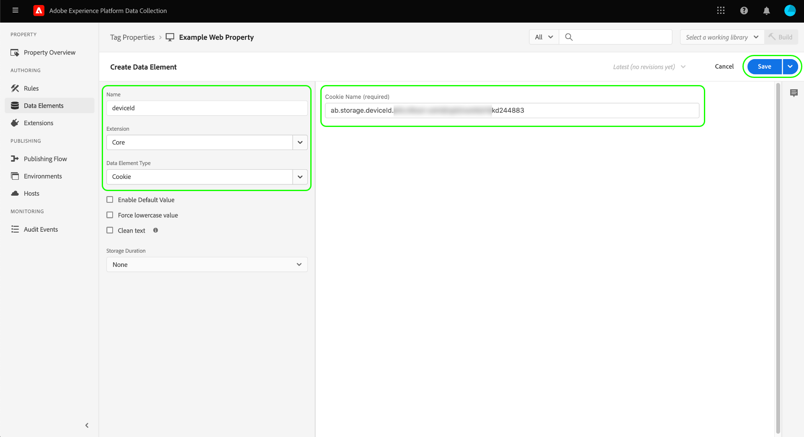

# [!DNL Braze Track Events API] estensione di inoltro eventi

[[!DNL Braze]](https://www.braze.com) è una piattaforma di coinvolgimento del cliente che potenzia in tempo reale le interazioni incentrate sul cliente tra consumatori e marchi. Utilizzo [!DNL Braze], puoi effettuare le seguenti operazioni:

* Fornisci dati (come messaggi di marketing) agli utenti target in base alle loro preferenze di lingua, posizione e altro, per aumentare i tassi di conversione e supportare obiettivi aziendali chiave.
* Invia messaggi personalizzati ai clienti su più canali, compresi e-mail, notifiche push e messaggi in-app, al momento giusto e nelle lingue preferite.
* Esegui il targeting di utenti specifici per campagne di marketing e promozionali per aumentare il numero di clienti ripetuti.
* Studia il comportamento e i pattern degli utenti per eseguire il targeting di tipi di pubblico specifici con messaggi personalizzati, che potrebbero contribuire ad aumentare i ricavi.

La [!DNL Braze Track Events API] [inoltro eventi](../../../ui/event-forwarding/overview.md) l’estensione ti consente di sfruttare i dati acquisiti in Adobe Experience Platform Edge Network e di inviarli a [!DNL Braze] sotto forma di eventi lato server che utilizzano [[!DNL Braze User Identify]](https://www.braze.com/docs/api/endpoints/user_data/post_user_identify) e [[!DNL Braze User Track]](https://www.braze.com/docs/api/endpoints/user_data/post_user_track) API.

Questo documento illustra i casi d&#39;uso dell&#39;estensione, come installarla nelle librerie di inoltro degli eventi e come utilizzarne le funzionalità in un inoltro degli eventi [regola](../../../ui/managing-resources/rules.md).

## Casi d’uso

Usa questa estensione se desideri utilizzare i dati di Edge Network in [!DNL Braze] per sfruttare le funzionalità di analisi e targeting dei clienti.

Ad esempio, considera un’organizzazione retail con una presenza multicanale (sito web e dispositivi mobili) e acquisisce input transazionali o conversazionali come dati evento dal sito web e dalle piattaforme mobili. Utilizzo di vari [tag](../../../home.md) , questi dati vengono inviati in tempo reale a Edge Network. Da qui, il [!DNL Braze] l&#39;estensione dell&#39;inoltro eventi invia automaticamente gli eventi rilevanti a [!DNL Braze] dal lato server.

Una volta inviati i dati, i team di analisi dell’organizzazione possono quindi sfruttare [!DNL Braze's] capacità di elaborare i set di dati e ricavare informazioni aziendali per generare grafici, dashboard o altre visualizzazioni al fine di informare le parti interessate del business. Fai riferimento a [[!DNL Braze] clienti](https://www.braze.com/customers) per ulteriori dettagli sui vari casi d’uso della piattaforma.

## [!DNL Braze] prerequisiti e protezioni {#prerequisites}

Devi avere un [!DNL Braze] per utilizzare le proprie tecnologie. Se non disponi di un account, passa alla [Pagina Introduzione](https://www.braze.com/get-started/) su [!DNL Braze] per connettersi a [!DNL Braze Sales] e avvia il processo di creazione dell&#39;account.

### Garanzie API

L&#39;estensione utilizza due di [!DNL Braze]Le API di e i relativi limiti sono descritti di seguito:

| API | Limiti di velocità |
| --- | --- |
| [!DNL User Track] | 50.000 richieste al minuto.  Fai riferimento a [[!DNL User Track] Documentazione API](https://www.braze.com/docs/api/endpoints/user_data/post_user_track#rate-limit) per i dettagli. |
| [!DNL User Identify] | 20.000 richieste al minuto.  Fai riferimento a [[!DNL User Identify] Documentazione API](https://www.braze.com/docs/api/endpoints/user_data/post_user_identify#rate-limit) per i dettagli. |

>[!NOTE]
>
>Consulta la guida su [[!DNL Braze] Limiti API](https://www.braze.com/docs/api/api_limits/) per ulteriori dettagli sui limiti da essi imposti.

### Informazioni sul ciclo di vita del profilo utente

[!DNL Braze] crea profili utente anonimi utilizzando l’identificatore univoco, `deviceId`, impostato da [!DNL Braze]. Una volta identificato un utente fornendo un ID utente, viene creato un profilo utente identificato.

Sulla prima istanza di assegnazione di un `external_id` a un profilo utente sconosciuto, tutti i dati del profilo utente esistenti ed eventuali eventi anonimi vengono migrati al nuovo profilo utente. I profili utente anonimi che condividono gli stessi `deviceId` sono anche in base al profilo utente identificato.

[!DNL Braze] unisce e conserva tutti i dati associati al profilo di solo alias. Tuttavia, tutti i dati utente anonimi successivi saranno orfani. Fai riferimento a [!DNL Braze] pagine della documentazione su [profili utente identificati](https://www.braze.com/docs/user_guide/data_and_analytics/user_data_collection/user_profile_lifecycle/#identified-user-profiles) e [best practice per la raccolta dati](https://www.braze.com/docs/user_guide/data_and_analytics/user_data_collection/best_practices/#overview) per ulteriori informazioni.

### Punti dati fatturabili

Invio di attributi personalizzati aggiuntivi a [!DNL Braze] può aumentare il [!DNL Braze] consumo dei punti dati. Consulta il tuo [!DNL Braze] account manager prima di inviare attributi personalizzati aggiuntivi. Fai riferimento a [!DNL Braze] documentazione [punti dati fatturabili](https://www.braze.com/docs/user_guide/onboarding_with_braze/data_points/#billable-data-points) per ulteriori informazioni.

### Raccogli i dettagli di configurazione richiesti {#configuration-details}

Per collegare la rete Edge a [!DNL Braze], sono necessari i seguenti ingressi:

| Tipo di chiave | Descrizione | Esempio |
| --- | --- | --- |
| [!DNL Braze] Istanza | L’endpoint REST associato al [!DNL Braze] conto. Fai riferimento a [!DNL Braze] documentazione [istanze](https://www.braze.com/docs/user_guide/administrative/access_braze/braze_instances) a titolo indicativo. | `rest.iad-03.braze.com` |
| Chiave API | La [!DNL Braze] Chiave API associata alla [!DNL Braze] conto.  Fai riferimento a [!DNL Braze] la documentazione [Chiave API REST](https://www.braze.com/docs/api/basics/#rest-api-key) a titolo indicativo. | `YOUR-BRAZE-REST-API-KEY` |

## Prerequisiti per l’Experience Cloud

Questa sezione descrive i passaggi prerequisiti in Experience Cloud per tutte le implementazioni. A seconda delle esigenze di implementazione individuali, può essere utile impostare i seguenti costrutti prima di configurare l&#39;estensione:

1. A [schema](../../../../xdm/schema/composition.md) descrivere la struttura dei dati che si stanno acquisendo in Experience Cloud
1. A [datastream](https://experienceleague.adobe.com/docs/platform-learn/data-collection/event-forwarding/set-up-a-datastream.html) per indirizzare i dati in arrivo alle applicazioni Adobe Experience Cloud appropriate
1. A [set di dati](https://experienceleague.adobe.com/docs/platform-learn/tutorials/data-ingestion/create-datasets-and-ingest-data.html?lang=it) per memorizzare i dati raccolti

Per tutte le implementazioni, è necessario quanto segue sul lato Experience Cloud:

1. [Creare un segreto](#create-a-secret)
1. [Impostare le proprietà dei tag](#set-up-tag-properties)
1. [Aggiungere elementi dati nelle proprietà tag](#add-data-elements-within-tag-properties)
1. [Aggiungi regole nelle proprietà dei tag](#add-rules-within-tag-properties)

### Creare un segreto

Crea un nuovo [segreto di inoltro eventi](../../../ui/event-forwarding/secrets.md) e imposta il valore su [[!DNL Braze] Chiave API](#configuration-details). Verrà utilizzato per autenticare la connessione al tuo account mantenendo al tempo stesso il valore protetto.

### Impostare le proprietà dei tag

[Creare una proprietà tag](https://experienceleague.adobe.com/docs/platform-learn/implement-in-websites/configure-tags/create-a-property.html?lang=en) oppure scegli una proprietà esistente da modificare. Questa proprietà verrà configurata per raccogliere le strutture di dati necessarie per [!DNL Braze] vengono portati in Edge Network prima di essere inviati tramite l’inoltro eventi.

### Aggiungere elementi dati nelle proprietà tag

Se il tuo sito web utilizza [!DNL Braze] SDK, devi [creare un elemento dati](../../../ui/managing-resources/data-elements.md) che utilizza **[!UICONTROL Cookie]** tipo (fornito dalla [[!UICONTROL Core] estensione tag](../../client/core/overview.md)) quindi [!DNL Braze] `deviceId` può essere letto dal cookie .

La **[!UICONTROL Nome cookie]** il valore deve corrispondere a [!DNL Braze] nome cookie del sito web. Il nome deve avere un formato simile a `ab.storage.deviceId.{BRAZE_PROJECT_TOKEN_FOR_WEBSITE}`. Al termine, seleziona **[!UICONTROL Salva]**.

Per il secondo elemento dati, imposta il tipo su **[!UICONTROL Oggetto XDM]** (dal [Estensione Adobe Experience Platform Web SDK](../../client/sdk/overview.md)) e mapparla allo schema creato in precedenza. Quando mappi i dati, assicurati che il valore `deviceId` elemento dati (che contiene [!DNL Braze] `deviceId` viene fatto riferimento come valore all&#39;interno di uno dei campi dello schema.

>[!NOTE]
>
>Se il tuo sito web non esegue il [!DNL Braze] SDK, un Adobe Experience Cloud ID (ECID) verrà utilizzato come fallback `deviceId` da trasmettere con l’evento inviato a [!DNL Braze].

A seconda dello scenario, potrebbe essere necessario creare un altro elemento dati che può essere utilizzato per eseguire il mapping al nome dell&#39;evento nello schema. Questa operazione può essere eseguita utilizzando **[!UICONTROL Costante]** tipo fornito dal [!UICONTROL Core] estensione.

### Aggiungi regole nelle proprietà dei tag

Il passaggio finale prima dell&#39;installazione del [!DNL Braze] estensione per creare un tag [regola](../../../ui/managing-resources/rules.md) (o più regole di tag) che vengono attivate per gli eventi di identificazione utente che vengono tracciati, come accessi, iscrizioni, registrazioni e così via.

Durante la configurazione della **[!UICONTROL Eventi]** per la regola, seleziona i tipi di evento appropriati che attiveranno la regola. Di seguito è riportato un esempio di un evento che attiva la regola di accesso su un clic utente:

Infine, quando selezioni la **[!UICONTROL Azioni]** per la regola, seleziona la **[!UICONTROL Invia evento]** tipo di azione fornito dall&#39;estensione SDK per web. Sotto **[!UICONTROL Dati XDM]**, seleziona [!UICONTROL Oggetto XDM] tipo di dati creato [precedente](#add-data-elements-within-tag-properties).

## Installa e configura il [!DNL Braze] estensione {#install}

Per installare l&#39;estensione, [creare una proprietà di inoltro eventi](../../../ui/event-forwarding/overview.md#properties) oppure scegli una proprietà esistente da modificare.

Seleziona **[!UICONTROL Estensioni]** nella navigazione a sinistra. In **[!UICONTROL Catalogo]** scheda , seleziona **[!UICONTROL Installa]** sulla scheda per [!DNL Braze] estensione.

![Installa il [!DNL Braze] estensione.](../../../images/extensions/server/braze/install-extension.png)

Nella schermata successiva, immetti quanto segue [valori di configurazione](#configuration-details) da cui è stato precedentemente raccolto [!DNL Braze]:

* **[!UICONTROL URL endpoint per il controllo dei freni]**: Puoi immettere il valore della [!DNL Braze] URL endpoint rest come testo normale nell&#39;input fornito.
* **[!UICONTROL Chiave API]**: Seleziona la [elemento dati segreto](#create-a-secret) creato in precedenza, che contiene [!DNL Braze] Chiave API.

Al termine, seleziona **[!UICONTROL Salva]**.

![La [!DNL Braze] pagina di configurazione dell&#39;estensione.](../../../images/extensions/server/braze/configure-extension.png)

## Configurare gli elementi dati di inoltro eventi

Dopo aver installato e configurato l’estensione, il passaggio successivo consiste nel creare elementi di dati di inoltro eventi che acquisiranno i costrutti di dati necessari che verranno inviati a [!DNL Braze].

### Crea un `deviceId` elemento dati

Se il sito è configurato con la [!DNL Braze] SDK, hai già definito un [elemento dati segreto](#add-data-elements-within-tag-properties) che contiene [!DNL Braze] `deviceId` nella proprietà tag. Ora è necessario impostare un elemento dati separato in inoltro eventi che indicherà questo valore quando viene inviato in formato XDM.

Quando crei l’elemento dati, seleziona **[!UICONTROL Core]** per l&#39;estensione , quindi seleziona **[!UICONTROL Percorso]** per il tipo di elemento dati. Per il valore , inserisci il percorso di notazione del punto nel `deviceId` campo esistente nello schema. Al termine, seleziona **[!UICONTROL Salva]**.

### Crea un `EventName` elemento dati

Nella proprietà di inoltro eventi, crea un elemento dati che utilizzi il **[!UICONTROL Percorso]** dal **[!UICONTROL Core]** estensione. Per il valore , immetti il percorso di notazione del punto al nome dell’evento così come esiste nello schema.

### Creare elementi dati per eventi e acquisti

La [[!DNL Braze User Track] API](https://www.braze.com/docs/api/endpoints/user_data/post_user_track) supporta due azioni distinte: personalizzato [events](https://www.braze.com/docs/api/objects_filters/event_object/#what-is-the-event-object) e [acquisti](https://www.braze.com/docs/api/objects_filters/purchase_object/#what-is-a-purchase-object). L’API supporta anche [attributes](https://www.braze.com/docs/api/objects_filters/user_attributes_object/) che corrispondono a [!DNL Braze] punti dati.

Gli elementi dati per `deviceId` e `EventName` sono necessari sia per gli eventi personalizzati che per gli acquisti, ma esistono elementi di dati aggiuntivi che possono essere inclusi per entrambi i tipi di evento. Questi sono elencati di seguito.

>[!NOTE]
>
>Tutti gli elementi di dati elencati di seguito devono utilizzare il **[!UICONTROL Percorso]** digita in modo che possano mappare campi specifici nello schema come descritto in **Percorso schema** colonna.

#### Eventi personalizzati

| [!DNL Braze] key | Percorso schema | Descrizione | Obbligatorio |
| --- | --- | --- | --- |
| [!DNL Braze] ID dispositivo | `arc.event.xdm._extconndev.brazeDeviceId` | `deviceId` identifica l&#39;utente che ha eseguito l&#39;evento. `deviceId` deve essere specificato su ogni evento, in quanto è fondamentale per [!DNL Braze] per eseguire analisi. | Sì |
| Tipo evento | `arc.event.xdm._extconndev.event_Type` | Nome dell&#39;evento. | Sì |
| Identificatore utente | `arc.event.xdm._extconndev.userId` | L’e-mail o l’ID di accesso dell’utente, se disponibile. |  |
| ID app | `arc.event.xdm._extconndev.appId` | Una stringa che indica dove è stato attivato l&#39;evento. |  |
| Campi evento | `arc.event.xdm._extconndev.event_Properties` | Un oggetto JSON che rappresenta tutti gli attributi relativi all’evento. |  |

{style="table-layout:auto"}

#### Acquisti

| [!DNL Braze] key | Percorso schema | Descrizione | Obbligatorio |
| --- | --- | --- | --- |
| [!DNL Braze] ID dispositivo | `arc.event.xdm._extconndev.brazeDeviceId` | `deviceId` identifica l&#39;utente che ha eseguito l&#39;evento. `deviceId` deve essere specificato su ogni evento, in quanto è fondamentale per [!DNL Braze] per eseguire analisi. | Sì |
| Tipo evento | `arc.event.xdm._extconndev.event_Type` | Nome dell&#39;evento. | Sì |
| Identificatore utente | `arc.event.xdm._extconndev.userId` | L’e-mail o l’ID di accesso dell’utente, se disponibile. |  |
| ID app | `arc.event.xdm._extconndev.appId` | Una stringa che indica dove è stato attivato l&#39;evento. |  |
| ID prodotto | `arc.event.xdm._extconndev.product_Id` | Identificatore per l&#39;acquisto, ad esempio UPC, ISBN, categoria di prodotto o nome del prodotto. | Sì |
| Valuta | `arc.event.xdm._extconndev.currency` | La valuta utilizzata per l&#39;acquisto, in [Formato del codice ISO 4217](https://www.iso.org/iso-4217-currency-codes.html). | Sì |
| Prezzo | `arc.event.xdm._extconndev.price` | Valore dell&#39;acquisto in cifre. | Sì |
| Quantità | `arc.event.xdm._extconndev.quantity` | Quantità del prodotto acquistato. | Sì |
| Campi aggiuntivi | `arc.event.xdm._extconndev.event_Properties` | Un oggetto JSON che rappresenta attributi aggiuntivi sull&#39;evento. Fai riferimento a [[!DNL Braze] documentazione](https://www.braze.com/docs/user_guide/onboarding_with_braze/data_points/#billable-data-points) per informazioni dettagliate sui punti dati fatturati. |  |

{style="table-layout:auto"}

## Configurare le regole di inoltro eventi

Una volta configurati tutti gli elementi dati, puoi iniziare a creare regole di inoltro eventi che determinano a quando e come verranno inviati gli eventi e gli acquisti personalizzati a [!DNL Braze].

Dal momento che [!DNL Braze User Track] L’API supporta gli eventi personalizzati e gli acquisti come due azioni separate. È necessario creare almeno due regole in modo che [!DNL Braze's] è possibile sfruttare in modo appropriato le analisi per ciascuno di essi.

Di conseguenza, il [!DNL Braze] l&#39;estensione consente di aggiungere alle regole i seguenti tipi di azione:

* **[!UICONTROL Evento Braze]**
* **[!UICONTROL Evento di acquisto del freno]**

>[!IMPORTANT]
>
>È necessario disporre di almeno una regola con un tipo di azione **[!UICONTROL Evento Braze]**. Senza questa regola, la rete Edge non invierà eventi a [!DNL Braze].

### Crea un [!DNL Track Event] regola {#tracking-rule}

Inizia a creare una nuova regola nella proprietà di inoltro eventi. Sotto **[!UICONTROL Condizioni]**, aggiungi un **[!UICONTROL Value Comparison]** tipo di condizione (fornito dal [!UICONTROL Core] per verificare che `EventName` non `Purchase`. In questo modo gli eventi vengono inviati con il payload di oggetto corretto al [!DNL Braze] API.

Sotto **[!UICONTROL Azioni]**, aggiungi una nuova azione e imposta l&#39;estensione su **[!UICONTROL Braccio]**. Quindi, imposta il tipo di azione su **[!UICONTROL Evento Braze]** per inviare eventi di Adobe Experience Edge Network a [!DNL Braze].

Da qui devi mappare il **[!UICONTROL Nome evento]** alla proprietà del nome dell&#39;evento in arrivo, nonché alla proprietà **[!UICONTROL Ora evento]**. Altri campi facoltativi includono [!UICONTROL ID utente esterno], [!UICONTROL ID utente di Braze], [!UICONTROL Etichetta alias], [!UICONTROL Nome alias]e [!UICONTROL Identificatore app].

>[!NOTE]
>
>La **[!UICONTROL Evento Braze]** l&#39;azione richiede solo **[!UICONTROL Nome evento]** e **[!UICONTROL Ora evento]** da specificare, ma devi includere il maggior numero possibile di informazioni nei campi rimanenti. Per maggiori dettagli sulla [!DNL Braze] oggetto evento, fare riferimento al [documentazione ufficiale](https://www.braze.com/docs/api/objects_filters/event_object/).

Una volta che [!UICONTROL Evento Braze] viene aggiunta alla regola, puoi anche includere un **[!UICONTROL Acquisto di freni]** se l’evento di cui stai tenendo traccia si verifica come evento di acquisto. Di seguito è riportato un esempio di configurazione per l’azione di acquisto:

>[!NOTE]
>
>Per maggiori dettagli sulla [!DNL Braze] oggetto di acquisto, fare riferimento al [documentazione ufficiale](https://www.braze.com/docs/api/objects_filters/purchase_object/).

La [!DNL Track Event] La regola è completa e dovrebbe avere un aspetto simile all&#39;immagine seguente. Seleziona **[!UICONTROL Salva]** per aggiungere la regola alla libreria.

>[!IMPORTANT]
>
>Se il sito web utilizza la [!DNL Braze] SDK, puoi continuare al passaggio successivo di [convalida dei dati in [!DNL Braze]](#validate). Se non utilizzi il [!DNL Braze] SDK, devi [creare una regola di tracciamento identità separata](#create-an-identity-tracking-rule) garantire che gli eventi appropriati e `deviceId` vengono inviati a [!DNL Braze] quando si verifica un evento di identificazione utente.

### Creare una regola di tracciamento delle identità

Se non utilizzi il [!DNL Braze SDK], il passaggio successivo consiste nel creare un&#39;altra regola che utilizza sia il **[!UICONTROL Evento Braze]** e **[!UICONTROL Alias del freno]** tipi di azioni. Questa regola assicura che ogni volta che si verifica un evento di identificazione dell’utente sul sito web (ad esempio un login, un abbonamento, una registrazione e così via), gli eventi appropriati e `deviceId` vengono inviati a [!DNL Braze].

Inizia a definire una nuova regola per tenere traccia degli eventi di identità. In questo esempio viene definita una regola specifica per un evento di registrazione.

Simile al [!DNL Track Event] regola, sotto **[!UICONTROL Condizioni]**, include **[!UICONTROL Value Comparison]** tipo di condizione che controlla che `EventName` è `Registration`. Questo assicura che questo evento venga attivato solo per gli eventi di registrazione.

![Configurazione azione per [!DNL Braze] Tipi di azioni Alias e Identifica.](../../../images/extensions/server/braze/ef-registration-condition.png)

Per garantire che [!DNL Braze] può unire automaticamente le identità utente, è necessario aggiungere alla regola i seguenti tipi di azione, entrambi forniti dalla [!DNL Braze] estensione:

* **[!UICONTROL Evento Braze]**
* **[!UICONTROL Evento alias di Braze]**

Configura le **[!UICONTROL Evento Braze]** allo stesso modo della [regola di tracciamento degli eventi](#tracking-rule), incluse tutte le informazioni disponibili nei campi forniti.

![Configurazione della [!DNL Braze] Azione evento](../../../images/extensions/server/braze/registration-braze-event.png)

La  **[!UICONTROL Evento alias di Braze]** un&#39;azione richiede [identificatore utente](https://www.braze.com/docs/api/objects_filters/aliases_to_identify)e puoi facoltativamente fornire un [identificatore dell&#39;applicazione](https://www.braze.com/docs/api/identifier_types/) se del caso.

![Configurazione della [!DNL Braze] Azione alias](../../../images/extensions/server/braze/registration-braze-alias.png)

Una volta aggiunte entrambe le azioni alla regola, seleziona **[!UICONTROL Salva]** per aggiungere la regola alla libreria di lavoro. Da qui, puoi creare la libreria in uno dei tuoi ambienti per verificare se funziona come previsto.

![Entrambi [!DNL Braze] vengono aggiunte azioni alla regola](../../../images/extensions/server/braze/registration-rule-complete.png)

## Convalida dei dati all’interno di [!DNL Braze] {#validate}

Se la raccolta eventi e [!DNL Adobe Experience Platform] Se l’integrazione è riuscita, vengono visualizzati gli eventi all’interno del [!DNL Braze] console quando [visualizzazione dei profili utente](https://www.braze.com/docs/user_guide/engagement_tools/segments/user_profiles/). In particolare, i nuovi dati dell’evento inviati a [!DNL Braze] è riflesso nel [!DNL Purchases] sezione di un utente specifico [scheda panoramica](https://www.braze.com/docs/user_guide/engagement_tools/segments/user_profiles/#overview-tab).

## Passaggi successivi

Questa guida spiega come inviare eventi di conversione a [!DNL Braze] utilizzo dell&#39;inoltro eventi. Per maggiori dettagli sulle applicazioni a valle per i dati degli eventi inviati a [!DNL Braze], fare riferimento alla [documentazione ufficiale](https://www.braze.com/docs).

Per ulteriori informazioni sulle funzionalità di inoltro eventi in Experience Platform, consulta la [panoramica sull&#39;inoltro eventi](../../../ui/event-forwarding/overview.md).