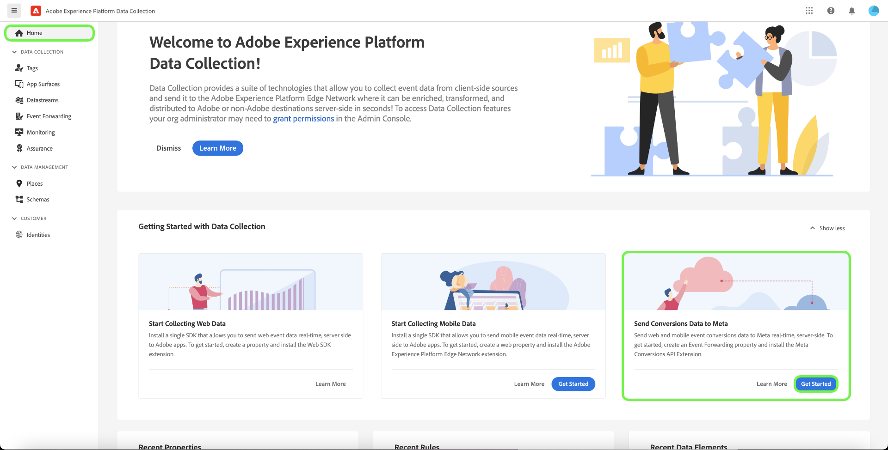

# [!DNL Meta Conversions API] panoramica dell&#39;estensione

La [[!DNL Meta Conversions API]](https://developers.facebook.com/docs/marketing-api/conversions-api/) consente di collegare i dati di marketing lato server a [!DNL Meta] tecnologie per ottimizzare il targeting degli annunci, ridurre il costo per azione e misurare i risultati. Gli eventi sono collegati a un [[!DNL Meta Pixel]](https://developers.facebook.com/docs/meta-pixel/) ID e vengono elaborati in modo simile agli eventi lato client.

Utilizzo della [!DNL Meta Conversions API] puoi sfruttare le funzionalità dell&#39;API nel [inoltro eventi](../../../ui/event-forwarding/overview.md) regole a cui inviare i dati [!DNL Meta] da Adobe Experience Platform Edge Network. Questo documento illustra come installare l&#39;estensione e utilizzarne le funzionalità in un inoltro eventi [regola](../../../ui/managing-resources/rules.md).

## Prerequisiti

Si consiglia vivamente di utilizzare [!DNL Meta Pixel] e [!DNL Conversions API] per condividere e inviare gli stessi eventi dal lato client e dal lato server, rispettivamente, in quanto ciò potrebbe aiutare a recuperare gli eventi che non sono stati rilevati da [!DNL Meta Pixel]. Prima di installare [!DNL Conversions API] estensione, consulta la guida [[!DNL Meta Pixel] estensione](../../client/meta/overview.md) per i passaggi su come integrarlo nelle implementazioni di tag lato client.

>[!NOTE]
>
>La sezione [deduplicazione degli eventi](#deduplication) più avanti in questo documento descrive i passaggi per garantire che lo stesso evento non venga utilizzato due volte, in quanto può essere ricevuto sia dal browser che dal server.

Per utilizzare il [!DNL Conversions API] estensione, devi disporre dell&#39;accesso all&#39;inoltro eventi e avere una valida [!DNL Meta] account con accesso a [!DNL Ad Manager] e [!DNL Event Manager]. In particolare, devi copiare l’ID di un [[!DNL Meta Pixel]](https://www.facebook.com/business/help/952192354843755?id=1205376682832142) o [creare una nuova [!DNL Pixel]](https://www.facebook.com/business/help/952192354843755) in questo modo l&#39;estensione può essere configurata sul tuo account.

## Installare l’estensione

Per installare [!DNL Meta Conversions API] , passa all’interfaccia utente di raccolta dati o di Experience Platform e seleziona **[!UICONTROL Inoltro eventi]** dalla navigazione a sinistra. Da qui, seleziona una proprietà a cui aggiungere l’estensione oppure crea una nuova proprietà.

Dopo aver selezionato o creato la proprietà desiderata, seleziona **[!UICONTROL Estensioni]** nel menu di navigazione a sinistra, seleziona il **[!UICONTROL Catalogo]** scheda . Cerca il [!UICONTROL API per le metaconversioni] scheda , quindi seleziona **[!UICONTROL Installa]**.

![La [!UICONTROL Installa] pulsante selezionato per [!UICONTROL API per le metaconversioni] estensione nell’interfaccia utente di raccolta dati.](../../../images/extensions/server/meta/install.png)

Nella visualizzazione di configurazione visualizzata, devi fornire [!DNL Pixel] ID copiato in precedenza per collegare l&#39;estensione al tuo account . Puoi incollare l’ID direttamente nell’input, oppure puoi utilizzare un elemento dati.

È inoltre necessario fornire un token di accesso per utilizzare il [!DNL Conversions API] specificamente. Fai riferimento a [!DNL Conversions API] documentazione [generazione di un token di accesso](https://developers.facebook.com/docs/marketing-api/conversions-api/get-started#access-token) per i passaggi su come ottenere questo valore.

Al termine, seleziona **[!UICONTROL Salva]**

![La [!DNL Pixel] ID fornito come elemento dati nella visualizzazione di configurazione dell&#39;estensione.](../../../images/extensions/server/meta/configure.png)

L&#39;estensione è installata e ora puoi utilizzarne le funzionalità nelle regole di inoltro degli eventi.

## Configurare una regola di inoltro eventi {#rule}

Questa sezione descrive come utilizzare il [!DNL Conversions API] estensione in una regola di inoltro eventi generica. In pratica, devi configurare diverse regole per inviare tutte le regole accettate [eventi standard](https://developers.facebook.com/docs/meta-pixel/reference) tramite [!DNL Meta Pixel] e [!DNL Conversions API].

>[!NOTE]
>
>Eventi [inviato in tempo reale](https://www.facebook.com/business/help/379226453470947?id=818859032317965) o il più vicino possibile in tempo reale per una migliore ottimizzazione delle campagne pubblicitarie.

Inizia a creare una nuova regola di inoltro eventi e configurane le condizioni come desiderato. Quando selezioni le azioni per la regola, seleziona **[!UICONTROL Estensione API Meta Conversioni]** per l&#39;estensione , quindi seleziona **[!UICONTROL Evento API di invio delle conversioni]** per il tipo di azione.

![La [!UICONTROL Invia visualizzazione pagina] tipo di azione selezionato per una regola nell&#39;interfaccia utente Raccolta dati.](../../../images/extensions/server/meta/select-action.png)

Vengono visualizzati i controlli che consentono di configurare i dati dell’evento a cui verranno inviati [!DNL Meta] tramite [!DNL Conversions API]. Queste opzioni possono essere immesse direttamente negli input forniti oppure è possibile selezionare elementi dati esistenti per rappresentare i valori. Le opzioni di configurazione sono suddivise in quattro sezioni principali come descritto di seguito.

| Sezione Configurazione | Descrizione |
| --- | --- |
| [!UICONTROL Parametri evento server] | Informazioni generali sull’evento, inclusa l’ora in cui si è verificato e l’azione sorgente che l’ha attivato. Fai riferimento a [!DNL Meta] documentazione per gli sviluppatori per ulteriori informazioni [parametri evento standard](https://developers.facebook.com/docs/marketing-api/conversions-api/parameters/server-event) accettati dalla [!DNL Conversions API].  Se utilizzi entrambi [!DNL Meta Pixel] e [!DNL Conversions API] per inviare eventi, assicurati di includere sia un **[!UICONTROL Nome evento]** (`event_name`) e **[!UICONTROL ID evento]** (`event_id`) per ogni evento, in quanto questi valori vengono utilizzati per [deduplicazione degli eventi](#deduplication).  Hai anche la possibilità di **[!UICONTROL Abilita uso limitato dei dati]** per rispettare le rinunce dei clienti. Consulta la sezione [!DNL Conversions API] documentazione [opzioni di elaborazione dati](https://developers.facebook.com/docs/marketing-apis/data-processing-options/) per informazioni dettagliate su questa funzione. |
| [!UICONTROL Parametri di informazioni cliente] | Dati di identità utente utilizzati per attribuire l&#39;evento a un cliente. Per poter essere inviati all’API, è necessario eseguire un hash per alcuni di questi valori.  Per garantire una buona connessione API comune e un’elevata qualità di corrispondenza degli eventi (EMQ), si consiglia di inviare tutti [parametri accettati per le informazioni sui clienti](https://developers.facebook.com/docs/marketing-api/conversions-api/parameters/customer-information-parameters) insieme agli eventi server. Questi parametri devono essere [priorità in base alla loro importanza e impatto su EMQ](https://www.facebook.com/business/help/765081237991954?id=818859032317965). |
| [!UICONTROL Dati personalizzati] | Dati aggiuntivi da utilizzare per l’ottimizzazione della distribuzione degli annunci, forniti sotto forma di un oggetto JSON. Fai riferimento a [[!DNL Conversions API] documentazione](https://developers.facebook.com/docs/marketing-api/conversions-api/parameters/custom-data) per ulteriori informazioni sulle proprietà accettate per questo oggetto.  Se invii un evento di acquisto, devi utilizzare questa sezione per fornire gli attributi richiesti `currency` e `value`. |
| [!UICONTROL Evento di prova] | Questa opzione viene utilizzata per verificare se la configurazione causa la ricezione di eventi server da parte di [!DNL Meta] come previsto. Per utilizzare questa funzione, seleziona la **[!UICONTROL Invia come evento di prova]** , quindi fornisci un codice evento di prova desiderato nell’input seguente. Una volta distribuita la regola di inoltro eventi, se hai configurato correttamente l&#39;estensione e l&#39;azione dovresti vedere le attività che compaiono all&#39;interno della **[!DNL Test Events]** visualizza in [!DNL Meta Events Manager]. |

{style="table-layout:auto"}

Al termine, seleziona **[!UICONTROL Mantieni modifiche]** per aggiungere l&#39;azione alla configurazione della regola.

![[!UICONTROL Mantieni modifiche] selezionato per la configurazione dell&#39;azione.](../../../images/extensions/server/meta/keep-changes.png)

Quando la regola è soddisfatta, seleziona **[!UICONTROL Salva nella libreria]**. Infine, pubblica un nuovo inoltro evento [build](../../../ui/publishing/builds.md) per abilitare le modifiche apportate alla libreria.

## Deduplicazione di eventi {#deduplication}

Come indicato nella [sezione prerequisiti](#prerequisites), si consiglia di utilizzare sia la [!DNL Meta Pixel] l&#39;estensione del tag e [!DNL Conversions API] estensione dell&#39;inoltro eventi per inviare gli stessi eventi dal client e dal server in una configurazione ridondante. Questo può aiutare a recuperare gli eventi che non sono stati rilevati da un&#39;estensione o dall&#39;altra.

Se invii tipi di evento diversi dal client e dal server senza sovrapposizione tra i due, la deduplicazione non è necessaria. Tuttavia, se un singolo evento è condiviso da entrambi [!DNL Meta Pixel] e [!DNL Conversions API], devi assicurarti che questi eventi ridondanti siano deduplicati in modo che la generazione di rapporti non subisca effetti negativi.

Quando invii eventi condivisi, assicurati di includere un ID evento e un nome con ogni evento inviato dal client e dal server. Quando vengono ricevuti più eventi con lo stesso ID e lo stesso nome, [!DNL Meta] utilizza automaticamente diverse strategie per deduplicarle e conservare i dati più rilevanti. Consulta la sezione [!DNL Meta] documentazione [deduplicazione per [!DNL Meta Pixel] e [!DNL Conversions API] events](https://www.facebook.com/business/help/823677331451951?id=1205376682832142) per informazioni dettagliate su questo processo.

## Flusso di lavoro di avvio rapido: Estensione API per le Meta Conversioni (Beta) {#quick-start}

>[!IMPORTANT]
>
>* La funzione di avvio rapido è disponibile per i clienti che hanno acquistato il pacchetto Real-Time CDP Prime e Ultimate. Per ulteriori informazioni, contatta il tuo rappresentante Adobe.
>* Questa funzione è destinata alle nuove implementazioni successive e al momento non supporta l’installazione automatica di estensioni e configurazioni su tag e proprietà di inoltro eventi esistenti.

La funzione di avvio rapido consente di effettuare la configurazione con facilità ed efficienza con l’API Meta Conversioni e le estensioni Meta Pixel. Questo strumento automatizza più passaggi che vengono eseguiti nei tag di Adobe e nell&#39;inoltro degli eventi, riducendo notevolmente il tempo di configurazione.

Questa funzione installa e configura automaticamente sia l’API Meta Conversioni che le estensioni Meta Pixel su tag generati automaticamente di recente e la proprietà di inoltro eventi con le regole e gli elementi dati necessari. Inoltre, installa e configura automaticamente Experience Platform Web SDK e Datastream. Infine, la funzione di avvio rapido pubblica automaticamente la libreria all&#39;URL designato in un ambiente di sviluppo, consentendo la raccolta dati lato client e l&#39;inoltro degli eventi lato server in tempo reale tramite Event Forwarding e Experience Edge.

Il video seguente fornisce un’introduzione alla funzione di avvio rapido.

>[!VIDEO](https://video.tv.adobe.com/v/3416939?quality=12&learn=on)

### Installazione della funzione di avvio rapido

>[!NOTE]
>
>Questa funzione è progettata per aiutarti a iniziare con un&#39;implementazione dell&#39;inoltro eventi. Non fornirà un’implementazione end-to-end e completamente funzionale che soddisfi tutti i casi d’uso.

Questa configurazione installa automaticamente sia l’API Meta Conversioni che le estensioni Meta Pixel. Questa implementazione ibrida è consigliata da Meta per raccogliere e inoltrare lato server le conversioni di eventi.
La funzione di configurazione rapida è progettata per aiutare i clienti a iniziare con un’implementazione di inoltro di eventi e non è concepita per fornire un’implementazione end-to-end completamente funzionale che soddisfi tutti i casi d’uso.

Per installare la funzione, seleziona **[!UICONTROL Introduzione]** per **[!DNL Send Conversions Data to Meta]** sulla raccolta dati di Adobe Experience Platform **[!UICONTROL Pagina principale]** pagina.

Inserisci il tuo **[!UICONTROL Dominio]**, quindi seleziona **[!UICONTROL Successivo]**. Questo dominio verrà utilizzato come convenzione di denominazione per le proprietà di Tag e Inoltro eventi generati automaticamente, le regole, gli elementi dati, i datastreams e così via.

In **[!UICONTROL Configurazione iniziale]** finestra di dialogo **[!UICONTROL ID metadati]**, **[!UICONTROL Token di accesso all’API di conversione meta]** e **[!UICONTROL Percorso livello dati]**, quindi seleziona **[!UICONTROL Successivo]**.

Consenti alcuni minuti per il completamento del processo di configurazione iniziale, quindi seleziona **[!UICONTROL Successivo]**.

Da **[!UICONTROL Aggiungi codice al tuo sito]** copia il codice fornito utilizzando la copia  e incollalo nella `<head>` del sito web di origine. Una volta implementato, seleziona **[!UICONTROL Avvia convalida]**

La [!UICONTROL Risultati convalida] visualizza i risultati dell’implementazione dell’estensione Meta . Seleziona **[!UICONTROL Avanti]**. Puoi inoltre visualizzare ulteriori risultati di convalida selezionando la **[!UICONTROL Affidabilità]** link.

La **[!UICONTROL Passaggi successivi]** la visualizzazione dello schermo conferma il completamento della configurazione. Da qui puoi ottimizzare la tua implementazione aggiungendo nuovi eventi, visualizzati nella sezione successiva.

Se non desideri aggiungere altri eventi, seleziona **[!UICONTROL Chiudi]**.

#### Aggiunta di eventi aggiuntivi

Per aggiungere nuovi eventi, seleziona **[!UICONTROL Modifica La Proprietà Web Dei Tag]**.

Seleziona la regola che corrisponde al meta evento che desideri modificare. Ad esempio: **MetaConversion_AddToCart**.

>[!NOTE]
>
>Se non è presente alcun evento, questa regola non verrà eseguita. Questo vale per tutte le regole, con **MetaConversion_PageView** regola che costituisce l&#39;eccezione.

Per aggiungere un evento, seleziona **[!UICONTROL Aggiungi]** in [!UICONTROL Eventi] intestazione.

Seleziona la [!UICONTROL Tipo evento]. In questo esempio, abbiamo selezionato la [!UICONTROL Fai clic su] e lo ha configurato per attivare quando **.add-to-cart-button** è selezionato. Seleziona **[!UICONTROL Mantieni modifiche]**.

Il nuovo evento è stato salvato. Seleziona **[!UICONTROL Selezionare una libreria di lavoro]** e seleziona la libreria in cui desideri creare.

Quindi seleziona il menu a discesa accanto a **[!UICONTROL Salva nella libreria]** e seleziona **[!UICONTROL Salva nella libreria e genera]**. La modifica verrà pubblicata nella libreria.

Ripeti questi passaggi per qualsiasi altro evento di conversione metadati che desideri configurare.

#### Configurazione livello dati

>[!IMPORTANT]
>
>Il modo in cui aggiorni questo livello dati globale dipende dall’architettura del sito web. Un&#39;applicazione a pagina singola sarà diversa da un&#39;app di rendering lato server. C&#39;è anche la possibilità che sarete interamente responsabili della creazione e dell&#39;aggiornamento di questi dati all&#39;interno del prodotto Tags. In tutte le istanze, il livello dati dovrà essere aggiornato tra l’esecuzione di ciascuna delle `MetaConversion_* rules`. Se non aggiorni i dati tra le regole, puoi anche trovarti in un caso in cui invii dati non aggiornati dall’ultimo `MetaConversion_* rule` nella `MetaConversion_* rule`.

Durante la configurazione, ti è stato chiesto dove si trova il livello dati. Per impostazione predefinita `window.dataLayer.meta`e all&#39;interno del `meta` oggetto , i dati sono attesi come mostrato di seguito.

Questo è importante per capire come ogni `MetaConversion_*` la regola utilizza questa struttura dati per trasmettere le parti di dati pertinenti al [!DNL Meta Pixel] e al [!DNL Meta Conversions API]. Consulta la documentazione su [eventi standard](https://developers.facebook.com/docs/meta-pixel/reference#standard-events) per ulteriori informazioni su quali dati richiedono i diversi eventi meta.

Ad esempio, se desideri utilizzare il `MetaConversion_Subscribe` regola, devi aggiornare `window.dataLayer.meta.currency`, `window.dataLayer.meta.predicted_ltv`e `window.dataLayer.meta.value` in base alle proprietà dell’oggetto descritte nella documentazione di [eventi standard](https://developers.facebook.com/docs/meta-pixel/reference#standard-events).

Di seguito è riportato un esempio di cosa dovrebbe essere eseguito su un sito web per aggiornare il livello di dati prima che la regola venga eseguita.

Per impostazione predefinita, la `<datalayerpath>.conversionData.eventId` sarà generato in modo casuale dall’azione &quot;Genera nuovo ID evento&quot; su uno qualsiasi dei `MetaConversion_* rules`.

Per un riferimento locale all’aspetto del livello dati, puoi aprire l’editor di codice personalizzato nella pagina `MetaConversion_DataLayer` elemento dati sulla proprietà.

## Passaggi successivi

Questa guida illustra come inviare dati evento lato server a [!DNL Meta] utilizzando [!DNL Meta Conversions API] estensione. Da qui, è consigliabile espandere l’integrazione connettendo altre opzioni [!DNL Pixels] e condividere altri eventi, se applicabile. Effettuare una delle seguenti operazioni può migliorare ulteriormente le prestazioni dell&#39;annuncio:

* Connetti a qualsiasi altro [!DNL Pixels] che non sono ancora collegati a un [!DNL Conversions API] integrazione.
* Se invii determinati eventi esclusivamente tramite [!DNL Meta Pixel] sul lato client, invia gli stessi eventi al [!DNL Conversions API] anche dal lato server.

Consulta la sezione [!DNL Meta] documentazione [best practice per [!DNL Conversions API]](https://www.facebook.com/business/help/308855623839366?id=818859032317965) per ulteriori informazioni su come implementare efficacemente l’integrazione. Per informazioni più generali sui tag e sull&#39;inoltro degli eventi in Adobe Experience Cloud, consulta [panoramica dei tag](../../../home.md).
