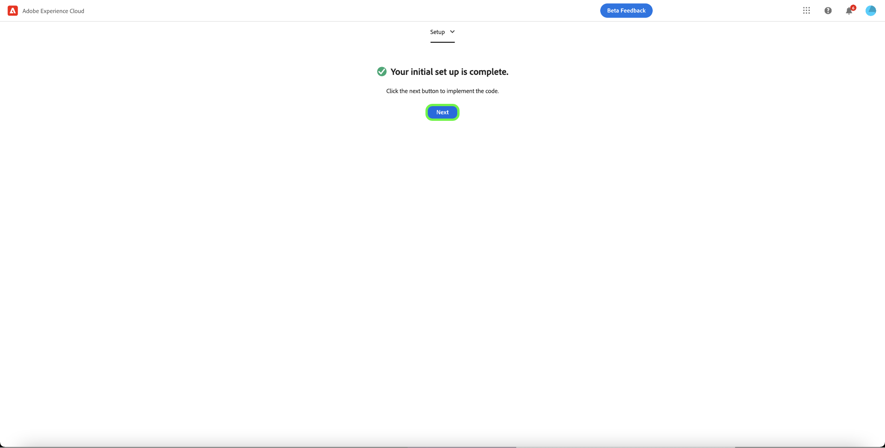

# Panoramica dell&#39;estensione [!DNL Meta Conversions API]

[[!DNL Meta Conversions API]](https://developers.facebook.com/docs/marketing-api/conversions-api/) ti consente di collegare i dati di marketing lato server alle tecnologie [!DNL Meta] per ottimizzare il targeting degli annunci, ridurre i costi per azione e misurare i risultati. Gli eventi sono collegati a un ID [[!DNL Meta Pixel]](https://developers.facebook.com/docs/meta-pixel/) e vengono elaborati in modo simile agli eventi lato client.

Utilizzando l&#39;estensione [!DNL Meta Conversions API], puoi sfruttare le funzionalità dell&#39;API nelle regole di [inoltro eventi](../../../ui/event-forwarding/overview.md) per inviare dati a [!DNL Meta] dall&#39;Edge Network di Adobe Experience Platform. In questo documento viene illustrato come installare l&#39;estensione e utilizzarne le funzionalità in una [regola](../../../ui/managing-resources/rules.md) di inoltro eventi.

## Demo

Il seguente video ha lo scopo di supportare la comprensione di [!DNL Meta Conversions API].

>[!VIDEO](https://unlockmarketingdata.com/video-meta-conversions-api)

## Prerequisiti

Si consiglia vivamente di utilizzare [!DNL Meta Pixel] e [!DNL Conversions API] per condividere e inviare gli stessi eventi, rispettivamente, dal lato client e dal lato server, in quanto ciò potrebbe facilitare il ripristino di eventi non raccolti da [!DNL Meta Pixel]. Prima di installare l&#39;estensione [!DNL Conversions API], consulta la guida sull&#39;[[!DNL Meta Pixel] estensione](../../client/meta/overview.md) per i passaggi su come integrarla nelle implementazioni tag lato client.

>[!NOTE]
>
>La sezione sulla [deduplicazione degli eventi](#deduplication) più avanti in questo documento descrive i passaggi per garantire che lo stesso evento non venga utilizzato due volte, in quanto potrebbe essere ricevuto sia dal browser che dal server.

Per utilizzare l&#39;estensione [!DNL Conversions API], è necessario avere accesso all&#39;inoltro degli eventi e disporre di un account [!DNL Meta] valido con accesso a [!DNL Ad Manager] e [!DNL Event Manager]. In particolare, devi copiare l&#39;ID di un [[!DNL Meta Pixel]](https://www.facebook.com/business/help/952192354843755?id=1205376682832142) esistente (o [creare un nuovo [!DNL Pixel]](https://www.facebook.com/business/help/952192354843755)) in modo che l&#39;estensione possa essere configurata sul tuo account.

>[!INFO]
>
>Se prevedi di utilizzare questa estensione con i dati dell&#39;app mobile o se lavori anche con i dati degli eventi offline nelle campagne [!DNL Meta], dovrai creare il set di dati tramite un&#39;app esistente e selezionare **Crea da un ID pixel** quando richiesto. Per informazioni dettagliate, consulta l&#39;articolo [Decidere quale opzione di creazione del set di dati è adatta alla tua azienda](https://www.facebook.com/business/help/5270377362999582?id=490360542427371). Consulta il documento [API delle conversioni per eventi app](https://developers.facebook.com/docs/marketing-api/conversions-api/app-events) per tutti i parametri di tracciamento app obbligatori e facoltativi.

## Installare l’estensione

Per installare l&#39;estensione [!DNL Meta Conversions API], passa all&#39;interfaccia utente di Data Collection o all&#39;interfaccia utente Experience Platform e seleziona **[!UICONTROL Inoltro eventi]** dal menu di navigazione a sinistra. Da qui, seleziona una proprietà a cui aggiungere l’estensione o creane una nuova.

Dopo aver selezionato o creato la proprietà desiderata, seleziona **[!UICONTROL Estensioni]** nel menu di navigazione a sinistra, quindi seleziona la scheda **[!UICONTROL Catalogo]**. Cerca la scheda [!UICONTROL Meta Conversions API], quindi seleziona **[!UICONTROL Installa]**.

![Opzione [!UICONTROL Installa] selezionata per l&#39;estensione [!UICONTROL Meta Conversions API] nell&#39;interfaccia utente di Data Collection.](../../../images/extensions/server/meta/install.png)

Nella vista di configurazione visualizzata, devi fornire l&#39;ID [!DNL Pixel] copiato in precedenza per collegare l&#39;estensione al tuo account. Puoi incollare l’ID direttamente nell’input, oppure puoi utilizzare un elemento dati.

È inoltre necessario fornire un token di accesso per utilizzare specificamente [!DNL Conversions API]. Per informazioni su come ottenere questo valore, consulta la documentazione di [!DNL Conversions API] in [generazione di un token di accesso](https://developers.facebook.com/docs/marketing-api/conversions-api/get-started#access-token).

Al termine, seleziona **[!UICONTROL Salva]**

![L&#39;ID [!DNL Pixel] fornito come elemento dati nella vista di configurazione dell&#39;estensione.](../../../images/extensions/server/meta/configure.png)

L&#39;estensione è installata e ora puoi utilizzarne le funzionalità nelle regole di inoltro degli eventi.

## Integrazione con l’estensione Facebook e Instagram {#facebook}

L’integrazione tramite l’estensione Facebook e Instagram consente di eseguire rapidamente l’autenticazione nell’account Meta Business. In questo modo, l&#39;ID [!UICONTROL Pixel] e l&#39;API Meta Conversions [!UICONTROL Access Token] verranno automaticamente compilati, semplificando l&#39;installazione e la configurazione dell&#39;API Meta Conversions.

Viene visualizzata una finestra di dialogo per l&#39;autenticazione in Facebook e Instagram durante l&#39;installazione dell&#39;estensione [!UICONTROL Meta Conversions API].

![La pagina di installazione dell&#39;estensione API [!UICONTROL Meta Conversions] evidenzia [!UICONTROL Connetti a Meta].](../../../images/extensions/server/meta/mbe-extension-install.png)

Una finestra di dialogo per l’autenticazione in Facebook e Instagram viene visualizzata anche nell’interfaccia utente del flusso di lavoro con avvio rapido nell’inoltro degli eventi.

![L&#39;interfaccia utente del flusso di lavoro con avvio rapido evidenzia [!UICONTROL Connetti a Meta].](../../../images/extensions/server/meta/mbe-extension-quick-start.png)

## Integrazione con Event Quality Match Score (EMQ) {#emq}

L’integrazione con Event Quality Match Score (EMQ) consente di visualizzare facilmente l’efficacia dell’implementazione mostrando i punteggi EMQ. Questa integrazione riduce al minimo il passaggio a un altro contesto e consente di migliorare il successo delle implementazioni API di metaconversione. Questi punteggi evento vengono visualizzati nella schermata di configurazione dell&#39;estensione [!UICONTROL Meta Conversions API].

![La pagina di configurazione dell&#39;estensione [!UICONTROL Meta Conversions API] evidenzia [!UICONTROL Visualizza punteggio EMQ].](../../../images/extensions/server/meta/emq-score.png)

## Integrazione con LiveRamp (Alpha) {#alpha}

[!DNL LiveRamp] clienti che hanno implementato la soluzione di traffico autenticato (ATS) di [!DNL LiveRamp] sui loro siti possono scegliere di condividere i RampID come parametro delle informazioni sul cliente. Collabora con il tuo account team [!DNL Meta] per partecipare al programma di Alpha per questa funzionalità.

![La pagina di configurazione dell&#39;inoltro degli eventi Meta [!UICONTROL Rule] evidenzia [!UICONTROL Partner Name (alpha)] e [!UICONTROL Partner ID (alpha)].](../../../images/extensions/server/meta/live-ramp.png)

## Configurare una regola di inoltro degli eventi {#rule}

In questa sezione viene illustrato come utilizzare l&#39;estensione [!DNL Conversions API] in una regola di inoltro eventi generica. In pratica, è necessario configurare diverse regole per inviare tutti i [eventi standard](https://developers.facebook.com/docs/meta-pixel/reference) accettati tramite [!DNL Meta Pixel] e [!DNL Conversions API]. Per i dati delle app mobili, consulta i campi obbligatori, i campi dati delle app, i parametri delle informazioni cliente e i dettagli dei dati personalizzati [qui](https://developers.facebook.com/docs/marketing-api/conversions-api/app-events).

>[!NOTE]
>
>Gli eventi devono essere [inviati in tempo reale](https://www.facebook.com/business/help/379226453470947?id=818859032317965) o il più vicino possibile al tempo reale per una migliore ottimizzazione della campagna pubblicitaria.

Inizia a creare una nuova regola di inoltro degli eventi e configurane le condizioni come desiderato. Quando selezioni le azioni per la regola, seleziona **[!UICONTROL Estensione API di conversione metadati]** per l&#39;estensione, quindi seleziona **[!UICONTROL Invia evento API di conversione]** per il tipo di azione.

![Tipo di azione [!UICONTROL Invia visualizzazione pagina] selezionato per una regola nell&#39;interfaccia utente di Data Collection.](../../../images/extensions/server/meta/select-action.png)

Vengono visualizzati i controlli che consentono di configurare i dati evento che verranno inviati a [!DNL Meta] tramite [!DNL Conversions API]. Queste opzioni possono essere immesse direttamente negli input forniti, oppure puoi selezionare elementi dati esistenti per rappresentare i valori. Le opzioni di configurazione sono suddivise in quattro sezioni principali, come descritto di seguito.

| Sezione di configurazione | Descrizione |
| --- | --- |
| [!UICONTROL Parametri evento server] | Informazioni generali sull&#39;evento, tra cui l&#39;ora in cui si è verificato e l&#39;azione di origine che l&#39;ha attivato. Per ulteriori informazioni sui [parametri evento standard](https://developers.facebook.com/docs/marketing-api/conversions-api/parameters/server-event) accettati da [!DNL Conversions API], consultare la documentazione per gli sviluppatori di [!DNL Meta].  Se per l&#39;invio di eventi si utilizzano sia [!DNL Meta Pixel] che [!DNL Conversions API], assicurarsi di includere sia un **[!UICONTROL Nome evento]** (`event_name`) che un **[!UICONTROL ID evento]** (`event_id`) in ogni evento, poiché questi valori vengono utilizzati per la [deduplicazione evento](#deduplication).  Hai anche la possibilità di **[!UICONTROL abilitare l&#39;uso limitato dei dati]** per rispettare le rinunce dei clienti. Per informazioni dettagliate su questa funzione, consulta la documentazione di [!DNL Conversions API] sulle [opzioni di elaborazione dati](https://developers.facebook.com/docs/marketing-apis/data-processing-options/). |
| [!UICONTROL Parametri informazioni cliente] | Dati di identità utente utilizzati per attribuire l’evento a un cliente. Per poter essere inviati all&#39;API, alcuni di questi valori devono avere un hash.  Per garantire una buona connessione API comune e un&#39;elevata qualità di corrispondenza eventi (EMQ), si consiglia di inviare tutti i [parametri accettati per le informazioni sul cliente](https://developers.facebook.com/docs/marketing-api/conversions-api/parameters/customer-information-parameters) insieme agli eventi del server. Anche questi parametri dovrebbero avere [priorità in base alla loro importanza e al loro impatto su EMQ](https://www.facebook.com/business/help/765081237991954?id=818859032317965). |
| [!UICONTROL Dati Personalizzati] | Dati aggiuntivi da utilizzare per l’ottimizzazione della consegna di annunci, forniti sotto forma di oggetto JSON. Per ulteriori informazioni sulle proprietà accettate per questo oggetto, consulta la [[!DNL Conversions API] documentazione](https://developers.facebook.com/docs/marketing-api/conversions-api/parameters/custom-data).  Se si invia un evento di acquisto, è necessario utilizzare questa sezione per fornire gli attributi richiesti `currency` e `value`. |
| [!UICONTROL Evento di prova] | Questa opzione viene utilizzata per verificare se la configurazione sta causando la ricezione di eventi server da parte di [!DNL Meta] come previsto. Per utilizzare questa funzionalità, selezionare la casella di controllo **[!UICONTROL Invia come evento di test]** e quindi specificare il codice dell&#39;evento di test desiderato nell&#39;input seguente. Una volta distribuita la regola di inoltro degli eventi, se l&#39;estensione e l&#39;azione sono state configurate correttamente, è necessario visualizzare le attività nella visualizzazione **[!DNL Test Events]** in [!DNL Meta Events Manager]. |

{style="table-layout:auto"}

Al termine, seleziona **[!UICONTROL Mantieni modifiche]** per aggiungere l&#39;azione alla configurazione della regola.

![[!UICONTROL Selezione di Mantieni modifiche] per la configurazione dell&#39;azione.](../../../images/extensions/server/meta/keep-changes.png)

Una volta soddisfatta la regola, selezionare **[!UICONTROL Salva nella libreria]**. Infine, pubblica un nuovo evento con inoltro di [build](../../../ui/publishing/builds.md) per abilitare le modifiche apportate alla libreria.

## Deduplicazione degli eventi {#deduplication}

Come indicato nella sezione [prerequisiti](#prerequisites), è consigliabile utilizzare sia l&#39;estensione tag [!DNL Meta Pixel] che l&#39;estensione inoltro eventi [!DNL Conversions API] per inviare gli stessi eventi dal client e dal server in una configurazione ridondante. Questo può aiutare a recuperare gli eventi che non sono stati rilevati da un’estensione o dall’altra.

Se invii tipi di evento diversi dal client e dal server senza alcuna sovrapposizione tra i due, la deduplicazione non è necessaria. Tuttavia, se un singolo evento è condiviso sia da [!DNL Meta Pixel] che da [!DNL Conversions API], è necessario assicurarsi che questi eventi ridondanti siano deduplicati in modo che il reporting non venga influenzato negativamente.

Quando invii eventi condivisi, accertati di includere un ID evento e un nome con ogni evento inviato sia dal client che dal server. Quando vengono ricevuti più eventi con lo stesso ID e nome, [!DNL Meta] utilizza automaticamente diverse strategie per deduplicarli e mantenere i dati più rilevanti. Per informazioni dettagliate su questo processo, consulta la documentazione [!DNL Meta] sulla [deduplicazione per [!DNL Meta Pixel] e [!DNL Conversions API] eventi](https://www.facebook.com/business/help/823677331451951?id=1205376682832142).

## Flusso di lavoro di avvio rapido: estensione API Meta Conversions (Beta) {#quick-start}

>[!IMPORTANT]
>
>* La funzione di avvio rapido è disponibile per i clienti che hanno acquistato il pacchetto Real-Time CDP Prime e Ultimate. Per ulteriori informazioni, contatta il rappresentante del tuo Adobe.
>* Questa funzione è destinata alle nuove implementazioni nette e al momento non supporta l’installazione automatica di estensioni e configurazioni su tag e proprietà di inoltro degli eventi esistenti.

>[!NOTE]
>
>Qualsiasi client esistente può utilizzare i flussi di lavoro di avvio rapido per creare un’implementazione di riferimento che può essere utilizzata per i seguenti elementi:
>* Utilizzala come inizio di un’implementazione completamente nuova.
>* Sfruttala come implementazione di riferimento da esaminare per vedere come è stata configurata e replicarla nelle implementazioni di produzione correnti.

La funzione di avvio rapido consente di effettuare la configurazione con facilità ed efficienza con l’API Meta Conversions e le estensioni Meta Pixel. Questo strumento automatizza più passaggi eseguiti nei tag Adobe e nell’inoltro degli eventi, riducendo in modo significativo il tempo di configurazione.

Questa funzione installa e configura automaticamente sia l’API Meta Conversions che le estensioni Meta Pixel su un tag appena generato automaticamente e la proprietà di inoltro degli eventi con le regole e gli elementi dati necessari. Inoltre, installa e configura automaticamente Experience Platform Web SDK e Datastream. Infine, la funzione di avvio rapido pubblica automaticamente la libreria nell’URL designato in un ambiente di sviluppo, consentendo la raccolta dei dati lato client e l’inoltro degli eventi lato server in tempo reale tramite l’inoltro degli eventi e un Edge Network di Experience Platform.

Il video seguente fornisce un’introduzione alla funzione di avvio rapido.

>[!VIDEO](https://video.tv.adobe.com/v/3416939?quality=12&learn=on)

### Installare la funzione di avvio rapido

>[!NOTE]
>
>Questa funzione è progettata per aiutarti a iniziare con un’implementazione di inoltro degli eventi. Non fornirà un’implementazione end-to-end pienamente funzionale che tenga conto di tutti i casi d’uso.

Questa configurazione installa automaticamente sia l’API Meta Conversions che le estensioni Meta Pixel. Questa implementazione ibrida è consigliata da Meta per raccogliere e inoltrare le conversioni di eventi lato server.
La funzione di configurazione rapida è progettata per aiutare i clienti a iniziare con un’implementazione di inoltro degli eventi e non è concepita per fornire un’implementazione completa e funzionale che tenga conto di tutti i casi d’uso.

Per installare la funzionalità, selezionare **[!UICONTROL Inizia]** per **[!DNL Send Conversions Data to Meta]** nella pagina **[!UICONTROL Home]** della raccolta dati di Adobe Experience Platform.

Immetti il **[!UICONTROL dominio]**, quindi seleziona **[!UICONTROL Successivo]**. Questo dominio verrà utilizzato come convenzione di denominazione per le proprietà, le regole, gli elementi dati, i flussi di dati e così via dei tag generati automaticamente e dell’inoltro degli eventi.

Nella finestra di dialogo **[!UICONTROL Configurazione iniziale]**, immetti il **[!UICONTROL ID metadati]**, il **[!UICONTROL Token di accesso API di conversione metadati]** e il **[!UICONTROL Percorso livello dati]**, quindi seleziona **[!UICONTROL Avanti]**.

Attendere alcuni minuti per il completamento del processo di installazione iniziale, quindi selezionare **[!UICONTROL Avanti]**.

Nella finestra di dialogo **[!UICONTROL Aggiungi codice nel sito]** copiare il codice fornito utilizzando la funzione di copia  e incollarlo in `<head>` del sito Web di origine. Una volta implementato, seleziona **[!UICONTROL Avvia convalida]**

La finestra di dialogo [!UICONTROL Risultati convalida] visualizza i risultati dell&#39;implementazione dell&#39;estensione Meta. Seleziona **[!UICONTROL Avanti]**. Puoi visualizzare ulteriori risultati di convalida selezionando il collegamento **[!UICONTROL Assurance]**.

La visualizzazione della schermata **[!UICONTROL Passaggi successivi]** conferma il completamento dell&#39;installazione. Da qui puoi ottimizzare l’implementazione aggiungendo nuovi eventi, descritti nella sezione successiva.

Se non si desidera aggiungere altri eventi, selezionare **[!UICONTROL Chiudi]**.

#### Aggiunta di eventi aggiuntivi

Per aggiungere nuovi eventi, selezionare **[!UICONTROL Modifica proprietà Web tag]**.

Seleziona la regola che corrisponde al meta evento da modificare. **MetaConversion_AddToCart**.

>[!NOTE]
>
>Se non vi è alcun evento, questa regola non verrà eseguita. Questo è vero per tutte le regole, con la regola **MetaConversion_PageView** che è l&#39;eccezione.

Per aggiungere un evento, seleziona **[!UICONTROL Aggiungi]** sotto l&#39;intestazione [!UICONTROL Eventi].

Seleziona il [!UICONTROL Tipo evento]. In questo esempio, abbiamo selezionato l&#39;evento [!UICONTROL Click] e l&#39;abbiamo configurato per attivarlo quando viene selezionato **.add-to-cart-button**. Seleziona **[!UICONTROL Mantieni modifiche]**.

Il nuovo evento è stato salvato. Seleziona **[!UICONTROL Seleziona una libreria di lavoro]** e seleziona la libreria in cui desideri creare.

Quindi, seleziona il menu a discesa accanto a **[!UICONTROL Salva nella libreria]** e seleziona **[!UICONTROL Salva nella libreria e genera]**. La modifica verrà pubblicata nella libreria.

Ripeti questi passaggi per qualsiasi altro evento di metaconversione che desideri configurare.

#### Configurazione livello dati {#configuration}

>[!IMPORTANT]
>
>Il modo in cui aggiorni questo livello di dati globale dipende dall’architettura del tuo sito web. Un&#39;applicazione a pagina singola sarà diversa da un&#39;app di rendering lato server. C’è anche la possibilità che tu sia completamente responsabile della creazione e dell’aggiornamento di questi dati all’interno del prodotto Tag. In tutte le istanze, il livello dati dovrà essere aggiornato tra l&#39;esecuzione di ciascuno dei `MetaConversion_* rules`. Se non aggiorni i dati tra regole, potresti anche imbatterti in un caso in cui stai inviando dati non aggiornati dagli ultimi `MetaConversion_* rule` nell&#39;attuale `MetaConversion_* rule`.

Durante la configurazione, ti è stato chiesto dove si trova il livello dati. Per impostazione predefinita, è `window.dataLayer.meta` e all&#39;interno dell&#39;oggetto `meta`, i dati sono previsti come mostrato di seguito.

Questo è importante da comprendere in quanto ogni regola `MetaConversion_*` utilizza questa struttura di dati per passare le parti di dati rilevanti all&#39;estensione [!DNL Meta Pixel] e a [!DNL Meta Conversions API]. Per ulteriori informazioni sui dati necessari per i diversi metadati, consulta la documentazione su [eventi standard](https://developers.facebook.com/docs/meta-pixel/reference#standard-events).

Se ad esempio si desidera utilizzare la regola `MetaConversion_Subscribe`, è necessario aggiornare `window.dataLayer.meta.currency`, `window.dataLayer.meta.predicted_ltv` e `window.dataLayer.meta.value` in base alle proprietà dell&#39;oggetto descritte nella documentazione su [eventi standard](https://developers.facebook.com/docs/meta-pixel/reference#standard-events).

Di seguito è riportato un esempio di ciò che dovrebbe essere eseguito su un sito web per aggiornare il livello dati prima che la regola venga eseguita.

Per impostazione predefinita, `<datalayerpath>.conversionData.eventId` verrà generato in modo casuale dall&#39;azione &quot;Genera nuovo ID evento&quot; in uno dei `MetaConversion_* rules`.

Per un riferimento locale su come dovrebbe apparire il livello dati, puoi aprire l&#39;editor di codice personalizzato sull&#39;elemento dati `MetaConversion_DataLayer` nella tua proprietà.

## Passaggi successivi

Questa guida illustra come inviare dati evento lato server a [!DNL Meta] utilizzando l&#39;estensione [!DNL Meta Conversions API]. Da qui, si consiglia di espandere l&#39;integrazione connettendo più [!DNL Pixels] e condividendo altri eventi, se applicabile. Effettuando una delle seguenti operazioni puoi migliorare ulteriormente le prestazioni dell’annuncio:

* Connettere altri [!DNL Pixels] non ancora connessi a un&#39;integrazione [!DNL Conversions API].
* Se alcuni eventi vengono inviati esclusivamente tramite [!DNL Meta Pixel] sul lato client, inviare gli stessi eventi a [!DNL Conversions API] anche dal lato server.

Consulta la documentazione di [!DNL Meta] sulle [best practice per  [!DNL Conversions API]](https://www.facebook.com/business/help/308855623839366?id=818859032317965) per maggiori informazioni su come implementare in modo efficace l&#39;integrazione. Per informazioni più generali sui tag e sull&#39;inoltro di eventi in Adobe Experience Cloud, consulta la [panoramica sui tag](../../../home.md).
