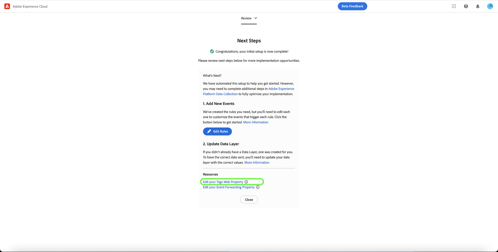

# [!DNL Meta Conversions API] panoramica dell’estensione

Il [[!DNL Meta Conversions API]](https://developers.facebook.com/docs/marketing-api/conversions-api/) ti consente di collegare i dati di marketing lato server a [!DNL Meta] tecnologie per ottimizzare il targeting degli annunci, ridurre i costi per azione e misurare i risultati. Gli eventi sono collegati a un [[!DNL Meta Pixel]](https://developers.facebook.com/docs/meta-pixel/) ID e vengono elaborati in modo simile agli eventi lato client.

Utilizzo di [!DNL Meta Conversions API] , puoi sfruttare le funzionalità dell&#39;API nella tua [inoltro eventi](../../../ui/event-forwarding/overview.md) regole a cui inviare i dati [!DNL Meta] dalla rete Edge di Adobe Experience Platform. Questo documento illustra come installare l’estensione e utilizzarne le funzionalità in un inoltro di eventi [regola](../../../ui/managing-resources/rules.md).

## Prerequisiti

Si consiglia vivamente di utilizzare [!DNL Meta Pixel] e [!DNL Conversions API] per condividere e inviare gli stessi eventi rispettivamente dal lato client e dal lato server, in quanto ciò può aiutare a recuperare eventi che non sono stati raccolti da [!DNL Meta Pixel]. Prima di installare [!DNL Conversions API] , consulta la guida sulla [[!DNL Meta Pixel] estensione](../../client/meta/overview.md) per i passaggi su come integrarlo nelle implementazioni tag lato client.

>[!NOTE]
>
>La sezione su [deduplicazione degli eventi](#deduplication) più avanti in questo documento vengono descritti i passaggi per garantire che lo stesso evento non venga utilizzato due volte, in quanto può essere ricevuto sia dal browser che dal server.

Per utilizzare il [!DNL Conversions API] , devi avere accesso all&#39;inoltro degli eventi e disporre di un [!DNL Meta] account con accesso a [!DNL Ad Manager] e [!DNL Event Manager]. In particolare, devi copiare l’ID di un [[!DNL Meta Pixel]](https://www.facebook.com/business/help/952192354843755?id=1205376682832142) (o [crea un nuovo [!DNL Pixel]](https://www.facebook.com/business/help/952192354843755) in modo che l’estensione possa essere configurata sul tuo account.

>[!INFO]
>
>Se prevedi di utilizzare questa estensione con i dati delle app mobili o se utilizzi anche i dati degli eventi offline nelle [!DNL Meta] campagne, dovrai creare il set di dati tramite un’app esistente e selezionare **Crea da un ID pixel** quando richiesto. Vedi l’articolo [Decidere quale opzione di creazione del set di dati è adatta alla tua azienda](https://www.facebook.com/business/help/5270377362999582?id=490360542427371) per i dettagli. Consulta la sezione [API Conversioni per eventi app](https://developers.facebook.com/docs/marketing-api/conversions-api/app-events) per tutti i parametri di tracciamento app obbligatori e facoltativi.

## Installare l’estensione

Per installare [!DNL Meta Conversions API] , passa all’interfaccia utente di Data Collection o all’interfaccia utente di Experienci Platform e seleziona **[!UICONTROL Inoltro eventi]** dal menu di navigazione a sinistra. Da qui, seleziona una proprietà a cui aggiungere l’estensione o creane una nuova.

Dopo aver selezionato o creato la proprietà desiderata, seleziona **[!UICONTROL Estensioni]** nel menu di navigazione a sinistra, seleziona quindi **[!UICONTROL Catalogo]** scheda. Cerca [!UICONTROL API di metaconversione] , quindi seleziona **[!UICONTROL Installa]**.

![Il [!UICONTROL Installa] opzione selezionata per il [!UICONTROL API di metaconversione] nell’interfaccia utente di Data Collection.](../../../images/extensions/server/meta/install.png)

Nella vista di configurazione visualizzata, devi fornire [!DNL Pixel] ID copiato in precedenza per collegare l&#39;estensione al tuo account. Puoi incollare l’ID direttamente nell’input, oppure puoi utilizzare un elemento dati.

È inoltre necessario fornire un token di accesso per utilizzare [!DNL Conversions API] in particolare. Consulta la sezione [!DNL Conversions API] documentazione su [generazione di un token di accesso](https://developers.facebook.com/docs/marketing-api/conversions-api/get-started#access-token) per i passaggi su come ottenere questo valore.

Al termine, seleziona **[!UICONTROL Salva]**

![Il [!DNL Pixel] ID fornito come elemento dati nella vista di configurazione dell’estensione.](../../../images/extensions/server/meta/configure.png)

L&#39;estensione è installata e ora puoi utilizzarne le funzionalità nelle regole di inoltro degli eventi.

## Integrazione con Meta Business Extension (MBE) {#mbe}

Il miglioramento dell’integrazione con Meta Business Extensions (MBE) consente di eseguire rapidamente l’autenticazione nell’account Meta Business. Questo quindi compila automaticamente il tuo [!UICONTROL ID pixel] e l’API Meta Conversions [!UICONTROL Token di accesso], per semplificare l’installazione e la configurazione dell’API di conversione metadati.

Viene visualizzata una finestra di dialogo per l&#39;autenticazione in MBE durante l&#39;installazione di [!UICONTROL API di metaconversione] estensione.

![Il [!UICONTROL Estensione API per metaconversione] evidenziazione della pagina di installazione [!UICONTROL Connetti a Meta].](../../../images/extensions/server/meta/mbe-extension-install.png)

Una finestra di dialogo per l’autenticazione in MBE viene visualizzata anche nell’interfaccia utente del flusso di lavoro con avvio rapido nell’inoltro degli eventi.

![Evidenziazione dell’interfaccia utente del flusso di lavoro con avvio rapido [!UICONTROL Connetti a Meta].](../../../images/extensions/server/meta/mbe-extension-quick-start.png)

## Integrazione con Event Quality Match Score (EMQ) {#emq}

L’integrazione con Event Quality Match Score (EMQ) consente di visualizzare facilmente l’efficacia dell’implementazione mostrando i punteggi EMQ. Questa integrazione riduce al minimo il passaggio a un altro contesto e consente di migliorare il successo delle implementazioni API di metaconversione. Questi punteggi di evento vengono visualizzati nel [!UICONTROL Estensione API per metaconversione] schermata di configurazione.

![Il [!UICONTROL Estensione API per metaconversione] evidenziazione della pagina di configurazione [!UICONTROL Visualizza punteggio EMQ].](../../../images/extensions/server/meta/emq-score.png)

## Integrazione con LiveRamp (Alpha) {#alpha}

[!DNL LiveRamp] clienti che hanno [!DNL LiveRamp]La soluzione ATS (Authenticated Traffic Solution) distribuita sui propri siti può scegliere di condividere i RampID come parametro delle informazioni del cliente. Lavora con il [!DNL Meta] team dell’account per partecipare al programma di Alpha per questa funzione.

![Inoltro metadati [!UICONTROL Regola] evidenziazione della pagina di configurazione [!UICONTROL Nome partner (alfa)] e [!UICONTROL ID partner (alfa)].](../../../images/extensions/server/meta/live-ramp.png)

## Configurare una regola di inoltro degli eventi {#rule}

Questa sezione descrive come utilizzare [!DNL Conversions API] estensione in una regola di inoltro eventi generica. In pratica, devi configurare diverse regole per inviare tutti gli elementi accettati [eventi standard](https://developers.facebook.com/docs/meta-pixel/reference) tramite [!DNL Meta Pixel] e [!DNL Conversions API]. Per i dati delle app mobili, consulta i campi obbligatori, i campi dati delle app, i parametri di informazione per il cliente e i dettagli dei dati personalizzati [qui](https://developers.facebook.com/docs/marketing-api/conversions-api/app-events).

>[!NOTE]
>
>Gli eventi devono essere [inviato in tempo reale](https://www.facebook.com/business/help/379226453470947?id=818859032317965) o il più vicino possibile al tempo reale per ottimizzare le campagne pubblicitarie.

Inizia a creare una nuova regola di inoltro degli eventi e configurane le condizioni come desiderato. Quando selezioni le azioni per la regola, seleziona **[!UICONTROL Estensione API per metaconversione]** per l’estensione, seleziona **[!UICONTROL Evento API di invio conversioni]** per il tipo di azione.

![Il [!UICONTROL Invia visualizzazione pagina] tipo di azione selezionato per una regola nell’interfaccia utente di Data Collection.](../../../images/extensions/server/meta/select-action.png)

Vengono visualizzati i controlli che consentono di configurare i dati evento che verranno inviati a [!DNL Meta] tramite [!DNL Conversions API]. Queste opzioni possono essere immesse direttamente negli input forniti, oppure puoi selezionare elementi dati esistenti per rappresentare i valori. Le opzioni di configurazione sono suddivise in quattro sezioni principali, come descritto di seguito.

| Sezione di configurazione | Descrizione |
| --- | --- |
| [!UICONTROL Parametri evento server] | Informazioni generali sull&#39;evento, tra cui l&#39;ora in cui si è verificato e l&#39;azione di origine che l&#39;ha attivato. Consulta la sezione [!DNL Meta] documentazione per gli sviluppatori di per ulteriori informazioni su [parametri evento standard](https://developers.facebook.com/docs/marketing-api/conversions-api/parameters/server-event) accettata dal [!DNL Conversions API].  Se utilizzi entrambi [!DNL Meta Pixel] e [!DNL Conversions API] per inviare gli eventi, assicurati di includere sia un **[!UICONTROL Nome evento]** (`event_name`) e **[!UICONTROL ID evento]** (`event_id`) con ogni evento, poiché questi valori vengono utilizzati per [deduplicazione degli eventi](#deduplication).  È inoltre possibile: **[!UICONTROL Abilita utilizzo dati limitato]** per rispettare le rinunce dei clienti. Consulta la [!DNL Conversions API] documentazione su [opzioni di elaborazione dati](https://developers.facebook.com/docs/marketing-apis/data-processing-options/) per i dettagli su questa funzione. |
| [!UICONTROL Parametri informazioni cliente] | Dati di identità utente utilizzati per attribuire l’evento a un cliente. Per poter essere inviati all&#39;API, alcuni di questi valori devono avere un hash.  Per garantire una buona connessione API in comune e un’elevata qualità di corrispondenza degli eventi (EMQ), si consiglia di inviare tutti [parametri accettati per le informazioni sul cliente](https://developers.facebook.com/docs/marketing-api/conversions-api/parameters/customer-information-parameters) insieme agli eventi del server. Anche questi parametri devono essere [prioritario in base alla loro importanza e impatto su EMQ](https://www.facebook.com/business/help/765081237991954?id=818859032317965). |
| [!UICONTROL Dati personalizzati] | Dati aggiuntivi da utilizzare per l’ottimizzazione della consegna di annunci, forniti sotto forma di oggetto JSON. Consulta la sezione [[!DNL Conversions API] documentazione](https://developers.facebook.com/docs/marketing-api/conversions-api/parameters/custom-data) per ulteriori informazioni sulle proprietà accettate per questo oggetto.  Se invii un evento di acquisto, devi utilizzare questa sezione per fornire gli attributi richiesti `currency` e `value`. |
| [!UICONTROL Evento di test] | Questa opzione viene utilizzata per verificare se la configurazione causa la ricezione di eventi server da parte di [!DNL Meta] come previsto. Per utilizzare questa funzione, selezionare **[!UICONTROL Invia come evento di test]** e quindi inserisci il codice di un evento di test desiderato nell’input seguente. Una volta distribuita la regola di inoltro degli eventi, se hai configurato correttamente l’estensione e l’azione dovresti visualizzare le attività presenti all’interno di **[!DNL Test Events]** visualizza in [!DNL Meta Events Manager]. |

{style="table-layout:auto"}

Al termine, seleziona **[!UICONTROL Mantieni modifiche]** per aggiungere l’azione alla configurazione della regola.

![[!UICONTROL Mantieni modifiche] in fase di selezione per la configurazione dell’azione.](../../../images/extensions/server/meta/keep-changes.png)

Quando sei soddisfatto della regola, seleziona **[!UICONTROL Salva nella libreria]**. Infine, pubblica un nuovo inoltro di eventi [build](../../../ui/publishing/builds.md) per abilitare le modifiche apportate alla libreria.

## Deduplicazione di eventi {#deduplication}

Come indicato nella [sezione prerequisiti](#prerequisites), si consiglia di utilizzare entrambi i [!DNL Meta Pixel] estensione tag e [!DNL Conversions API] estensione di inoltro degli eventi per inviare gli stessi eventi dal client e dal server in una configurazione ridondante. Questo può aiutare a recuperare gli eventi che non sono stati rilevati da un’estensione o dall’altra.

Se invii tipi di evento diversi dal client e dal server senza alcuna sovrapposizione tra i due, la deduplicazione non è necessaria. Tuttavia, se un singolo evento è condiviso da entrambi [!DNL Meta Pixel] e [!DNL Conversions API], è necessario assicurarsi che questi eventi ridondanti siano deduplicati in modo che il reporting non venga influenzato negativamente.

Quando invii eventi condivisi, accertati di includere un ID evento e un nome con ogni evento inviato sia dal client che dal server. Quando si ricevono più eventi con lo stesso ID e nome, [!DNL Meta] utilizza automaticamente diverse strategie per deduplicarle e conservare i dati più rilevanti. Consulta la [!DNL Meta] documentazione su [deduplicazione per [!DNL Meta Pixel] e [!DNL Conversions API] Eventi](https://www.facebook.com/business/help/823677331451951?id=1205376682832142) per informazioni dettagliate su questo processo.

## Flusso di lavoro di avvio rapido: estensione API Meta Conversions (Beta) {#quick-start}

>[!IMPORTANT]
>
>* La funzione di avvio rapido è disponibile per i clienti che hanno acquistato il pacchetto Real-Time CDP Prime e Ultimate. Per ulteriori informazioni, contatta il rappresentante del tuo Adobe.
>* Questa funzione è destinata alle nuove implementazioni nette e al momento non supporta l’installazione automatica di estensioni e configurazioni su tag e proprietà di inoltro degli eventi esistenti.

>[!NOTE]
>
>Qualsiasi client esistente può utilizzare i flussi di lavoro di avvio rapido per creare un’implementazione di riferimento che può essere utilizzata per i seguenti elementi:
>* Utilizzala come inizio di un’implementazione completamente nuova.
>* Sfruttala come implementazione di riferimento da esaminare per vedere come è stata configurata e replicarla nelle implementazioni di produzione correnti.

La funzione di avvio rapido consente di effettuare la configurazione con facilità ed efficienza con l’API Meta Conversions e le estensioni Meta Pixel. Questo strumento automatizza più passaggi eseguiti nei tag Adobe e nell’inoltro degli eventi, riducendo in modo significativo il tempo di configurazione.

Questa funzione installa e configura automaticamente sia l’API Meta Conversions che le estensioni Meta Pixel su un tag appena generato automaticamente e la proprietà di inoltro degli eventi con le regole e gli elementi dati necessari. Inoltre, installa e configura automaticamente Experienci Platform Web SDK e Datastream. Infine, la funzione di avvio rapido pubblica automaticamente la libreria nell’URL designato in un ambiente di sviluppo, consentendo la raccolta dei dati lato client e l’inoltro degli eventi lato server in tempo reale tramite l’inoltro degli eventi e Experienci Platform Edge Network.

Il video seguente fornisce un’introduzione alla funzione di avvio rapido.

>[!VIDEO](https://video.tv.adobe.com/v/3416939?quality=12&learn=on)

### Installare la funzione di avvio rapido

>[!NOTE]
>
>Questa funzione è progettata per aiutarti a iniziare con un’implementazione di inoltro degli eventi. Non fornirà un’implementazione end-to-end pienamente funzionale che tenga conto di tutti i casi d’uso.

Questa configurazione installa automaticamente sia l’API Meta Conversions che le estensioni Meta Pixel. Questa implementazione ibrida è consigliata da Meta per raccogliere e inoltrare le conversioni di eventi lato server.
La funzione di configurazione rapida è progettata per aiutare i clienti a iniziare con un’implementazione di inoltro degli eventi e non è concepita per fornire un’implementazione completa e funzionale che tenga conto di tutti i casi d’uso.

Per installare la funzionalità, selezionare **[!UICONTROL Introduzione]** per **[!DNL Send Conversions Data to Meta]** sulla raccolta dati di Adobe Experience Platform **[!UICONTROL Home]** pagina.

Immetti il **[!UICONTROL Dominio]**, quindi seleziona **[!UICONTROL Successivo]**. Questo dominio verrà utilizzato come convenzione di denominazione per le proprietà, le regole, gli elementi dati, i flussi di dati e così via dei tag generati automaticamente e dell’inoltro degli eventi.

In **[!UICONTROL Configurazione iniziale]** finestra di dialogo immetti **[!UICONTROL ID metadati]**, **[!UICONTROL Token di accesso API di conversione metadati]**, e **[!UICONTROL Percorso livello dati]**, quindi seleziona **[!UICONTROL Successivo]**.

Attendere alcuni minuti per il completamento del processo di configurazione iniziale, quindi selezionare **[!UICONTROL Successivo]**.

Dalla sezione **[!UICONTROL Aggiungi codice sul sito]** finestra di dialogo copia il codice fornito utilizzando la copia  e incollarlo nella `<head>` del sito web di origine. Una volta implementato, seleziona **[!UICONTROL Avvia convalida]**

Il [!UICONTROL Risultati convalida] Questa finestra di dialogo mostra i risultati dell’implementazione dell’estensione Meta. Seleziona **[!UICONTROL Successivo]**. Puoi anche visualizzare ulteriori risultati di convalida selezionando la **[!UICONTROL Assurance]** collegamento.

Il **[!UICONTROL Passaggi successivi]** la visualizzazione dello schermo conferma il completamento dell&#39;installazione. Da qui puoi ottimizzare l’implementazione aggiungendo nuovi eventi, descritti nella sezione successiva.

Se non desideri aggiungere altri eventi, seleziona **[!UICONTROL Chiudi]**.

#### Aggiunta di eventi aggiuntivi

Per aggiungere nuovi eventi, seleziona **[!UICONTROL Modificare La Proprietà Web Dei Tag]**.

Seleziona la regola che corrisponde al meta evento da modificare. Ad esempio: **Metaconversione_AggiungiAlCarrello**.

>[!NOTE]
>
>Se non vi è alcun evento, questa regola non verrà eseguita. Questo è vero per tutte le regole, con **MetaConversion_PageView** la regola è l&#39;eccezione.

Per aggiungere un evento, seleziona **[!UICONTROL Aggiungi]** sotto [!UICONTROL Eventi] intestazione.

Seleziona la [!UICONTROL Tipo di evento]. In questo esempio, abbiamo selezionato [!UICONTROL Clic] e l&#39;ha configurato per l&#39;attivazione quando **.add-to-carrello-button** è selezionato. Seleziona **[!UICONTROL Mantieni modifiche]**.

Il nuovo evento è stato salvato. Seleziona **[!UICONTROL Seleziona una libreria di lavoro]** e seleziona la libreria in cui desideri creare.

Quindi seleziona il menu a discesa accanto a **[!UICONTROL Salva nella libreria]** e seleziona **[!UICONTROL Salva nella libreria e genera]**. La modifica verrà pubblicata nella libreria.

Ripeti questi passaggi per qualsiasi altro evento di metaconversione che desideri configurare.

#### Configurazione livello dati {#configuration}

>[!IMPORTANT]
>
>Il modo in cui aggiorni questo livello di dati globale dipende dall’architettura del tuo sito web. Un&#39;applicazione a pagina singola sarà diversa da un&#39;app di rendering lato server. C’è anche la possibilità che tu sia completamente responsabile della creazione e dell’aggiornamento di questi dati all’interno del prodotto Tag. In tutte le istanze, il livello dati dovrà essere aggiornato tra l’esecuzione di ciascuna delle `MetaConversion_* rules`. Se non aggiorni i dati tra regole, potresti anche imbatterti in un caso in cui invii dati obsoleti dall’ultimo `MetaConversion_* rule` nell&#39;attuale `MetaConversion_* rule`.

Durante la configurazione, ti è stato chiesto dove si trova il livello dati. Per impostazione predefinita, questo valore è `window.dataLayer.meta`, e all&#39;interno del `meta` dei dati, come illustrato di seguito.

Questo è importante da capire come ogni `MetaConversion_*` utilizza questa struttura di dati per trasmettere le parti di dati rilevanti al [!DNL Meta Pixel] e al [!DNL Meta Conversions API]. Consulta la documentazione su [eventi standard](https://developers.facebook.com/docs/meta-pixel/reference#standard-events) per ulteriori informazioni sui dati richiesti dai diversi metadati.

Ad esempio, se desideri utilizzare il `MetaConversion_Subscribe` regola, dovrai aggiornare `window.dataLayer.meta.currency`, `window.dataLayer.meta.predicted_ltv`, e `window.dataLayer.meta.value` in base alle proprietà oggetto descritte nella documentazione su [eventi standard](https://developers.facebook.com/docs/meta-pixel/reference#standard-events).

Di seguito è riportato un esempio di ciò che dovrebbe essere eseguito su un sito web per aggiornare il livello dati prima che la regola venga eseguita.

Per impostazione predefinita, il `<datalayerpath>.conversionData.eventId` verrà generato in modo casuale dall’azione &quot;Genera nuovo ID evento&quot; su uno qualsiasi degli `MetaConversion_* rules`.

Per un riferimento locale su come dovrebbe apparire il livello dati, puoi aprire l’editor di codice personalizzato sul `MetaConversion_DataLayer` sulla proprietà.

## Passaggi successivi

Questa guida illustra come inviare dati evento lato server a [!DNL Meta] utilizzando [!DNL Meta Conversions API] estensione. Da qui, si consiglia di espandere la tua integrazione collegando più [!DNL Pixels] e la condivisione di altri eventi, se applicabile. Effettuando una delle seguenti operazioni puoi migliorare ulteriormente le prestazioni dell’annuncio:

* Connetti qualsiasi altro [!DNL Pixels] che non sono ancora connessi a un [!DNL Conversions API] integrazione.
* Se invii determinati eventi esclusivamente tramite [!DNL Meta Pixel] sul lato client, invia gli stessi eventi al [!DNL Conversions API] anche dal lato server.

Consulta la [!DNL Meta] documentazione su [best practice per [!DNL Conversions API]](https://www.facebook.com/business/help/308855623839366?id=818859032317965) per maggiori informazioni su come implementare in modo efficace l’integrazione. Per informazioni più generali sui tag e sull’inoltro di eventi in Adobe Experience Cloud, consulta [panoramica sui tag](../../../home.md).
