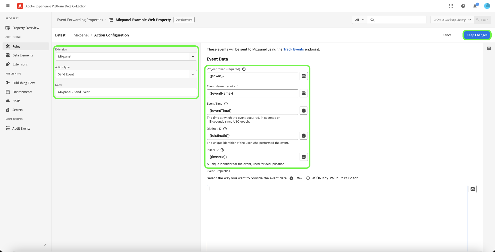

# [!DNL Mixpanel Track Events] Estensione di inoltro degli eventi API

[[!DNL Mixpanel]](https://www.mixpanel.com) è uno strumento di analisi dei prodotti che consente di acquisire dati sul modo in cui gli utenti interagiscono con un prodotto digitale. Puoi analizzare i dati dei prodotti con rapporti semplici e interattivi che ti consentono di eseguire query e visualizzare i dati con pochi clic. [!DNL Mixpanel] progettato per rendere i team più efficienti, consentendo a tutti di analizzare i dati degli utenti in tempo reale per identificare le tendenze, comprendere il comportamento degli utenti e prendere decisioni sul prodotto.

[!DNL Mixpanel] utilizza un modello basato su eventi e incentrato sull’utente che collega ogni interazione a un singolo utente. Il [!DNL Mixpanel] Il modello dati è basato sui concetti di utenti, eventi e proprietà.

>[!NOTE]
>
>Consulta la sezione [!DNL Mixpanel] documentazione su [gestione delle identità](https://help.mixpanel.com/hc/en-us/articles/360041039771-Getting-Started-with-Identity-Management) per capire come [!DNL Mixpanel] unisce gli eventi per creare cluster di identità. Si consiglia inoltre di rivedere il documento su [ID distinti](https://help.mixpanel.com/hc/en-us/articles/115004509426-Distinct-ID-Creation-JavaScript-iOS-Android-) per capire come vengono utilizzati per identificare gli utenti nei dati evento.

## Casi d’uso

Utilizza questa estensione se desideri utilizzare i dati provenienti dalla rete Edge in [!DNL Mixpanel] per sfruttare le funzionalità di analisi dei prodotti.

Ad esempio, considera un’organizzazione di vendita al dettaglio con una presenza multicanale (sito web e dispositivi mobili). L’organizzazione acquisisce input transazionali o conversazionali come dati evento dalle proprie piattaforme e li carica in [!DNL Mixpanel] utilizzando l’estensione per l’inoltro degli eventi.

I team di analisi possono quindi sfruttare [!DNL Mixpanel's] funzionalità per elaborare i set di dati e derivare informazioni aziendali, che possono essere utilizzate per generare grafici, dashboard o altre visualizzazioni per informare le parti interessate.

Per ulteriori informazioni sui casi d’uso specifici per [!DNL Mixpanel], consulta la seguente documentazione:

* [Nuovo a [!DNL Mixpanel]](https://docs.mixpanel.com/docs)
* [Che cosa è [!DNL Mixpanel]?](https://developer.mixpanel.com/docs)
* [12 must-try [!DNL Mixpanel] funzioni](https://mixpanel.com/blog/12-things-you-probably-didnt-know-you-could-do-with-mixpanel/)

## [!DNL Mixpanel] prerequisiti {#prerequisites-mixpanel}

È necessario disporre di un [!DNL Mixpanel] per utilizzare questa estensione. Vai a [[!DNL Mixpanel] pagina di registrazione](https://mixpanel.com/register/) per registrarti e creare un account, se non ne hai già uno.

Assicurati che [[!DNL Identity Merge]](https://help.mixpanel.com/hc/en-us/articles/9648680824852-ID-Merge-Implementation-Best-Practices) l&#39;impostazione è abilitata per il progetto. Accedi a **[!DNL Settings]** > **[!DNL Project Setting]** > **[!DNL Identity Merge]** e attivare/disattivare l&#39;impostazione.

### Informazioni sui cluster di identità in [!DNL Mixpanel]

In entrata [!DNL Mixpanel], un cluster di identità contiene una raccolta di `distinct_id` valori che si connettono a un singolo utente. [!DNL Mixpanel] gestisce il cluster di identità per ogni utente, risolvendo un singolo canonico `distinct_id` da ciascun cluster da utilizzare nei rapporti. Puoi anche includere un identificatore personalizzato, denominato locale `distinct_id`) per eventi anonimi che si verificano prima di un evento di identificazione utente.

[!DNL Mixpanel] risolve i cluster di identità tramite due metodi:

* **Identificare** : [!DNL Mixpanel] connette l&#39;identificatore scelto a un anonimo `distinct_id`. Se il sito Web include [!DNL Mixpanel] SDK abilitato, Platform utilizzerà `distinct_id` assegnato all&#39;utente attualmente connesso.
* **Alias**: [!DNL Mixpanel] combina due elementi non anonimi `distinct id`s insieme se sono soddisfatti ulteriori criteri di unione.

>[!NOTE]
>
>Consulta la sezione [!DNL Mixpanel] documento su [gestione delle identità](https://help.mixpanel.com/hc/en-us/articles/360041039771-Getting-Started-with-Identity-Management#user-identification) per ulteriori dettagli su questi metodi.
>
>Conferma di aver abilitato [[!DNL Mixpanel] feature di unione identità](#prerequisites-mixpanel) per garantire che i cluster di identità siano risolti in modo appropriato.

### Raccogliere i dettagli di configurazione richiesti {#configuration-details}

Per collegare Experienci Platform a [!DNL Mixpanel] è necessario disporre dei seguenti input:

| Tipo di chiave | Descrizione | Esempio |
| --- | --- | --- |
| Token progetto | Il token di progetto associato al tuo [!DNL Mixpanel] account. Consulta la sezione [!DNL Mixpanel] documentazione su [ricerca del token del progetto](https://help.mixpanel.com/hc/en-us/articles/115004502806-Find-Project-Token-) a titolo indicativo. | `25470xxxxxxxxxxxxxxxxxxx1289` |

## Installare e configurare [!DNL Mixpanel] estensione {#install}

Per installare l&#39;estensione: [creare una proprietà di inoltro degli eventi](../../../ui/event-forwarding/overview.md#properties) oppure scegli una proprietà esistente da modificare.

Seleziona **[!UICONTROL Estensioni]** nel menu di navigazione a sinistra. In **[!UICONTROL Catalogo]** , seleziona **[!UICONTROL Installa]** sulla scheda per [!DNL Mixpanel] estensione.

![Installazione di [!DNL Mixpanel] estensione.](../../../images/extensions/server/mixpanel/install-extension.png)

## Creare un [!DNL Send Event] regola

Inizia a creare una nuova regola nella proprietà di inoltro degli eventi. Sotto **[!UICONTROL Azioni]**, aggiungi una nuova azione e imposta l&#39;estensione su **[!UICONTROL Mixpanel]**. Quindi, imposta il tipo di azione su **[!UICONTROL Traccia evento]** per inviare eventi di rete Edge a [!DNL Mixpanel].

| Input | Descrizione | Obbligatorio |
| --- | --- | --- |
| [!UICONTROL Token progetto] | Questo campo deve essere mappato al token di progetto associato al [!DNL Mixpanel] account. | Sì |
| [!UICONTROL Tipo evento] | Il nome dell’evento. | Sì |
| [!UICONTROL Ora evento] | Ora dell’evento. | |
| [!UICONTROL ID distinto mixpanel] | L’identificatore univoco dell’utente che ha eseguito l’evento. | |
| [!UICONTROL Inserisci ID] | Un identificatore univoco dell’evento, utilizzato per la deduplicazione. | |
| [!UICONTROL Proprietà evento] | Oggetto JSON contenente le proprietà personalizzate dell’evento. Scegli se fornire JSON non elaborato o utilizzare un set semplificato di input chiave-valore. | |

>[!NOTE]
>
>Per ulteriori informazioni sui campi standard per [!DNL Mixpanel] , fare riferimento al [documentazione ufficiale](https://developer.mixpanel.com/reference/import-events#event).

Una volta [!UICONTROL Traccia evento] viene aggiunta alla regola, puoi configurare le condizioni della regola in modo che venga attivata solo per determinati eventi, oppure puoi lasciare vuota la sezione condizioni affinché la regola venga attivata per tutti gli eventi.

>[!IMPORTANT]
>
>Se il sito web utilizza [!DNL Mixpanel] SDK, puoi procedere al passaggio successivo di [convalida dei dati in [!DNL Mixpanel]](#validate). Se non si utilizza [!DNL Mixpanel] SDK, devi [creare una regola di tracciamento identità separata](#create-an-identity-tracking-rule) garantire che eventi e `distinct_id` i valori vengono inviati a [!DNL Mixpanel] quando si verifica un evento di identificazione utente.

## Convalidare i dati in [!DNL Mixpanel] {#validate}

Se l&#39;implementazione ha esito positivo e gli eventi vengono raccolti, gli eventi all&#39;interno di [[!DNL Mixpanel] console](https://help.mixpanel.com/hc/en-us/articles/4402837164948).

Controlla se [!DNL Mixpanel] ha unito gli eventi di post-accesso compilati con valori e-mail e gli eventi creati quando si utilizza **[!UICONTROL Invia evento]**. Se correttamente implementato, [!DNL Mixpanel] li assocerà a un singolo [profilo utente](https://help.mixpanel.com/hc/en-us/articles/115004501966).

## Passaggi successivi

Questa guida illustra come inviare eventi di conversione a [!DNL Mixpanel] utilizzando l’inoltro degli eventi. Questa estensione di inoltro degli eventi sfrutta [!DNL Mixpanel] SDK e API JavaScript. Per ulteriori informazioni su queste tecnologie di base, consulta la documentazione ufficiale:

* [[!DNL Mixpanel] SDK](https://developer.mixpanel.com/docs/nodejs)
* [[!DNL Mixpanel] API JavaScript](https://developer.mixpanel.com/docs/javascript-full-api-reference#mixpanelidentify)

Per ulteriori informazioni sulle funzionalità di inoltro degli eventi in Experienci Platform, consulta [panoramica sull’inoltro degli eventi](../../../ui/event-forwarding/overview.md).
