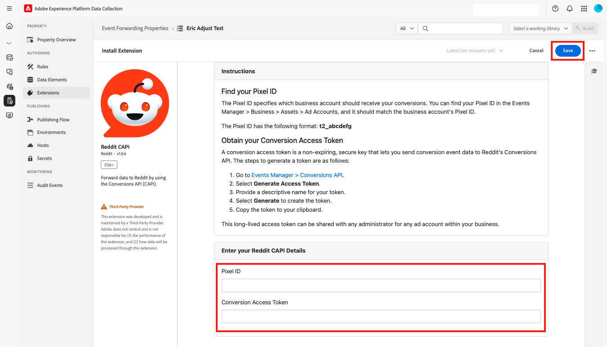

# Panoramica dell&#39;estensione API Conversions [!DNL Reddit]

Reddit è una piattaforma di social media con una base di utenti diversificata, che la rende ideale per gli inserzionisti che si rivolgono a tipi di pubblico specifici.

Utilizza l&#39;estensione API [[!DNL Reddit] Conversions](https://ads-api.reddit.com/docs/v2/#tag/Conversions-API) per inviare a [!DNL Reddit Ads] gli eventi di interazione utente acquisiti in Adobe Experience Platform Edge Network. Utilizza questa estensione per aiutare il tuo marchio a raggiungere un pubblico di oltre 379 milioni di utenti attivi ogni settimana, comprendere meglio il comportamento degli utenti ed eseguire annunci pubblicitari mirati.

Leggi questa guida per scoprire come installare, configurare e utilizzare l&#39;estensione API per le conversioni di [!DNL Reddit] nell&#39;inoltro degli eventi [rules](https://experienceleague.adobe.com/en/docs/experience-platform/tags/ui/rules).

## Vantaggi chiave {#benefits}

Utilizza l’estensione API Reddit Conversions per:

- **Rivolgiti al tuo pubblico**: interagisci con oltre 379 milioni di utenti attivi ogni settimana su [!DNL Reddit].
- **Analizzare il comportamento dell&#39;utente**: sfrutta i dati di interazione dell&#39;utente per comprendere il comportamento e ottimizzare le campagne.
- **Distribuisci annunci mirati**: esegui annunci personalizzati in base alle interazioni utente acquisite in Adobe Experience Platform.

## Prerequisiti {#prerequisites}

Per utilizzare questa estensione, è necessario disporre di un account Reddit Ads valido. Vai alla [[!DNL Reddit Ads] pagina di registrazione](https://business.reddithelp.com/s/article/Create-and-manage-your-Reddit-Ads-account) per registrarti e creare un account, se non ne hai già uno. Dopo aver configurato l&#39;account, [richiedi l&#39;accesso all&#39;API Ads](https://www.redditforbusiness.com/api-partnership).

### Raccogliere i dettagli di configurazione richiesti {#configuration-details}

Per connettere Experience Platform a [!DNL Reddit], sono necessari i seguenti input:

| Credenziali | Descrizione | Esempio |
| --- | --- | --- |
| ID pixel | L&#39;ID pixel è un identificatore univoco associato al tuo account [!DNL Reddit Ads]. Viene utilizzato per monitorare le interazioni dell’utente e gli eventi di conversione sul sito web o sull’app. Puoi trovare il tuo Pixel ID nel tuo [!DNL Reddit Ads] [account](https://ads.reddit.com/accounts). | 123456789012 |
| Token di accesso alla conversione | Il Token Di Accesso Per La Conversione [!DNL Reddit]. Consulta il documento [[!DNL Reddit] Conversions API](https://business.reddithelp.com/s/article/conversion-access-token) per maggiori informazioni.   **È necessario eseguire questo processo solo una volta, poiché il token non scade.** | {YOUR_REDDIT_BEARER_TOKEN} |

## Installa e configura l&#39;estensione [!DNL Reddit] {#install-configure}

Per installare e configurare l&#39;estensione API per conversioni [!DNL Reddit], eseguire la procedura seguente:

1. Nell&#39;interfaccia utente di Experience Platform Data Collection, seleziona [!UICONTROL Estensioni] dalla navigazione a sinistra per accedere al catalogo [!UICONTROL Estensioni]. Quindi [Crea una nuova proprietà di inoltro eventi](https://experienceleague.adobe.com/en/docs/experience-platform/tags/event-forwarding/overview#properties) o seleziona una proprietà esistente.
2. Passa a **[!UICONTROL Estensioni]** nel pannello di navigazione a sinistra. Selezionare **[!UICONTROL Catalogo]**, quindi selezionare l&#39;estensione **[!DNL Reddit]**.
   
3. Fornisci i seguenti dettagli di configurazione:
   - **ID pixel**: immettere l&#39;ID [!DNL Reddit Ads] pixel.
   - **Token di accesso di conversione**: immetti il token generato nell&#39;account [!DNL Reddit Ads] e al termine seleziona **[!UICONTROL Salva]**.
     

## Configurare una regola di inoltro degli eventi {#config-rule}

Dopo aver configurato gli elementi dati, creare regole di inoltro degli eventi per determinare quando e come gli eventi vengono inviati a [!DNL Reddit Ads].

1. Passa a **Regole** nella proprietà di inoltro eventi e crea una nuova [regola](https://experienceleague.adobe.com/en/docs/experience-platform/tags/ui/rules).
2. In **Azioni**, aggiungi una nuova azione e imposta l&#39;estensione su **[!DNL Reddit CAPI]**.
3. Imposta **Tipo azione** su **Invia evento**.
   
4. Configura i controlli aggiuntivi per l’evento, come illustrato nella tabella seguente:

   | Nome campo | Descrizione | Esempio |
   | --- | --- | --- |
   | `Event Name` | Specifica il nome dell’evento di conversione. | `Purchase` |
   | `Event Type` | Definisci il tipo di evento che può essere un [evento di conversione supportato da Reddit](https://business.reddithelp.com/s/article/supported-conversion-events#supported-conversion-events) o uno personalizzato. | `SignUp`, `MyCustomEvent` |
   | `Timestamp` | Specifica l’ora dell’evento in formato ISO o epoca. | `2025-04-15T16:01:00.000Z`, `1744742460000` |
   | `Client Dedupe ID` | Aggiungi un ID univoco per la deduplicazione. | `abc123` |
   | `Match Keys` | Includi identificatori utente e dispositivo per l’attribuzione. | `{"email":"hashed_email@example.com", "phone":"hashed_phone"}` |
   | `Value` | Specifica il valore monetario dell’evento. | `99.99` |
   | `Currency Code` | Utilizza il formato ISO-4217 per la valuta. | `USD` |
   | `Units Sold` | Inserire la quantità di articoli acquistati. | `3` |
   | `Country Code` | Specifica il paese in cui si è verificato l’evento. | `US` |
   | `Data Processing Options` | Aggiungi i flag di privacy, ad esempio LDU (Limited Data Usage). | `{"modes":["LDU"],"country":"US","region":"US-NY"}` |
   | `Consent` | Indica il consenso dell’utente per l’utilizzo dei dati pubblicitari. | `true` |

5. Seleziona **Mantieni modifiche** per salvare la regola.

## Metadati evento {#event-metadata}

Leggi questa sezione per una suddivisione dettagliata dei metadati dell’evento e dei campi dei dati utente, in modo da comprendere i parametri obbligatori e facoltativi per la configurazione degli eventi. I campi visualizzati possono variare a seconda del tipo di evento selezionato.

>[!NOTE]
>
>Per ottenere i migliori risultati dagli eventi di conversione, assicurati di compilare tutti i campi durante la configurazione di [annunci di prodotto dinamici](https://business.reddithelp.com/s/article/dynamic-product-ads).

### Campi metadati evento

| Nome campo | Descrizione | Esempio |
| --- | --- | --- |
| `Conversion ID` (obbligatorio) | ID univoco dell’evento di conversione, utilizzato per la deduplicazione. | `abc123` |
| `Item Count` | Numero totale di elementi per l&#39;evento di conversione. | `6` |
| `Currency` | Viene fornita la valuta per il valore, nel formato [ISO-4217](https://www.iso.org/iso-4217-currency-codes.html). | `USD` |
| `Value` | Il valore monetario totale dell’evento di conversione, inclusi i decimali. | `1.23` |
| `Products` | Array JSON di oggetti con dettagli sui prodotti associati all’evento. Ogni oggetto deve includere almeno `id`. | `[{"id":"SKU123","name":"ProductName","category":"CategoryName"},{"id":"SKU456","name":"ProductName","category":"CategoryName"}]` |

### Campi dati utente

I seguenti parametri sono facoltativi ma consigliati:

| Nome campo | Descrizione | Esempio |
| --- | --- | --- |
| `Email` (consigliato) | E-mail utente con hash o senza hash. | `example@email.com` |
| `External ID` | ID utente assegnato dall&#39;inserzionista con o senza hash. | `customer12345` |
| `UUID` (consigliato) | L’ID generato dal pixel Reddit sul sito web. | `1677712978045.b8f7eb7d-b357-437b-8bd3-e1c8166c7132` |
| `IP Address` (consigliato) | Indirizzo IP del dispositivo dell’utente. | `192.168.0.1` |
| `User Agent` (consigliato) | Il browser o l’app utilizzati dall’utente. | `Chrome/98.0.4758.102` |
| `IDFA` | Identificatore Apple con o senza hash per gli inserzionisti. | `8A2E4F6D-0852-4B2A-B9D5-79334DE14B16` |
| `AAID` | Un ID Advertising di Android con o senza hash. | `38400000-8cf0-11bd-b23e-10b96e40000d` |
| `Screen Width` | Larghezza della visualizzazione dell&#39;utente. | `1920` |
| `Screen Height` | Altezza della visualizzazione dell&#39;utente. | `1080` |
| `Data Processing Options` (formato JSON) | Impostazioni di privacy dell&#39;utente. Supporta solo LDU (Limited Data Usage, utilizzo limitato dei dati). | `{"modes":["LDU"],"country":"US","region":"US-NY"}` |

### Considerazioni importanti

Prima di inviare i dati a [!DNL Reddit Ads], l&#39;estensione esegue l&#39;hash e normalizza i valori dei campi seguenti: `Email`, `External ID`, `IDFA` e `AAID`. L&#39;estensione non esegue il rehash di questi valori se è già stato eseguito l&#39;hashing in [!DNL SHA-256].

## Convalidare e distribuire {#validate-deploy}

Dopo aver configurato l&#39;estensione e le regole, convalida l&#39;integrazione controllando i dati dell&#39;evento in [[!DNL Reddit Ads] Gestione eventi](https://business.reddithelp.com/s/article/Events-Manager). Utilizza [Match Quality Score (MQS)](https://business.reddithelp.com/s/article/match-quality-score) per valutare la precisione e l&#39;affidabilità delle integrazioni di segnali.

Per ulteriori dettagli su [!DNL Reddit Ads], visita la [documentazione di Reddit Ads](https://ads.reddit.com/).

## Passaggi successivi {#next-steps}

Dopo aver letto questo documento, sarai in grado di configurare e utilizzare l&#39;estensione API Conversions di [!DNL Reddit]. Per ulteriori informazioni sulle funzionalità di inoltro degli eventi in Adobe Experience Platform, consulta la [panoramica sull&#39;inoltro degli eventi](../../../ui/event-forwarding/overview.md) o le risorse seguenti:

- [Condividi chiavi di corrispondenza](https://business.reddithelp.com/s/article/about-attribution-matching-signals) e metadati dell&#39;evento : scopri come condividere in modo efficace chiavi di corrispondenza e metadati dell&#39;evento.
- [Deduplica eventi](https://business.reddithelp.com/s/article/event-deduplication): assicurati che il tracciamento degli eventi sia accurato tramite la deduplicazione degli eventi.
- [Creare un token di accesso di conversione](https://business.reddithelp.com/helpcenter/s/article/conversion-access-token): eseguire la procedura seguente per creare un token di accesso di conversione per l&#39;autenticazione API sicura.
