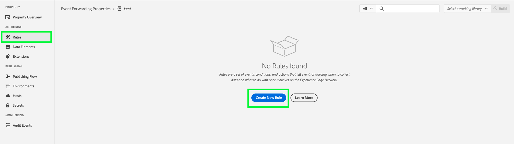

# Panoramica dell&#39;estensione API Conversions [!DNL Snapchat]

L&#39;estensione dell&#39;API di conversione [!DNL Snap] è un&#39;interfaccia protetta dell&#39;[API Edge Network](https://developer.adobe.com/data-collection-apis/docs/) che consente di condividere informazioni con [!DNL Snapchat] direttamente sulle azioni degli utenti sui siti Web. È possibile sfruttare le regole di inoltro degli eventi per inviare dati da **[!DNL Adobe Experience Platform Edge Network]** a **[!DNL Snapchat]** utilizzando l&#39;estensione API di conversione **[!DNL Snap]**.

## [!DNL Snapchat] prerequisiti {#prerequisites}

Per utilizzare l&#39;API di conversione [!DNL Snapchat]:

* In Adobe Experience Platform deve essere impostata una proprietà [Inoltro eventi](/help/tags/ui/event-forwarding/getting-started.md).
* Per modificare la proprietà è inoltre necessario disporre delle [autorizzazioni necessarie](/help/collection/permissions.md).

Crea un [Datastream](/help/tags/ui/event-forwarding/getting-started.md) e aggiungi il [servizio di inoltro eventi](/help/tags/ui/event-forwarding/getting-started.md#enable-event-forwarding).

Per utilizzare l&#39;API di conversione è necessario un account **[!DNL Snapchat]** [Business Manager](https://business.snapchat.com/). Business Manager consente agli inserzionisti di integrare le attività di marketing di **[!DNL Snapchat]** nella propria azienda e con partner esterni. Consulta l&#39;**[!DNL Snapchat]** [articolo del Centro assistenza](https://businesshelp.snapchat.com/s/article/get-started?language=en_US) sulla creazione di un account di Business Manager, se non ne hai uno.

È necessario configurare [[!DNL [Snap Pixel]]](https://businesshelp.snapchat.com/s/article/pixel-website-install?language=en_US) in Gestione annunci di Snapchat e disporre dell&#39;accesso per visualizzare `Pixel ID`. Il `Pixel ID` si trova nella sezione [[!UICONTROL [Gestione eventi]]](https://businesshelp.snapchat.com/s/article/events-manager?language=en_US).

È necessario un token API statico e di lunga durata. Per ottenere questo token, consulta la [[!DNL Snapchat] documentazione sulle conversioni API](https://developers.snap.com/api/marketing-api/Conversions-API/GetStarted#access-token).

## Installa e configura l&#39;estensione API per eventi Web [!DNL Snapchat] {#install}

Per installare l&#39;estensione, passa a **[!UICONTROL Raccolta dati]**>**[!UICONTROL Inoltro eventi]**. Seleziona la proprietà in cui desideri installare l&#39;estensione.

Dopo aver selezionato la proprietà desiderata, effettua le seguenti operazioni:

1. Nel pannello di navigazione a sinistra, seleziona **[!UICONTROL Estensioni]**.
2. Cerca l&#39;estensione **[!UICONTROL Snap Conversion API]** e seleziona **[!UICONTROL Install]**.

   

3. Nella schermata di configurazione, inserisci i seguenti valori:

* **[!UICONTROL ID pixel]**
* **[!UICONTROL Token API]**

Al termine, selezionare **[!UICONTROL Salva]**.


<!-- 
![[!DNL Snap] configuration screen for the [!DNL Snap] conversion API extension.](../../../images/extensions/server/snap/configure.png) -->

## Creare elementi dati {#create-data-elements}

Per inviare dati all&#39;estensione API per conversioni [!DNL Snapchat], creare [elementi dati](https://experienceleague.adobe.com/it/docs/platform-learn/implement-web-sdk/event-forwarding/setup-event-forwarding#create-an-event-forwarding-data-element) per ogni parametro dati. Segui questi passaggi:

1. Passa a **[!UICONTROL Authoring]**>**[!UICONTROL Elementi dati]** nella schermata **[!UICONTROL Informazioni proprietà]** della tua proprietà, quindi seleziona **[!UICONTROL Aggiungi elemento dati]**.

   

2. Immetti un nome per l’elemento dati.

3. Seleziona **[!UICONTROL Core]** come estensione e **[!UICONTROL Path]** come tipo di elemento dati.

4. Dal menu a discesa, seleziona l&#39;elemento appropriato e compila il campo [!UICONTROL Percorso] nel pannello a destra per fare riferimento ai dati desiderati nello schema.

   

Ad esempio, se crei un elemento dati che fa riferimento a `snapClickId` nello schema mostrato di seguito:


È necessario configurare l&#39;elemento dati perché `snapClickId` si trova in `_snap.inc.exchange` nello schema XDM.


Per ulteriori informazioni sulla creazione di elementi dati, consulta la [documentazione sulle proprietà di Inoltro eventi](/help/tags/ui/event-forwarding/overview.md#data-elements).

## Creare regole per inviare eventi di conversione a Snap {#create-snap-rules}

[Le regole](https://experienceleague.adobe.com/it/docs/platform-learn/implement-web-sdk/event-forwarding/setup-event-forwarding#create-an-event-forwarding-rule) vengono utilizzate per attivare le estensioni in Experience Platform. Questa sezione illustra come creare regole all’interno della proprietà di inoltro degli eventi per inviare eventi di conversione a Snap utilizzando l’estensione API Conversioni.

### Crea una nuova regola

1. Passa alla proprietà di inoltro degli eventi e seleziona **[!UICONTROL Regole]** dal menu Creazione. Quindi, fai clic su **[!UICONTROL Crea nuova regola]**.

   

2. Denomina la regola e configura una condizione per attivare l&#39;evento Snap. Ad esempio, per inviare un evento `PURCHASE` ogni volta che un evento include un numero di ordine, impostare una condizione per verificare se l&#39;interazione utente contiene un numero di ordine di acquisto valido.

   

3. Dopo aver salvato la condizione, aggiungi un’azione per attivare l’API di conversione snap. Nel pannello a sinistra:

   * Impostare il menu a discesa [!UICONTROL Estensione] su [!UICONTROL Estensione API per conversioni snap].

   * Imposta il menu a discesa [!UICONTROL Tipo azione] su [!UICONTROL Report Web Conversions].

   * Denomina la regola di conseguenza.

   

4. Configura i [valori dei parametri CAPI](https://developers.snap.com/api/marketing-api/Conversions-API/Parameters) che desideri inviare per l&#39;evento nella sezione **[!UICONTROL Data Bindings]** nel pannello a destra. I campi nell’estensione vengono mappati sui parametri CAPI, come illustrato di seguito. Per ulteriori informazioni su ciascun parametro, consulta la [documentazione dell&#39;API Conversioni Snapchat](https://developers.snap.com/api/marketing-api/Conversions-API/Parameters).

| Campo di associazione dati | Parametro Snap CAPI |
| --- | --- |
| Tipo evento (obbligatorio) | `event_name` |
| E-mail | `em` |
| Numero di telefono | `ph` |
| Agente utente | `client_user_agent` |
| Indirizzo IP | `client_ip_address` |
| ID clic | `sc_click_id` |
| Cookie1 | `so_cookie1` |
| Nome | `fn` |
| Cognome | `ln` |
| Genere | `ge` |
| Città | `ph` |
| Stato | `st` |
| ZIP | `zp` |
| Paese | `country` |
| ID esterno | `external_id` |
| ID partner | `partner_id` |
| ID abbonamento | `subscription_id` |
| ID lead | `lead_id` |
| Articolo o categoria | `content_category` |
| Nome contenuto | `content_ids` |
| Tipo di contenuto | `content_name` |
| Sommario | `contents` |
| Descrizione | `description` |
| Tag evento | `event_tag` |
| Numero di elementi | `num_items` |
| Prezzo | `value` |
| Valuta | `currency` |
| ID transazione | `order_id` (inviato anche per `event_id` invece di `client dedup idD`) |
| LTV previsto | `predicted_ltv` |
| Stringa di ricerca | `search_string` |
| Metodo di registrazione | `sign_up_method` |
| ID deduplicazione client | `event_id` |
| Utilizzo limitato dei dati | `data_processing_options` |
| URL pagina | `event_source_url` |

{style="table-layout:auto"}

### Campi obbligatori e facoltativi

Ogni evento richiede `event_source`, che è sempre impostato su `WEB.` Per la corrispondenza, è necessario almeno uno dei seguenti campi o combinazioni:

* E-mail
* Numero di telefono
* Indirizzo IP e agente utente

**Note aggiuntive:**

* Per gli eventi `Purchase`, i campi `Currency` e `Price` sono obbligatori.

* Se si attiva la casella di controllo **[!UICONTROL Modalità test]**, gli eventi vengono inviati come eventi di test, visualizzati nello strumento degli eventi di test anziché nel reporting standard. Per ulteriori dettagli, consulta questo [articolo del centro assistenza aziendale](https://businesshelp.snapchat.com/s/article/capi-event-testing?language=en_US#:~:text=Snap&#39;s%20Conversions%20API%20(CAPI)%20Test,being%20processed%20as%20production%20results.).

* Il parametro `contents` deve essere una stringa JSON contenente almeno uno dei seguenti campi:

   * `id`
   * `item_category`
   * `brand`
   * `delivery_category`
   * `item_price`
   * `quantity`

Esempio:

```json
{
  "id": "id1",
  "brand": "brand1",
  "delivery_category": "c1",
  "item_price": 2.00,
  "quantity": 2
}
```

Per utilizzare il valore di [conversioni personalizzate e il reporting ROAS](https://businesshelp.snapchat.com/s/article/custom-conversions-value-roas?language=en_US), includere i parametri rilevanti nel campo `contents`. Esempio di configurazione per un evento di acquisto: `brand`, `item_price`, `id`.

Esempio di configurazione per un evento `Purchase`:


I campi facoltativi possono essere impostati come illustrato di seguito:


Dopo aver impostato il nome, la condizione e l’azione della regola come descritto sopra, salva la regola e accertati che sia abilitata.


Ora puoi pubblicare queste modifiche nella tua proprietà. Per ulteriori informazioni, consulta la documentazione sul [flusso di pubblicazione](/help/tags/ui/publishing/overview.md).

## Risoluzione dei problemi {#troubleshoot}

Per la risoluzione dei problemi e l&#39;ottimizzazione della configurazione, controlla i [consigli per il punteggio di qualità dell&#39;evento](https://businesshelp.snapchat.com/s/article/event-quality-score) per garantire che gli eventi raggiungano i tassi di corrispondenza e i risultati di prestazioni più elevati possibili.

Se riscontri problemi con il tuo **Punteggio qualità evento**, consulta ulteriori informazioni sui nostri consigli per migliorarlo [qui](https://businesshelp.snapchat.com/s/article/esq-issues-recommendations?language=en_US).

## Passaggi successivi {#next-steps}

Questa guida illustra come inviare dati evento lato server a **[!DNL Snap]** utilizzando l&#39;estensione **[!DNL Snap Conversions API]**. Per ulteriori informazioni sulle funzionalità di inoltro degli eventi in Experience Platform, consulta la [Panoramica sull&#39;inoltro degli eventi](../../../ui/event-forwarding/overview.md).
