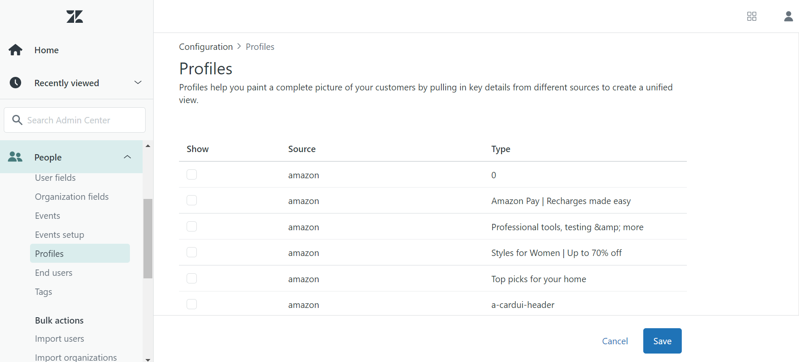

# Panoramica dell&#39;estensione API [!DNL Zendesk] Events

[Zendesk](https://www.zendesk.com) è una soluzione di assistenza clienti e uno strumento di vendita. L&#39;estensione [event forwarding](../../../ui/event-forwarding/overview.md) di Zendesk sfrutta [[!DNL Zendesk Events API]](https://developer.zendesk.com/documentation/ticketing/events/about-the-events-api/) per inviare eventi dall&#39;Edge Network di Adobe Experience Platform a Zendesk per ulteriore elaborazione. Puoi utilizzare l’estensione per raccogliere le interazioni del profilo cliente da utilizzare nell’analisi e nell’azione a valle.

Questo documento illustra come installare e configurare l’estensione nell’interfaccia utente di.

## Prerequisiti

Per utilizzare questa estensione è necessario disporre di un account Zendesk. Puoi registrarti per un account Zendesk sul [sito Web Zendesk](https://www.zendesk.com/register/).

È inoltre necessario raccogliere i seguenti dettagli per la configurazione Zendesk:

| Tipo di chiave | Descrizione | Esempio |
| --- | --- | --- |
| Subdomain | Durante il processo di registrazione, viene creato un **sottodominio** univoco specifico per l&#39;account. Per ulteriori informazioni, consulta la [documentazione di Zendesk](https://developer.zendesk.com/documentation/ticketing/working-with-oauth/creating-and-using-oauth-tokens-with-the-api/). | `xxxxx.zendesk.com` (dove `xxxxx` è il valore fornito durante la creazione dell&#39;account) |
| Token API | Zendesk utilizza token bearer come meccanismo di autenticazione per comunicare con l’API di Zendesk. Dopo aver effettuato l’accesso al portale Zendesk, genera un token API. Per ulteriori informazioni, consulta la [documentazione di Zendesk](https://support.zendesk.com/hc/en-us/articles/4408889192858-Generating-a-new-API-token). | `cwWyOtHAv12w4dhpiulfe9BdZFTz3OKaTSzn2QvV` |

{style="table-layout:auto"}

Infine, devi creare un segreto per l’inoltro degli eventi per il token API. Imposta il tipo segreto su **[!UICONTROL Token]** e imposta il valore sul token API raccolto dalla configurazione Zendesk. Per ulteriori informazioni sulla configurazione dei segreti, consulta la documentazione su [segreti nell&#39;inoltro degli eventi](../../../ui/event-forwarding/secrets.md).

## Installare l’estensione {#install}

Per installare l&#39;estensione Zendesk nell&#39;interfaccia utente, passa a **Inoltro eventi** e seleziona una proprietà a cui aggiungere l&#39;estensione oppure crea una nuova proprietà.

Dopo aver selezionato o creato la proprietà desiderata, passa a **Estensioni** > **Catalogo**. Cercare &quot;[!DNL Zendesk]&quot;, quindi selezionare **[!DNL Install]** nell&#39;estensione Zendesk.

## Configurare l&#39;estensione {#configure}

>[!IMPORTANT]
>
>A seconda delle esigenze di implementazione, potrebbe essere necessario creare uno schema, elementi di dati e un set di dati prima di configurare l’estensione. Prima di iniziare, controlla tutti i passaggi di configurazione per determinare quali entità devi impostare per il tuo caso d’uso.

Seleziona **Estensioni** nel menu di navigazione a sinistra. In **Installato**, seleziona **Configura** nell&#39;estensione Zendesk.

In **[!UICONTROL Dominio Zendesk]**, immetti il valore per il sottodominio Zendesk. In **[!UICONTROL Token Zendesk]**, seleziona il segreto creato in precedenza che contiene il token API.

## Configurare una regola di inoltro degli eventi

Inizia a creare una nuova regola di inoltro eventi [regola](../../../ui/managing-resources/rules.md) e configurane le condizioni come desiderato. Quando selezioni le azioni per la regola, seleziona l&#39;estensione [!UICONTROL Zendesk], quindi seleziona il tipo di azione [!UICONTROL Crea evento].

Quando si imposta la configurazione dell’azione, viene richiesto di assegnare elementi dati alle varie proprietà che verranno inviate a Zendesk.

Questi elementi dati devono essere mappati come indicato di seguito.

### `event` chiavi

`event` è un oggetto JSON che rappresenta l&#39;evento attivato dall&#39;utente. Per ulteriori informazioni sulle proprietà acquisite dall&#39;oggetto `event`, consultare il documento Zendesk sull&#39;[anatomia di un evento](https://developer.zendesk.com/documentation/ticketing/events/anatomy-of-an-event/).

È possibile fare riferimento alle chiavi seguenti all&#39;interno dell&#39;oggetto `event` durante il mapping agli elementi dati:

| Chiave `event` | Tipo | Percorso piattaforma | Descrizione | Obbligatorio | Limiti |
| --- | --- | --- | --- | --- | --- |
| `source` | Stringa | `arc.event.xdm._extconndev.event_source` | Applicazione che ha inviato l&#39;evento. | Sì | Non utilizzare `Zendesk` come valore poiché è un nome di origine protetto per gli eventi standard Zendesk. I tentativi di utilizzarlo genereranno un errore. La lunghezza del valore non deve superare i 40 caratteri. |
| `type` | Stringa | `arc.event.xdm._extconndev.event_type` | Nome per il tipo di evento. È possibile utilizzare questo campo per indicare diversi tipi di eventi per una determinata origine. Ad esempio, puoi creare un set di eventi per gli accessi degli utenti e un altro per i carrelli acquisti. | Sì | La lunghezza del valore non deve superare i 40 caratteri. |
| `description` | Stringa | `arc.event.xdm._extconndev.description` | Descrizione dell&#39;evento. | No | (N/D) |
| `created_at` | Stringa | `arc.event.xdm.timestamp` | Una marca temporale ISO-8601 che riflette l’ora di creazione dell’evento. | No | (N/D) |
| `properties` | Oggetto | `arc.event.xdm._extconndev.EventProperties` | Oggetto JSON personalizzato con dettagli sull’evento. | Sì | (N/D) |

{style="table-layout:auto"}

>[!NOTE]
>
>Per ulteriori informazioni sulle proprietà dell&#39;evento, consultare la [[!DNL Zendesk Events API] documentazione](https://developer.zendesk.com/documentation/ticketing/events/about-the-events-api/).

### `profile` chiavi

`profile` è un oggetto JSON che rappresenta l&#39;utente che ha attivato l&#39;evento. Per ulteriori informazioni sulle proprietà acquisite dall&#39;oggetto `profile`, consultare il documento Zendesk sull&#39;[anatomia di un profilo](https://developer.zendesk.com/documentation/ticketing/profiles/anatomy-of-a-profile/).

È possibile fare riferimento alle chiavi seguenti all&#39;interno dell&#39;oggetto `profile` durante il mapping agli elementi dati:

| Chiave `profile` | Tipo | Percorso piattaforma | Descrizione | Obbligatorio | Limiti |
| --- | --- | --- | --- | --- | --- |
| `source` | Stringa | `arc.event.xdm._extconndev.profile_source` | Prodotto o servizio associato al profilo, ad esempio `Support`, `CompanyName` o `Chat`. | Sì | (N/D) |
| `type` | Stringa | `arc.event.xdm._extconndev.profile_type` | Nome per il tipo di profilo. Puoi utilizzare questo campo per creare diversi tipi di profili per una determinata origine. Ad esempio, puoi creare un set di profili aziendali per i clienti e un altro per i dipendenti. | Sì | La lunghezza del tipo di profilo non deve superare i 40 caratteri. |
| `name` | Stringa | `arc.event.xdm._extconndev.name` | Nome della persona dal profilo | No | (N/D) |
| `user_id` | Stringa | `arc.event.xdm._extconndev.user_id` | ID utente della persona in Zendesk. | No | (N/D) |
| `identifiers` | Array | `arc.event.xdm._extconndev.identifiers` | Matrice contenente almeno un identificatore. Ogni identificatore è costituito da un tipo e da un valore. | Sì | Per ulteriori informazioni sull&#39;array `identifiers`, consultare la [documentazione di Zendesk](https://developer.zendesk.com/api-reference/ticketing/users/profiles_api/profiles_api/#identifiers-array). Tutti i campi e i valori devono essere univoci. |
| `attributes` | Oggetto | `arc.event.xdm._extconndev.attrbutes` | Oggetto contenente le proprietà definite dall’utente sulla persona. | No | Per ulteriori informazioni sugli attributi del profilo, consulta la [documentazione di Zendesk](https://developer.zendesk.com/documentation/ticketing/profiles/anatomy-of-a-profile/#attributes). |

{style="table-layout:auto"}

## Convalidare i dati in Zendesk {#validate}

Se la raccolta di eventi e l’integrazione di Adobe Experience Platform hanno esito positivo, gli eventi all’interno della console Zendesk dovrebbero apparire come mostrato di seguito. Ciò indica un’integrazione riuscita.

Profili:

Eventi:

## Limiti di richieste {#limits}

In base al tipo di account, Zendesk [!DNL Events API] è in grado di gestire il seguente numero di richieste al minuto:

| [!DNL Account Type] | Richieste al minuto |
| --- | --- |
| [!DNL Team] | 250 |
| [!DNL Growth] | 250 |
| [!DNL Professional] | 500 |
| [!DNL Enterprise] | 750 |
| [!DNL Enterprise Plus] | 1000 |

{style="table-layout:auto"}

Per ulteriori informazioni su questi limiti, consulta la [documentazione di Zendesk](https://developer.zendesk.com/api-reference/ticketing/account-configuration/usage_limits/#:~:text=API%20requests%20made%20by%20Zendesk%20apps%20are%20subject,sources%20for%20the%20account%2C%20including%20internal%20product%20requests.).

## Errori e risoluzione problemi {#errors-and-troubleshooting}

Durante l’utilizzo o la configurazione dell’estensione, l’API degli eventi Zendesk potrebbe restituire gli errori seguenti:

| Codice di errore | Descrizione | Risoluzione | Esempio |
|---|---|---|---|
| 400 | **Lunghezza profilo non valida:** Questo errore si verifica quando la lunghezza di un attributo di profilo contiene più di 40 caratteri. | Limita la lunghezza dei dati dell’attributo del profilo a un massimo di 40 caratteri. | `{"error": [{"code":"InvalidProfileTypeLength","title": "Profile type length > 40 chars"}]}` |
| 401 | **Route non trovata:** Questo errore si verifica quando è stato fornito un dominio non valido. | Verificare che sia fornito un dominio valido nel seguente formato: `{subdomain}.zendesk.com` | `{"error": [{"description": "No route found for host {subdomain}.zendesk.com","title": "RouteNotFound"}]}` |
| 401 | **Autenticazione non valida o mancante:** Questo errore si verifica quando l&#39;accesso al token non è valido, è mancante o è scaduto. | Verifica che il token di accesso sia valido e non sia scaduto. | `{"error": [{"code":"MissingOrInvalidAuthentication","title": "Invalid or Missing Authentication"}]}` |
| 403 | **Autorizzazioni insufficienti:** Questo errore si verifica quando non sono state fornite autorizzazioni sufficienti per accedere alla risorsa. | Verifica che siano state fornite le autorizzazioni necessarie. | `{"error": [{"code":"PermissionDenied","title": "Insufficient permisssions to perform operation"}]}` |
| 429 | **Troppe richieste:** Questo errore si verifica quando viene superato il limite di record dell&#39;oggetto endpoint. | Per informazioni sulle soglie per limite, consulta la sezione precedente sui [limiti di richiesta](#limits). | `{"error": [{"code":"TooManyRequests","title": "Too Many Requests"}]}` |

{style="table-layout:auto"}

## Passaggi successivi

Questo documento illustra come installare e configurare l’estensione di inoltro degli eventi Zendesk nell’interfaccia utente. Per ulteriori informazioni sulla raccolta dei dati sull’evento in Zendesk, consulta la documentazione ufficiale:

* [Guida introduttiva agli eventi](https://developer.zendesk.com/documentation/ticketing/events/getting-started-with-events/)
* [API eventi Zendesk](https://developer.zendesk.com/api-reference/ticketing/users/events-api/events-api/)
* [Informazioni sull&#39;API degli eventi](https://developer.zendesk.com/documentation/ticketing/events/about-the-events-api/)
* [Anatomia di un evento](https://developer.zendesk.com/documentation/ticketing/events/anatomy-of-an-event/)
* [API profili Zendesk](https://developer.zendesk.com/api-reference/ticketing/users/events-api/events-api/#profile-object)
* [Informazioni sull&#39;API dei profili](https://developer.zendesk.com/documentation/ticketing/profiles/about-the-profiles-api/)
* [Anatomia di un profilo](https://developer.zendesk.com/documentation/ticketing/profiles/anatomy-of-a-profile/)
