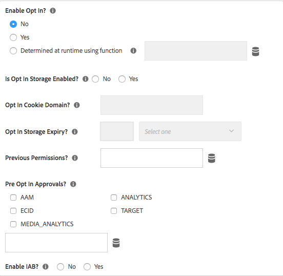
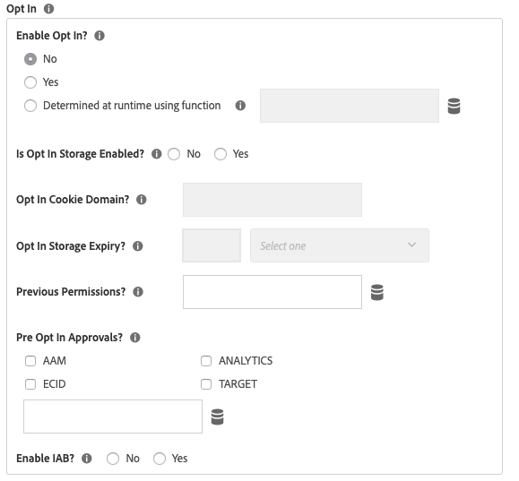

# Note sulla versione dell’estensione Adobe Experience Cloud Identity Service

>[!NOTE]
>
>Adobe Experience Platform Launch è stato classificato come una suite di tecnologie di raccolta dati in Adobe Experience Platform. Di conseguenza, sono state introdotte diverse modifiche terminologiche nella documentazione del prodotto. Consulta questo [documento](../../../term-updates.md) come riferimento consolidato delle modifiche terminologiche.

Per le note sulla versione del servizio Experience Cloud Identity Service stesso e non solo sull’estensione tag per Adobe Experience Platform, visita: [https://experienceleague.adobe.com/docs/id-service/using/release-notes/release-notes.html?lang=it](https://experienceleague.adobe.com/docs/id-service/using/release-notes/release-notes.html?lang=it)

## 3 novembre 2021

### Estensione Experience Cloud ID 5.2.1

#### **Funzioni**

* Questa patch contiene una correzione per la scrittura di cookie da un iFrame con attributo `SameSite=None` nel browser Google Chrome.

## 12 gennaio 2021

### Estensione Experience Cloud ID 5.2.0

#### **Funzioni**

* La patch VisitorJS 5.2.0 è stata aggiornata per correggere un problema a causa del quale ECID DataElement non veniva aggiornato dopo la ricezione del consenso.

## 27 ottobre 2020

### Estensione Experience Cloud ID 5.1.0

#### **Funzioni**

* Aggiunta della configurazione `sameSiteCookie` per specificare l’attributo `SameSite` del cookie `AMCV`. La configurazione supporta i seguenti valori per l’attributo `SameSite`:

   * `Strict`
   * `Lax`
   * `None`

I dettagli dei valori dell’attributo sono reperibili su [web.dev](https://web.dev/samesite-cookies-explained/) e [chromium](https://www.chromium.org/updates/same-site)

## 13 agosto 2020

### Estensione Experience Cloud ID 5.0.1

#### **Funzioni**

* Aggiornamento alla patch VisitorJS 5.0.1 con una correzione per aggiungere il flag d_cf quando cambia la stringa di consenso IAB.

## 15 giugno 2020

### Estensione Experience Cloud ID 5.0.0

#### **Funzioni**

* È stato aggiunto supporto per `IAB TCF` (Transparency and Consent Framework) `Version 2.0`.

## 13 aprile 2020

### Estensione Experience Cloud ID 4.6.0

#### **Funzioni**

* È stato impostato il flag `loadSSL` per impostazione predefinita. Tutte le chiamate al servizio identità sono impostate su `https` per impostazione predefinita. I clienti possono impostarlo su false se desiderano chiamare i servizi identità su HTTP dalle proprie pagine non SSL.
* È stata aggiornata la funzione utilizzata per rilevare la versione di Internet Explorer (IE) per risolvere un problema segnalato da ESLint.
* Sono stati corretti i bug per un problema di prestazioni in Internet Explorer (IE) 11 in caso di pre-approvazione del consenso ECID e successivo aggiornamento.

## 22 gennaio 2020

### Estensione Experience Cloud ID 4.5.2

#### **Funzioni**

* Aggiornamento visitor.js a 4.5.2
* Il visitatore 4.5.1 include una correzione di bug per il plug-in IAB per l’opzione opt-in
* È stato aggiornato il metodo `setCustomerIDs` per rifiutare gli ID vuoti inviati.

## 7 gennaio 2020

### Estensione Experience Cloud ID 4.4.2

#### **Funzioni**

* Aggiornamento visitor.js a 4.4.2
* È stato migliorato il metodo `getVisitorValues` per recuperare più rapidamente i valori.

## 19 settembre 2019

### Estensione Experience Cloud ID 4.4.1

#### **Funzioni**

* Aggiornamento visitor.js a 4.4.1
* È stato corretto un bug per ottenere il consenso di input di pre-approvazione
* VIDEO_ANALYTICS rinominato in MEDIA_ANALYTICS in preOptInApprovals

   

## 17 luglio 2019

### Estensione Experience Cloud ID 4.4.0

#### **Funzioni**

* Aggiornamento visitor.js a 4.4.0
* Aggiunto supporto di hashing SHA-256 per setCustomerIDs

   

## 13 maggio 2019

### Estensione Experience Cloud ID 4.3.1

#### **Funzioni**

* Aggiornamento visitor.js a 4.3
* È stato aggiunto tipo di elemento dati per ECID come parte dell’estensione tag.

   

## 9 aprile 2019

### Estensione Experience Cloud ID 4.2.0

#### **Funzioni**

* Aggiornamento visitor.js a 4.2 che include il supporto per il plug-in IAB TCF di Audience Manager.

## 25 febbraio 2019

### Estensione Experience Cloud ID 4.1.0

#### **Funzioni**

* Aggiornato visitor.js a 4.1, che aggiornava publishDestinations in base alla nuova modifica API. Con questo aggiornamento le informazioni della pagina possono essere esposte durante la sincronizzazione ID, se si desidera.

## 15 febbraio 2019

### Estensione Experience Cloud ID 4.0.0

#### **Funzioni**

* Aggiornamento visitor.js a 4.0
* Sono state aggiunte opzioni di configurazione per il nuovo oggetto opt-in integrato. Le impostazioni Opt-In possono essere utilizzate per sopprimere cookie e le chiamate beacon di Adobe Solutions per supportare meglio normative come il RGPD.

   

## 20 marzo 2018

### Estensione Experience Cloud ID 3.1.0

#### **Funzioni**

* Aggiornamento visitor.js a 3.1
* Aggiunge due proprietà di configurazione: `resetBeforeVersion` e `serverState`.
