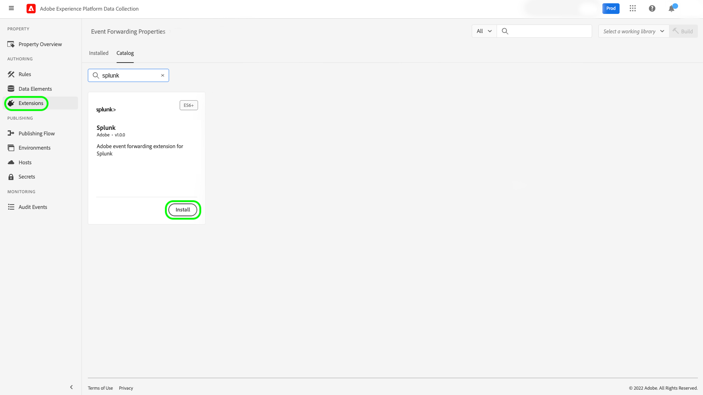

# Panoramica dell&#39;estensione Splunk

[Splunk](https://www.splunk.com) è una piattaforma di osservabilità che offre funzioni di ricerca, analisi e visualizzazione per informazioni fruibili sui dati. Lo splunk [inoltro eventi](../../../ui/event-forwarding/overview.md) sfrutta [API REST dell’agente di raccolta eventi HTTP Splunk](https://docs.splunk.com/Documentation/Splunk/8.2.5/Data/HECRESTendpoints) per inviare eventi da Adobe Experience Platform Edge Network a [Raccoglitore eventi HTTP Splunk](https://docs.splunk.com/Documentation/Splunk/8.2.5/Data/UsetheHTTPEventCollector).

Splunk utilizza i token portatori come meccanismo di autenticazione per comunicare con l’API Splunk Event Collector.

## Casi d’uso {#use-cases}

I team di marketing possono utilizzare l’estensione per i seguenti casi d’uso:

| Caso d’uso | Descrizione |
| --- | --- |
| Analisi del comportamento dei clienti | Le organizzazioni possono acquisire i dati dell’evento di interazione del cliente dal proprio sito web e inoltrare gli eventi rilevanti a Splunk. I team di marketing e analisi possono quindi eseguire analisi successive all’interno della piattaforma Splunk per comprendere le interazioni e il comportamento chiave degli utenti. La piattaforma Splunk può essere utilizzata per generare grafici, dashboard o altre visualizzazioni per informare le parti interessate. |
| Ricerca scalabile su set di dati di grandi dimensioni | Le organizzazioni possono acquisire input transazionali o conversazionali come dati evento dal sito web e inoltrare gli eventi a Splunk. I team di Analytics possono quindi sfruttare le capacità di indicizzazione scalabile di Splunk per filtrare ed elaborare set di dati di grandi dimensioni in modo da ricavare qualsiasi insights aziendale e prendere decisioni informate. |

{style=&quot;table-layout:auto&quot;}

## Prerequisiti {#prerequisites}

Per utilizzare questa estensione è necessario disporre di un account Splunk. È possibile registrarsi per un account Splunk nel [Homepage Splunk](https://www.splunk.com/page/sign_up).

>[!NOTE]
>
> L’estensione Splunk supporta sia le istanze di Splunk Cloud che di Splunk enterprise. Questa guida documenta un’implementazione utilizzando [Splunk Cloud](https://www.splunk.com/en_us/products/splunk-cloud-platform.html) come riferimento. Il processo di configurazione per [Splunk Enterprise](https://www.splunk.com/en_us/products/splunk-enterprise.html) è simile, ma richiede indicazioni specifiche da parte dell’amministratore Splunk Enterprise.

Per configurare l&#39;estensione è inoltre necessario disporre dei seguenti valori tecnici:

* Un [Token dell’agente di raccolta eventi](https://docs.splunk.com/Documentation/Splunk/8.2.5/Data/UsetheHTTPEventCollector#Create_an_Event_Collector_token_on_Splunk_Cloud_Platform). I token in genere sono in formato UUIDv4 come segue: `12345678-1234-1234-1234-1234567890AB`.
* Indirizzo e porta dell&#39;istanza della piattaforma Splunk per la tua organizzazione. Un indirizzo e una porta di istanza della piattaforma avranno in genere il seguente formato: `mysplunkserver.example.com:443`.
   >[!IMPORTANT]
   >
   > Gli endpoint Splunk a cui si fa riferimento all&#39;interno dell&#39;inoltro eventi devono utilizzare solo la porta `443`. Le porte non standard non sono attualmente supportate nelle implementazioni di inoltro eventi.

## Installa l&#39;estensione Splunk {#install}

Per installare l’estensione Splunk Event Collector nell’interfaccia utente, passa a **Inoltro eventi** e seleziona una proprietà a cui aggiungere l&#39;estensione oppure crea una nuova proprietà.

Dopo aver selezionato o creato la proprietà desiderata, passa a **Estensioni** > **Catalogo**. Cerca &quot;[!DNL Splunk]&quot;, quindi seleziona **[!DNL Install]** nell’estensione Splunk.

## Configura l’estensione Splunk {#configure_extension}

>[!IMPORTANT]
>
>A seconda delle esigenze di implementazione, potrebbe essere necessario creare uno schema, elementi dati e un set di dati prima di configurare l’estensione. Controlla tutti i passaggi di configurazione prima di iniziare per determinare quali entità devi impostare per il tuo caso d’uso.

Seleziona **Estensioni** nella navigazione a sinistra. Sotto **Installato**, seleziona **Configura** sull’estensione Splunk.

Per **[!UICONTROL URL raccolta eventi HTTP]**, immetti l’indirizzo e la porta dell’istanza della piattaforma Splunk. Sotto **[!UICONTROL Token di accesso]**, inserisci il [!DNL Event Collector Token] valore. Al termine, seleziona **[!UICONTROL Salva]**.

## Configurare una regola di inoltro eventi {#config_rule}

Avvia la creazione di una nuova regola di inoltro eventi [regola](../../../ui/managing-resources/rules.md) e configurane le condizioni desiderate. Quando selezioni le azioni per la regola, seleziona la [!UICONTROL Splunk] , quindi seleziona la [!UICONTROL Crea evento] tipo di azione. Vengono visualizzati controlli aggiuntivi per configurare ulteriormente l&#39;evento Splunk.

Il passaggio successivo consiste nel mappare le proprietà dell’evento Splunk agli elementi dati creati in precedenza. Di seguito sono riportate le mappature facoltative supportate basate sui dati dell’evento di input che è possibile impostare. Fai riferimento a [Documentazione di Splunk](https://docs.splunk.com/Documentation/Splunk/8.2.5/Data/FormateventsforHTTPEventCollector#Event_metadata) per ulteriori dettagli.

| Nome campo | Descrizione |
| --- | --- |
| [!UICONTROL Evento ]  **(OBBLIGATORIO)** | Indica come desideri fornire i dati dell’evento. I dati dell’evento possono essere assegnati al `event` all’interno dell’oggetto JSON nella richiesta HTTP, oppure può essere testo non elaborato. La `event` key si trova allo stesso livello all&#39;interno del pacchetto di eventi JSON delle chiavi di metadati. All&#39;interno di `event` parentesi graffe con valore chiave, i dati possono essere in qualsiasi modulo richiesto (ad esempio una stringa, un numero, un altro oggetto JSON e così via). |
| [!UICONTROL Host] | Il nome host del client da cui stai inviando i dati. |
| [!UICONTROL Tipo di origine] | Il tipo di origine da assegnare ai dati dell&#39;evento. |
| [!UICONTROL Origine] | Il valore di origine da assegnare ai dati dell’evento. Ad esempio, se invii dati da un’app in fase di sviluppo, imposta questa chiave sul nome dell’app. |
| [!UICONTROL Indice] | Nome dell&#39;indice dei dati dell&#39;evento. L&#39;indice qui specificato deve trovarsi all&#39;interno dell&#39;elenco degli indici consentiti se per il token è impostato il parametro indexes. |
| [!UICONTROL Tempo] | Ora dell’evento. Il formato ora predefinito è UNIX (nel formato `<sec>.<ms>`) e dipende dal fuso orario locale. Ad esempio: `1433188255.500` indica 1433188255 secondi e 500 millisecondi dopo epoch, o lunedì 1 giugno 2015, a 7:50:55 GMT. |
| [!UICONTROL Campi] | Specifica un oggetto JSON non elaborato o un set di coppie chiave-valore contenenti campi personalizzati espliciti da definire in fase di indice.  La `fields` la chiave non è applicabile ai dati non elaborati.  Richieste contenenti `fields` deve essere inviata al `/collector/event` o non verranno indicizzati. Per ulteriori informazioni, consulta la documentazione su [estrazioni dei campi indicizzati](https://docs.splunk.com/Documentation/Splunk/8.2.5/Data/IFXandHEC). |

### Convalidare i dati in Splunk {#validate}

Dopo aver creato ed eseguito la regola di inoltro dell’evento, verifica se l’evento inviato all’API Splunk viene visualizzato come previsto nell’interfaccia utente di Splunk. Se la raccolta di eventi e l’integrazione di Experienci Platform hanno avuto successo, gli eventi nella console Splunk saranno visualizzati in questo modo:

## Passaggi successivi

Questo documento illustra come installare e configurare l&#39;estensione di inoltro eventi Splunk nell&#39;interfaccia utente. Per ulteriori informazioni sulla raccolta dei dati evento in Splunk, consulta la documentazione ufficiale:

* [Configurare e utilizzare l’agente di raccolta eventi HTTP in Splunk Web ](https://docs.splunk.com/Documentation/Splunk/8.2.5/Data/UsetheHTTPEventCollector)
* [Configurare l’autenticazione con i token](https://docs.splunk.com/Documentation/Splunk/8.2.5/Security/Setupauthenticationwithtokens#Prerequisites_for_activating_tokens)
* [Risolvere i problemi relativi al servizio di raccolta eventi HTTP](https://docs.splunk.com/Documentation/Splunk/8.2.5/Data/TroubleshootHTTPEventCollector) (elenca anche un compendio di [possibili codici di errore](https://docs.splunk.com/Documentation/Splunk/8.2.5/Data/TroubleshootHTTPEventCollector#Possible_error_codes))
