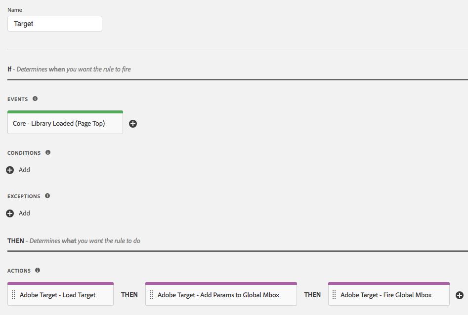

# Panoramica dell’estensione Adobe Target

>[!NOTE]
>
>Adobe Experience Platform Launch è stato classificato come una suite di tecnologie di raccolta dati in Adobe Experience Platform. Di conseguenza, sono state introdotte diverse modifiche terminologiche nella documentazione del prodotto. Consulta questo [documento](../../../term-updates.md) come riferimento consolidato delle modifiche terminologiche.

Utilizza questo riferimento per informazioni sulle opzioni disponibili quando utilizzi questa estensione per creare una regola.

## Configura l&#39;estensione Adobe Target

>[!IMPORTANT]
>
> L’estensione Adobe Target richiede at.js. Non supporta mbox.js.

Se l’estensione Adobe Target non è ancora installata, apri la proprietà, quindi seleziona **[!UICONTROL Estensioni > Catalogo]**, passa il puntatore sull’estensione Target e fai clic su **[!UICONTROL Installa]**.

Per configurare l’estensione, apri la scheda [!UICONTROL Estensioni], passa il puntatore sull’estensione e fai clic su **[!UICONTROL Configura]**.


### Impostazioni at.js

Tutte le impostazioni at.js, a eccezione del Timeout, vengono recuperate automaticamente dalla configurazione at.js nell’interfaccia utente di Target. L’estensione recupera le impostazioni dall’interfaccia utente di Target quando viene aggiunta per la prima volta; in caso di aggiornamenti futuri, tutte le impostazioni dovranno invece essere gestite nell&#39;interfaccia di 

Sono disponibili le seguenti configurazioni:

#### Codice client

Il codice client è l&#39;identificatore account di Target. Questo valore dovrebbe essere quasi sempre lasciato come predefinito.

Può essere modificato tramite elementi di dati.

#### ID organizzazione

Questo ID collega l&#39;implementazione al tuo account Adobe Experience Cloud. Questo valore dovrebbe essere quasi sempre lasciato come predefinito.

Può essere modificato tramite elementi di dati.

#### Nome mbox globale

Mostra il nome della richiesta di Target globale. Per impostazione predefinita, il nome è target-global-mbox, a meno che tu non abbia modificato il nome nell&#39;interfaccia utente di Target prima di aggiungere l&#39;estensione.

Può essere modificato tramite elementi di dati.

#### Dominio server

Il dominio in cui vengono inviate le richieste Target. Questo valore dovrebbe essere quasi sempre lasciato come predefinito.

#### Interdominio

Stabilisce dove Target imposta i cookie nei browser.

* **Disabilitato:** imposta i cookie solo sul dominio di prime parti. Questa è l&#39;impostazione tipica.
* **Abilitato:** imposta i cookie sia sul dominio di prime parti che sul dominio di Target di terze parti (&quot;Server Domain&quot;).

#### Timeout (ms)

Se la risposta di Target non viene ricevuta entro il periodo definito, la richiesta scade e viene visualizzato il contenuto predefinito. Durante la sessione del visitatore vengono ripetuti ulteriori tentativi di richiesta. Il valore predefinito è 3000 ms, che potrebbe essere diverso dal Timeout configurato nell&#39;interfaccia utente di Target.

Per ulteriori informazioni sul funzionamento dell&#39;impostazione Timeout, consulta la [guida di Adobe Target](https://experienceleague.adobe.com/docs/target/using/implement-target/client-side/deploy-at-js/implementing-target-without-a-tag-manager.html?lang=it).

#### Altre impostazioni at.js disponibili nell&#39;interfaccia utente di Target

Diverse impostazioni disponibili sulla pagina [!UICONTROL Modifica impostazioni at.js] dell’interfaccia utente di Target non fanno parte dell’estensione Target. Ecco alcune soluzioni alternative:

* Creazione automatica di mbox globale. Questa impostazione è sostituita dall&#39;azione Fire Global Mbox nell&#39;estensione Target.
* Intestazione libreria. Questa impostazione non fa parte dell&#39;estensione Target. Inserisci il codice che deve essere caricato prima di at.js in un&#39;azione Core Extension>Custom Code prima di utilizzare l&#39;azione Load Target.
* Footer libreria. Questa impostazione non fa parte dell&#39;estensione Target. Inserisci il codice che deve essere caricato dopo at.js in un&#39;azione Core Extension>Custom Code dopo aver utilizzato l&#39;azione Load Target.

## Tipi di azione dell&#39;estensione Target

In questa sezione sono descritti i tipi di azione disponibili nell&#39;estensione Target.

L&#39;estensione Target fornisce le seguenti azioni nella sezione Then di una regola:

### Load Target

Aggiungi questa azione alla regola di tag nel punto più appropriato per caricare Target nel contesto della regola. Questo carica la libreria at.js nella pagina. Nella maggior parte delle implementazioni, Target deve essere caricato su ogni pagina del sito.

Non è necessaria alcuna configurazione.

### Aggiungi parametri mbox

Aggiungi parametri a tutte le richieste mbox. L&#39;azione Load Target deve essere utilizzata in precedenza.

1. Specifica il nome e il valore del parametro che desideri aggiungere.
1. Fai clic sull&#39;icona **più (+)** per aggiungere altri parametri.

### Aggiungi parametri mbox globali

Aggiungi parametri solo alle richieste mbox globali. L&#39;azione Load Target deve essere utilizzata in precedenza.

1. Specifica il nome e il valore del parametro che desideri aggiungere.
1. Fai clic sull&#39;icona **più (+)** per aggiungere altri parametri.

### Attiva mbox globale

Attiva la mbox globale sulla pagina. L&#39;azione Load Target deve essere utilizzata in precedenza.

Specifica se abilitare nascondi corpo in modo da prevenire instabilità e lo stile utilizzato per nascondere l&#39;elemento del corpo.

Sono disponibili le seguenti opzioni:

* **Nascondi corpo:** puoi abilitare o disabilitare questa impostazione. Il valore predefinito è Enabled: ciò significa che HTML BODY è nascosta.
* **Stile corpo nascosto:** Il valore predefinito è `body{opacity:0}`. Questo valore può essere modificato in uno diverso, ad esempio `body{display:none}`.

Per ulteriori informazioni, consulta la [documentazione online di Target](https://experienceleague.adobe.com/docs/target/using/implement-target/client-side/mbox-implement/advanced-mboxjs-settings.html?lang=it).

## Implementazione di base di Adobe Target

Una volta installata l&#39;estensione Target, dovrai creare almeno una regola per distribuirla correttamente. Prima di tutto, devi caricare la libreria Target (at.js), specificare i parametri che desideri utilizzare con la mbox globale e attivare la mbox globale.

Una regola Target con questa implementazione di base si presenta così:



Dopo aver salvato questa regola, devi aggiungerla a una libreria e generarla/distribuirla in modo da poter testare il comportamento.

## Estensione Adobe Target con implementazione asincrona

I tag possono essere distribuiti in modo asincrono. Se carichi la libreria di tag in modo asincrono con Target al suo interno, anche Target verrà caricato in modo asincrono. Si tratta di uno scenario completamente supportato, ma bisogna fare una valutazione aggiuntiva.

Nelle implementazioni asincrone, è possibile che il rendering del contenuto predefinito della pagina venga completato prima che la libreria di Target sia stata completamente caricata e che abbia eseguito lo scambio dei contenuti. Questo può causare il cosiddetto &quot;sfarfallio&quot; in cui il contenuto predefinito viene visualizzato brevemente prima di essere sostituito dal contenuto personalizzato specificato da Target. Se vuoi evitare questo sfarfallio, ti consigliamo di utilizzare uno snippet per nascondere il contenuto e caricare il bundle di tag in modo asincrono.

Di seguito sono riportati alcuni aspetti da tenere presenti quando si utilizza lo snippet per nascondere il contenuto:

* Lo snippet deve essere aggiunto prima di caricare il codice di incorporamento dell’intestazione del tag.
* Questo codice non può essere gestito dai tag, pertanto deve essere aggiunto direttamente alla pagina.
* La pagina viene visualizzata quando si verifica il primo degli eventi seguenti:
   * Quando è stata ricevuta la risposta mbox globale
   * Quando la richiesta mbox globale scade
   * Quando lo stesso frammento scade
* L’azione &quot;Fire Global Mbox&quot; deve essere utilizzata in tutte le pagine che utilizzano il frammento pre-hiding per ridurne la durata.

Il frammento di codice pre-hiding è il seguente e può essere ridotto. Le opzioni configurabili sono alla fine:

```javascript
;(function(win, doc, style, timeout) {
  var STYLE_ID = 'at-body-style';

  function getParent() {
    return doc.getElementsByTagName('head')[0];
  }

  function addStyle(parent, id, def) {
    if (!parent) {
      return;
    }

    var style = doc.createElement('style');
    style.id = id;
    style.innerHTML = def;
    parent.appendChild(style);
  }

  function removeStyle(parent, id) {
    if (!parent) {
      return;
    }

    var style = doc.getElementById(id);

    if (!style) {
      return;
    }

    parent.removeChild(style);
  }

  addStyle(getParent(), STYLE_ID, style);
  setTimeout(function() {
    removeStyle(getParent(), STYLE_ID);
  }, timeout);
}(window, document, "body {opacity: 0 !important}", 3000));
```

Per impostazione predefinita, il frammento nasconde l&#39;intera sezione HTML BODY. In alcuni casi, puoi voler nascondere solo alcuni elementi HTML e non l&#39;intera pagina. Per farlo, puoi personalizzare il parametro di stile. Sostituiscilo con un elemento che nasconde solo determinate aree della pagina.

Ad esempio, se hai due aree identificate dagli ID container-1 e container-2, puoi sostituire lo stile come segue:

```css
#container-1, #container-2 {opacity: 0 !important}
```

invece del codice di default:

```css
body {opacity: 0 !important}
```

Per impostazione predefinita, il frammento scade a 3000 ms o 3 secondi. Questo valore può essere personalizzato.
