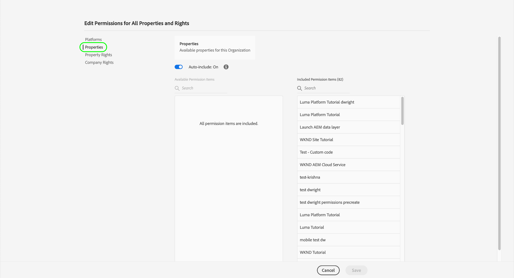
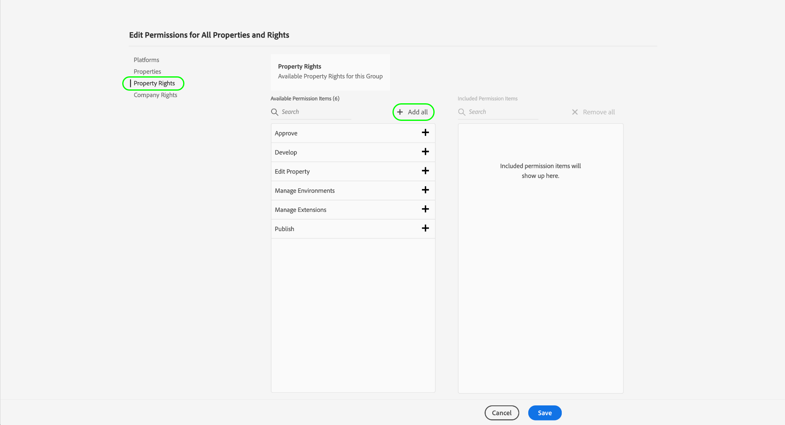

# Gestione delle autorizzazioni per i tag

>[!NOTE]
>
>Adobe Experience Platform Launch è stato classificato come una suite di tecnologie di raccolta dati in Adobe Experience Platform. Di conseguenza, sono state introdotte diverse modifiche terminologiche nella documentazione del prodotto. Consulta questo [documento](../../term-updates.md) come riferimento consolidato delle modifiche terminologiche.

Per utilizzare i tag in Adobe Experience Platform, è necessario avere accesso ad almeno un prodotto Adobe Experience Cloud tramite Adobe Admin Console. Inoltre, è necessario disporre delle autorizzazioni per i tag a livello di profilo di prodotto per eseguire determinate azioni quando si effettua l’accesso all’interfaccia utente di raccolta dati.

Questa guida illustra come concedere queste autorizzazioni agli utenti che utilizzano l’Admin Console.

>[!NOTE]
>
>Per informazioni dettagliate sui diversi tipi di autorizzazioni tag disponibili menzionati in questa guida, consulta la [panoramica sulle autorizzazioni utente](./user-permissions.md).

## Ottenere i diritti di amministratore per un profilo di prodotto dei tag

Per gestire le autorizzazioni utente per i tag, devi essere almeno un amministratore del profilo di prodotto per i tag in Adobe Admin Console. Gli amministratori di sistema e gli amministratori di prodotto possono anche gestire le autorizzazioni per un profilo di prodotto dei tag.

Consulta il documento di Admin Console relativo a [ruoli amministrativi](https://helpx.adobe.com/enterprise/admin-guide.html/enterprise/using/admin-roles.ug.html) per ulteriori informazioni sui diversi livelli di amministrazione e su come gestire questi ruoli all&#39;interno dell&#39;organizzazione.

## Selezionare un profilo di prodotto per gestire le autorizzazioni

Una volta ottenuti i diritti di amministratore, accedi ad Admin Console e seleziona **[!UICONTROL Prodotti]** dalla navigazione in alto. Dall’elenco dei prodotti visualizzati, seleziona **[!UICONTROL Adobe Experience Platform Launch]**.

Viene visualizzato un elenco di profili di prodotto. Un profilo di prodotto è un costrutto che collega un gruppo di autorizzazioni a un gruppo di utenti. Da qui puoi creare un nuovo profilo da configurare, oppure selezionare un profilo di prodotto esistente dall’elenco da modificare (supponendo di disporre dei diritti di amministratore per quel profilo).

### Creare un profilo di prodotto

>[!NOTE]
>
>Se hai selezionato un profilo esistente da modificare, passa alla sezione [successiva](#permissions).

Per creare un nuovo profilo di prodotto, fai clic su **[!UICONTROL Nuovi profili]**.

Viene visualizzata una finestra di dialogo che consente di specificare un nome e una descrizione facoltativa per il profilo. Puoi anche specificare se gli utenti devono ricevere e-mail quando vengono aggiunti o rimossi da questo profilo. Al termine, seleziona **[!UICONTROL Salva]**.

## Configurare le autorizzazioni per il profilo di prodotto {#permissions}

Viene visualizzata la pagina dei dettagli del profilo di prodotto. Utilizzando le schede fornite, puoi gestire gli utenti assegnati al profilo e configurare le proprietà e i diritti specifici che il profilo concederà a tali utenti.

I passaggi su come aggiungere utenti sono forniti [più avanti in questa guida](#users). Per il momento, seleziona **[!UICONTROL Autorizzazioni]**.

La schermata successiva mostra una panoramica del numero di piattaforme, proprietà e diritti attualmente assegnati al profilo. Seleziona **[!UICONTROL Modifica]** accanto a una delle righe per iniziare a configurare le autorizzazioni del profilo.

Viene visualizzata la schermata [!UICONTROL Modifica autorizzazioni] , che consente di aggiungere e rimuovere autorizzazioni dal profilo di prodotto. Dalla sezione **[!UICONTROL Piattaforme]**, puoi vedere che tutte le piattaforme sono state aggiunte al profilo per impostazione predefinita.

### Assegnare le proprietà

Per assegnare le proprietà a questo profilo, seleziona **[!UICONTROL Proprietà]** nel menu di navigazione a sinistra.

Per impostazione predefinita, a un nuovo profilo di prodotto viene automaticamente concesso l’accesso a tutte le proprietà disponibili per la tua organizzazione. Ciò include le proprietà attualmente disponibili ed eventuali proprietà future.

Per limitare le proprietà disponibili, seleziona l’opzione **[!UICONTROL Includi automatica]** . Ciò ti consente di aggiungere e rimuovere manualmente le proprietà per la proprietà a seconda delle tue esigenze.

Se l&#39;opzione di inclusione automatica è disabilitata, tutte le proprietà attualmente disponibili sono elencate a sinistra. Puoi aggiungere proprietà al profilo selezionando l’icona più (**+**) accanto alla proprietà in questione nella colonna a sinistra. Per rimuovere una proprietà, seleziona l’icona **X** accanto alla proprietà in questione nella colonna di destra.

>[!IMPORTANT]
>
>Se si disabilita la funzione di inclusione automatica, tutte le proprietà create in futuro devono essere aggiunte manualmente al profilo di prodotto per potervi accedere.

### Assegnare i diritti

Per impostazione predefinita, tutti i diritti sono disabilitati per un profilo di prodotto e devono essere aggiunti manualmente per essere abilitati. Se appartieni a un profilo di prodotto che include automaticamente le proprietà ma non i diritti, avrai accesso in sola lettura a tutte le proprietà.

>[!NOTE]
>
>Ad Admin Console, un utente può appartenere a più profili di prodotto, ma i diritti di tali profili non sono combinati in un set di autorizzazioni principali. L&#39;utente disporrà comunque dei diritti esplicitamente concessi da ciascun gruppo.
>
>Ad esempio, se il Gruppo 1 concede l’accesso alla Proprietà A con il diritto di sviluppo e il Gruppo 2 concede l’accesso alla Proprietà B con il diritto di pubblicazione, i diritti di sviluppo e pubblicazione non vengono combinati per la Proprietà A e la Proprietà B. Puoi sviluppare solo sulla proprietà A e pubblicare sulla proprietà B.

Seleziona **[!UICONTROL Diritti di proprietà]** nel menu di navigazione a sinistra. Come per le proprietà, puoi selezionare l’icona più (**+**) accanto a un diritto di proprietà per aggiungerlo al profilo. Se desideri aggiungere tutti i diritti di proprietà al profilo, puoi anche selezionare **[!UICONTROL Aggiungi tutto]**.

Quindi, seleziona **[!UICONTROL Diritti aziendali]** nel menu di navigazione a sinistra. Aggiungi o rimuovi i diritti necessari e al termine seleziona **[!UICONTROL Salva]**.

## Assegnare gli utenti al profilo {#users}

Per assegnare gli utenti al profilo di prodotto, seleziona la scheda [!UICONTROL Utenti] , quindi seleziona [!UICONTROL Aggiungi utente].

Nella finestra di dialogo visualizzata, immetti il nome, il gruppo di utenti o l’indirizzo e-mail degli utenti che desideri aggiungere al profilo. Se un utente fa parte dell’organizzazione, le relative informazioni vengono visualizzate in un menu a discesa con completamento automatico , che puoi selezionare per inserire i dettagli. Se non fanno parte dell’organizzazione, puoi immettere manualmente le relative informazioni.

Al termine, seleziona **[!UICONTROL Salva]** per aggiungere gli utenti specificati al profilo di prodotto.

Dopo aver aggiunto gli utenti al profilo, questi riceveranno un’e-mail per informarli di disporre dei diritti per l’interfaccia utente di raccolta dati.

## Passaggi successivi

Questo documento illustra come gestire le proprietà e i diritti per l’interfaccia utente di Raccolta dati utilizzando Adobe Admin Console. Per ulteriori informazioni sulle autorizzazioni disponibili e sulle funzionalità a cui concedono l&#39;accesso, consulta la panoramica sulle [autorizzazioni utente](./user-permissions.md).
