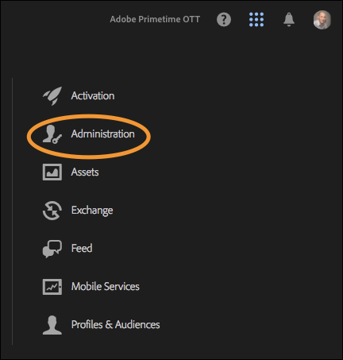

# Autorizzazioni utente

>[!NOTE]
>
>Con il suo rebranding, Adobe Experience Platform Launch viene riproposto come una suite di tecnologie per la raccolta dati all’interno di Experience Platform. Di conseguenza, sono state introdotte diverse modifiche terminologiche nella documentazione del prodotto. Consulta questo [documento](../../term-updates.md) come riferimento consolidato delle modifiche terminologiche.

## Tipi di autorizzazione

Esistono due autorizzazioni utente da comprendere per l’utilizzo con i tag in Adobe Experience Platform:

* **Autorizzazioni di Experience Cloud:** disponibili nell&#39;Admin Console a livello aziendale, le autorizzazioni di [!DNL Experience Cloud] determinano chi può controllare le autorizzazioni del gruppo e l&#39;iscrizione al gruppo per tutti i prodotti [!DNL Experience Cloud].
* **Autorizzazioni per i tag:** le autorizzazioni per i tag si trovano nell’Admin Console a livello di profilo di prodotto. Queste autorizzazioni determinano quali utenti possono eseguire determinate azioni quando effettuano l’accesso all’interfaccia utente di raccolta dati.

Questo articolo esamina nel dettaglio queste diverse autorizzazioni.

### Autorizzazioni di Experience Cloud

Questa sezione descrive fattori importanti da comprendere durante l’utilizzo di Platform. Consulta [Ruoli amministrativi nella Guida utente di Enterprise](https://helpx.adobe.com/it/enterprise/using/admin-roles.html) per una visualizzazione completa delle [!DNL Experience Cloud] autorizzazioni.

#### Amministratore dell&#39;organizzazione

Gli amministratori dell&#39;organizzazione vengono spesso definiti amministratori organizzazione. La funzione principale di un amministratore dell&#39;organizzazione consiste nell&#39;assegnare le autorizzazioni ad altri utenti. Per farlo, crea profili del prodotto (o gruppi) che contengono un set specifico di diritti all&#39;interno di un prodotto specifico e quindi assegna gli utenti, esistenti o nuovi, a quel profilo di prodotto.

Gli amministratori dell’organizzazione Enterprise non ereditano i diritti per i tag in Platform. Devono aggiungersi a un profilo di prodotto con le autorizzazioni appropriate se desiderano eseguire un’operazione nell’interfaccia utente Raccolta dati.

#### Amministratore del prodotto

Un amministratore del prodotto (o amministratore prodotto) è simile a un amministratore organizzazione, ma con ambito più ristretto. Un amministratore prodotto può solo modificare i profili di prodotto per un prodotto [!DNL Adobe] specifico, anziché tutti i prodotti [!DNL Adobe] a cui ha accesso l&#39;azienda.

### Autorizzazioni per i tag

In [!DNL Experience Cloud] non si assegnano diritti o autorizzazioni a singoli utenti, che sono invece assegnati a un profilo di prodotto (vedi Autorizzazioni di Experience Cloud qui sopra). I singoli utenti vengono poi assegnati a uno o più profili di prodotto.

All’interno di un profilo di prodotto, le autorizzazioni per i tag sono suddivise in quattro dimensioni.

1. Piattaforme
1. Proprietà
1. Diritti di proprietà
1. Diritti aziendali

#### Piattaforme

Ogni proprietà ha una piattaforma. Sono attualmente disponibili due piattaforme utilizzabili per i tag: *Web* e *Mobile*. Puoi utilizzare questo tipo di autorizzazione per limitare o concedere l’accesso a un particolare tipo di proprietà. Ciò può rivelarsi utile quando il team che gestisce le app mobile è diverso da quello che gestisce i siti web.

#### Proprietà

Si tratta di un elenco di tutte le proprietà esistenti all’interno dell’azienda. Puoi utilizzare questo tipo di autorizzazione per limitare o concedere l’accesso a specifiche proprietà esistenti (per nome).

#### Diritti di proprietà

Tutte le proprietà create nell’interfaccia utente Raccolta dati diventano disponibili nell’Admin Console per l’assegnazione delle autorizzazioni. Se un determinato profilo di prodotto non ha accesso alla proprietà A1, gli utenti che appartengono a tale profilo non possono vedere o modificare le impostazioni all&#39;interno della proprietà A1.

Supponendo che un utente appartenga a un profilo con accesso alla proprietà A1, le azioni che può svolgere all’interno della proprietà A1 sono determinate dai diritti concessi da questo gruppo di autorizzazioni. Gli utenti con autorizzazioni alla proprietà A1, ma senza diritti assegnati, hanno accesso in sola lettura.

Le autorizzazioni disponibili in questo gruppo sono:

* **Develop (Sviluppo):**  consente di creare regole ed elementi di dati. Puoi anche creare librerie e generarle negli ambienti di sviluppo esistenti. Quando è tutto pronto, invia una libreria per l&#39;approvazione. La maggior parte delle attività quotidiane nell’interfaccia utente di raccolta dati richiede questo diritto.
* **Approve (Approvazione):**  consente di trasferire una libreria e una build inviate nell&#39;ambiente di staging. Puoi inoltre approvare una libreria per la pubblicazione dopo aver completato i test.
* **Pubblica:** consente di pubblicare librerie approvate nell’ambiente di produzione.
* **Manage Extensions (Gestisci estensioni):**  consente di installare nuove estensioni in una proprietà, modificare la configurazione dell&#39;estensione per un&#39;estensione già installata ed eliminare un&#39;estensione. Consulta la documentazione di panoramica sulle estensioni per [ulteriori informazioni sulle estensioni](../managing-resources/extensions/overview.md). In genere questo ruolo appartiene al reparto IT o Marketing, a seconda dell&#39;organizzazione.
* **Manage Environments (Gestisci ambienti):**  consente di creare e modificare ambienti. Per ulteriori informazioni, consulta la documentazione [ambienti](../publishing/environments.md) . Generalmente, questo ruolo appartiene al reparto IT.

#### Diritti aziendali

I diritti aziendali si applicano ad autorizzazioni che si estendono su più proprietà. Al momento ne sono disponibili tre:

* **Gestisci proprietà:** consente di creare nuove proprietà nell’interfaccia utente di raccolta dati e di modificare i metadati e le impostazioni a livello di proprietà. Inoltre, puoi eliminare le proprietà. Per ulteriori informazioni, consulta la [documentazione sulle proprietà](companies-and-properties.md) . Generalmente, gli amministratori eseguono questo ruolo.
* 
* Consente di creare nuove proprietà in [!DNL Platform Launch] e di modificare i metadati e le impostazioni a livello di proprietà. Inoltre, puoi eliminare le proprietà. Ulteriori informazioni sulle proprietà disponibili [qui](companies-and-properties.md). Generalmente, gli amministratori eseguono questo ruolo.
* **Develop Extensions (Sviluppa estensioni):** consente di creare e modificare pacchetti di estensioni di proprietà dell&#39;azienda, incluse versioni private e richieste di versioni pubbliche.
* **Gestione configurazioni app:** questa opzione è disponibile solo per i clienti che dispongono di una licenza per Adobe Journey Optimizer o altre soluzioni che consentono di accedere ai messaggi in-app e push mobili.  Questo ti consente di gestire le app che Experience Cloud conosce insieme alle credenziali push necessarie per comunicare con il servizio Firebase Cloud Messaging e il servizio Apple Push Notification.

### Autorizzazioni utente totali

Le autorizzazioni totali di un singolo utente sono determinate dall&#39;iscrizione totale in profili di prodotto diversi. Se un utente appartiene a più profili di prodotto, le autorizzazioni di ciascun profilo vengono aggiunte insieme anziché moltiplicate.

Ad esempio: il profilo di prodotto A concede a Henry il diritto Develop per la proprietà 1. Il profilo di prodotto B concede a Henry il diritto Publish per la proprietà 2. Henry può sviluppare nella proprietà 1 e pubblicare nella proprietà 2, ma non può pubblicare nella proprietà 1 o sviluppare nella proprietà 2 perché non dispone dei diritti espliciti per farlo.

## Scenari di diritti

Diverse aziende hanno esigenze diverse per la creazione di nuovi profili di prodotto. Queste esigenze variano in base alle dimensioni dell&#39;azione, alla struttura dell&#39;organizzazione, al numero di siti, al numero di persone coinvolte nella gestione dei tag e così via.

Di seguito sono riportati alcuni scenari comuni e un punto di partenza consigliato per la creazione di profili di prodotto e per l&#39;aggiunta di utenti.

### Un solo protagonista

Se gestisci un&#39;azienda di dimensioni modeste che dispone di un solo responsabile a tutti gli effetti, concedi a quest&#39;utente tutte le proprietà e assegnagli tutti i diritti elencati sopra.

### Separazione dei compiti

Sono coinvolte molte persone nell&#39;assegnazione tag. Hai un gruppo di persone (ad esempio un consulente esterno) che crea regole ed elementi di dati, ma non vuoi che abbiano accesso all&#39;ambiente di produzione. Vuoi assicurarti che nessuno distribuisca in produzione eccetto il team IT.

1. Crea un account per i tuoi consulenti e concedi loro solo il diritto di sviluppo.
1. Il consulente genera ed esegue test all&#39;interno dei confini impostati.
1. Se il consulente desidera una nuova estensione o è pronto per andare live, un rappresentante della tua organizzazione (con i diritti appropriati) esegue tali azioni.

### Enterprise

Un&#39;azienda di livello Enterprise potrebbe avere più siti divisi geograficamente, con team diversi responsabili di ogni area geografica. All&#39;interno di questi team, i vari utenti possono sviluppare e pubblicare.

È simile al precedente scenario &quot;Separazione dei compiti&quot;, ma organizzato per aree geografiche.

* America del Nord
   * Gruppo Develop
   * Gruppo Publish
* Europa
   * Gruppo Develop
   * Gruppo Publish
* ...
   * Gruppo Develop
   * Gruppo Publish

## Esempi

Alcuni esempi dei tipi di ruoli che potresti avere a disposizione nell&#39;organizzazione e quali autorizzazioni dovresti assegnare potrebbero aiutarti a chiarire questo concetto.

Di seguito trovi alcune descrizioni di vari ruoli che possono essere applicati nell&#39;organizzazione e una matrice a mostrare le autorizzazioni necessarie per svolgere il loro lavoro.

* Manager: vuole vedere cosa succede, ma non deve essere in grado di apportare modifiche.
* Addetto marketing: può installare estensioni e impostare nuovi tag per le proprietà esistenti, ma non può pubblicare negli ambienti di staging o produzione.
* Sviluppatore app mobili: è responsabile dell&#39;implementazione di soluzioni Adobe e di terze parti all&#39;interno di un&#39;app nativa per dispositivi mobili.
* Team IT: non modificano effettivamente i tag, ma hanno il controllo completo degli ambienti di staging e produzione e dei rispettivi contenuti.
* Tuttofare: esegue tutte le operazioni.

| Ruolo | Proprietà | Diritti aziendali | Diritti di proprietà |
|--- |--- |--- |--- |
| Manager | Inclusione automatica |  |  |
| Addetto al marketing | Inclusione automatica | Gestisci proprietà | Sviluppa Gestisci estensioni |
| Sviluppatore app mobili | Inclusione automatica | Gestisci proprietà Gestire le configurazioni dell’app | Sviluppa Gestisci estensioni |
| Team IT | Inclusione automatica | Approva Pubblica Gestisci ambienti |
| Tuttofare | Inclusione automatica | Gestisci proprietà | Sviluppa Approva Pubblica Gestisci estensioni Gestisci ambienti |
| Sviluppatore di estensioni | Inclusione automatica | Gestisci proprietà Sviluppa estensioni | Sviluppa |

## Assegnazione delle autorizzazioni utente

I passaggi seguenti ti guideranno lungo la procedura di assegnazione delle autorizzazioni. Puoi anche vedere la procedura [in questo video](https://www.youtube.com/watch?v=ba28BHX8cwU).

I passaggi 1-3 di seguito si possono evitare passando direttamente ad [Adobe Admin Console](https://adminconsole.adobe.com/enterprise/products). Se fai parte di più organizzazioni, seleziona l&#39;organizzazione corretta dal menu di navigazione in alto a destra.

### 1. Accedere a Experience Cloud

Accedi a [https://experiencecloud.adobe.com/](https://experiencecloud.adobe.com/) con il tuo Adobe ID, quindi scegli l&#39;organizzazione da utilizzare nell&#39;interfaccia utente di raccolta dati dal menu [!UICONTROL Navigazione].

Apri il selettore delle soluzioni facendo clic sull’icona con 9 puntini nel menu [!UICONTROL Navigazione], quindi seleziona **[!UICONTROL Amministrazione]**.

Se non riesci a visualizzare questo collegamento, entrambe le condizioni seguenti sono vere:

* Non sei un amministratore dell&#39;organizzazione.
* Non sei un amministratore prodotto per nessun prodotto [!DNL Experience Cloud].

In entrambi i casi, chiedi a un amministratore organizzazione di eseguire questi passaggi al posto tuo o di renderti amministratore prodotto per i tag in modo da poterlo fare autonomamente.

>[!NOTE]
>
>Se non sai chi sia l’amministratore organizzazione, contatta l’Assistenza clienti.

### 2. Aprire Admin Console

Selezionare **Admin Console**.

Seleziona la scheda **[!DNL Experience Platform Launch]-`Company Name`**.

<!-- Scott, update above image. Rebranding. -->

Puoi anche selezionare **[!UICONTROL Prodotti]** dal menu di navigazione in alto, quindi seleziona **[!DNL Experience Platform Launch]-`Company Name`** dal menu di navigazione a sinistra.

Se non trovi una scheda [!DNL Experience Platform Launch] e/o [!DNL Experience Platform Launch] non appare in questo elenco, vuol dire che non sei un amministratore organizzazione, ma sei un amministratore di prodotto per altri prodotti Experience Cloud. Poiché non sei amministratore per Experience Platform Launch, devi trovare un amministratore organizzazione che esegua questi passaggi al posto o che può renderti amministratore di prodotto per [!DNL Platform Launch].

Dopo aver selezionato Platform Launch, appare un elenco di profili di prodotto. Considera questi profili come gruppi di autorizzazioni. Viene creato un profilo per te, denominato &quot;[!DNL Platform Launch] - `Company Name`&quot;.

### 3. Creare il profilo di prodotto

Se stai modificando un profilo di prodotto esistente, salta questo passaggio.

Scegli di modificare il profilo di prodotto o creane uno nuovo.

Per creare un nuovo profilo di prodotto, fai clic su **[!UICONTROL Nuovi profili]**.

Assegna un nome e una descrizione al nuovo profilo e specifica se gli utenti devono ricevere e-mail quando vengono aggiunti o rimossi dal profilo, quindi fai clic su **[!UICONTROL Fine]**.

### 4. Modificare il profilo di prodotto

Seleziona il profilo prodotto dall’elenco, quindi apri la scheda **[!UICONTROL Autorizzazioni]**. Puoi assegnare le autorizzazioni su due dimensioni: proprietà e diritti.

Per assegnare le proprietà a questa definizione di gruppo, apri la sezione **[!UICONTROL Proprietà]**.

Un elenco mostra le proprietà dei tag.

Per impostazione predefinita, le nuove configurazioni di prodotto includono automaticamente le proprietà. Questo significa che tutte le proprietà (presenti e future) sono incluse nella definizione del gruppo.

Se l&#39;opzione di inclusione automatica è disattivata, tutte le proprietà attualmente disponibili sono elencate a sinistra. Puoi spostare le proprietà in questa definizione di gruppo selezionando **[!UICONTROL Aggiungi]**.

Al termine, seleziona **[!UICONTROL Salva]**.

### 5. Assegnare i diritti

Assegna i diritti che desideri aggiungere alla definizione del gruppo. Apri la sezione **[!UICONTROL Diritti]**.

I diritti non sono inclusi automaticamente. Devi assegnare tutti i diritti al tuo profilo. Puoi aggiungere rapidamente tutti i diritti a questo profilo utilizzando il pulsante [!UICONTROL + Aggiungi tutto] oppure assegnare singoli diritti utilizzando i singoli pulsanti + (aggiungi). Per ulteriori informazioni sulle autorizzazioni associate a ogni diritto, consulta [Scenari di diritti](#rights-scenarios). Al termine, seleziona **[!UICONTROL Salva]**. Se [!UICONTROL Save] non è disponibile, non sono state apportate modifiche e non verranno assegnati nuovi diritti.

Innanzitutto, assegna i diritti di proprietà:

Quindi, assegna i diritti aziendali:

Alcune note importanti da tenere a mente sull&#39;assegnazione dei diritti:

* La mancanza di diritti comporta l&#39;accesso in sola lettura. Se appartieni a una configurazione di prodotto con proprietà di inclusione automatica e nessun diritto, avrai accesso in sola lettura a tutte le proprietà dei tag.
* Se non assegni correttamente le proprietà Gestisci , non potrai aggiungere proprietà al momento dell&#39;accesso.
* Un utente può appartenere a più gruppi, ma i diritti di tali gruppi non sono combinati in un set di autorizzazioni principali. L&#39;utente disporrà comunque dei diritti esplicitamente concessi da ciascun gruppo.

   Ad esempio, se il gruppo 1 concede l&#39;accesso alla proprietà A con il diritto di sviluppo e il gruppo 2 concede l&#39;accesso alla proprietà B con il diritto di pubblicazione, i diritti di sviluppo e pubblicazione non sono combinati per la proprietà A e la proprietà B. Sarà possibile sviluppare nella proprietà A e pubblicare nella proprietà B.

### 6. Assegnare utenti ai gruppi

Per assegnare degli utenti al tuo gruppo, apri la scheda [!UICONTROL Utenti], quindi fai clic su [!UICONTROL Aggiungi utente].

Selezionare i puntini di sospensione (...) per ulteriori opzioni, ad esempio operazioni utente in blocco.

>[!NOTE]
>
>Il fatto di essere amministratore organizzazione o amministratore di prodotto non ti assegna autorizzazioni all’interno del prodotto tag . Devi appartenere ad almeno un profilo di prodotto.

Cerca l&#39;utente da aggiungere al gruppo. Puoi effettuare ricerche per nome o per indirizzo e-mail. Questo si compila in automatico con gli utenti esistenti nell&#39;organizzazione. Una volta trovato l&#39;utente desiderato, fai clic sul suo nome.

Dopo aver aggiunto gli utenti, questi riceveranno un&#39;e-mail per informarli che dispongono dei diritti. Per effettuare l&#39;accesso, segui il collegamento all&#39; [Interfaccia di raccolta dati](https://launch.adobe.com).

>[!NOTE]
>
>Se l’utente non esiste, è sufficiente digitare l’intero indirizzo e-mail e indicare un nome e un cognome. Il nuovo utente riceve un&#39;e-mail e, quando crea un ID [!DNL Adobe] a partire da quell&#39;invito e-mail, si collega all&#39;account utente creato da te. Se ti stai assegnando le autorizzazioni autonomamente, non avrai questo problema.

## Problemi comuni

### Errore di caricamento dell&#39;account

Quando accedi all’interfaccia utente Raccolta dati, ricevi un messaggio di errore di caricamento dell’account.

Risoluzione: L’utente non appartiene ad alcun profilo di prodotto di tag. Vedi i passaggi qui sopra per creare un profilo e assegnargli diritti e per assegnare un utente a un profilo.

### Pulsante Proprietà disattivato

Dopo aver eseguito l&#39;accesso, non puoi aggiungere proprietà.

Soluzione: l&#39;account utente non appartiene a una configurazione di prodotto con proprietà Manage Properties (Gestisci proprietà). Torna al passaggio 5 precedente.
