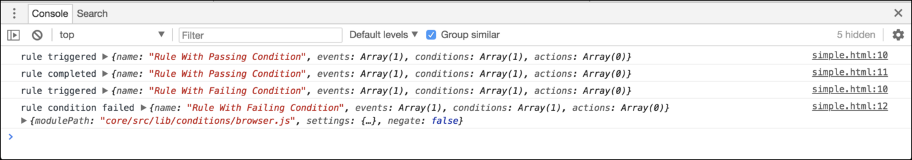

# Adobe Experience Platform tag Riferimento a un oggetto satellitare

>[!NOTE]
>
>Con il suo rebranding, Adobe Experience Platform Launch viene riproposto come una suite di tecnologie per la raccolta dati all’interno di Experience Platform. Di conseguenza, sono state introdotte diverse modifiche terminologiche nella documentazione del prodotto. Consulta questo [documento](../../term-updates.md) come riferimento consolidato delle modifiche terminologiche.

Questo documento funge da riferimento per l&#39;oggetto lato client `_satellite` e le varie funzioni che è possibile eseguire con esso.

## `track`

**Codice**

```javascript
_satellite.track(identifier: string [, detail: *] )
```

**Esempio**

```javascript
_satellite.track('contact_submit', { name: 'John Doe' });
```

`track` attiva tutte le regole utilizzando il tipo di evento Direct Call configurato con l&#39;identificatore specificato dall&#39;estensione Core tag. L&#39;esempio precedente attiva tutte le regole utilizzando un tipo di evento Call Direct in cui l&#39;identificativo configurato è `contact_submit`. Inoltre, viene trasmesso un oggetto facoltativo contenente le relative informazioni. L&#39;oggetto dettaglio è accessibile immettendo `%event.detail%` all&#39;interno di un campo di testo in una condizione o in un&#39;azione oppure `event.detail` all&#39;interno dell&#39;editor di codice in una condizione o in un&#39;azione di codice personalizzato.

## `getVar`

**Codice**

```javascript
_satellite.getVar(name: string) => *
```

**Esempio**

```javascript
var product = _satellite.getVar('product');
```

Nell&#39;esempio fornito, se esiste un elemento dati con un nome corrispondente, viene restituito il valore dell&#39;elemento dati. Se non esiste alcun elemento di dati corrispondente, eseguirà una verifica per vedere se in precedenza è stata impostata una variabile personalizzata con un nome corrispondente utilizzando `_satellite.setVar()`. Se si trova una variabile personalizzata corrispondente, verrà restituito il relativo valore.

Tieni presente che in molti campi del modulo nell’interfaccia utente Raccolta dati puoi utilizzare la sintassi `%%` per fare riferimento alle variabili, riducendo la necessità di chiamare `_satellite.getVar()`. Ad esempio, se utilizzi %product% accederai al valore dell&#39;elemento di dati o della variabile personalizzata del prodotto.

## `setVar`

**Codice**

```javascript
_satellite.setVar(name: string, value: *)
```

**Esempio**

```javascript
_satellite.setVar('product', 'Circuit Pro');
```

`setVar()` imposta una variabile personalizzata con un nome e un valore specifici. In seguito è possibile accedere al valore della variabile utilizzando `_satellite.getVar()`.

Se lo desideri, puoi impostare più variabili contemporaneamente trasmettendo un oggetto in cui le chiavi sono nomi di variabili e i valori sono i rispettivi valori delle variabili.

```javascript
_satellite.setVar({ 'product': 'Circuit Pro', 'category': 'hobby' });
```

## `getVisitorId`

**Codice**

```javascript
_satellite.getVisitorId() => Object
```

**Esempio**

```javascript
var visitorIdInstance = _satellite.getVisitorId();
```

Se l&#39;estensione [!DNL Adobe Experience Cloud ID] è installata nella proprietà, questo metodo restituisce l&#39;istanza ID visitatore. Per ulteriori informazioni, consulta la [documentazione del servizio Experience Cloud ID](https://forums.adobe.com/external-link.jspa?url=https%3A%2F%2Fmarketing.adobe.com%2Fresources%2Fhelp%2Fit_IT%2Fmcvid%2F).

## `logger`

**Codice**

```javascript
_satellite.logger.log(message: string)
```

```javascript
_satellite.logger.info(message: string)
```

```javascript
_satellite.logger.warn(message: string)
```

```javascript
_satellite.logger.error(message: string)
```

**Esempio**

```javascript
_satellite.logger.error('No product ID found.');
```

L’oggetto `logger` consente di registrare un messaggio nella console del browser. Il messaggio verrà visualizzato solo se l’utente ha abilitato il debug dei tag (chiamando `_satellite.setDebug(true)` o utilizzando un’estensione del browser appropriata).

### Registrazione degli avvisi di funzioni deprecate

```javascript
_satellite.logger.deprecation(message: string)
```

**Esempio**

```javascript
_satellite.logger.deprecation('This method is no longer supported, please use [new example] instead.');
```

Questo registra un avviso nella console del browser. Viene visualizzato il messaggio se l’utente ha abilitato o meno il debug dei tag.

## `cookie`

**Codice**

```javascript
_satellite.cookie.set(name: string, value: string[, attributes: Object])
```

```javascript
_satellite.cookie.get(name: string) => string
```

```javascript
_satellite.cookie.remove(name: string)
```

**Esempio**

```javascript
// Writing a cookie that expires in one week.
_satellite.cookie.set('product', 'Circuit Pro', { expires: 7 });
```

```javascript
// Reading a previously set cookie.
var product = _satellite.cookie.get('product');
```

```javascript
// Removing a previously set cookie.
_satellite.cookie.remove('product');
```

Questa è un&#39;utilità per la lettura e la scrittura di cookie. È una copia esposta della libreria di terze parti js-cookie. Per un utilizzo più avanzato, consulta la [documentazione sull’utilizzo dei cookie js](https://www.npmjs.com/package/js-cookie#basic-usage) (collegamento esterno).

## `buildInfo`

**Codice**

```javascript
_satellite.buildInfo
```

Questo oggetto contiene informazioni sulla build della libreria di runtime di tag corrente. L&#39;oggetto contiene le proprietà seguenti:

### `turbineVersion`

Questo fornisce la versione [Turbine](https://www.npmjs.com/package/@adobe/reactor-turbine) utilizzata all&#39;interno della libreria corrente.

### `turbineBuildDate`

La data di creazione della versione di [Turbine](https://www.npmjs.com/package/@adobe/reactor-turbine) utilizzata all&#39;interno del contenitore in formato ISO 8601.

### `buildDate`

La data di creazione della libreria corrente in formato ISO 8601.

### `environment`

L&#39;ambiente per il quale è stata generata la libreria. I valori possibili sono:

* development
* staging
* production

Questo esempio illustra i valori dell&#39;oggetto:

```javascript
{
  turbineVersion: "14.0.0",
  turbineBuildDate: "2016-07-01T18:10:34Z",
  buildDate: "2016-03-30T16:27:10Z",
  environment: "development"
}
```

## `notify`

>[!NOTE]
>
>Questo metodo è stato dichiarato obsoleto. Utilizza piuttosto `_satellite.logger.log()`.

**Codice**

```javascript
_satellite.notify(message: string[, level: number])
```

**Esempio**

```javascript
_satellite.notify('Hello world!');
```

`notify` registra un messaggio nella console del browser. Il messaggio verrà visualizzato solo se l’utente ha abilitato il debug dei tag (chiamando `_satellite.setDebug(true)` o utilizzando un’estensione del browser appropriata).

È possibile passare un livello di registrazione facoltativo che influirà sullo stile e sul filtraggio del messaggio registrato. I livelli supportati sono i seguenti:

3: messaggi informativi.

4: messaggi di avviso.

5: messaggi di errore.

Se non definisci un livello di registrazione o non trasmetti altri valori di livello, il messaggio sarà registrato come messaggio regolare.

## `setCookie`

>[!NOTE]
>
>Questo metodo è stato dichiarato obsoleto. Utilizza piuttosto `_satellite.cookie.set()`.

**Codice**

```javascript
_satellite.setCookie(name: string, value: string, days: number)
```

**Esempio**

```javascript
_satellite.setCookie('product', 'Circuit Pro', 3);
```

Questo imposta un cookie nel browser dell&#39;utente. Il cookie persiste per il numero di giorni specificati.

## `readCookie`

>[!NOTE]
>
>Questo metodo è stato dichiarato obsoleto. Utilizza piuttosto `_satellite.cookie.get()`.

**Codice**

```javascript
_satellite.readCookie(name: string) => string
```

**Esempio**

```javascript
var product = _satellite.readCookie('product');
```

Questo legge un cookie dal browser dell&#39;utente.

## `removeCookie`

>[!NOTE]
>
>Questo metodo è stato dichiarato obsoleto. Utilizza piuttosto `_satellite.cookie.remove()`.

**Codice**

```javascript
_satellite.removeCookie(name: string)
```

**Esempio**

```javascript
_satellite.removeCookie('product');
```

Questo rimuove un cookie dal browser dell&#39;utente.

## Funzioni di debug

Le seguenti funzioni non sono accessibili dal codice di produzione. Queste sono intese solo a scopo di debug e cambiano nel tempo in base alle esigenze.

### `container`

**Codice**

```javascript
_satellite._container
```

**Esempio**

>[!IMPORTANT]
>
>Questa funzione non è accessibile dal codice di produzione. La funzione è intesa solo a scopo di debug e cambia nel tempo in base alle esigenze.

### `monitor`

**Codice**

```javascript
_satellite._monitors
```

**Esempio**

>[!IMPORTANT]
>
>Questa funzione non è accessibile dal codice di produzione. La funzione è intesa solo a scopo di debug e cambia nel tempo in base alle esigenze.

**Esempio**

Nella pagina web in cui è in esecuzione una libreria di tag, aggiungi uno snippet di codice al codice HTML. In genere, il codice viene inserito nell&#39;elemento `<head>` prima dell&#39;elemento `<script>` che carica la libreria di tag. Questo consente al monitoraggio di rilevare i primi eventi di sistema che si verificano nella libreria di tag. Esempio:

```html
<!DOCTYPE html>
<html lang="en">
<head>
  <meta charset="UTF-8">
  <title>Title</title>
  <script>
    window._satellite = window._satellite || {};
    window._satellite._monitors = window._satellite._monitors || [];
    window._satellite._monitors.push({
      ruleTriggered: function (event) {
        console.log(
          'rule triggered',
          event.rule
        );
      },
      ruleCompleted: function (event) {
        console.log(
          'rule completed',
          event.rule
        );
      },
      ruleConditionFailed: function (event) {
        console.log(
          'rule condition failed',
          event.rule,
          event.condition
        );
      }
    });
  </script>
  <script src="//assets.adobedtm.com/launch-EN5bfa516febde4b22b3e7c6f96f6b439f.min.js"
          async></script>
</head>
<body>
  <h1>Click me!</h1>
</body>
</html>
```

Nel primo elemento di script, poiché la libreria di tag non è ancora stata caricata, viene creato l&#39;oggetto iniziale `_satellite` e viene inizializzato un array su `_satellite._monitors`. Lo script aggiunge quindi un oggetto di monitoraggio a tale array. L&#39;oggetto di monitoraggio può specificare i seguenti metodi che verranno successivamente chiamati dalla libreria di tag:

### `ruleTriggered`

Questa funzione viene chiamata dopo che un evento attiva una regola ma prima che le condizioni e le azioni della regola siano state elaborate. L&#39;oggetto evento trasmesso a `ruleTriggered` contiene informazioni sulla regola attivata.

### `ruleCompleted`

Questa funzione viene chiamata dopo che una regola è stata completamente elaborata. In altre parole, l’evento si è verificato, tutte le condizioni sono state passate e tutte le azioni sono state eseguite. L&#39;oggetto evento trasmesso a `ruleCompleted` contiene informazioni sulla regola completata.

### `ruleConditionFailed`

Questa funzione viene chiamata dopo che una regola è stata attivata e una delle sue condizioni non è riuscita. L&#39;oggetto evento trasmesso a `ruleConditionFailed` contiene informazioni sulla regola attivata e sula condizione che ha avuto esito negativo.

Se si chiama `ruleTriggered`, poco dopo sarà chiamato `ruleCompleted` oppure `ruleConditionFailed`.

>[!NOTE]
>
>Un monitoraggio non deve necessariamente specificare tutti e tre i metodi (`ruleTriggered`, `ruleCompleted` e `ruleConditionFailed`). I tag in Adobe Experience Platform funzionano con tutti i metodi supportati forniti dal monitoraggio.

### Verifica del monitoraggio

L&#39;esempio precedente specifica tutti e tre i metodi nel monitoraggio. Quando questi vengono chiamati, il monitoraggio disporrà di informazioni pertinenti. Per eseguire il test, imposta due regole nella libreria di tag:

1. Una regola con un evento di clic e una condizione di browser che trasmette solo se il browser è [!DNL Chrome].
1. Una regola con un evento di clic e una condizione di browser che trasmette solo se il browser è [!DNL Firefox].

Se apri la pagina in [!DNL Chrome], apri la console del browser e fai clic sulla pagina, la console visualizza quanto segue:



Se necessario, a questi gestori possono essere aggiunti hook o informazioni aggiuntive.
