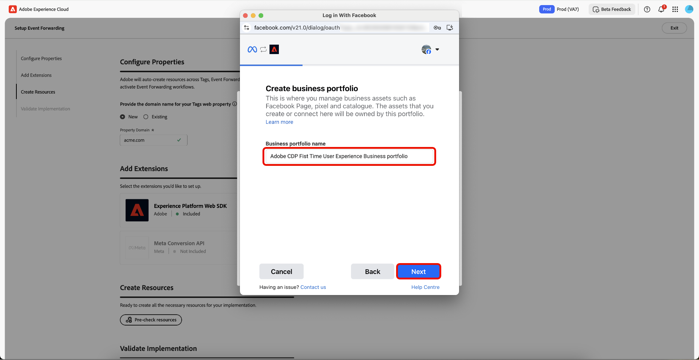
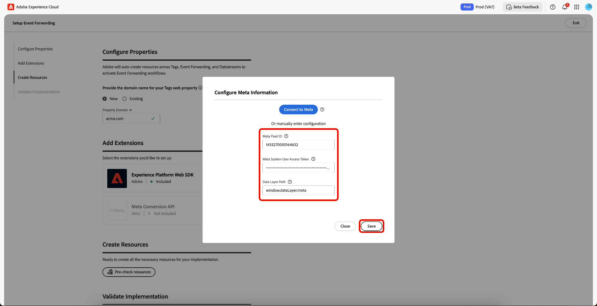
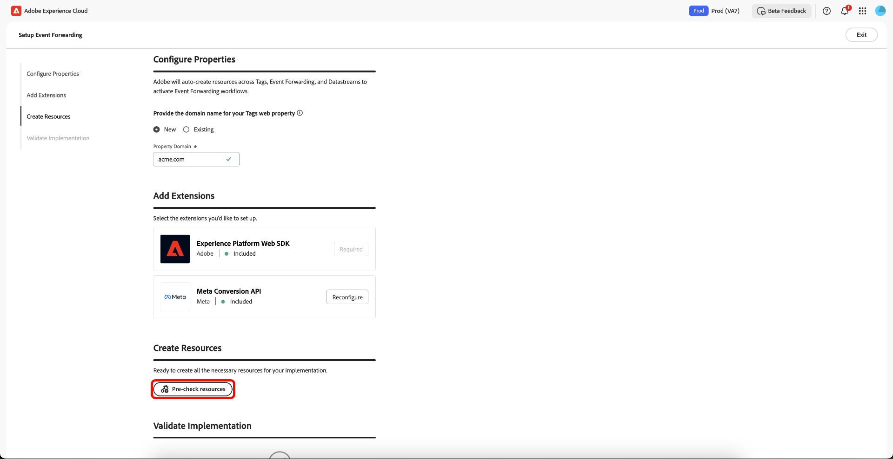

# Panoramica sulla configurazione guidata dell’inoltro degli eventi

>[!IMPORTANT]
>
>La funzione di configurazione guidata è disponibile per i clienti che hanno acquistato il pacchetto Real-Time CDP Prime e Ultimate. Per ulteriori informazioni, contatta il rappresentante Adobe.

>[!NOTE]
>
>Qualsiasi client esistente può utilizzare i flussi di lavoro di configurazione guidata per creare un’implementazione di riferimento che può essere utilizzata per i seguenti elementi:
>
>* Utilizzala come inizio di un’implementazione completamente nuova.
>* Sfruttala come implementazione di riferimento da esaminare per vedere come è stata configurata e replicarla nelle implementazioni di produzione correnti.

La funzione di configurazione guidata consente di effettuare la configurazione con facilità ed efficienza. Questo strumento automatizza più passaggi eseguiti nei tag di Adobe e nell’inoltro degli eventi, riducendo in modo significativo il tempo di configurazione.

Questa installazione può installare automaticamente le estensioni. Questa implementazione ibrida è consigliata da [!DNL Meta] per raccogliere e inoltrare le conversioni di eventi lato server. La funzione di configurazione guidata è progettata per aiutarti a iniziare con un’implementazione di inoltro degli eventi e non è concepita per fornire un’implementazione completa e completamente funzionale che tenga conto di tutti i casi d’uso.

## Introduzione alla configurazione guidata {#guided-setup}

Per iniziare a utilizzare la funzione, seleziona **[!UICONTROL Get Started]** nell&#39;interfaccia utente di **[!UICONTROL Event Forwarding]** Data Collections.

### Creare una nuova proprietà tag {#new-property}

Nella sezione Configura proprietà selezionare **[!UICONTROL New]** e immettere i nuovi dettagli di **[!UICONTROL Property Domain]**.

Selezionare **[!UICONTROL Add]** per [!DNL Meta Conversion API] nella sezione Aggiungi estensioni. Nella pagina Configura informazioni di [!DNL Meta] è possibile immettere manualmente **[!UICONTROL Meta Pixel ID]**, **[!UICONTROL Meta System User Access Token]** e **[!UICONTROL Data Layer Path]** oppure utilizzare l&#39;opzione **[!UICONTROL Connect to Meta]**.

#### Connettersi a [!DNL Meta] utilizzando le credenziali {#meta-credentials}

Seleziona **[!UICONTROL Connect to Meta]**, quindi immetti le tue credenziali di [!DNL Meta] e seleziona **[!UICONTROL Log in]**, quindi seleziona **[!UICONTROL Next]**.

Ti verrà richiesto di **creare un portfolio aziendale**. Immettere **[!UICONTROL Business portfolio name]** e selezionare **[!UICONTROL Next]**.

Seleziona il tuo portfolio aziendale dall&#39;elenco, quindi seleziona **[!UICONTROL Next]**. Puoi visualizzare le impostazioni per Business Portfolio, Account annuncio e [!DNL Meta Pixel]. Selezionare **[!UICONTROL Continue]** per confermare le impostazioni, quindi selezionare **[!UICONTROL Next]**.

Attendere alcuni minuti per il completamento del processo di installazione, quindi selezionare **[!UICONTROL Done]**.

**[!UICONTROL Meta Pixel ID]**, **[!UICONTROL Meta System User Access Token]** e **[!UICONTROL Data Layer Path]** verranno compilati automaticamente. Seleziona **[!UICONTROL Save]**.

#### Creare risorse per la nuova proprietà tag {#create-resources}

Nella sezione Crea risorse, seleziona **[!UICONTROL Pre-check resources]** per verificare l&#39;organizzazione e le proprietà per eventuali conflitti o risorse necessarie esistenti per l&#39;implementazione.

Nella pagina Azioni task viene visualizzato un elenco di task e azioni. Seleziona **[!UICONTROL Create Resources]** per creare queste attività.

Attendi alcuni minuti per completare l&#39;installazione delle regole, degli elementi dati, delle estensioni, delle librerie, degli SDK e così via richiesti. La sezione Creare risorse fornisce collegamenti alle proprietà e alle risorse create.

#### Convalidare l’implementazione {#validate-implementation}

La sezione Convalida implementazione fornisce il collegamento da incorporare sul sito web. **[!UICONTROL Start Validation]** esegue il test nella sessione corrente del browser in questa pagina di configurazione guidata. Se la convalida ha esito positivo qui, la stessa implementazione dovrebbe funzionare quando distribuisci il collegamento di incorporamento sul sito.

Selezionare **[!UICONTROL Send PageView Event]** per inviare un evento di test tramite Adobe Experience Platform Edge Network. Viene quindi inoltrato lato server a [!DNL Meta]. Selezionare **[!UICONTROL Finished Validation]** per completare la configurazione.

>[!NOTE]
>
>Se si verificano errori durante il processo di convalida, selezionare il collegamento **[!UICONTROL Assurance]** per esaminare gli eventi che potrebbero non essere riusciti.

### Usa una proprietà tag esistente {#existing-property}

Nella sezione Configura proprietà, seleziona **[!UICONTROL Existing]**, quindi seleziona la proprietà dei tag dal menu a discesa. Il sistema tenta di trovare la proprietà di inoltro degli eventi già associata a questa proprietà tramite gli stream di dati. È ora possibile continuare a riconfigurare [!DNL Meta Conversion API], quindi pre-controllare e creare le risorse.

Se la proprietà dei tag selezionata non è connessa a una proprietà di inoltro degli eventi o se mancano flussi di dati, questi verranno creati automaticamente.

Per configurare [!DNL Meta Conversion API], segui il processo evidenziato in precedenza in [Connetti a [!DNL Meta] utilizzando le tue credenziali](#meta-credentials).

Dopo aver generato **[!UICONTROL Meta Pixel ID]**, **[!UICONTROL Meta System User Access Token]** e **[!UICONTROL Data Layer Path]**, seleziona **[!UICONTROL Pre-Check resources]** per creare il flusso di lavoro di inoltro degli eventi.

Poiché stai utilizzando una proprietà di tag esistente, il processo di impostazione è leggermente diverso dal nuovo flusso di lavoro delle proprietà. Puoi vedere che il sistema salterà la creazione della proprietà web, dell’host e dell’ambiente, poiché questi esistono già. Infine, selezionare **[!UICONTROL Create Resources]** per creare le attività non ancora disponibili.

>[!INFO]
>
>La configurazione guidata aggiunge automaticamente note alle proprietà che vengono aggiornate durante il processo. Puoi visualizzarli nella sezione Note nel pannello a destra della proprietà tags in modalità di modifica. Puoi vedere quando la proprietà è stata aggiornata o creata dallo strumento di configurazione guidato. Questo audit trail consente di tenere traccia delle modifiche apportate dalla funzione di configurazione guidata.

Attendi alcuni minuti per completare l&#39;installazione delle regole, degli elementi dati, delle estensioni, delle librerie, degli SDK e così via richiesti. La sezione Creare risorse fornisce collegamenti alle proprietà e alle risorse create.

La sezione Convalida implementazione fornisce il collegamento da incorporare sul sito web. **[!UICONTROL Start Validation]** esegue il test nella sessione corrente del browser in questa pagina di configurazione guidata. Se la convalida ha esito positivo qui, la stessa implementazione dovrebbe funzionare quando distribuisci il collegamento di incorporamento sul sito.

Selezionare **[!UICONTROL Send PageView Event]** per inviare un evento di test tramite Adobe Experience Platform Edge Network. Viene quindi inoltrato lato server a [!DNL Meta]. Selezionare **[!UICONTROL Finished Validation]** per completare la configurazione.

>[!NOTE]
>
>Se si verificano errori durante il processo di convalida, selezionare il collegamento **[!UICONTROL Assurance]** per esaminare gli eventi che potrebbero non essere riusciti.

## Passaggi successivi {#next-steps}

In questa guida viene descritto come utilizzare lo strumento di installazione guidata per creare e configurare le proprietà per [!DNL Meta Conversions API].

Consulta la documentazione di [!DNL Meta] sulle [best practice per  [!DNL Conversions API]](https://www.facebook.com/business/help/308855623839366?id=818859032317965) per maggiori informazioni su come implementare in modo efficace l&#39;integrazione. Per informazioni più generali sui tag e sull&#39;inoltro di eventi in Adobe Experience Cloud, consulta la [panoramica sui tag](../../home.md).
