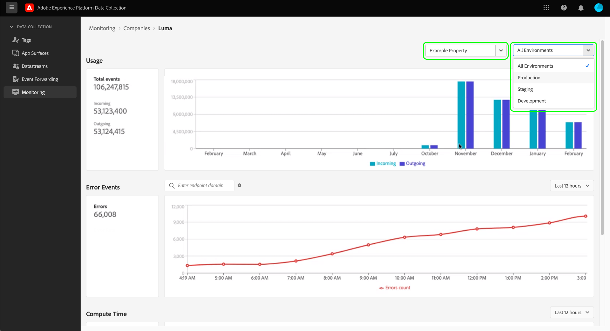

# Monitorare le attività nell’inoltro degli eventi (Beta)

>[!IMPORTANT]
>
>Questa funzione è attualmente in versione beta e la tua organizzazione potrebbe non averne ancora accesso. La funzionalità e la documentazione sono soggette a modifiche.

Il **[!UICONTROL Monitorare]** Nell’interfaccia utente di Data Collection puoi monitorare i pattern di utilizzo, gli errori e il tempo di calcolo delle proprietà di inoltro degli eventi. Questa guida fornisce una panoramica di alto livello su come visualizzare e comprendere i rapporti mostrati nella scheda.

## Prerequisiti

Questa guida presuppone che tu abbia acquistato l’inoltro di eventi e che tu abbia una buona conoscenza di come funziona l’inoltro di eventi. Consulta la [panoramica sull’inoltro degli eventi](./overview.md) per ulteriori informazioni.

## Video introduttivo

Il seguente video offre una panoramica generale della funzione di monitoraggio:

>[!VIDEO](https://video.tv.adobe.com/v/343999?quality=12&learn=on)

## Selezione di proprietà e ambienti

Puoi visualizzare le metriche all’interno di un singolo ambiente e di una singola proprietà oppure tra tutte le proprietà e gli ambienti di proprietà della tua organizzazione.

Per visualizzare le metriche per una singola proprietà, seleziona il menu a discesa delle proprietà e scegli la proprietà di interesse dall’elenco. Dopo aver scelto una proprietà, puoi anche utilizzare il menu a discesa dell’ambiente per selezionare un ambiente di tuo interesse.

## [!UICONTROL Utilizzo]

Il **[!UICONTROL Utilizzo]** Il rapporto mostra le chiamate in entrata e in uscita per un determinato periodo di tempo. Le chiamate in arrivo rappresentano i dati inviati all’inoltro di eventi. Le chiamate in uscita rappresentano i dati inviati dall’inoltro degli eventi. Il **[!UICONTROL Eventi totali]** numero nel riquadro a sinistra è la somma delle chiamate in entrata e in uscita per il periodo di tempo specificato.

## [!UICONTROL Eventi di errore]

Il **[!UICONTROL Eventi di errore]** Il rapporto mostra gli errori in forma aggregata e suddivisi per codice di risposta HTTP quando passi il cursore sul grafico a linee. Gli errori visualizzati provengono da chiamate in uscita e i codici di risposta provengono dall’endpoint con cui l’inoltro degli eventi interagisce.

Gli errori vengono visualizzati per un determinato periodo di tempo, che può essere regolato dal menu a discesa fornito.

La casella di ricerca dell’evento di errore consente di eseguire una query sull’inoltro degli eventi per comprendere gli errori relativi a un determinato dominio dell’endpoint. È necessario immettere il dominio esatto, in quanto la funzione di ricerca non accetta approssimazioni o corrispondenze &quot;fuzzy&quot;. Dopo aver fornito un dominio esatto per il quale sono presenti dati di errore in uscita, fai clic su Invio e il rapporto viene aggiornato per mostrare gli errori in uscita per tale dominio. Ad esempio, per visualizzare gli errori dall’endpoint API di conversione Facebook, il dominio deve essere scritto come `https://graph.facebook.com`.

## [!UICONTROL Tempo di calcolo]

Il **[!UICONTROL Tempo di calcolo]** Il rapporto mostra il tempo di calcolo di tutte le regole sui server di inoltro degli eventi.

>[!NOTE]
>
>Gli orari visualizzati non rappresentano una latenza end-to-end. L’inoltro degli eventi ha un limite di tempo di calcolo di 50 millisecondi. Se questo limite viene superato, i dati correlati verranno eliminati.

I seguenti fattori influiscono sul tempo di calcolo:

1. Numero di regole
2. La complessità delle regole, solitamente guidata dalla quantità di JavaScript personalizzato eseguito

Ad esempio, se un’azione nell’inoltro degli eventi arriva a un endpoint e la risposta a tale endpoint richiede due secondi, questa latenza di due secondi non verrà conteggiata nel tempo di calcolo perché l’inoltro degli eventi è solo in attesa e non calcola attivamente nulla. Il tempo di risposta non può superare i 30 secondi, altrimenti i dati verranno eliminati.
