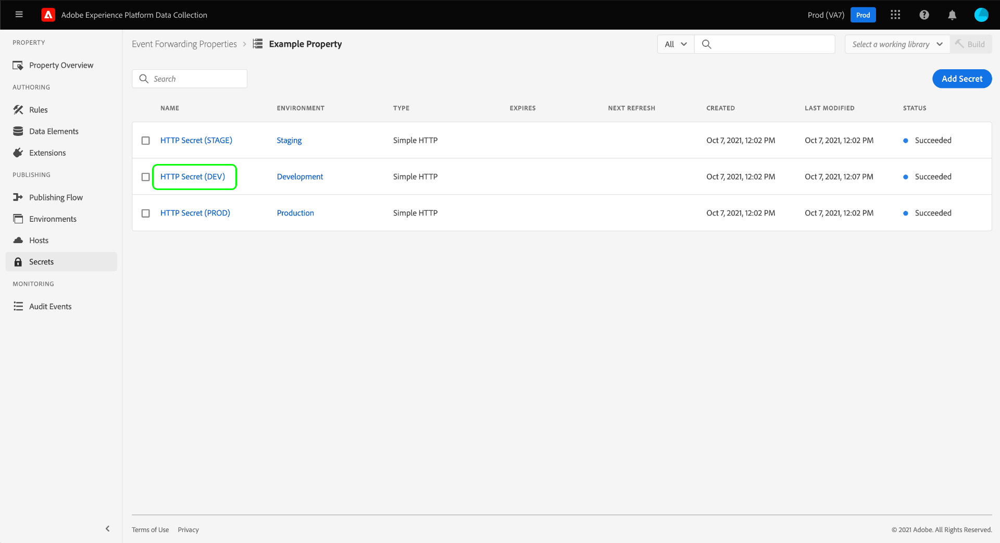

# Configurazione dei segreti nell’inoltro degli eventi

Nell’inoltro degli eventi, un segreto è una risorsa che rappresenta una credenziale di autenticazione per un altro sistema, consentendo lo scambio sicuro di dati. I segreti possono essere creati solo all’interno delle proprietà di inoltro degli eventi.

Sono attualmente supportati i seguenti tipi di segreto:

| Tipo di segreto | Descrizione |
| --- | --- |
| [!UICONTROL Google OAuth 2] | Contiene diversi attributi per supportare la specifica di autenticazione [OAuth 2.0](https://datatracker.ietf.org/doc/html/rfc6749) da utilizzare nelle [API Google Ads](https://developers.google.com/google-ads/api/docs/oauth/overview) e [API Pub/Sub](https://cloud.google.com/pubsub/docs/reference/service_apis_overview). Il sistema richiede le informazioni richieste, quindi gestisce il rinnovo di questi token per te in un intervallo specificato. |
| [!UICONTROL HTTP] | Contiene due attributi di stringa rispettivamente per nome utente e password. |
| [!UICONTROL [!DNL LinkedIn] OAuth 2] | Il sistema richiede le informazioni richieste, quindi gestisce il rinnovo di questi token per te in un intervallo specificato. |
| [!UICONTROL OAuth 2] | Contiene diversi attributi per supportare il tipo di concessione delle credenziali client  per la specifica di autenticazione [OAuth 2.0](https://datatracker.ietf.org/doc/html/rfc6749). Il sistema richiede le informazioni richieste, quindi gestisce il rinnovo di questi token per te in un intervallo specificato. |
| [!UICONTROL OAuth 2 JWT] | Contiene diversi attributi per supportare il profilo JSON Web Token (JWT) per [le autorizzazioni OAuth 2.0](https://datatracker.ietf.org/doc/html/rfc7523#section-2.1) concesse. Il sistema richiede le informazioni richieste, quindi gestisce il rinnovo di questi token per te in un intervallo specificato. |
| [!UICONTROL Token] | Una singola stringa di caratteri che rappresenta un valore del token di autenticazione noto e compreso da entrambi i sistemi. |

{style="table-layout:auto"}

Questa guida fornisce una panoramica di alto livello sulla configurazione dei segreti per una proprietà di inoltro eventi ([!UICONTROL Edge]) nell&#39;interfaccia utente di Experience Platform o nell&#39;interfaccia utente di Data Collection.

>[!NOTE]
>
>Per istruzioni dettagliate su come gestire i segreti nell&#39;API di Reactor, incluso un esempio di JSON della struttura di un segreto, consulta la [guida dell&#39;API dei segreti](../../api/guides/secrets.md).

## Prerequisiti

Questa guida presuppone che tu abbia già familiarità con le modalità di gestione delle risorse per i tag e l’inoltro di eventi nell’interfaccia utente, incluso come creare un elemento dati e una regola per l’inoltro di eventi. Se hai bisogno di un&#39;introduzione, consulta la guida su [gestione delle risorse](../managing-resources/overview.md).

È inoltre necessario avere una buona conoscenza del flusso di pubblicazione per i tag e l’inoltro degli eventi, incluso come aggiungere risorse a una libreria e installare una build sul sito web per i test. Per ulteriori dettagli, consulta la [panoramica sulla pubblicazione](../publishing/overview.md).

## Creare un segreto {#create}

>[!CONTEXTUALHELP]
>id="platform_eventforwarding_secrets_environments"
>title="Ambienti per segreti"
>abstract="Affinché un segreto possa essere utilizzato dall’inoltro eventi, deve essere assegnato a un ambiente esistente. Se non sono stati creati ambienti per la proprietà di inoltro eventi, devi configurarli prima di continuare."
>additional-url="https://experienceleague.adobe.com/docs/experience-platform/tags/publish/environments/environments.html?lang=it" text="Panoramica sugli ambienti"

Per creare un segreto, seleziona **[!UICONTROL Inoltro eventi]** nel menu di navigazione a sinistra, quindi apri la proprietà di inoltro eventi in cui desideri aggiungere il segreto. Quindi, seleziona **[!UICONTROL Segreti]** nell&#39;area di navigazione a sinistra, seguito da **[!UICONTROL Crea nuovo segreto]**.

La schermata successiva ti consente di configurare i dettagli del segreto. Affinché un segreto possa essere utilizzato dall’inoltro eventi, deve essere assegnato a un ambiente esistente. Se non hai creato ambienti per la proprietà di inoltro degli eventi, consulta la guida su [ambienti](../publishing/environments.md) per informazioni su come configurarli prima di continuare.

>[!NOTE]
>
>Se desideri comunque creare e salvare il segreto prima di aggiungerlo a un ambiente, disattiva l&#39;opzione **[!UICONTROL Allega segreto agli ambienti]** prima di inserire le altre informazioni. Se desideri utilizzare il segreto, in un secondo momento dovrai assegnarlo a un ambiente.
>
>

In **[!UICONTROL Ambiente di destinazione]**, utilizza il menu a discesa per selezionare l&#39;ambiente a cui assegnare il segreto. In **[!UICONTROL Nome segreto]**, fornisci un nome per il segreto nel contesto dell&#39;ambiente. Questo nome deve essere univoco in tutti i segreti nella proprietà di inoltro degli eventi.

Un segreto può essere assegnato a un solo ambiente alla volta, ma se lo desideri, puoi assegnare le stesse credenziali a più segreti in ambienti diversi. Selezionare **[!UICONTROL Aggiungi ambiente]** per aggiungere un&#39;altra riga all&#39;elenco.

Per ogni ambiente aggiunto, devi fornire un altro nome univoco per il segreto associato. Se si esauriscono tutti gli ambienti disponibili, il pulsante **[!UICONTROL Aggiungi ambiente]** non sarà disponibile.

Da qui, i passaggi per creare il segreto variano a seconda del tipo di segreto che stai creando. Per ulteriori informazioni, consulta le sottosezioni seguenti:

* [[!UICONTROL Token]](#token)
* [[!UICONTROL HTTP]](#http)
* [[!UICONTROL OAuth 2]](#oauth2)
* [[!UICONTROL OAuth 2 JWT]](#oauth2jwt)
* [[!UICONTROL Google OAuth 2]](#google-oauth2)
* [[!UICONTROL [!DNL LinkedIn] OAuth 2]](#linkedin-oauth2)

### [!UICONTROL Token] {#token}

Per creare un segreto token, seleziona **[!UICONTROL Token]** dal menu a discesa **[!UICONTROL Tipo]**. Nel campo **[!UICONTROL Token]** visualizzato, fornire la stringa di credenziali riconosciuta dal sistema a cui si sta eseguendo l&#39;autenticazione. Seleziona **[!UICONTROL Crea segreto]** per salvare il segreto.

### [!UICONTROL HTTP] {#http}

Per creare un segreto HTTP, selezionare **[!UICONTROL HTTP semplice]** dal menu a discesa **[!UICONTROL Tipo]**. Nei campi visualizzati di seguito, fornire un nome utente e una password per le credenziali prima di selezionare **[!UICONTROL Crea segreto]** per salvare il segreto.

>[!NOTE]
>
>Al momento del salvataggio, le credenziali vengono codificate utilizzando lo schema di autenticazione HTTP [&quot;Basic&quot;](https://www.rfc-editor.org/rfc/rfc7617.html).

### [!UICONTROL OAuth 2] {#oauth2}

Per creare un segreto OAuth 2, seleziona **[!UICONTROL OAuth 2]** dal menu a discesa **[!UICONTROL Tipo]**. Fornisci [[!UICONTROL ID client] e [!UICONTROL Segreto client]](https://www.oauth.com/oauth2-servers/client-registration/client-id-secret/) nei campi seguenti, nonché l&#39;[[!UICONTROL URL token]](https://www.oauth.com/oauth2-servers/access-tokens/client-credentials/) per l&#39;integrazione OAuth. Il campo [!UICONTROL URL token] nell&#39;interfaccia utente è una concatenazione tra l&#39;host del server autorizzazioni e il percorso del token.

In **[!UICONTROL Opzioni credenziali]** è possibile fornire altre opzioni delle credenziali, ad esempio `scope` e `audience` sotto forma di coppie chiave-valore. Per aggiungere altre coppie chiave-valore, selezionare **[!UICONTROL Aggiungi un&#39;altra]**.

Infine, puoi configurare il valore **[!UICONTROL Offset aggiornamento]** per il segreto. Rappresenta il numero di secondi prima della scadenza del token durante i quali il sistema eseguirà un aggiornamento automatico. Il tempo equivalente in ore e minuti viene visualizzato a destra del campo e viene aggiornato automaticamente durante la digitazione.

Ad esempio, se l&#39;offset di aggiornamento è impostato sul valore predefinito di `14400` (quattro ore) e il token di accesso ha un valore `expires_in` di `86400` (24 ore), il sistema aggiornerà automaticamente il segreto tra 20 ore.

>[!IMPORTANT]
>
>Un segreto OAuth richiede almeno quattro ore tra un aggiornamento e l’altro e deve anche essere valido per almeno otto ore. Questa limitazione ti consente di intervenire per un minimo di quattro ore in caso di problemi con il token generato.
>
>Ad esempio, se l&#39;offset è impostato su `28800` (otto ore) e il token di accesso ha un `expires_in` di `36000` (dieci ore), lo scambio non riuscirà perché la differenza risultante sarà inferiore a quattro ore.

Al termine, selezionare **[!UICONTROL Crea segreto]** per salvare il segreto.

### [!UICONTROL OAuth 2 JWT] {#oauth2jwt}

Per creare un segreto JWT OAuth 2, seleziona **[!UICONTROL OAuth 2 JWT]** dal menu a discesa **[!UICONTROL Tipo]**.

![Scheda [!UICONTROL Crea segreto] con il segreto JWT OAuth 2 evidenziato nel menu a discesa [!UICONTROL Tipo].](../../images/ui/event-forwarding/secrets/oauth-jwt-secret.png)

>[!NOTE]
>
>L&#39;unico [!UICONTROL algoritmo] attualmente supportato per la firma del codice JWT è RS256.

Nei campi visualizzati di seguito, fornisci le [!UICONTROL Attestazioni personalizzate], [!UICONTROL TTL] di [!UICONTROL Issuer], [!UICONTROL Subject], [!UICONTROL Audience], [!UICONTROL Algorithm] dal menu a discesa. Quindi, immetti l&#39;[!UICONTROL ID chiave privata] e l&#39;[[!UICONTROL URL token]](https://www.oauth.com/oauth2-servers/access-tokens/client-credentials/) per l&#39;integrazione OAuth. Il campo [!UICONTROL URL token] non è obbligatorio. Se viene fornito un valore, il JWT viene scambiato con un token di accesso. Il segreto verrà aggiornato in base all&#39;attributo `expires_in` della risposta e al valore [!UICONTROL Aggiorna offset]. Se non viene fornito un valore, il segreto inviato al bordo è il JWT. Il codice JWT verrà aggiornato in base ai valori [!UICONTROL TTL] e [!UICONTROL Refresh Offset].

![Scheda [!UICONTROL Crea segreto] con una selezione di campi di input evidenziati.](../../images/ui/event-forwarding/secrets/oauth-jwt-information.png)

In **[!UICONTROL Opzioni credenziali]** è possibile fornire altre opzioni delle credenziali, ad esempio `jwt_param` sotto forma di coppie chiave-valore. Per aggiungere altre coppie chiave-valore, selezionare **[!UICONTROL Aggiungi un&#39;altra]**.

![La scheda [!UICONTROL Crea segreto] evidenzia i campi [!UICONTROL Opzioni credenziali].](../../images/ui/event-forwarding/secrets/oauth-jwt-credential-options.png)

Infine, puoi configurare il valore **[!UICONTROL Offset aggiornamento]** per il segreto. Rappresenta il numero di secondi prima della scadenza del token durante i quali il sistema eseguirà un aggiornamento automatico. Il tempo equivalente in ore e minuti viene visualizzato a destra del campo e viene aggiornato automaticamente durante la digitazione.

![Scheda [!UICONTROL Crea segreto] che evidenzia il campo [!UICONTROL Aggiorna offset].](../../images/ui/event-forwarding/secrets/oauth-jwt-refresh-offset.png)

Ad esempio, se l&#39;offset di aggiornamento è impostato sul valore predefinito di `1800` (30 minuti) e il token di accesso ha un valore `expires_in` di `3600` (un&#39;ora), il sistema aggiornerà automaticamente il segreto in un&#39;ora.

>[!IMPORTANT]
>
>Un segreto JWT OAuth 2 richiede almeno 30 minuti tra un aggiornamento e l’altro e deve anche essere valido per almeno un’ora. Questa limitazione ti consente di intervenire per un minimo di 30 minuti in caso di problemi con il token generato.
>
>Ad esempio, se l&#39;offset è impostato su `1800` (30 minuti) e il token di accesso ha un `expires_in` di `2700` (45 minuti), lo scambio non riuscirà perché la differenza risultante sarà inferiore a 30 minuti.

Al termine, selezionare **[!UICONTROL Crea segreto]** per salvare il segreto.

![La scheda [!UICONTROL Crea segreto] evidenzia [!UICONTROL Crea segreto]](../../images/ui/event-forwarding/secrets/oauth-jwt-create-secret.png)

### [!UICONTROL Google OAuth 2] {#google-oauth2}

Per creare un segreto Google OAuth 2, seleziona **[!UICONTROL Google OAuth 2]** dal menu a discesa **[!UICONTROL Tipo]**. In **[!UICONTROL Ambiti]**, selezionare le API Google a cui si desidera concedere l&#39;accesso con questo segreto. Sono attualmente supportati i seguenti prodotti:

* [API Google Ads](https://developers.google.com/google-ads/api/docs/oauth/overview)
* [API Pub/Sub](https://cloud.google.com/pubsub/docs/reference/service_apis_overview)

Al termine, selezionare **[!UICONTROL Crea segreto]**.

Viene visualizzato un messaggio che informa che il segreto deve essere autorizzato manualmente tramite Google. Seleziona **[!UICONTROL Crea e autorizza]** per continuare.

Viene visualizzata una finestra di dialogo che consente di immettere le credenziali per l’account Google. Segui le istruzioni per concedere l’accesso all’inoltro degli eventi ai tuoi dati nell’ambito selezionato. Una volta completato il processo di autorizzazione, viene creato il segreto.

>[!IMPORTANT]
>
>Se nell’organizzazione è impostato un criterio di riautenticazione per le applicazioni Google Cloud, i segreti creati non vengono aggiornati correttamente alla scadenza dell’autenticazione (tra 1 e 24 ore a seconda della configurazione del criterio).
>
>Per risolvere il problema, accedi a Google Admin Console e passa alla pagina **[!DNL App access control]** per contrassegnare l&#39;app di inoltro eventi (Adobe Real-Time CDP Event Forwarding) come [!DNL Trusted]. Per ulteriori informazioni, consulta la documentazione di Google sull&#39;[impostazione della durata delle sessioni per i servizi Google Cloud](https://support.google.com/a/answer/9368756).

### [!UICONTROL [!DNL LinkedIn] OAuth 2] {#linkedin-oauth2}

Per creare un segreto OAuth 2 [!DNL LinkedIn], seleziona **[!UICONTROL [!DNL LinkedIn]OAuth 2]** dal menu a discesa **[!UICONTROL Tipo]**. Selezionare **[!UICONTROL Crea segreto]**.

![Scheda [!UICONTROL Crea segreto] con il campo [!UICONTROL Tipo] evidenziato.](../../images/ui/event-forwarding/secrets/linkedin-oauth.png)

Viene visualizzato un messaggio che informa che il segreto deve essere autorizzato manualmente tramite [!DNL LinkedIn]. Seleziona **[!UICONTROL Crea e autorizza segreto con[!DNL LinkedIn]]** per continuare.

![[!DNL LinkedIn] elemento a comparsa autorizzazione che evidenzia [!UICONTROL Crea e autorizza segreto con [!DNL LinkedIn]].](../../images/ui/event-forwarding/secrets/linkedin-authorization.png)

Viene visualizzata una finestra di dialogo in cui viene richiesto di immettere le credenziali [!DNL LinkedIn]. Segui le istruzioni per concedere l’accesso ai tuoi dati con inoltro eventi.

Una volta completato il processo di autorizzazione, si torna alla scheda **[!UICONTROL Segreti]**, dove è possibile visualizzare il segreto appena creato. Qui puoi vedere lo stato del segreto e la data di scadenza.

![La scheda [!UICONTROL Segreto] evidenzia il segreto appena creato.](../../images/ui/event-forwarding/secrets/linkedin-new-secret.png)

#### Autorizza nuovamente un segreto OAuth 2] [!UICONTROL [!DNL LinkedIn]

>IMPORTANTE
>
>È necessario ripetere l&#39;autorizzazione utilizzando le credenziali [!DNL LinkedIn] ogni 365 giorni. Se non esegui la nuova autorizzazione in tempo debito, il segreto non verrà aggiornato e le richieste di conversione [!DNL LinkedIn] non riusciranno.

Tre mesi prima del segreto che richiede la riautorizzazione, quando visiti una pagina della proprietà inizia a essere visualizzato un pop-up. Seleziona **[!UICONTROL Fai clic qui per accedere ai tuoi segreti]**.

![La scheda [!UICONTROL Panoramica proprietà] evidenzia il popup di ri-autorizzazione segreto.](../../images/ui/event-forwarding/secrets/linkedin-reauthorization-popup.png)

Sei stato reindirizzato alla scheda [!UICONTROL Segreti]. I segreti elencati in questa pagina vengono filtrati in modo da mostrare solo i segreti che devono essere nuovamente autorizzati. Seleziona **[!UICONTROL Autorizzazione richiesta]** per il segreto da riautorizzare.

![Scheda [!UICONTROL Segreto] che evidenzia [!UICONTROL Autenticazione richiesta]per il segreto [!DNL LinkedIn].](../../images/ui/event-forwarding/secrets/linkedin-reauthorization.png)

Viene visualizzata una finestra di dialogo in cui viene richiesto di immettere le credenziali [!DNL LinkedIn]. Segui le istruzioni per autorizzare nuovamente il segreto.

## Modifica un segreto

Dopo aver creato i segreti per una proprietà, puoi trovarli elencati nell&#39;area di lavoro **[!UICONTROL Segreti]**. Per modificare i dettagli di un segreto esistente, selezionarne il nome dall&#39;elenco.

La schermata successiva consente di modificare il nome e le credenziali per il segreto.

>[!NOTE]
>
>Se il segreto è associato a un ambiente esistente, non è possibile riassegnarlo a un altro ambiente. Se desideri utilizzare le stesse credenziali in un ambiente diverso, devi [creare un nuovo segreto](#create). L’unico modo per riassegnare l’ambiente da questa schermata è se non hai mai assegnato in precedenza il segreto a un ambiente o se hai eliminato l’ambiente a cui era associato il segreto.

### Riprovare uno scambio segreto

Puoi riprovare o aggiornare uno scambio segreto dalla schermata di modifica. Questo processo varia a seconda del tipo di segreto da modificare:

| Tipo di segreto | Ritenta protocollo |
| --- | --- |
| [!UICONTROL Token] | Selezionare **[!UICONTROL Segreto Exchange]** per ritentare lo scambio segreto. Questo controllo è disponibile solo quando è presente un ambiente associato al segreto. |
| [!UICONTROL HTTP] | Se al segreto non è associato alcun ambiente, selezionare **[!UICONTROL Segreto Exchange]** per scambiare le credenziali in base64. Se un ambiente è collegato, selezionare **[!UICONTROL Exchange e Distribuisci segreto]** per scambiare in base64 e distribuire il segreto. |
| [!UICONTROL OAuth 2] | Selezionare **[!UICONTROL Genera token]** per scambiare le credenziali e restituire un token di accesso dal provider di autenticazione. |

## Eliminare un segreto

Per eliminare un segreto esistente nell&#39;area di lavoro **[!UICONTROL Segreti]**, selezionare la casella di controllo accanto al nome prima di selezionare **[!UICONTROL Elimina]**.

## Utilizzo dei segreti nell’inoltro degli eventi

Per utilizzare un segreto nell&#39;inoltro degli eventi, è necessario innanzitutto creare un [elemento dati](../managing-resources/data-elements.md) che faccia riferimento al segreto stesso. Dopo aver salvato l&#39;elemento dati, puoi includerlo nell&#39;inoltro degli eventi [regole](../managing-resources/rules.md) e aggiungere tali regole a una [libreria](../publishing/libraries.md), che a sua volta può essere distribuita ai server di Adobe come [build](../publishing/builds.md).

Durante la creazione dell&#39;elemento dati, seleziona l&#39;estensione **[!UICONTROL Core]**, quindi seleziona **[!UICONTROL Segreto]** per il tipo di elemento dati. Il pannello a destra aggiorna e fornisce controlli a discesa per assegnare fino a tre segreti all&#39;elemento dati: uno per [!UICONTROL Sviluppo], [!UICONTROL Gestione temporanea] e [!UICONTROL Produzione] rispettivamente.

>[!NOTE]
>
>Solo i segreti allegati agli ambienti di sviluppo, staging e produzione vengono visualizzati per i rispettivi elenchi a discesa.

Assegnando più segreti a un singolo elemento dati e includendolo in una regola, il valore dell&#39;elemento dati può cambiare a seconda di dove si trova la libreria contenitore nel [flusso di pubblicazione](../publishing/publishing-flow.md).

>[!NOTE]
>
>Durante la creazione dell’elemento dati, è necessario assegnare un ambiente di sviluppo. Non sono necessari segreti per gli ambienti di staging e produzione, ma le build che tentano di passare a tali ambienti avranno esito negativo se i loro elementi di dati di tipo segreto non hanno un segreto selezionato per l’ambiente in questione.

## Passaggi successivi

Questa guida illustra come gestire i segreti nell’interfaccia utente di. Per informazioni su come interagire con i segreti utilizzando l&#39;API di Reactor, consulta la [guida dell&#39;endpoint dei segreti](../../api/endpoints/secrets.md).
