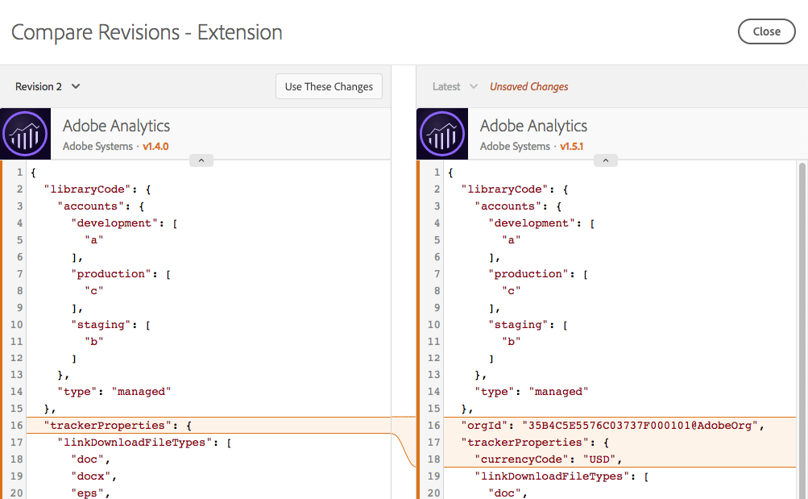

# Confrontare le revisioni delle risorse

>[!NOTE]
>
>Adobe Experience Platform Launch è stato ridefinito come suite di tecnologie di raccolta dati in Adobe Experience Platform. Di conseguenza, sono state introdotte diverse modifiche terminologiche nella documentazione del prodotto. Consulta questo [documento](../../term-updates.md) come riferimento consolidato delle modifiche terminologiche.

Confronta le revisioni di risorse per visualizzare la cronologia di una singola risorsa. Puoi confrontare lo stato corrente della risorsa con le versioni precedenti, oppure la versione pubblicata di una risorsa con quella più recente salvata.

## Avviare un confronto

L&#39;avvio di un confronto è lo stesso per tutti i tipi di risorse. Apri la vista Modifica per una singola risorsa, quindi individua l’icona dei tre puntini accanto al pulsante **[!UICONTROL Salva]** per visualizzare le azioni disponibili per tale risorsa. Seleziona **[!UICONTROL Confronta revisioni]** dall’elenco.

Per le estensioni, puoi accedere alla vista dei dettagli facendo clic sul pulsante **[!UICONTROL Configura]** quando viene visualizzato l’elenco delle estensioni installate.  Per elementi e regole dati, selezionane uno dall&#39;elenco.

## Utilizzo della vista Confronto

Quando avvii un confronto, la vista predefinita mostra la versione più recente a destra. Questa versione include tutte le modifiche non salvate apportate alla risorsa nella vista Modifica. (Osserva l&#39;etichetta &quot;Modifiche non salvate&quot; a destra nell&#39;illustrazione di seguito).

A sinistra, puoi scegliere tra le revisioni esistenti da confrontare con &quot;Più recente&quot;.

Seleziona **[!UICONTROL Utilizza queste modifiche]** per copiare le impostazioni dalla revisione selezionata (a sinistra) alla versione più recente (a destra). Le impostazioni vengono copiate dalla precedente revisione alle ultime modifiche non salvate. Se desideri che queste modifiche rimangano invariate, fai clic su **[!UICONTROL Salva]** a seguito dell’uscita dalla vista Confronta.

>[!TIP]
>Le singole risorse possono disporre sia attributi che di impostazioni. Queste impostazioni sono memorizzate come block JSON: un modo strutturato per archiviare i dati, ma sufficientemente flessibile da consentire agli sviluppatori di estensioni di mettere a disposizione tutte le attività necessarie per fare ciò che desiderano.
>La versione iniziale della vista Confronto visualizza le impostazioni nel modulo grezzo come JSON. I miglioramenti futuri consentiranno di visualizzare le versioni in diversi modi, inclusi i confronti dettagliati di codice e l&#39;utilizzo di viste delle estensioni fornite dagli sviluppatori.

## Confronto delle estensioni

Le estensioni dispongono di una singola schermata per mostrare le differenze tra versioni.

Nella vista Confronto, vengono evidenziate le differenze tra le versioni delle impostazioni. Le aggiunte e le rimozioni a singole impostazioni vengono indicate da un&#39;espansione di una linea in entrambe le direzioni.

In precedenza, si possono vedere le seguenti modifiche:

* L&#39;estensione [!DNL Adobe Analytics] viene aggiornata a una nuova versione, indicata dai numeri di versione arancioni nella parte superiore.
* `orgID` e `currencyCode` vengono modificati secondo le impostazioni indicate dall&#39;espansione della sezione arancione nelle impostazioni.

## Confronto degli elementi dati

Gli elementi dati hanno una sola schermata per mostrare le differenze, ma poiché dispongono di attributi aggiuntivi oltre alle relative impostazioni, vengono visualizzate ulteriori informazioni. Gli attributi modificati vengono evidenziati in arancione.

In precedenza, si possono vedere le seguenti modifiche:

* Il nome viene modificato da &quot;Nome pagina 2&quot; a &quot;Nome pagina speciale&quot;, come indicato dalla barra arancione.
* Il tipo viene modificato da Variabile JavaScript a Informazioni pagina.
* È stato aggiunto il valore predefinito &quot;b&quot;.
* È stato selezionato &quot;Forza valore minuscolo&quot;.
* È stato selezionato &quot;Testo pulito&quot;.
* Le impostazioni sono state modificate. (Le impostazioni per il tipo di Variabile JavaScript sono diverse dal tipo Informazioni pagina.)

Se il blocco delle impostazioni è elevato, puoi espandere la sezione delle impostazioni per visualizzarla meglio.

## Confronto delle regole

Le regole sono costituite da molti componenti della regola. Per comprendere le modifiche apportate a una regola, è necessario conoscere l&#39;aggiunta e la rimozione dei componenti nonché le modifiche a un singolo componente. Quindi, quando confronti le versioni di una regola, sono presenti due schermate.

La prima schermata mostra una vista di alto livello, che evidenzia le modifiche alla disposizione dei componenti regola all&#39;interno della regola. Vengono evidenziate le modifiche. Vengono visualizzati diversi tipi di modifiche.

In precedenza, si possono vedere le seguenti modifiche:

* Il nome della regola è cambiato da &quot;Analytics&quot; a &quot;Linea di base Analytics&quot;, indicato dalla barra arancione ome Nome.
* È stata aggiunta la condizione &quot;Core - Dominio&quot;, indicata dall&#39;icona arancione &quot;+&quot; e dall&#39;aggiunta del componente a destra.
* L&#39;azione &quot;[!DNL Adobe Analytics] - Cancella variabili&quot; è stata rimossa, indicata dall&#39;icona arancione &quot;-&quot; e dall&#39;assenza del componente a destra.
* L&#39;azione &quot;[!DNL Adobe Analytics] - Imposta variabili&quot; è stata modificata; indicata dalla linea arancione tra le versioni del componente a sinistra e a destra. Questa linea è retta se l&#39;ordine dei componenti non è stato modificato.
* L&#39;ordine delle azioni &quot;[!DNL Adobe Analytics] - Imposta variabili&quot; e &quot;[!DNL Adobe Analytics] - Invia beacon&quot; è stato modificato, indicato dalle linee curve che consentono di collegare le diverse versioni dei componenti a sinistra e a destra

Per visualizzare le modifiche specifiche di uno dei componenti della regola, seleziona il componente in questione. Quando passi il mouse, la linea diventa blu.

Il confronto per un singolo componente della regola si comporta come il confronto per un elemento dati.

In precedenza, si può vedere la seguente modifica:

* Il componente della regola è stato modificato per aggiungere eVar2 con un valore pari a &quot;1&quot;.

Se il blocco delle impostazioni è elevato, puoi espandere la sezione delle impostazioni per visualizzarla meglio.
