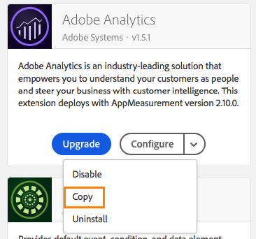
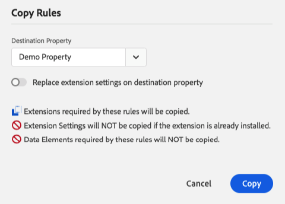

# Copiare le risorse

>[!NOTE]
>
>Adobe Experience Platform Launch è stato classificato come una suite di tecnologie di raccolta dati in Adobe Experience Platform. Di conseguenza, sono state introdotte diverse modifiche terminologiche nella documentazione del prodotto. Consulta questo [documento](../../term-updates.md) come riferimento consolidato delle modifiche terminologiche.

A volte è utile creare una nuova risorsa utilizzando le impostazioni di una risorsa esistente. In questi casi, puoi fare una copia.

È possibile copiare proprietà, estensioni, regole ed elementi di dati.

Copiare una risorsa crea un duplicato della stessa nella destinazione specificata. Questa è un&#39;azione facoltativa e occasionale; non esiste alcuna relazione continuativa tra la risorsa originale e le copie effettuate.

## Avviare una copia

Per avviare la copia di un’estensione, visualizza le estensioni installate, fai clic sulla freccia a discesa sul pulsante **[!UICONTROL Configura]** e seleziona **[!UICONTROL Copia]**.

Per proprietà, regole ed elementi dati, seleziona la risorsa da copiare, quindi fai clic sul pulsante **[!UICONTROL Copia]** nel menu delle azioni.

Se copi una regola o un elemento dati, nella finestra di dialogo di copia puoi utilizzare il menu a discesa per selezionare una proprietà di destinazione in cui desideri copiare (l&#39;impostazione predefinita è la proprietà corrente). Le estensioni non possono essere copiate nella stessa proprietà, pertanto queste non forniscono tale opzione.

>[!NOTE]
>
>Non è possibile copiare le risorse in un&#39;altra proprietà se una di queste è configurata per lo sviluppo dell&#39;estensione e l&#39;altra non lo è.

Dopo aver configurato il comportamento desiderato, fai clic su **[!UICONTROL Copia]**.

## Copia delle proprietà

Quando crei una copia di una proprietà completa, ci sono alcuni aspetti del processo che dovresti capire.

* Le impostazioni delle proprietà verranno copiate esattamente come sono (domini, impostazioni avanzate, ecc.)
* Regole, elementi dati ed estensioni dall&#39;interno della proprietà di origine verranno copiati nella nuova proprietà target. Gli adattatori, gli ambienti e le librerie non verranno copiati.
* Le estensioni richieste (necessarie da qualsiasi elemento dati o componente regola esistente) verranno copiate nella proprietà target anche se sono state disinstallate dalla proprietà di origine.
* La copia di una proprietà può richiedere alcuni minuti. Questo avviene in background. Puoi monitorare l’avanzamento della copia o continuare con altre attività mentre questa viene eseguita.
* Se modifichi una singola risorsa dopo che è già stata copiata nella proprietà target (ma prima che la copia sia stata completata), le nuove modifiche non verranno copiate.

## Copia delle estensioni

Quando copi un&#39;estensione in un&#39;altra proprietà ci sono degli elementi che dovresti capire.

* Se nella proprietà di destinazione l&#39;estensione non è installata, verrà fatto utilizzando le stesse impostazioni della proprietà di origine.
* Se l&#39;estensione è già installata nella proprietà di destinazione, verranno copiate solo le impostazioni.
* Se nella proprietà di destinazione è installata una versione precedente dell&#39;estensione, riceverai un avviso che informa sulla necessità di aggiornare l&#39;estensione nella proprietà di destinazione prima di creare la copia. Gli sviluppatori delle estensioni possono aggiungere impostazioni alle loro estensioni nel tempo, pertanto le impostazioni di un&#39;estensione più recente non possono essere applicate in modo affidabile alle versioni precedenti.
* Se nella proprietà di destinazione è installata una versione successiva dell&#39;estensione, le impostazioni vengono copiate ma non viene eseguito alcun downgrade. La proprietà di destinazione mantiene il numero di versione corrente.

## Copia delle regole e degli elementi dati

Tutte le regole e gli elementi dati vengono forniti da un’estensione; pertanto, quando crei una copia da una proprietà a un’altra, Platform deve tenere conto delle estensioni sottostanti.

 Prima di iniziare la copia, la finestra di dialogo Copia fornisce una spiegazione di ciò che verrà eseguito. La finestra di dialogo precedente è per una regola, ma lo stesso vale per gli elementi dati.

1. **Le estensioni richieste da queste regole vengono copiate.** Questo permette di sapere che le estensioni richieste andranno di pari passo con la regola. Queste copie seguono le stesse regole di una normale copia dell&#39;estensione descritta in precedenza.
1. **Le impostazioni dell&#39;estensione NON verranno copiate se questa è già installata.** Ciò significa che se le estensioni necessarie esistono già nella proprietà di destinazione, l&#39;estensione rimane invariata. Se desideri copiare anche le impostazioni di estensione puoi utilizzare l&#39;interruttore **Sostituisci le impostazioni dell&#39;estensione nella proprietà di destinazione** e la spiegazione viene aggiornata di conseguenza.
1. **Gli elementi dati richiesti da queste regole NON verranno copiati.** Questa spiegazione si applica solo alle regole. Le regole si basano spesso su elementi dati per funzionare correttamente. Se copi una regola in una nuova proprietà, devi copiare anche gli elementi dati richiesti come azione separata.
