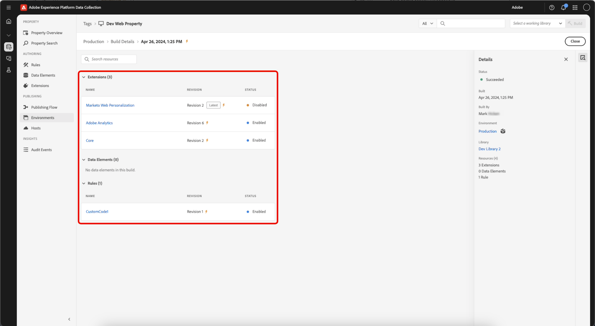

# Build

Una build è il set di file contenente tutto il codice che viene eseguito sul dispositivo client.

Si tratta di un composito delle modifiche specificate all’interno della libreria, nonché di tutte le operazioni inviate, approvate o pubblicate prima di tale modifica.

La build consiste in file di codice lato client che si riferiscono a l&#39;uno all&#39;altro. Questi file vengono inviati alla tua posizione di hosting utilizzando l&#39;ambiente e l&#39;host scelti per la libreria. Il codice distribuito sul sito fa riferimento a questa stessa posizione, in modo che i file possano essere caricati quando un utente accede al sito o all&#39;applicazione.

## Contenuto del file {#file-contents}

Una libreria definisce un set discreto di risorse tag (estensioni, regole ed elementi dati) che devono essere incluse al suo interno.

Una build contiene tutto il codice del modulo (fornito dagli sviluppatori dell’estensione) e la configurazione (inserita dall’utente) necessaria per abilitare le risorse contenute nella libreria. Ad esempio, se un’estensione fornisce azioni non utilizzate nelle tue regole, il codice per eseguire tali azioni non è contenuto nella build.

Le Build sono suddivise nel file della libreria principale e in molti file di dimensioni più ridotte. Il file della libreria principale è menzionato nel tuo codice da incorporare e caricato sulla pagina in fase di esecuzione. Contiene:

* Il motore regole
* Tutte le configurazioni Extension
* Tutto il codice e la configurazione degli elementi dati
* Tutto il codice Evento e la configurazione della regola
* Tutto il codice e la configurazione della Condizione
* Codice evento e configurazione per tutte le regole che hanno come evento Libreria caricata o Fine pagina (poiché sappiamo che ne avremo subito bisogno).

I file più piccoli contengono codice e configurazione per singole Azioni caricate sulla pagina, in base alle esigenze. Quando una Regola viene attivata e le sue Condizioni sono valutate in modo tale che le azioni debbano essere eseguite, il codice e la configurazione necessari per quella specifica azione vengono recuperati da uno dei file più piccoli. Questo significa che solo il codice necessario per eseguire le azioni richieste viene caricato sulla pagina, rendendo la libreria principale il più piccola possibile.

## Formato file {#file-format}

Il formato predefinito del file per le build è un pacchetto di file che contiene tutto il codice necessario affinché le estensioni, gli elementi dati e le regole vengano eseguiti nel modo desiderato.

Tuttavia, in alcuni casi, potrebbe essere preferibile un archivio .zip dei file anziché il file di codice lato client eseguibile. Ad esempio, potrebbe essere utile creare un archivio se ospiti autonomamente la build e si desideri utilizzare la build in un&#39;altra distribuzione. Se fornisci qualcosa nel percorso self-hosted al campo libreria, puoi salvare il tuo ambiente. Assieme al nuovo codice, diventa disponibile un collegamento al download archiviato. Una volta creata la libreria, puoi distribuire un file zip in Akamai e scaricarlo da `assets.adobedtm.com/...`.

>[!NOTE]
>
>Nella posizione specificata non esiste nulla finché non viene creata una build.

Indipendentemente dal formato del file, la build viene sempre distribuita nella posizione specificata dall&#39;Host.

Per completare una build, seleziona una libreria e fai clic sull&#39;opzione Build disponibile a tale livello del processo di pubblicazione (Build per sviluppo, Build per staging e così via).

## Minimizzazione {#minification}

La minimizzazione riduce i costi di larghezza di banda e migliora la velocità eliminando i dati non necessari per l&#39;esecuzione da un file.

Per migliorare le prestazioni, Experience Platform consente di minimizzare qualsiasi cosa, tra cui:

* La libreria tag principale
* Il codice modulo fornito dagli sviluppatori di estensioni come parte di un’estensione
* Il codice personalizzato fornito dagli utenti di Experience Platform

>[!NOTE]
>
>Se il codice modulo e il codice personalizzato sono già ridotti, Experience Platform li minimizza nuovamente. Questa seconda minimizzazione non fornisce vantaggi aggiuntivi, ma non causa danni e rende Experience Platform meno complesso e di facile gestione.

Eventuale codice lato client fornito fa riferimento alla versione minimizzata del codice. Questo è visibile nei nomi dei file che seguono la convenzione di denominazione standard per i file minimizzati:

`launch-%environment_id%.min.js`

Se desideri visualizzare il codice non minimizzato, rimuovi .min dal nome file:

`launch-%environment_id%.js`

Se uno sviluppatore di estensioni fornisce codici minimizzati con la propria estensione, Experience Platform non fornisce codice non minimizzato nella build non minimizzata. Analogamente, se un utente di Experience Platform inserisce un codice ridotto in una casella di codice personalizzata, tale codice viene ancora ridotto in una build non minimizzata. Experience Platform non annulla alcuna minimizzazione.

Per ulteriori informazioni sulla minimizzazione, consulta [questo articolo su Stackpath](https://blog.stackpath.com/glossary/minification/).

Quando si esegue una build, per prima cosa viene creata la libreria non minimizzata, quindi viene minimizzata l’intera libreria.

## Visualizzare i dettagli della build {#build-details}

>[!IMPORTANT]
>
>Una libreria memorizza le revisioni delle risorse tag, ma una **Build** è un&#39;istantanea point-in-time della libreria contenente i file recapitati al sito.

È possibile accedere alle build e ai relativi dettagli da una **libreria** o da un **ambiente** per visualizzare le build live correnti e verificare cosa contiene una build (estensioni, elementi dati e regole).

### Visualizzare i dettagli della build da una libreria

Nella proprietà dei tag, apri **[!UICONTROL Publishing Flow]** e seleziona una libreria.

Nel pannello dei dettagli, potete esaminare quanto segue:

* **[!UICONTROL Last Build Environment]** — Collegamento all&#39;ambiente che ha ricevuto l&#39;ultima build. Indica se questa libreria è la build corrente per l&#39;ambiente (**Corrente** o **Non corrente**).
* **[!UICONTROL Current Builds]** — Build attualmente attive nei relativi ambienti. Per le librerie pubblicate, la build di produzione live è indicata dall’icona a forma di fulmine in questa sezione.
* Per ogni build elencata, puoi visualizzare:
   * **[!UICONTROL Status]** - Quando è stata creata la build.
   * **[!UICONTROL Environment]**: l&#39;ambiente in cui è stata distribuita la build.
   * **[!UICONTROL User]** - Utente che ha creato la build.

### Visualizzare le build da un ambiente

Una build è associata a un ambiente e alla libreria creata per tale ambiente. La build è ciò che contiene effettivamente le risorse compilate.

Selezionare **[!UICONTROL Environment]** dal pannello dei dettagli. Il pannello Dettagli dell’ambiente mostra un elenco delle build recenti, della build live corrente e delle librerie correlate.

Quindi, seleziona una build per aprirne i dettagli. I dettagli della build mostrano le **Estensioni**, **Elementi dati** e **Regole** incluse nella build.

>[!NOTE]
>
>Una build può includere più risorse di quelle elencate nella sola libreria. Le **Estensioni**, **Elementi dati** e **Regole** incluse nella build includono il contenuto della libreria e il contenuto a monte. È l’istantanea completa che viene pubblicata sul sito o sull’app.

Utilizzare il pannello dei dettagli per tornare a **[!UICONTROL Environment]** o **[!UICONTROL Library]**.
