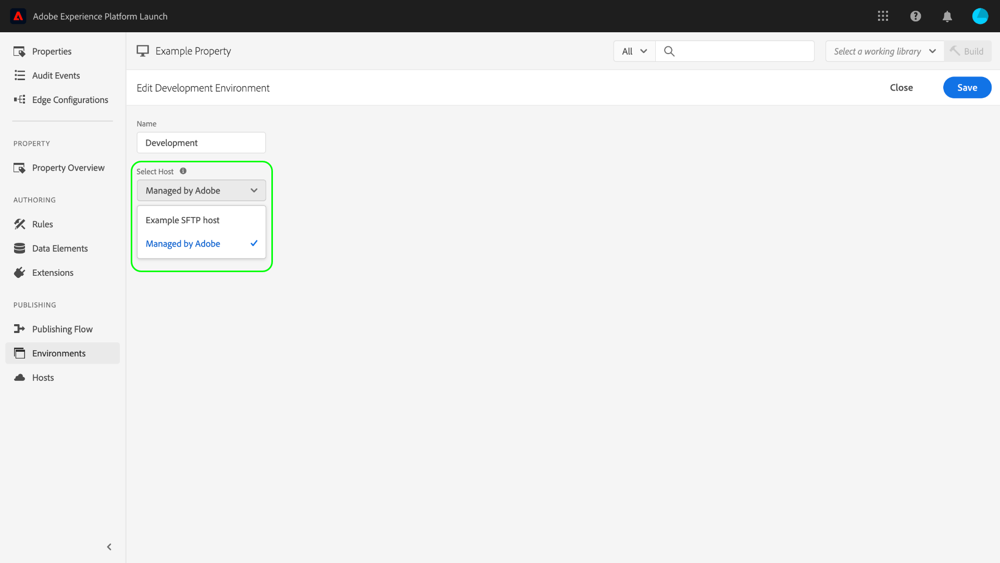
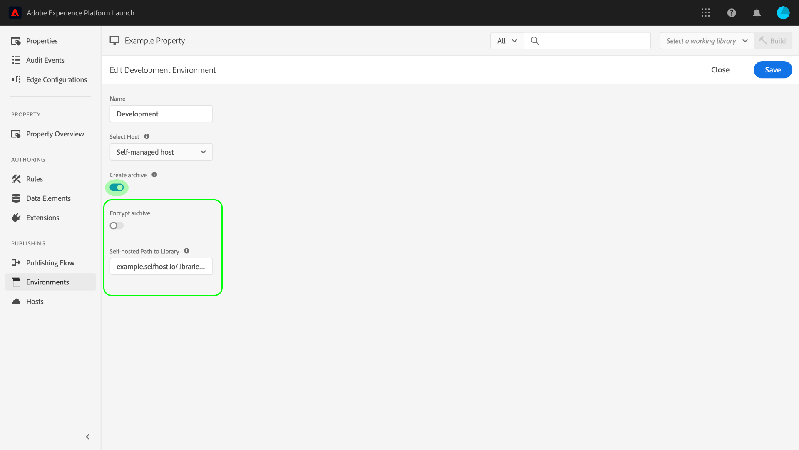

# Ambienti

Gli ambienti di tag definiscono diversi aspetti chiave delle build della libreria che distribuisci sul sito web o sull’app:

* Il nome file della build.
* Il dominio e il percorso della build, a seconda dell’host assegnato dell’ambiente.
* Il formato del file della build, a seconda dell’opzione di archiviazione scelta.

Quando crei una build della libreria, devi assegnarla a un ambiente. Le estensioni, le regole e gli elementi dati della build vengono quindi compilati e inseriti nell’ambiente assegnato. Ogni ambiente fornisce un codice da incorporare univoco che consente di integrare la build assegnata nel sito.

In ciascun ambiente possono esistere artefatti diversi. In questo modo è possibile sottoporre a test librerie diverse in ambienti diversi quando vengono trasmesse tramite il flusso di lavoro.

In questo documento sono descritti i passaggi necessari per installare, configurare e creare diversi ambienti nell’interfaccia utente di Data Collection.

## Tipi di ambiente

I tag supportano tre tipi di ambiente diversi, ciascuno corrispondente a uno stato diverso nel [flusso di lavoro di pubblicazione](./publishing-flow.md):

| Tipo di ambiente | Descrizione |
| --- | --- |
| Sviluppo | Questo ambiente corrisponde alla colonna **Development** nel flusso di lavoro di pubblicazione. |
| Staging | Questo ambiente corrisponde alle colonne **Submitted** e **Approved** nel flusso di lavoro di pubblicazione. |
| Produzione | Questo ambiente corrisponde alla colonna **Published** nel flusso di lavoro di pubblicazione. |

In ciascun ambiente possono esistere artefatti diversi. Ciò ti consente di testare librerie diverse in ambienti diversi mentre le sottoponi al flusso di lavoro di pubblicazione.

>[!NOTE]
>
>A ogni ambiente può essere assegnata una sola build della libreria alla volta. Tuttavia, è previsto che nel corso del tempo un singolo ambiente contenga diverse build man mano che esse vengono spostate nel flusso di lavoro di pubblicazione e che le build vengano ridistribuite tra gli ambienti in base alle esigenze.

## Installazione {#installation}

Ogni ambiente presenta una serie di istruzioni per connettersi all’applicazione. Per le proprietà web, queste istruzioni forniscono codici da incorporare. Per le proprietà mobili, tali istruzioni forniscono il codice necessario per creare istanze delle librerie in uso e recuperare la configurazione in fase di esecuzione.

>[!IMPORTANT]
>
>Ogni tipo di ambiente dispone delle relative istruzioni di installazione. A seconda dell’ambiente in uso, è necessario assicurarsi di utilizzare le dipendenze e/o i codici da incorporare corrispondenti corretti.
>
>Ad esempio, il codice da incorporare di produzione per una proprietà web supporta la memorizzazione in cache del browser, mentre i codici da incorporare di sviluppo e di staging no lo supportano. Pertanto, è preferibile non utilizzare i codici da incorporare di sviluppo e di staging in contesti di produzione o di traffico elevato.

Per accedere alle istruzioni di installazione per un ambiente, passa alla scheda **[!UICONTROL Environments]** della proprietà, quindi seleziona l’icona **[!UICONTROL Install]** dell’ambiente in questione.

Se utilizzi una proprietà web, riceverai un codice da incorporare da utilizzare nel tag `<head>` del documento. Avrai inoltre la possibilità di distribuire i file della libreria in modo sincrono o asincrono in fase di esecuzione. A seconda dell’impostazione scelta, le istruzioni di installazione visualizzate saranno diverse. I codici da incorporare sono descritti più avanti in questo documento.

Se utilizzi una proprietà mobile, riceverai istruzioni separate per l’installazione delle dipendenze per Android (tramite [Gradle](https://gradle.org/)) e iOS (tramite [CocoaPods](https://cocoapods.org/)).

## Configurazione dispositivi mobili

Per le proprietà dei dispositivi mobili, puoi visualizzare le opzioni di configurazione per un ambiente selezionandole dall’elenco. Da qui è possibile cambiare il nome dell’ambiente. Al momento, per gli ambienti mobili è possibile utilizzare solo host gestiti da Adobe.

Per ulteriori informazioni, consulta la panoramica sugli [host](./hosts/hosts-overview.md).

## Configurazione web

Le impostazioni dell’ambiente assegnato determinano quanto segue per le proprietà web:

* **Host**: il percorso del server in cui desideri distribuire la build.
* **Impostazione di archiviazione**: indica se il sistema restituisce un set di file distribuibili o se comprime i file in un formato di archiviazione.
* **Codice da incorporare**: il codice `<script>` da incorporare nell’HTML delle pagine del sito web, utilizzato per distribuire la build della libreria in fase di esecuzione.

Nella scheda [!UICONTROL Environments], seleziona uno degli ambienti elencati per visualizzare i relativi controlli di configurazione.

### Host {#host}

Seleziona **[!UICONTROL Host]** per scegliere un host preconfigurato per l&#39;ambiente dal menu a discesa.

Quando viene creata una build, questa viene consegnata alla posizione specificata per l’host assegnato. Per informazioni su come creare e configurare gli host tag, consulta la [panoramica sugli host](./hosts/hosts-overview.md).

### Impostazione di archiviazione {#archive}

La maggior parte delle build consiste in più file. Le build con più file contengono un file di libreria principale (collegato nel codice da incorporare) contenente riferimenti interni agli altri file, che vengono recuperati a seconda delle necessità.

Il pulsante **[!UICONTROL Create archive]** consente di attivare/disattivare l’impostazione di archiviazione dell’ambiente. Per impostazione predefinita, l’opzione di archiviazione è disattivata e la build viene consegnata in un formato che viene eseguito così com’è (JavaScript per le proprietà web e JSON per le proprietà mobili).

Se scegli di attivare l’impostazione di archiviazione, verranno mostrate ulteriori impostazioni di configurazione nell’interfaccia utente con cui puoi scegliere di crittografare il file di archivio e definire un percorso per la libreria se utilizzi l’hosting autonomo.

Il percorso può essere un URL completo o un percorso relativo che può essere utilizzato in più domini. Questo è importante, in quanto la maggior parte delle build hanno più file che contengono riferimenti interni gli uni agli altri.

Se utilizzi l’opzione di archiviazione, tutti i file della build vengono consegnati come un file ZIP. Questo può risultare utile se:

1. Utilizzi l’hosting autonomo per la libreria ma non vuoi impostare un host SFTP per la consegna.
1. Prima della distribuzione devi eseguire l’analisi del codice sulla build.
1. Vuoi solamente esaminare i contenuti della build per vedere cosa comprendono.

### Codice da incorporare {#embed-code}

Un codice da incorporare è un tag `<script>` che deve essere inserito nelle sezioni `<head>` delle pagine del sito web per caricare ed eseguire il codice generato. Ogni configurazione dell’ambiente genera automaticamente il proprio codice da incorporare, pertanto è necessario solo copiarlo e incollarlo nel sito, sulle pagine in cui desideri che vengano eseguiti i tag.

Quando visualizzi le istruzioni di installazione, puoi scegliere se fare in modo che lo script carichi i file della libreria in modo sincrono o asincrono. L’impostazione non è permanente e non riflette il modo in cui i tag sono stati effettivamente implementati sul sito. La sua funzione è quella di mostrare come installare l’ambiente nel modo giusto.

>[!WARNING]
>
>A seconda del contenuto della libreria dei tag, il comportamento delle regole e degli altri elementi può essere con distribuzione sincrona o asincrona. È quindi importante verificare accuratamente tutte le modifiche apportate.

#### Implementazione asincrona

La distribuzione asincrona consente al browser di continuare a caricare il resto della pagina mentre viene recuperata la libreria. Quando utilizzi questa impostazione, è disponibile un solo codice da incorporare, che deve essere inserito nella sezione `<head>` del documento.

Per ulteriori informazioni su questa impostazione, consulta la guida alla [distribuzione asincrona](../client-side/asynchronous-deployment.md).

#### Distribuzione sincrona

Quando il browser legge un codice di incorporamento utilizzando la distribuzione sincrona, recupera la libreria di tag e la esegue prima di continuare a caricare la pagina.

I codici da incorporare sincroni sono costituiti da due tag `<script>` che devono essere inseriti all’interno dell’HTML del sito web. Un tag `<script>` va inserito nella sezione `<head>` del documento, mentre l’altro deve essere posizionato immediatamente prima del tag `</body>` di chiusura.

#### Aggiornamenti del codice da incorporare

Poiché i codici da incorporare vengono generati in base alle configurazioni dell’ambiente, alcune modifiche alla configurazione aggiorneranno automaticamente il codice da incorporare per l’ambiente in questione. Queste modifiche includono:

* Il passaggio da un host gestito da Adobe a un host SFTP, o viceversa.
* La modifica dell’impostazione di archiviazione.
* L’aggiornamento del campo percorso se l’impostazione di archiviazione è abilitata.

>[!WARNING]
>
>Quando il codice da incorporare di un ambiente di tag cambia, è necessario aggiornare manualmente i codici da incorporare nel codice HTML. Per evitare costi di manutenzione, è necessario aggiornare i codici da incorporare solo se assolutamente necessario.

## Creare un ambiente

Tre ambienti vengono assegnati automaticamente a una proprietà quando questa viene creata: sviluppo, staging e produzione. Questo è sufficiente per eseguire il flusso di lavoro di pubblicazione. Tuttavia, se lo desideri, puoi aggiungere altri ambienti di sviluppo. Ciò può essere particolarmente utile per i team più grandi, dove più sviluppatori lavorano contemporaneamente a progetti diversi.

Nella scheda [!UICONTROL Environments] della proprietà, seleziona **[!UICONTROL Add Environment]**.

Nella schermata successiva, seleziona l’opzione **[!UICONTROL Development]**.

La schermata successiva consente di denominare il nuovo ambiente, selezionare un host e scegliere un’impostazione di archiviazione. Al termine, seleziona **[!UICONTROL Save]** per creare l’ambiente.

Viene visualizzata nuovamente la scheda [!UICONTROL Environments] con le istruzioni di installazione per il nuovo ambiente.

## Passaggi successivi

Dopo aver letto questo documento, avrai acquisito conoscenze pratiche per configurare gli ambienti nell’interfaccia utente e installarli nel sito web o nell’app. Ora puoi iniziare a pubblicare le build della libreria.

Man mano che pubblichi le iterazioni della libreria, potresti avere la necessità di monitorare e archiviare le build precedenti per risolvere eventuali problemi e a scopo di rollback. Per ulteriori informazioni, consulta la guida alla [ripubblicazione di librerie precedenti](./republish.md).
