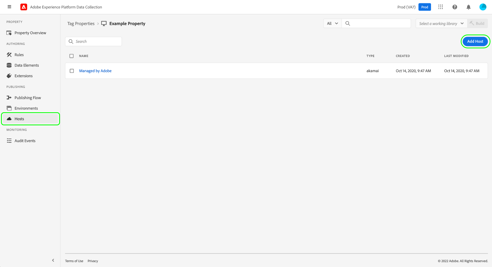
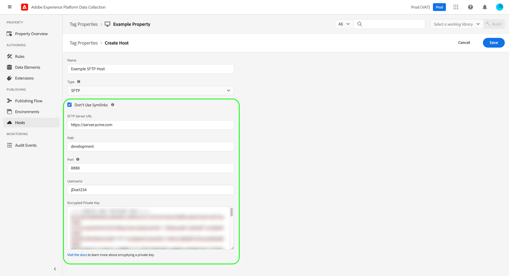

# Host SFTP

>[!NOTE]
>
>Adobe Experience Platform Launch è stato ridefinito come suite di tecnologie di raccolta dati in Adobe Experience Platform. Di conseguenza, sono state introdotte diverse modifiche terminologiche nella documentazione del prodotto. Consulta questo [documento](../../../term-updates.md) come riferimento consolidato delle modifiche terminologiche.

Adobe Experience Platform ti consente di distribuire le build della libreria di tag a un server SFTP protetto che ospiti, offrendoti un maggiore controllo su come vengono memorizzate e gestite le build. Questa guida illustra come impostare un host SFTP per una proprietà tag nell’interfaccia utente di Experience Platform o nell’interfaccia utente di Data Collection.

>[!NOTE]
>
>Puoi anche scegliere di utilizzare un host gestito da Adobe. Consulta la guida su [Host gestiti da Adobe](./managed-by-adobe-host.md) per ulteriori informazioni.
>
>Per informazioni sui vantaggi e le limitazioni delle librerie di self-hosting, consulta la sezione [guida all’hosting autonomo](./self-hosting-libraries.md).

## Configurare una chiave di accesso per il server {#access-key}

Platform si collega al tuo sito SFTP utilizzando una chiave crittografata. Sono disponibili alcuni passaggi per eseguire correttamente la configurazione:

### Creare una coppia di chiavi pubblica/privata

Sul server SFTP deve essere installata una coppia di chiave pubblica/privata. Puoi generare queste chiavi sul server o generarle altrove e installarle sul server. Per ulteriori informazioni, consulta la documentazione GitHub relativa a [come generare chiavi SSH](https://help.github.com/articles/generating-a-new-ssh-key-and-adding-it-to-the-ssh-agent/#generating-a-new-ssh-key).

### Crittografa le chiavi

La chiave privata viene utilizzata per crittografare la chiave pubblica. Dovrai fornire la tua chiave privata durante il processo di creazione dell’host SFTP. Consulta la sezione su [cifratura dei valori](../../../api/guides/encrypting-values.md) nella guida dell’API di Reactor per istruzioni sulla crittografia delle chiavi pubbliche. Utilizza la chiave GPG dell’ambiente di produzione a meno che tu non sappia di aver bisogno di una chiave specifica. Infine, puoi crittografare la tua chiave privata da qualsiasi computer, per cui non devi installare GPG sul server per completare questo passaggio.

### Inserire nell&#39;elenco Consentiti gli indirizzi IP della piattaforma

Per consentire a Platform di raggiungere e connettersi al server SFTP, potrebbe essere necessario approvare un set di indirizzi IP da utilizzare all’interno del firewall aziendale. Questi indirizzi IP sono:

* `184.72.239.68`
* `23.20.85.113`
* `54.226.193.184`

>[!NOTE]
>
>La struttura delle build di tag è cambiata nel tempo. Utilizzano internamente dei collegamenti simbolici (symlink) per mantenere la compatibilità con le versioni precedenti, affinché i codici precedentemente incorporati possano continuare a funzionare anche con la struttura di build più recente. Per poter essere utilizzato come destinazione valida per le build di tag, il server SFTP deve supportare l’utilizzo di symlink.

Per informazioni più dettagliate, consulta il seguente articolo Medium su [come configurare i server SFTP per distribuire una build](https://medium.com/launch-by-adobe/configuring-an-sftp-server-for-use-with-adobe-launch-bc626027e5a6).

## Creare un host SFTP {#create}

Seleziona **[!UICONTROL Host]** nel menu di navigazione a sinistra, seguito da **[!UICONTROL Aggiungi host]**.

Viene visualizzata la finestra di dialogo per la creazione dell’host. Specifica un nome per l’host e sotto **[!UICONTROL Tipo]**, seleziona **[!UICONTROL SFTP]**.

### Configurare l’host SFTP {#configure}

La finestra di dialogo si espande per includere opzioni di configurazione aggiuntive per l’host SFTP. Queste sono spiegate di seguito.

| Campo di configurazione | Descrizione |
| --- | --- |
| [!UICONTROL Non utilizzare collegamenti simbolici] | Per impostazione predefinita, tutti gli host SFTP utilizzano collegamenti simbolici (symlink) per fare riferimento alla libreria [build](../builds.md) salvate nel server. Tuttavia, non tutti i server supportano l&#39;utilizzo di symlink. Quando questa opzione è selezionata, l’host utilizza un’operazione di copia per aggiornare direttamente le risorse della build invece di utilizzare i symlink. |
| [!UICONTROL URL del server SFTP] | Percorso URL di base per il server. |
| [!UICONTROL Path] | Percorso da aggiungere all&#39;URL del server base per questo host. |
| [!UICONTROL Porta ] | Per la porta, scegli una delle seguenti possibilità:<ul><li>`21`</li><li>`22`</li><li>`80`</li><li>`200-299`</li><li>`443`</li><li>`2000-2999`</li><li>`4343`</li><li>`8080`</li><li>`8888`</li></ul>Come best practice per la sicurezza, Adobe limita il numero di porte che possono essere utilizzate per il traffico in uscita. Le porte selezionate sono solitamente consentite dai firewall aziendali e includono alcuni intervalli per garantire flessibilità. |
| [!UICONTROL Nome utente] | Nome utente da utilizzare per l&#39;accesso al server. |
| [!UICONTROL Chiave privata crittografata] | La chiave privata crittografata creata in un [passaggio precedente](#access-key). |

Seleziona **[!UICONTROL Salva]** per creare l&#39;host con la configurazione selezionata.

Quando selezioni **[!UICONTROL Salva]**, viene verificata la connessione e la capacità di consegnare i file al server SFTP. Platform crea una cartella, scrive un file all’interno della cartella, verifica che il file sia presente, quindi si ripulisce in seguito. Se l’account utente sul server SFTP (quello associato al certificato protetto fornito a Platform) non dispone delle autorizzazioni necessarie per eseguire questa azione, l’host passa a uno stato &quot;Non riuscito&quot;.

## Passaggi successivi

Questa guida illustra come configurare un server SFTP con hosting autonomo da utilizzare nei tag. Una volta stabilito l’host, puoi associarlo a uno o più dei [ambienti](../environments.md) per la pubblicazione di librerie di tag. Per ulteriori informazioni sul processo ad alto livello di attivazione delle funzionalità tag sulle proprietà web o mobili, consulta la sezione [panoramica sulla pubblicazione](../overview.md).
