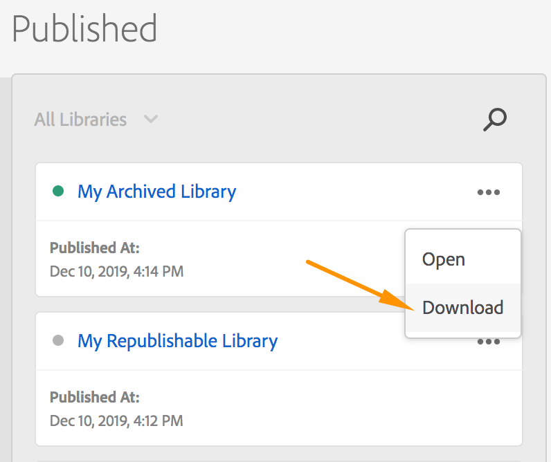

# Ripubblicare una libreria

>[!NOTE]
>
>Adobe Experience Platform Launch è stato classificato come una suite di tecnologie di raccolta dati in Adobe Experience Platform. Di conseguenza, sono state introdotte diverse modifiche terminologiche nella documentazione del prodotto. Consulta questo [documento](../../term-updates.md) come riferimento consolidato delle modifiche terminologiche.

Le cinque librerie più recenti pubblicate nell&#39;ambiente di produzione su una proprietà Web sono disponibili per un recupero successivo. Questa funzione è utile quando si trova un bug nella libreria di produzione e occorre eseguire immediatamente il rollback allo stato valido.

Il processo di recupero dipende dalle impostazioni dell&#39;ambiente al momento della pubblicazione della libreria. Questo aspetto è importante perché il recupero di una libreria archiviata non comporta nessuna modifica sul sito attivo, al contrario di quanto accadrebbe con il recupero di una libreria regolare.

Sono disponibili le seguenti opzioni:

* **Host: gestito da Adobe, Archivio: disattivato:** se utilizzi l’host gestito da Adobe e non archivi la libreria, puoi ripubblicare queste librerie meno recenti.

* **Host: gestito da Adobe, Archivio: attivato:** se utilizzi l’host gestito da Adobe e stai archiviando la tua libreria, puoi scaricare queste vecchie librerie.

* **Host: SFTP, Archivio: attivato o disattivato:** Se utilizzi l&#39;host SFTP, si presume che siano state implementate strategie di archiviazione sul posto e che non siano disponibili opzioni di recupero.

Le opzioni di recupero per le proprietà mobili non sono ancora disponibili.

## Ripubblicazione

Ogni ambiente di tag fornisce un collegamento a un file della libreria. Tutte le librerie create in tale ambiente fanno riferimento a tale collegamento.

Quando crei un ambiente di sviluppo o di gestione temporanea, la build precedente viene pulita e la nuova build viene distribuita. Per l’ambiente di produzione, questo collegamento viene aggiornato per indicare la build più recente, ma le cinque build più recenti vengono mantenute prima di essere pulite.

Queste cinque build più recenti nell&#39;ambiente di produzione sono quelle disponibili per il recupero.

Quando ripubblichi una libreria precedente, Platform aggiorna il collegamento dell’ambiente in modo che faccia riferimento a una di queste build precedenti che non è ancora stata pulita. Platform invia inoltre una richiesta di eliminazione alla cache dei nodi edge CDN per indicare che la libreria è stata aggiornata e che è necessario recuperare una nuova copia dall’origine.

Questo significa che quando si ripubblica una libreria precedente:

* Non viene apportata nessuna modifica alle risorse (o alle revisioni storiche) della proprietà tag

* La modalità con cui gli ambienti di sviluppo e di gestione temporanea calcolano ciò che è a monte non cambia

Esamina lo scenario in cui esegui il roll back a causa di un problema con una regola specifica. La revisione della regola attualmente in produzione potrebbe, ad esempio, essere precedente a tre revisioni. Quando visualizzi questa regola nell’interfaccia utente di per correggerla, vengono comunque riportate le ultime modifiche salvate, anziché le modifiche attualmente in produzione.

Per questo motivo, Platform notifica che una proprietà è in stato di ripubblicazione per ricordare che ciò che visualizzi nell’interfaccia utente di Data Collection è un po’ più lontano dalla produzione rispetto al solito. Questa notifica può essere eliminata e viene visualizzata una volta per ogni sessione del browser la prima volta che visualizzi la proprietà.

### Come ripubblicare una libreria precedente

Dalla schermata Pubblicazione:

1. Trova nella colonna Pubblicato la libreria che desideri ripubblicare.
1. Seleziona i puntini di sospensione (`...`) nell&#39;angolo superiore destro della scheda Libreria.
1. Seleziona **[!UICONTROL Ripubblica]**.

## Scarica

Il download di una libreria archiviata è più semplice. Non stai facendo riferimento direttamente a questi file .zip ovunque, quindi puoi semplicemente scaricare la libreria precedente sul computer ed eseguire il normale processo.

### Come scaricare una libreria precedente

Dalla schermata Pubblicazione:

1. Trova nella colonna Pubblicato la libreria che desideri scaricare.
1. Seleziona i puntini di sospensione (`...`) nell&#39;angolo superiore destro della scheda Libreria.
1. Seleziona **[!UICONTROL Scarica]**.
