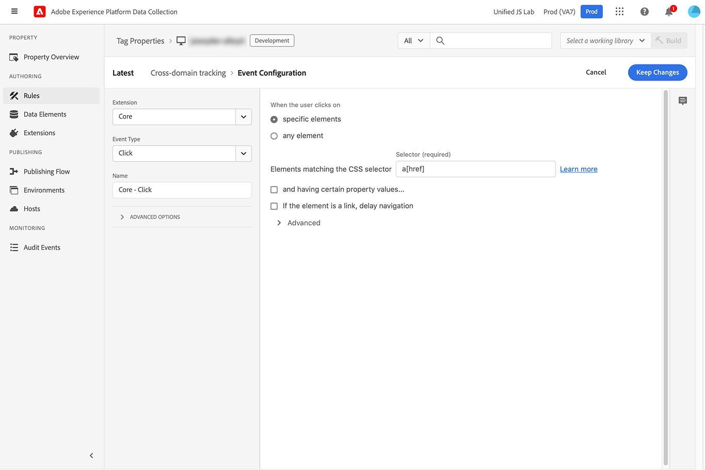

# `appendIdentityToUrl`

Il `appendIdentityToUrl` consente di aggiungere un identificatore utente all’URL come stringa di query. Questa azione ti consente di trasmettere l’identità di un visitatore tra più domini, evitando conteggi duplicati dei visitatori per i set di dati che includono sia domini che canali. È disponibile su Web SDK versione 2.11.0 o successiva.

La stringa di query generata e aggiunta all’URL è `adobe_mc`. Se l’SDK web non riesce a trovare un ECID, chiama il `/acquire` per generarne uno.

>[!NOTE]
>
>Se non è stato fornito il consenso, l’URL di questo metodo viene restituito invariato. Questo comando viene eseguito immediatamente, senza attendere un aggiornamento del consenso.

## Aggiungere identità all’URL utilizzando l’estensione Web SDK {#extension}

L’aggiunta di un’identità a un URL viene eseguita come azione all’interno di una regola nell’interfaccia dei tag di Adobe Experience Platform Data Collection.

1. Accedi a [experience.adobe.com](https://experience.adobe.com) utilizzando le credenziali di Adobe ID.
1. Accedi a **[!UICONTROL Raccolta dati]** > **[!UICONTROL Tag]**.
1. Seleziona la proprietà tag desiderata.
1. Accedi a **[!UICONTROL Regole]**, quindi seleziona la regola desiderata.
1. Sotto [!UICONTROL Azioni], seleziona un&#39;azione esistente o creane una.
1. Imposta il [!UICONTROL Estensione] campo a discesa per **[!UICONTROL Adobe Experience Platform Web SDK]**, e impostare [!UICONTROL Tipo di azione] a **[!UICONTROL Reindirizza con identità]**.
1. Clic **[!UICONTROL Mantieni modifiche]**, quindi esegui il flusso di lavoro di pubblicazione.

Questo comando viene in genere utilizzato con una regola specifica che ascolta i clic e controlla i domini desiderati.

+++Criteri evento regola

Si attiva quando un tag di ancoraggio con un `href` viene fatto clic su.

* **[!UICONTROL Estensione]**: Core
* **[!UICONTROL Tipo di evento]**: fai clic
* **[!UICONTROL Quando l’utente fa clic su]**: elementi specifici
* **[!UICONTROL Elementi che corrispondono al selettore CSS]**: `a[href]`



+++

+++Condizione regola

Si attiva solo sui domini desiderati.

* **[!UICONTROL Tipo di logica]**: Regolare
* **[!UICONTROL Estensione]**: Core
* **[!UICONTROL Tipo di condizione]**: Confronto dei valori
* **[!UICONTROL Operando sinistro]**: `%this.hostname%`
* **[!UICONTROL Operatore]**: corrisponde a Regex
* **[!UICONTROL Operando destro]**: espressione regolare che corrisponde ai domini desiderati. Ad esempio, `adobe.com$|behance.com$`


+++

+++Azione regola

Aggiungi l’identità all’URL.

* **[!UICONTROL Estensione]**: Adobe Experience Platform Web SDK
* **[!UICONTROL Tipo di azione]**: reindirizzamento con identità


+++

## Aggiungere identità all’URL utilizzando la libreria JavaScript dell’SDK web

Esegui il `appendIdentityToUrl` con un URL come parametro. Il metodo restituisce un URL con l’identificatore aggiunto come stringa di query.

```js
alloy("appendIdentityToUrl",document.location);
```

Puoi aggiungere un listener di eventi per tutti i clic ricevuti sulla pagina e verificare se l’URL corrisponde ai domini desiderati. In caso contrario, aggiungi l’identità all’URL e reindirizza l’utente.

```js
document.addEventListener("click", event => {
  // Check if the click was a link
  const anchor = event.target.closest("a");
  if (!anchor || !anchor.href) return;

  // Check if the link points to the desired domain
  const url = new URL(anchor.href);
  if (!url.hostname.endsWith(".adobe.com") && !url.hostname.endsWith(".behance.com")) return;

  // Append the identity to the URL, then direct the user to the URL
  event.preventDefault();
  alloy("appendIdentityToUrl", {url: anchor.href}).then(result => {document.location = result.url;});
});
```

## Oggetto di risposta

Se decidi di [gestire le risposte](command-responses.md) con questo comando, l’oggetto di risposta contiene **`url`**, il nuovo URL con informazioni sull’identità aggiunto come parametro della stringa di query.
