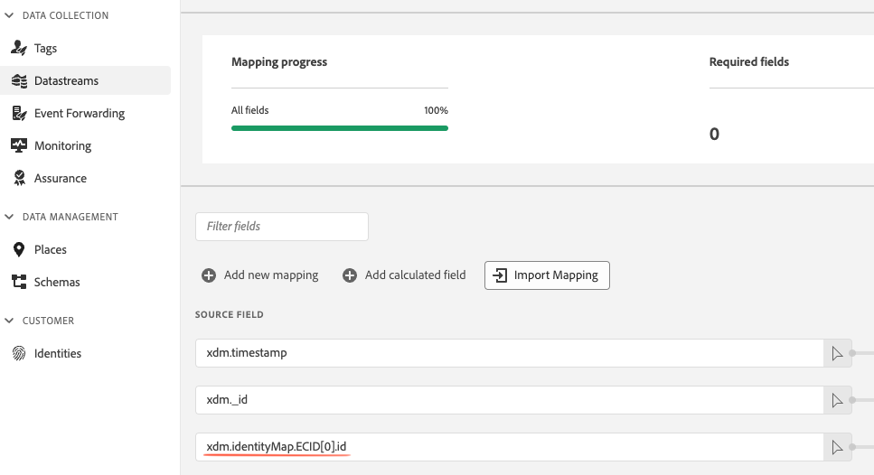

# Dati di identità in Web SDK

Adobe Experience Platform Web SDK utilizza [Adobe Experience Cloud ID (ECID)](../../identity-service/features/ecid.md) per monitorare il comportamento dei visitatori. Utilizzando [!DNL ECIDs], puoi verificare che ogni dispositivo abbia un identificatore univoco che può persistere in più sessioni, collegando a un dispositivo specifico tutti gli hit che si verificano durante e tra sessioni web.

Questo documento fornisce una panoramica su come gestire [!DNL ECIDs] tramite Web SDK.

## Tracciamento degli ECID tramite Web SDK {#tracking-ecids-we-sdk}

L&#39;SDK Web assegna e tiene traccia di [!DNL ECIDs] utilizzando i cookie, con più metodi disponibili per configurare la modalità di generazione di questi cookie.

Quando un nuovo utente arriva sul tuo sito Web, il [servizio Adobe Experience Cloud Identity](../../identity-service/home.md) tenta di impostare un cookie di identificazione del dispositivo per tale utente.

* Per i nuovi visitatori, viene generato un [!DNL ECID] che viene restituito nella prima risposta dall&#39;Edge Network di Experience Platform.
* Per i visitatori di ritorno, [!DNL ECID] viene recuperato dal cookie `kndctr_{YOUR-ORG-ID}_AdobeOrg_identity` e aggiunto al payload della richiesta dall&#39;Edge Network.

Una volta impostato il cookie contenente [!DNL ECID], ogni richiesta successiva generata da Web SDK include un [!DNL ECID] codificato nel cookie `kndctr_{YOUR-ORG-ID}_AdobeOrg_identity`.

Quando si utilizzano i cookie per l’identificazione del dispositivo, è possibile interagire con l’Edge Network in due modi:

1. Crea un CNAME nel tuo dominio che punti a `adobedc.net`. Questo metodo è denominato [raccolta dati di prime parti](#first-party).
1. Invia dati direttamente al dominio Edge Network `adobedc.net`. Questo metodo è denominato [raccolta dati di terze parti](#third-party).

Come spiegato nelle sezioni seguenti, il metodo di raccolta dei dati che scegli di utilizzare ha un impatto diretto sulla durata dei cookie nei vari browser.

### Raccolta di dati di prime parti {#first-party}

La raccolta dati di prime parti comporta l&#39;impostazione di cookie tramite `CNAME` nel proprio dominio che punta a `adobedc.net`.

Sebbene i browser abbiano a lungo trattato i cookie impostati da `CNAME` endpoint in modo simile a quelli impostati dagli endpoint di proprietà del sito, le recenti modifiche implementate dai browser hanno creato una distinzione nella gestione dei cookie `CNAME`. Sebbene non vi siano browser che attualmente bloccano i cookie di prime parti `CNAME` per impostazione predefinita, alcuni browser limitano la durata dei cookie impostati con `CNAME` a soli sette giorni.

### Raccolta di dati di terze parti {#third-party}

La raccolta dati di terze parti comporta l&#39;invio diretto di dati al dominio Edge Network `adobedc.net`.

Negli ultimi anni, i browser web sono diventati sempre più restrittivi nella gestione dei cookie impostati da terze parti. Per impostazione predefinita, alcuni browser bloccano i cookie di terze parti. Se utilizzi cookie di terze parti per identificare i visitatori del sito, la durata di tali cookie è quasi sempre più breve di quella che sarebbe altrimenti disponibile utilizzando i cookie di prima parte. A volte, un cookie di terze parti scade entro appena sette giorni.

Inoltre, quando si utilizza la raccolta dati di terze parti, alcuni ad blocker limitano il traffico agli endpoint di raccolta dati di Adobe.

### Effetti della durata dei cookie sulle applicazioni Adobe Experience Cloud {#lifespans}

Indipendentemente dal fatto che si scelga la raccolta dati di prime parti o di terze parti, il periodo di tempo in cui un cookie può persistere ha un impatto diretto sui conteggi dei visitatori in [Adobe Analytics](https://experienceleague.adobe.com/it/docs/analytics) e [Customer Journey Analytics](https://experienceleague.adobe.com/it/docs/customer-journey-analytics). Inoltre, gli utenti finali potrebbero sperimentare esperienze di personalizzazione incoerenti quando [Adobe Target](https://experienceleague.adobe.com/en/docs/target) o [Offer Decisioning](https://experienceleague.adobe.com/en/docs/target/using/integrate/ajo/offer-decision) sono utilizzati sul sito.

Ad esempio, considera una situazione in cui hai creato un’esperienza di personalizzazione che promuove qualsiasi elemento nella home page se un utente lo ha visualizzato tre volte negli ultimi sette giorni.

Se un utente finale visita il sito tre volte alla settimana e poi non vi ritorna per sette giorni, potrebbe essere considerato un nuovo utente quando ritorna sul sito, perché i suoi cookie potrebbero essere stati eliminati da una policy del browser (a seconda del browser che stava utilizzando quando ha visitato il sito). In questo caso, lo strumento Analytics tratta il visitatore come un nuovo utente, anche se ha visitato il sito poco più di sette giorni fa. Inoltre, ricomincia qualsiasi tentativo di personalizzare l’esperienza per l’utente.

### ID dispositivo di prime parti (FPID) {#fpid}

Per tenere conto degli effetti delle durate dei cookie come descritto in precedenza, puoi invece scegliere di impostare e gestire gli identificatori dei dispositivi. Per ulteriori informazioni, consulta la guida su [ID dispositivo di prime parti](./first-party-device-ids.md).

## Recupera l’ECID e l’area geografica dell’utente corrente {#retrieve-ecid}

A seconda del caso d&#39;uso, è possibile accedere a [!DNL ECID] in due modi:

* [Recupera il [!DNL ECID] tramite la preparazione dati per la raccolta dati](#retrieve-ecid-data-prep): metodo consigliato da utilizzare.
* [Recupera  [!DNL ECID] tramite il comando `getIdentity()`](#retrieve-ecid-getidentity): utilizzare questo metodo solo quando sono necessarie le informazioni [!DNL ECID] sul lato client.

### Recupera [!DNL ECID] tramite la preparazione dati per la raccolta dati {#retrieve-ecid-data-prep}

Utilizza [Preparazione dati per raccolta dati](../../datastreams/data-prep.md) per mappare [!DNL ECID] a un campo [!DNL XDM]. Questo è il modo consigliato per accedere a [!DNL ECID].

A questo scopo, imposta il campo di origine sul seguente percorso:

```js
xdm.identityMap.ECID[0].id
```

Quindi, imposta il campo di destinazione su un percorso XDM in cui il campo è di tipo `string`.




### Recupera [!DNL ECID] tramite il comando `getIdentity()` {#retrieve-ecid-getidentity}


>[!IMPORTANT]
>
>Recuperare l&#39;ECID tramite il comando `getIdentity()` solo se si richiede [!DNL ECID] sul lato client. Se desideri mappare solo l&#39;ECID a un campo XDM, utilizza invece [Preparazione dati per raccolta dati](#retrieve-ecid-data-prep).

Per recuperare l&#39;ECID univoco per il visitatore corrente, utilizzare il comando `getIdentity`. Per i nuovi visitatori che non hanno ancora un [!DNL ECID], questo comando genera un nuovo [!DNL ECID]. `getIdentity` restituisce anche l&#39;ID di regione per il visitatore.

>[!NOTE]
>
>Questo metodo viene in genere utilizzato con soluzioni personalizzate che richiedono la lettura dell&#39;ID [!DNL Experience Cloud] o che richiedono un hint di posizione per Adobe Audience Manager. Non viene utilizzato da un’implementazione standard.

```javascript
alloy("getIdentity")
  .then(function(result) {
    // The command succeeded.
    console.log("ECID:", result.identity.ECID);
    console.log("RegionId:", result.edge.regionId);
  })
  .catch(function(error) {
    // The command failed.
    // "error" will be an error object with additional information.
  });
```

## Utilizzo di `identityMap` {#using-identitymap}

Utilizzando un campo [`identityMap` XDM](../../xdm/schema/composition.md#identityMap), è possibile identificare un dispositivo/utente utilizzando più identità, impostarne lo stato di autenticazione e decidere quale identificatore è considerato primario. Se non è stato impostato alcun identificatore come `primary`, l&#39;impostazione predefinita è `ECID`.

I campi `identityMap` sono stati aggiornati con il comando `sentEvent`.

```javascript
alloy("sendEvent", {
  xdm: {
    "identityMap": {
      "ID_NAMESPACE": [ // Notice how each namespace can contain multiple identifiers.
        {
          "id": "1234",
          "authenticatedState": "authenticated",
          "primary": true
        }
      ]
    }
  }
});
```

>[!NOTE]
>
>L&#39;Adobe consiglia di inviare spazi dei nomi che rappresentano una persona, ad esempio `CRMID`, come identità primaria.


Ogni proprietà all&#39;interno di `identityMap` rappresenta identità appartenenti a un particolare [spazio dei nomi identità](../../identity-service/features/namespaces.md). Il nome della proprietà deve essere il simbolo dello spazio dei nomi dell&#39;identità, che puoi trovare elencato nell&#39;interfaccia utente di Adobe Experience Platform in &quot;[!UICONTROL Identities]&quot;. Il valore della proprietà deve essere un array di identità relative a tale spazio dei nomi di identità.

>[!IMPORTANT]
>
>L&#39;ID dello spazio dei nomi passato in `identityMap` distingue tra maiuscole e minuscole. Assicurati di utilizzare l’ID dello spazio dei nomi corretto per evitare la raccolta incompleta dei dati.

Ogni oggetto identità nell’array delle identità contiene le seguenti proprietà:

| Proprietà | Tipo di dati | Descrizione |
| --- | --- | --- |
| `id` | Stringa | **(Obbligatorio)** ID che si desidera impostare per lo spazio dei nomi specificato. |
| `authenticatedState` | Stringa | **(Obbligatorio)** Stato di autenticazione dell&#39;ID. I valori possibili sono `ambiguous`, `authenticated` e `loggedOut`. |
| `primary` | Booleano | Determina se questa identità deve essere utilizzata come frammento principale nel profilo. Per impostazione predefinita, l’ECID è impostato come identificatore principale dell’utente. Se omesso, il valore predefinito sarà `false`. |

Se si utilizza il campo `identityMap` per identificare dispositivi o utenti, si ottiene lo stesso risultato dell&#39;utilizzo del metodo [`setCustomerIDs`](https://experienceleague.adobe.com/docs/id-service/using/id-service-api/methods/setcustomerids.html) di [!DNL ID Service API]. Per ulteriori dettagli, consulta la [documentazione API del servizio ID](https://experienceleague.adobe.com/docs/id-service/using/id-service-api/methods/get-set.html).

## Migrazione dall’API visitatore a ECID {#migrating-visitor-api-ecid}

Durante la migrazione da utilizzando l’API visitatore, puoi anche eseguire la migrazione dei cookie AMCV esistenti. Per abilitare la migrazione ECID, imposta il parametro `idMigrationEnabled` nella configurazione. La migrazione degli ID abilita i seguenti casi d’uso:

* Quando alcune pagine di un dominio utilizzano l’API Visitor e altre pagine utilizzano questo SDK. Per supportare questo caso, l’SDK legge i cookie AMCV esistenti e scrive un nuovo cookie con l’ECID esistente. Inoltre, l&#39;SDK scrive i cookie AMCV in modo che, se l&#39;ECID viene ottenuto per primo su una pagina instrumentata con l&#39;SDK, le pagine successive instrumentate con l&#39;API visitatore abbiano lo stesso ECID.
* Quando Adobe Experience Platform Web SDK è configurato in una pagina che dispone anche dell’API visitatore. Per supportare questo caso, se il cookie AMCV non è impostato, l&#39;SDK cerca l&#39;API visitatore nella pagina e la chiama per ottenere l&#39;ECID.
* Quando l’intero sito utilizza Adobe Experience Platform Web SDK e non dispone dell’API visitatore, è utile migrare gli ECID in modo che vengano conservate le informazioni sul visitatore restituite. Dopo che l&#39;SDK è stato distribuito con `idMigrationEnabled` per un certo periodo di tempo in modo che la maggior parte dei cookie del visitatore vengano migrati, l&#39;impostazione può essere disattivata.

### Aggiornamento delle caratteristiche per la migrazione

Quando si inviano dati in formato XDM a Audience Manager, questi devono essere convertiti in segnali durante la migrazione. Le caratteristiche devono essere aggiornate per riflettere le nuove chiavi fornite da XDM. Questo processo è facilitato dall&#39;utilizzo dello strumento [BAAAM](https://experienceleague.adobe.com/docs/audience-manager/user-guide/reference/bulk-management-tools/bulk-management-intro.html#getting-started-with-bulk-management) creato dall&#39;Audience Manager.

## Utilizzo nell’inoltro degli eventi

Se al momento hai abilitato [inoltro eventi](../../tags/ui/event-forwarding/overview.md) e utilizzi `appmeasurement.js` e `visitor.js`, puoi mantenere abilitata la funzione di inoltro eventi e non si verificheranno problemi. Nel back-end, Adobe recupera tutti i segmenti AAM e li aggiunge alla chiamata ad Analytics. Se la chiamata ad Analytics contiene tali segmenti, Analytics non chiamerà Audience Manager per inoltrare alcun dato, quindi non esiste una doppia raccolta di dati. Inoltre, non è necessario usare il suggerimento posizione quando si utilizza l’SDK per web, in quanto nel back-end vengono chiamati gli stessi endpoint di segmentazione.
