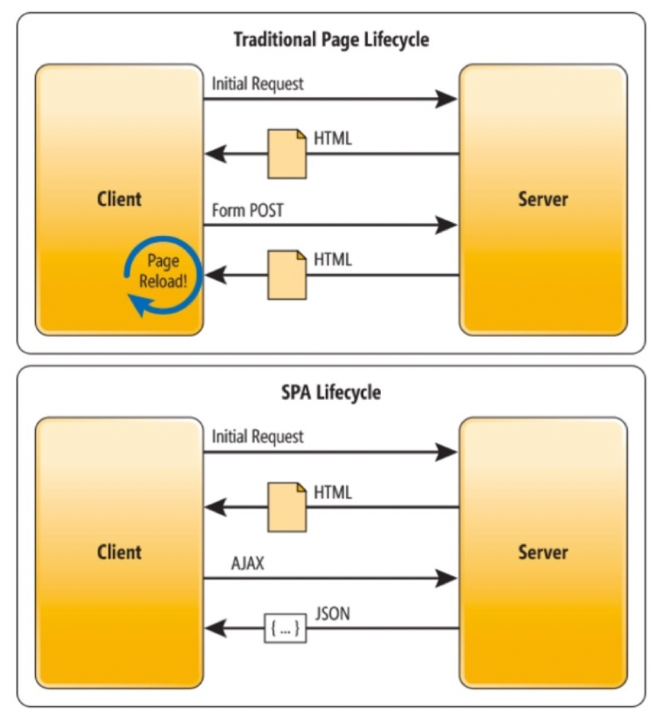

# Implementazione di un&#39;applicazione a pagina singola

Adobe Experience Platform Web SDK offre funzioni avanzate che consentono di eseguire personalizzazioni su tecnologie lato client di nuova generazione, come le applicazioni a pagina singola (SPA).

I siti web tradizionali funzionavano su modelli di navigazione &quot;da pagina a pagina&quot;, altrimenti noti come Applicazioni a più pagine, in cui le progettazioni del sito web erano strettamente collegate a URL e le transizioni da una pagina web a un’altra richiedevano un caricamento di pagina.

Le applicazioni web moderne, come le applicazioni a pagina singola, hanno invece adottato un modello che attiva rapidamente il rendering dell’interfaccia utente del browser, spesso indipendente dai ricaricamenti delle pagine. Queste esperienze possono essere attivate dalle interazioni dei clienti, ad esempio scorrimento, clic e movimenti del cursore. Con l’evolversi dei paradigmi del web moderno, la rilevanza degli eventi generici tradizionali, come il caricamento di una pagina, per distribuire personalizzazione e sperimentazione non funziona più.



## Vantaggi di Platform Web SDK per SPA

Di seguito sono riportati alcuni vantaggi dell’utilizzo di Adobe Experience Platform Web SDK per le applicazioni a pagina singola:

* Possibilità di memorizzare nella cache tutte le offerte al caricamento di pagina per ridurre più chiamate server a una singola chiamata server.
* Migliora enormemente l’esperienza utente sul sito, in quanto le offerte appaiono immediatamente tramite la cache senza il ritardo causato dalle chiamate al server tradizionali.
* Una singola riga di codice e una configurazione per sviluppatori una tantum consentono agli esperti di marketing di creare ed eseguire attività A/B e di targeting dell’esperienza (XT) tramite il Compositore esperienza visivo sull’SPA.

## Visualizzazioni XDM e applicazioni a pagina singola

Il Compositore esperienza visivo di Adobe Target per l’SPA sfrutta un concetto chiamato Visualizzazioni: un gruppo logico di elementi visivi che insieme formano un’esperienza SPA. Un’applicazione a pagina singola può, pertanto, essere considerata come in fase di transizione tra le visualizzazioni, anziché tra gli URL, in base alle interazioni dell’utente. In genere, una visualizzazione può rappresentare un intero sito o elementi visivi raggruppati all’interno di un sito.

Per spiegare ulteriormente cosa sono le visualizzazioni, nell’esempio seguente viene utilizzato un ipotetico sito di e-commerce online implementato in React per esplorare le visualizzazioni di esempio.

Dopo aver visitato la home page, un’immagine protagonista promuove una vendita di Pasqua e gli ultimi prodotti disponibili sul sito. In questo caso, è possibile definire una visualizzazione per l&#39;intera schermata iniziale. Questa visualizzazione potrebbe semplicemente essere chiamata &quot;home&quot;.


Quando il cliente diventa più interessato ai prodotti venduti dall&#39;azienda, decide di fare clic sul collegamento **Prodotti**. Come con la home page, l’intero sito dei prodotti può essere definito come visualizzazione. Questa visualizzazione potrebbe essere denominata &quot;products-all&quot; (tutti i prodotti).


Poiché una visualizzazione può essere definita come un intero sito o come un gruppo di elementi visivi su un sito, i quattro prodotti visualizzati sul sito dei prodotti possono essere raggruppati e considerati come una visualizzazione. Questa visualizzazione potrebbe essere denominata &quot;products&quot; (prodotti).


Quando il cliente decide di fare clic sul pulsante **Carica altro** per esplorare altri prodotti sul sito, in questo caso l&#39;URL del sito Web non cambia, ma è possibile creare una visualizzazione qui per rappresentare solo la seconda riga di prodotti visualizzati. Il nome della visualizzazione potrebbe essere &quot;products-page-2&quot;.


Il cliente decide di acquistare alcuni prodotti dal sito e procede alla schermata di pagamento. Sul sito di pagamento al cliente vengono date le opzioni per scegliere la consegna normale o express. Una visualizzazione può essere qualsiasi gruppo di elementi visivi su un sito, quindi può essere creata per le preferenze di consegna e denominata, &quot;Preferenze di consegna&quot;.


Il concetto di Viste può essere esteso molto di più. Questi sono solo alcuni esempi di visualizzazioni che possono essere definite su un sito.

## Implementazione delle visualizzazioni XDM

Le visualizzazioni XDM possono essere utilizzate in Adobe Target per consentire agli addetti al marketing di eseguire test A/B e XT sull’SPA tramite il Compositore esperienza visivo. Per completare la configurazione per sviluppatori una tantum, è necessario eseguire i passaggi seguenti:

1. Installa [Adobe Experience Platform Web SDK](/help/web-sdk/install/overview.md)
2. Determina tutte le visualizzazioni XDM nell’applicazione a pagina singola che desideri personalizzare.
3. Dopo aver definito le viste XDM, per distribuire le attività VEC AB o XT, implementa la funzione `sendEvent()` con `renderDecisions` impostato su `true` e la vista XDM corrispondente nell’applicazione a pagina singola. La visualizzazione XDM deve essere passata in `xdm.web.webPageDetails.viewName`. Questo passaggio consente agli esperti di marketing di sfruttare il Compositore esperienza visivo per avviare test A/B e XT per tali XDM.

   ```javascript
   alloy("sendEvent", { 
     "renderDecisions": true, 
     "xdm": { 
       "web": { 
         "webPageDetails": { 
         "viewName":"home" 
         }
       } 
     } 
   });
   ```

>[!NOTE]
>
>Alla prima chiamata `sendEvent()`, tutte le visualizzazioni XDM di cui eseguire il rendering per l&#39;utente finale verranno recuperate e memorizzate nella cache. Le successive `sendEvent()` chiamate con viste XDM passate verranno lette dalla cache e sottoposte a rendering senza una chiamata al server.

## `sendEvent()` esempi di funzioni

In questa sezione vengono illustrati tre esempi che illustrano come richiamare la funzione `sendEvent()` in React per un ipotetico SPA di e-commerce.

### Esempio 1: home page per test A/B

Il team marketing desidera eseguire test A/B sull’intera home page.


Per eseguire test A/B sull&#39;intero sito principale, è necessario richiamare `sendEvent()` con XDM `viewName` impostato su `home`:

```jsx
function onViewChange() { 
  
  var viewName = window.location.hash; // or use window.location.pathName if router works on path and not hash 

  viewName = viewName || 'home'; // view name cannot be empty 

  // Sanitize viewName to get rid of any trailing symbols derived from URL 

  if (viewName.startsWith('#') || viewName.startsWith('/')) { 
    viewName = viewName.substr(1); 
  }
   
  alloy("sendEvent", { 
    "renderDecisions": true, 
    "xdm": { 
      "web": { 
        "webPageDetails": { 
          "viewName":"home" 
        } 
      } 
    }
  }); 
} 

// react router v4 

const history = syncHistoryWithStore(createBrowserHistory(), store); 

history.listen(onViewChange); 

// react router v3 

<Router history={hashHistory} onUpdate={onViewChange} > 
```

### Esempio 2: prodotti personalizzati

Il team marketing desidera personalizzare la seconda riga di prodotti cambiando il colore dell&#39;etichetta prezzo in rosso dopo che un utente ha fatto clic su **Carica altro**.


```jsx
function onViewChange(viewName) { 

  alloy("sendEvent", { 
    "renderDecisions": true, 
    "xdm": { 
      "web": { 
        "webPageDetails": { 
          "viewName": viewName
        }
      } 
    } 
  }); 
} 

class Products extends Component { 
  
  render() { 
    return ( 
      <button type="button" onClick={this.handleLoadMoreClicked}>Load more</button> 
    ); 
  } 

  handleLoadMoreClicked() { 
    var page = this.state.page + 1; // assuming page number is derived from component's state 
    this.setState({page: page}); 
    onViewChange('PRODUCTS-PAGE-' + page); 
  } 

} 
```

### Esempio 3: preferenze di consegna per test A/B

Il team marketing desidera eseguire un test A/B per valutare se cambiare il colore del pulsante da blu a rosso quando si seleziona l&#39;opzione **Consegna express** per aumentare le conversioni (invece di mantenere il pulsante blu con entrambe le opzioni di consegna).


Per personalizzare il contenuto sul sito a seconda della preferenza di consegna selezionata, è possibile creare una visualizzazione per ogni preferenza di consegna. Quando si seleziona **Consegna normale**, la visualizzazione può essere denominata &quot;checkout-normal&quot;. Se è selezionato **Consegna express**, la visualizzazione può essere denominata &quot;checkout-express&quot;.

```jsx
function onViewChange(viewName) { 
  alloy("sendEvent", { 
    "renderDecisions": true, 
    "xdm": { 
      "web": { 
        "webPageDetails": { 
          "viewName": viewName 
        }
      }
    }
  }); 
} 

class Checkout extends Component { 

  render() { 
    return ( 
      <div onChange={this.onDeliveryPreferenceChanged}> 
        <label> 
          <input type="radio" id="normal" name="deliveryPreference" value={"Normal Delivery"} defaultChecked={true}/> 
          <span> Normal Delivery (7-10 business days)</span> 
        </label> 
        <label> 
          <input type="radio" id="express" name="deliveryPreference" value={"Express Delivery"}/> 
          <span> Express Delivery* (2-3 business days)</span> 
        </label> 
      </div> 
    ); 
  } 

  onDeliveryPreferenceChanged(evt) { 
    var selectedPreferenceValue = evt.target.value; 
    onViewChange(selectedPreferenceValue); 
  } 

} 
```

## Utilizzo del Compositore esperienza visivo per un SPA

Una volta completata la definizione delle viste XDM e implementato `sendEvent()` con le viste XDM passate, il Compositore esperienza visivo sarà in grado di rilevare tali viste e consentire agli utenti di creare azioni e modifiche per le attività A/B o XT.

>[!NOTE]
>
>Per utilizzare il Compositore esperienza visivo per l&#39;SPA, è necessario installare e attivare l&#39;estensione [Firefox](https://addons.mozilla.org/en-US/firefox/addon/adobe-target-vec-helper/) o [Chrome](https://chrome.google.com/webstore/detail/adobe-target-vec-helper/ggjpideecfnbipkacplkhhaflkdjagak) VEC Helper.

### Pannello delle modifiche

Il pannello Modifiche acquisisce le azioni create per una visualizzazione specifica. Tutte le azioni di una visualizzazione sono raggruppate sotto di essa.


### Azioni

Facendo clic su un’azione viene evidenziato l’elemento del sito in cui questa verrà applicata. Ogni azione del Compositore esperienza visivo creata in una visualizzazione presenta le icone seguenti: **Informazioni**, **Modifica**, **Clone**, **Sposta** e **Elimina**. Queste icone sono spiegate più dettagliatamente nella tabella seguente.


| Icona | Descrizione |
|---|---|
| Informazioni | Visualizza i dettagli dell&#39;azione. |
| Modifica | Consente di modificare direttamente le proprietà dell’azione. |
| Clona | Clona l’azione in una o più visualizzazioni presenti nel pannello Modifiche o in una o più visualizzazioni a cui sei passato nel Compositore esperienza visivo. L’azione non deve necessariamente essere presente nel pannello Modifiche.<br/><br/>**Nota:** dopo un&#39;operazione di clonazione, passa alla visualizzazione nel Compositore esperienza visivo tramite Sfoglia per verificare che l&#39;azione clonata sia un&#39;operazione valida. Se non può essere applicata alla visualizzazione, viene visualizzato un errore. |
| Sposta | Sposta l’azione in un evento di caricamento pagina o in un’altra visualizzazione già esistente nel pannello delle modifiche.<br/><br/>**Evento di caricamento pagina:** Tutte le azioni corrispondenti all&#39;evento di caricamento pagina vengono applicate al caricamento iniziale della pagina dell&#39;applicazione Web. <br/><br/>**Nota:** dopo un&#39;operazione di spostamento, passa alla visualizzazione nel Compositore esperienza visivo tramite Sfoglia per verificare che lo spostamento sia un&#39;operazione valida. Se non può essere applicata alla visualizzazione, viene visualizzato un errore. |
| Elimina | Elimina l’azione. |

## Utilizzo del Compositore esperienza visivo per esempi di SPA

Questa sezione descrive tre esempi per utilizzare il Compositore esperienza visivo per creare azioni e modifiche per le attività A/B o XT.

### Esempio 1: aggiornare la vista &quot;home&quot;

In precedenza, in questo documento era stata definita una visualizzazione denominata &quot;home&quot; per l’intero sito principale. Ora il team marketing desidera aggiornare la visualizzazione &quot;home&quot; nei seguenti modi:

* Modifica i pulsanti **Aggiungi al carrello** e **Mi piace** in una condivisione blu più chiara. Questo dovrebbe accadere durante il caricamento della pagina perché comporta la modifica dei componenti dell’intestazione.
* Modifica l&#39;etichetta **Ultimi prodotti per il 2019** in **Prodotti più caldi per il 2019** e modifica il colore del testo in viola.

Per apportare questi aggiornamenti nel Compositore esperienza visivo, seleziona **Componi** e applica le modifiche alla visualizzazione &quot;Home page&quot;.


### Esempio 2: modificare le etichette dei prodotti

Per la visualizzazione &quot;products-page-2&quot;, il team marketing desidera modificare l&#39;etichetta **Price** in **Sale Price** e cambiare il colore dell&#39;etichetta in rosso.

Per apportare questi aggiornamenti nel Compositore esperienza visivo, è necessario attenersi ai seguenti passaggi:

1. Seleziona **Sfoglia** nel Compositore esperienza visivo.
2. Seleziona **Prodotti** nella navigazione superiore del sito.
3. Seleziona **Carica altro** una volta per visualizzare la seconda riga di prodotti.
4. Seleziona **Componi** nel Compositore esperienza visivo.
5. Applica le azioni per modificare l&#39;etichetta di testo in **Prezzo di vendita** e il colore in rosso.


### Esempio 3: personalizzare lo stile delle preferenze di consegna

Le viste possono essere definite a un livello granulare, ad esempio uno stato o un&#39;opzione da un pulsante di opzione. In precedenza, in questo documento venivano definite le visualizzazioni per le preferenze di consegna, &quot;checkout-normal&quot; e &quot;checkout-express&quot;. Il team marketing desidera cambiare il colore del pulsante in rosso per la visualizzazione &quot;checkout-express&quot;.

Per apportare questi aggiornamenti nel Compositore esperienza visivo, è necessario attenersi ai seguenti passaggi:

1. Seleziona **Sfoglia** nel Compositore esperienza visivo.
2. Aggiungi prodotti al carrello sul sito.
3. Seleziona l’icona del carrello nell’angolo in alto a destra del sito.
4. Seleziona **Estrai il tuo ordine**.
5. Selezionare il pulsante di opzione **Consegna express** in **Preferenze di consegna**.
6. Seleziona **Componi** nel Compositore esperienza visivo.
7. Cambia il colore del pulsante **Paga** in rosso.

>[!NOTE]
>
>La visualizzazione &quot;Consegna express&quot; non viene visualizzata nel pannello Modifiche finché non viene selezionato il pulsante di opzione **Consegna express**. Questo perché la funzione `sendEvent()` viene eseguita quando viene selezionato il pulsante di opzione **Consegna express**, pertanto il Compositore esperienza visivo non è a conoscenza della visualizzazione &quot;checkout express&quot; finché il pulsante di opzione non viene selezionato.


