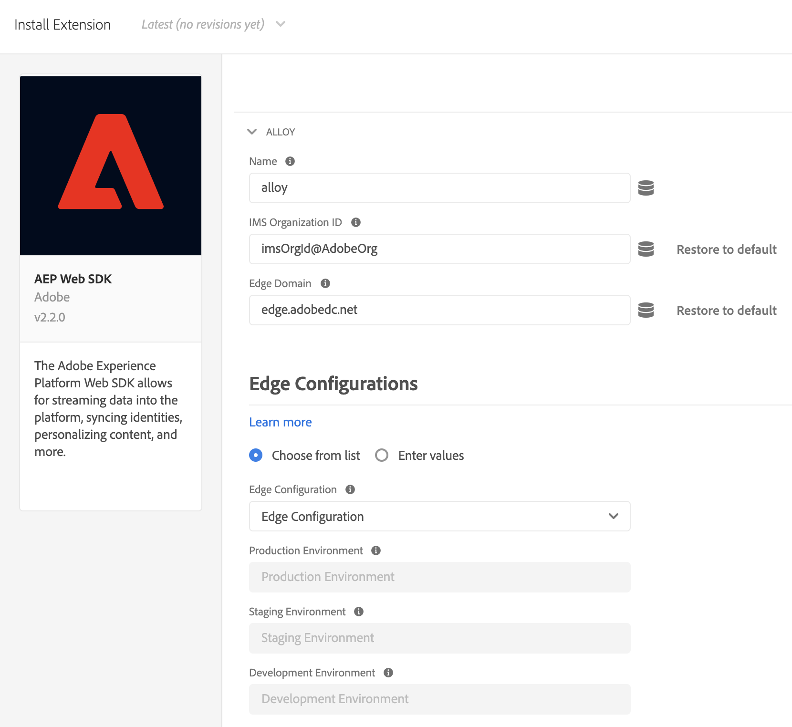
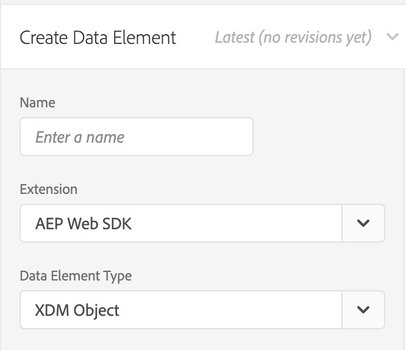

# Utilizzo di Offer Decisioning con Platform Web SDK

>[!NOTE]
>
>L’utilizzo di Offer Decisioning in Adobe Experience Platform Web SDK è disponibile in accesso anticipato per alcuni utenti. Questa funzionalità non è disponibile per tutte le organizzazioni.

Adobe Experience Platform [!DNL Web SDK] può distribuire ed eseguire il rendering di offerte personalizzate gestite in Offer Decisioning. Puoi creare le offerte e altri oggetti correlati utilizzando l’interfaccia utente o le API di Offer Decisioning.

## Prerequisiti

* L’organizzazione è abilitata per le decisioni edge
* Offerte, attività create
* Lo stream di dati è pubblicato

## Terminologia

Quando si lavora con Offer Decisioning, è importante comprendere la seguente terminologia. Per ulteriori informazioni e per visualizzare altri termini, visitare il [glossario di Offer decisioning](https://experienceleague.adobe.com/docs/offer-decisioning/using/get-started/glossary.html).

* **Ambiti decisionali:** Ad Offer decisioning, gli ambiti decisionali sono le stringhe con codifica Base64 di JSON contenenti gli ID di attività e posizionamento che il servizio offer decisioning deve utilizzare per proporre le offerte.

  *JSON ambito decisione:*

  ```json
  {
    "activityId":"xcore:offer-activity:11cfb1fa93381aca",
    "placementId":"xcore:offer-placement:1175009612b0100c"
  }
  ```

  *Stringa con codifica Base64 per ambito decisionale:*

  ```json
  "eyJhY3Rpdml0eUlkIjoieGNvcmU6b2ZmZXItYWN0aXZpdHk6MTFjZmIxZmE5MzM4MWFjYSIsInBsYWNlbWVudElkIjoieGNvcmU6b2ZmZXItcGxhY2VtZW50OjExNzUwMDk2MTJiMDEwMGMifQ=="
  ```

  >[!TIP]
  >
  >Puoi copiare il valore dell&#39;ambito della decisione dalla pagina **Panoramica attività** nell&#39;interfaccia utente.

  

* **Datastreams:** Per ulteriori informazioni, consulta la documentazione di [datastreams](/help/datastreams/overview.md).

* **Identità**: per ulteriori informazioni, leggere questa documentazione che illustra come [Platform Web SDK utilizza Identity Service](../../identity/overview.md).

## Abilitazione Offer decisioning

Per abilitare l’Offer decisioning, effettua le seguenti operazioni:

1. Abilitazione di Adobe Experience Platform nello [stream di dati](/help/datastreams/overview.md) e selezione della casella &quot;Offer decisioning&quot;

   

1. Segui le istruzioni per [installare l&#39;SDK](/help/web-sdk/install/overview.md) (l&#39;SDK può essere installato in modo autonomo o tramite l&#39;interfaccia utente. Per ulteriori informazioni, consulta la [guida rapida ai tag](/help/tags/quick-start/quick-start.md)).
1. Configurare l&#39;SDK, ad Offer decisioning utilizzando `personalization.decisionScopes`. Di seguito sono riportati ulteriori passaggi specifici per Offer decisioning.

   * Installare l’SDK autonomo

      1. Configurare l&#39;azione &quot;sendEvent&quot; con `personalization.decisionScopes`

     ```javascript
     alloy("sendEvent", {
       ...
       "personalization": {
         "decisionScopes": [
           "eyJhY3Rpdml0eUlkIjoieGNvcmU6b2ZmZXItYWN0aXZpdHk6MTIxYWIwOWMxM2JkZDIyNCIsInBsYWNlbWVudElkIjoieGNvcmU6b2ZmZXItcGxhY2VtZW50OjEyMWFiMDZhODRkMDViMTEifQ==",
           "eyJhY3Rpdml0eUlkIjoieGNvcmU6b2ZmZXItYWN0aXZpdHk6MTIxYWIyNWI5NTUwNWIxZiIsInBsYWNlbWVudElkIjoieGNvcmU6b2ZmZXItcGxhY2VtZW50OjEyMWFiMjFmOTQzMDE0MmIifQ=="
         ]
       }
     });
     ```

   * Installare l’SDK tramite tag

      1. [Creare una proprietà tag](/help/tags/ui/administration/companies-and-properties.md)
      1. [Aggiungi il codice di incorporamento](https://experienceleague.adobe.com/docs/core-services-learn/implementing-in-websites-with-launch/configure-launch/launch-add-embed.html)
      1. Installa e configura l’estensione Platform Web SDK con lo stream di dati creato selezionando la configurazione dal menu a discesa &quot;Stream di dati&quot;. Consulta la documentazione sulle [estensioni](/help/tags/ui/managing-resources/extensions/overview.md).

         

         

      1. Creare gli elementi dati [necessari](/help/tags/ui/managing-resources/data-elements.md). È necessario creare almeno una mappa identità di Platform Web SDK e un elemento dati di oggetti XDM di Platform Web SDK.

         

         

      1. Crea le [regole](/help/tags/ui/managing-resources/rules.md).

         * Aggiungi un&#39;azione Invia evento di Platform Web SDK e aggiungi `decisionScopes` alla configurazione di tale azione

         

      1. [Crea e pubblica una libreria](/help/tags/ui/publishing/libraries.md) contenente tutte le regole, gli elementi dati e le estensioni pertinenti che hai configurato

## Richieste di esempio e risposte

### Un valore `decisionScopes`

**Richiesta**

```json
{
  "events": [
    {
      "xdm": {
        "identityMap": {
          "ECID": [
            {
              "id": "91133425615229052182584359620783097099"
            }
          ]
        }
      },
      "query": {
        "personalization": {
          "decisionScopes": [
            "eyJhY3Rpdml0eUlkIjoieGNvcmU6b2ZmZXItYWN0aXZpdHk6MTFjZmIxZmE5MzM4MWFjYSIsInBsYWNlbWVudElkIjoieGNvcmU6b2ZmZXItcGxhY2VtZW50OjExNzUwMDk2MTJiMDEwMGMifQ=="
          ]
        }
      }
    }
  ]
}
```

| Proprietà | Obbligatorio | Descrizione | Limiti | Esempio |
|---|---|---|---|---|
| `identityMap` | Sì | Consulta questa [documentazione del servizio Identity](../../identity/overview.md). | Un’identità per richiesta. | `{ "identityMap": { "ECID": [ { "id": "91133425615229052182584359620783097099" } ] } }`. <br><br> Nota: gli utenti non devono includere il parametro `ECID` nella chiamata API. Se necessario, questo parametro viene aggiunto automaticamente alla chiamata. |
| `decisionScopes` | Sì | Array di stringhe JSON con codifica Base64 contenenti gli ID di attività e posizionamento. | Massimo 30 `decisionScopes` per richiesta. | `"decisionScopes": ["eyJhY3Rpdml0eUlkIjoieGNvcmU6b2ZmZXItYWN0aXZpdHk6MTFjZmIxZmE5MzM4MWFjYSIsInBsYWNlbWVudElkIjoieGNvcmU6b2ZmZXItcGxhY2VtZW50OjExNzUwMDk2MTJiMDEwMGMifQ=="]` |

**Risposta**

```json
{
  "requestId": "94c4f2f1-9218-43ce-afd3-eb0d853c5174",
  "handle": [
    {
      "payload": [
        {
          "id": "2862bb89-5df2-4bc6-85c2-d8f7e1a091de",
          "scope": "eyJhY3Rpdml0eUlkIjoieGNvcmU6b2ZmZXItYWN0aXZpdHk6MTFjZmIxZmE5MzM4MWFjYSIsInBsYWNlbWVudElkIjoieGNvcmU6b2ZmZXItcGxhY2VtZW50OjExNzUwMDk2MTJiMDEwMGMifQ==",
          "activity": {
            "id": "xcore:offer-activity:11cfb1fa93381aca",
            "etag": "2"
          },
          "placement": {
            "id": "xcore:offer-placement:1175009612b0100c",
            "etag": "1"
          },
          "items": [
            {
              "id": "xcore:personalized-offer:124cc332095cfa74",
              "schema": "https://ns.adobe.com/experience/offer-management/content-component-html",
              "etag": "1",
              "data": {
                "id": "xcore:personalized-offer:124cc332095cfa74",
                "format": "text/html",
                "language": [
                  "en-US"
                ],
                "content": "<p>20% Off on shipping</p>",
                "characteristics": {
                  "foo": "bar",
                  "foo1": "bar1"
                }
              }
            }
          ]
        }
      ],
      "type": "personalization:decisions",
      "eventIndex": 0
    }
  ]
}
```

| Proprietà | Descrizione | Esempio |
|---|---|---|
| `scope` | Ambito della decisione che ha portato alle offerte proposte. | `"scope": "eyJhY3Rpdml0eUlkIjoieGNvcmU6b2ZmZXItYWN0aXZpdHk6MTFjZmIxZmE5MzM4MWFjYSIsInBsYWNlbWVudElkIjoieGNvcmU6b2ZmZXItcGxhY2VtZW50OjExNzUwMDk2MTJiMDEwMGMifQ=="` |
| `activity.id` | ID univoco dell’attività di offerta. | `"id": "xcore:offer-activity:11cfb1fa93381aca"` |
| `placement.id` | ID univoco del posizionamento dell’offerta. | `"id": "xcore:offer-placement:1175009612b0100c"` |
| `items.id` | ID dell’offerta proposta. | `"id": "xcore:personalized-offer:124cc332095cfa74"` |
| `schema` | Schema del contenuto associato all’offerta proposta. | `"schema": "https://ns.adobe.com/experience/offer-management/content-component-html"` |
| `data.id` | ID dell’offerta proposta. | `"id": "xcore:personalized-offer:124cc332095cfa74"` |
| `format` | Il formato del contenuto associato all’offerta proposta. | `"format": "text/html"` |
| `language` | Un array di lingue associate al contenuto dell’offerta proposta. | `"language": [ "en-US" ]` |
| `content` | Contenuto associato all’offerta proposta sotto forma di stringa. | `"content": "<p style="color:red;">20% Off on shipping</p>"` |
| `deliveryUrl` | Contenuto immagine associato all’offerta proposta sotto forma di URL. | `"deliveryURL": "https://image.jpeg"` |
| `characteristics` | Caratteristiche associate all’offerta proposta nel formato di un oggetto JSON. | `"characteristics": { "foo": "bar", "foo1": "bar1" }` |

### Più valori `decisionScopes`

**Richiesta**

```json
{
  "events": [
    {
      "xdm": {
        "identityMap": {
          "ECID": [
            {
              "id": "91133425615229052182584359620783097099"
            }
          ]
        }
      },
      "query": {
        "personalization": {
          "decisionScopes": [
            "eyJhY3Rpdml0eUlkIjoieGNvcmU6b2ZmZXItYWN0aXZpdHk6MTFjZmIxZmE5MzM4MWFjYSIsInBsYWNlbWVudElkIjoieGNvcmU6b2ZmZXItcGxhY2VtZW50OjExNzUwMDk2MTJiMDEwMGMifQ==",
            "eyJhY3Rpdml0eUlkIjoieGNvcmU6b2ZmZXItYWN0aXZpdHk6MTIyMjA4YjNhODc0MDU1OCIsInBsYWNlbWVudElkIjoieGNvcmU6b2ZmZXItcGxhY2VtZW50OjEyMjIwNDUyOTUxNGEyYzAifQ==",
            "eyJhY3Rpdml0eUlkIjoieGNvcmU6b2ZmZXItYWN0aXZpdHk6MTIyYzkxMzg1Mjc2MDE4YyIsInBsYWNlbWVudElkIjoieGNvcmU6b2ZmZXItcGxhY2VtZW50OjEyMzMxZjU2MTYyYWEyZjcifQ=="
          ]
        }
      }
    }
  ]
}
```

| Proprietà | Obbligatorio | Descrizione | Limiti | Esempio |
|---|---|---|---|---|
| `identityMap` | Sì | Consulta questa [documentazione del servizio Identity](../../identity/overview.md). | Un’identità per richiesta. | `{ "identityMap": { "ECID": [ { "id": "91133425615229052182584359620783097099" } ] } }`. <br><br> Nota: gli utenti non devono includere il parametro `ECID` nella chiamata API. Se necessario, questo parametro viene aggiunto automaticamente alla chiamata. |
| `decisionScopes` | Sì | Array di stringhe JSON con codifica Base64 contenenti gli ID di attività e posizionamento. | Massimo 30 `decisionScopes` per richiesta. | `"decisionScopes":["eyJhY3Rpdml0eUlkIjoieGNvcmU6b2ZmZXItYWN0aXZpdHk6MTFjZmIxZmE5MzM4MWFjYSIsInBsYWNlbWVudElkIjoieGNvcmU6b2ZmZXItcGxhY2VtZW50OjExNzUwMDk2MTJiMDEwMGMifQ==", "eyJhY3Rpdml0eUlkIjoieGNvcmU6b2ZmZXItYWN0aXZpdHk6MTIyMjA4YjNhODc0MDU1OCIsInBsYWNlbWVudElkIjoieGNvcmU6b2ZmZXItcGxhY2VtZW50OjEyMjIwNDUyOTUxNGEyYzAifQ=="` |

**Risposta**

```json
{
  "requestId": "94c4f2f1-9218-43ce-afd3-eb0d853c5174",
  "handle": [
    {
      "payload": [
        {
          "id": "a2804dfb-a0ec-4df9-8311-59d3ecdeb642",
          "scope": "eyJhY3Rpdml0eUlkIjoieGNvcmU6b2ZmZXItYWN0aXZpdHk6MTFjZmIxZmE5MzM4MTEyMyIsInBsYWNlbWVudElkIjoieGNvcmU6b2ZmZXItcGxhY2VtZW50OjExNzUwMDk2MTJiMDExMjMifQ==",
          "activity": {
            "id": "xcore:offer-activity:11cfb1fa93381123",
            "etag": "1"
          },
          "placement": {
            "id": "xcore:offer-placement:1175009612b01123",
            "etag": "3"
          },
          "items": [
            {
              "id": "xcore:personalized-offer:11e36d4a22954123",
              "schema": "https://ns.adobe.com/experience/offer-management/content-component-text",
              "etag": "2",
              "data": {
                "id": "xcore:personalized-offer:11e36d4a22954123",
                "format": "text/text",
                "language": [
                  "en"
                ],
                "content": "20% Off on shipping",
                "characteristics": {
                  "foo2": "bar2"
                }
              }
            }
          ]
        },
        {
          "id": "a2804dfb-a0ec-4df9-8311-59d3ecdeb642",
          "scope": "eyJhY3Rpdml0eUlkIjoieGNvcmU6b2ZmZXItYWN0aXZpdHk6MTFjZmIxZmE5MzM4MWFjYSIsInBsYWNlbWVudElkIjoieGNvcmU6b2ZmZXItcGxhY2VtZW50OjExNzUwMDk2MTJiMDEwMGMifQ==",
          "activity": {
            "id": "xcore:offer-activity:11cfb1fa93381aca",
            "etag": "2"
          },
          "placement": {
            "id": "xcore:offer-placement:1175009612b0100c",
            "etag": "1"
          },
          "items": [
            {
              "id": "xcore:personalized-offer:11e36d4a2295415d",
              "schema": "https://ns.adobe.com/experience/offer-management/content-component-imagelink",
              "etag": "1",
              "data": {
                "id": "xcore:personalized-offer:11e36d4a2295415d",
                "format": "image/png",
                "language": [
                  "en"
                ],
                "deliveryURL": "https://image.jpeg",
                "characteristics": {
                  "foo": "bar",
                  "foo1": "bar1"
                }
              }
            }
          ]
        }
      ],
      "type": "personalization:decisions",
      "eventIndex": 0
    }
  ]
}
```

| Proprietà | Descrizione | Esempio |
|---|---|---|
| `scope` | Ambito della decisione che ha portato alle offerte proposte. | `"scope": "eyJhY3Rpdml0eUlkIjoieGNvcmU6b2ZmZXItYWN0aXZpdHk6MTFjZmIxZmE5MzM4MWFjYSIsInBsYWNlbWVudElkIjoieGNvcmU6b2ZmZXItcGxhY2VtZW50OjExNzUwMDk2MTJiMDEwMGMifQ=="` |
| `activity.id` | ID univoco dell’attività di offerta. | `"id": "xcore:offer-activity:11cfb1fa93381123"` |
| `placement.id` | ID univoco del posizionamento dell’offerta. | `"xcore:offer-placement:1175009612b01123"` |
| `items.id` | ID dell’offerta proposta. | `"id": "xcore:personalized-offer:11e36d4a22954123"` |
| `schema` | Schema del contenuto associato all’offerta proposta. | `"schema": "https://ns.adobe.com/experience/offer-management/content-component-text"` |
| `data.id` | ID dell’offerta proposta. | `"id": "xcore:personalized-offer:11e36d4a22954123"` |
| `format` | Il formato del contenuto associato all’offerta proposta. | `"format": "text/text"` |
| `language` | Un array di lingue associate al contenuto dell’offerta proposta. | `"language": [ "en-US" ]` |
| `content` | Contenuto associato all’offerta proposta sotto forma di stringa. | `"content": "<p style="color:red;">20% Off on shipping</p>"` |
| `deliveryUrl` | Contenuto immagine associato all’offerta proposta sotto forma di URL. | `"deliveryURL": "https://image.jpeg"` |
| `characteristics` | Caratteristiche associate all’offerta proposta nel formato di un oggetto JSON. | `"characteristics": { "foo": "bar", "foo1": "bar1" }` |

## Limitazioni

Alcuni vincoli di offerta non sono attualmente supportati con i flussi di lavoro di Edge Network per dispositivi mobili, ad esempio il limite. Il valore del campo Limite specifica quante volte un’offerta può essere presentata a tutti gli utenti. Per ulteriori dettagli, consulta [Documentazione su regole e vincoli di idoneità per le offerte](https://experienceleague.adobe.com/docs/offer-decisioning/using/managing-offers-in-the-offer-library/creating-personalized-offers.html#eligibility).
