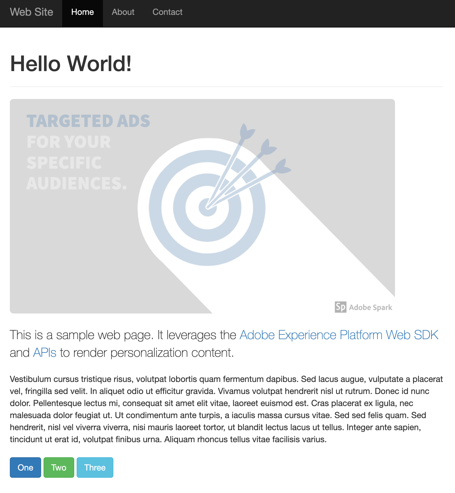

# Personalizzazione lato server tramite l’API server Edge Network

## Panoramica {#overview}

La personalizzazione lato server comporta l&#39;utilizzo di [Edge Network Server API](../../server-api/overview.md) per personalizzare l&#39;esperienza del cliente nelle proprietà Web.

Nell’esempio descritto in questo articolo, il contenuto di personalizzazione viene recuperato lato server, utilizzando l’API server. Quindi, il HTML viene sottoposto a rendering lato server, in base al contenuto di personalizzazione recuperato.

La tabella seguente mostra un esempio di contenuto personalizzato e non personalizzato.

| Pagina di esempio senza personalizzazione | Pagina di esempio con personalizzazione |
|---|---|
|  |  |

## Considerazioni {#considerations}

### Cookie {#cookies}

I cookie vengono utilizzati per rendere persistenti l’identità dell’utente e le informazioni sul cluster.  Quando si utilizza un’implementazione lato server, il server applicazioni gestisce l’archiviazione e l’invio di questi cookie durante il ciclo di vita della richiesta.

| Cookie | Scopo | Archiviato da | Inviato da |
|---|---|---|---|
| `kndctr_AdobeOrg_identity` | Contiene i dettagli dell’identità utente. | Server dell’applicazione | Server dell’applicazione |
| `kndctr_AdobeOrg_cluster` | Indica quale cluster di Edge Network deve essere utilizzato per soddisfare le richieste. | Server dell’applicazione | Server dell’applicazione |

### Posizionamento della richiesta {#request-placement}

Le richieste di Personalization sono necessarie per ottenere proposte e inviare una notifica di visualizzazione. Quando si utilizza un’implementazione lato server, il server applicazioni invia tali richieste all’API del server Edge Network.

| Richiesta | Creato da |
|---|---|
| Richiesta di interazione per recuperare le proposte | Server applicazioni che chiama l&#39;API del server Edge Network. |
| Richiesta di interazione per inviare notifiche di visualizzazione | Server applicazioni che chiama l&#39;API del server Edge Network. |

## Applicazione di esempio {#sample-app}

Il processo descritto di seguito utilizza un’applicazione di esempio che puoi utilizzare come punto di partenza per fare esperimenti e saperne di più su questo tipo di personalizzazione.

Puoi scaricare questo esempio e personalizzarlo in base alle tue esigenze. Ad esempio, puoi modificare le variabili di ambiente in modo che l’app di esempio estragga le offerte dalla tua configurazione di Experience Platform.

A tale scopo, aprire il file `.env` nella directory principale dell&#39;archivio e modificare le variabili in base alla configurazione. Riavvia l’app di esempio per sperimentare l’utilizzo di contenuti di personalizzazione.

### Esecuzione dell’esempio {#running-sample}

Segui i passaggi seguenti per eseguire l’app di esempio.

1. Clona [questo repository](https://github.com/adobe/alloy-samples) nel computer locale.
2. Aprire un terminale e passare alla cartella `personalization-server-side`.
3. Esegui `npm install`.
4. Esegui `npm start`.
5. Apri il browser Web e passa a `http://localhost`.

## Panoramica del processo {#process}

In questa sezione sono descritti i passaggi utilizzati per recuperare il contenuto di personalizzazione.

1. [Express](https://expressjs.com/) è utilizzato per un&#39;implementazione lato server snella. In questo modo vengono gestite le richieste di base del server e il routing.
2. Il browser richiede la pagina web. Sono inclusi tutti i cookie precedentemente memorizzati dal browser, con prefisso `kndctr_`.
3. Quando la pagina viene richiesta dal server app, viene inviato un evento all&#39;[endpoint di raccolta dati interattiva](../../../server-api/interactive-data-collection.md) per recuperare il contenuto di personalizzazione. L&#39;app di esempio utilizza metodi helper per semplificare la creazione e l&#39;invio di richieste all&#39;API (vedi [aepEdgeClient.js](https://github.com/adobe/alloy-samples/blob/main/common/aepEdgeClient.js)). La richiesta `POST` contiene `event` e `query`. I cookie del passaggio precedente, se disponibili, sono inclusi nell&#39;array `meta>state>entries`.

   ```js
   fetch(
   "https://edge.adobedc.net/ee/v2/interact?dataStreamId=abc&requestId=123",
   {
      headers: {
         accept: "*/*",
         "accept-language": "en-US,en;q=0.9",
         "cache-control": "no-cache",
         "content-type": "text/plain; charset=UTF-8",
         pragma: "no-cache",
         "sec-fetch-dest": "empty",
         "sec-fetch-mode": "cors",
         "sec-fetch-site": "cross-site",
         "sec-gpc": "1",
         "Referrer-Policy": "strict-origin-when-cross-origin",
         Referer: "http://localhost/",
      },
      body: JSON.stringify({
         event: {
         xdm: {
            web: {
               webPageDetails: {
               URL: "http://localhost/",
               },
               webReferrer: {
               URL: "",
               },
            },
            identityMap: {
               FPID: [
               {
                  id: "xyz",
                  authenticatedState: "ambiguous",
                  primary: true,
               },
               ],
            },
            timestamp: "2022-06-23T22:21:00.878Z",
         },
         data: {},
         },
         query: {
         identity: {
            fetch: ["ECID"],
         },
         personalization: {
            schemas: [
               "https://ns.adobe.com/personalization/default-content-item",
               "https://ns.adobe.com/personalization/html-content-item",
               "https://ns.adobe.com/personalization/json-content-item",
               "https://ns.adobe.com/personalization/redirect-item",
               "https://ns.adobe.com/personalization/dom-action",
            ],
            decisionScopes: ["__view__", "sample-json-offer"],
         },
         },
         meta: {
         state: {
            domain: "localhost",
            cookiesEnabled: true,
            entries: [
               {
               "key": "kndctr_XXX_AdobeOrg_identity",
               "value": "abc123"
               },
               {
               "key": "kndctr_XXX_AdobeOrg_cluster",
               "value": "or2"
               }
            ],
         },
         },
      }),
      method: "POST",
   }
   ).then((res) => res.json());
   ```

4. L’offerta Target dall’attività basata su modulo viene letta dalla risposta e utilizzata durante la produzione della risposta HTML.
5. Per le attività basate su moduli, gli eventi di visualizzazione devono essere inviati manualmente nell’implementazione per indicare quando è stata visualizzata l’offerta. In questo esempio, la notifica viene inviata lato server, durante il ciclo di vita della richiesta.

   ```js
   function sendDisplayEvent(aepEdgeClient, req, propositions, cookieEntries) {
   const address = getAddress(req);
   
   aepEdgeClient.interact(
      {
         event: {
         xdm: {
            web: {
               webPageDetails: { URL: address },
               webReferrer: { URL: "" },
            },
            timestamp: new Date().toISOString(),
            eventType: "decisioning.propositionDisplay",
            _experience: {
               decisioning: {
               propositions: propositions.map((proposition) => {
                  const { id, scope, scopeDetails } = proposition;
   
                  return {
                     id,
                     scope,
                     scopeDetails,
                  };
               }),
               },
            },
         },
         },
         query: { identity: { fetch: ["ECID"] } },
         meta: {
         state: {
            domain: "",
            cookiesEnabled: true,
            entries: [...cookieEntries],
         },
         },
      },
      {
         Referer: address,
      }
   );
   }
   ```

6. [!DNL Visual Experience Composer (VEC)] offerte vengono ignorate, poiché è possibile eseguirne il rendering solo tramite Web SDK.
7. Quando viene restituita la risposta del HTML, i cookie di identità e cluster vengono impostati nella risposta dal server applicazioni.