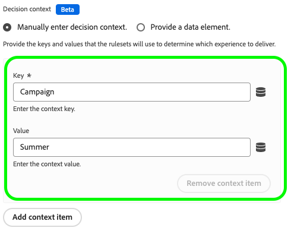

# Configurare il supporto per la messaggistica Web in-app in Web SDK

I messaggi in-app sono notifiche che puoi inviare agli utenti all’interno dell’applicazione web, guidandoli verso punti di interesse specifici.

Puoi utilizzare queste notifiche per diversi scopi, ad esempio per promuovere nuove funzioni, presentare offerte speciali o facilitare l’onboarding degli utenti.

Utilizzando i messaggi in-app, puoi interagire in modo efficace con il pubblico e indirizzarli verso aspetti importanti dell’applicazione.

>[!IMPORTANT]
>
>La messaggistica Web in-app è una funzionalità di [Adobe Journey Optimizer](https://experienceleague.adobe.com/docs/journey-optimizer/using/ajo-home.html?lang=it) che utilizza l&#39;SDK Web per distribuire il contenuto personalizzato.
>
>Per istruzioni dettagliate su come configurare la campagna di messaggistica in-app Web, consulta la [documentazione di Adobe Journey Optimizer](https://experienceleague.adobe.com/docs/journey-optimizer/using/in-app/create-in-app-web.html).


## Prerequisiti {#prerequisites}

### Versione estensione tag Web SDK {#extension-version}

La funzionalità di messaggistica in-app per web richiede la versione più recente dell’estensione tag SDK per web.

### Configurare un CSP per la messaggistica in-app web {#csp}

Quando configuri [Messaggistica Web in-app](../personalization/web-in-app-messaging.md), devi includere la seguente direttiva nel CSP:

```
default-src  blob:;
```

Per ulteriori informazioni sulla configurazione di un CSP, consulta la [documentazione dedicata](../use-cases/configuring-a-csp.md).

## Configurare la messaggistica Web in-app utilizzando l’estensione tag Web SDK {#tag-extension}

Consulta la [pagina di configurazione dell&#39;estensione tag Web SDK](../../tags/extensions/client/web-sdk/web-sdk-extension-configuration.md) per capire dove si trovano le impostazioni descritte di seguito.

Dopo aver [installato](../../tags/extensions/client/web-sdk/web-sdk-extension-configuration.md#install-the-web-sdk-tag-extension) l&#39;estensione tag Web SDK, segui i passaggi seguenti per configurare l&#39;estensione per la messaggistica in-app Web.

Nella sezione **[!UICONTROL Personalization]**, seleziona l&#39;opzione **[!UICONTROL Abilita archiviazione personalizzazione]**. Questa opzione consente all’SDK web di tenere traccia delle esperienze viste dall’utente nei vari caricamenti di pagina.


La messaggistica in-app Web supporta due tipi di trigger:

* [Invio di dati a Platform](#send-data-platform)
* [Attivazione manuale dei messaggi](#manual-trigger)

Consulta le sezioni seguenti per configurare l’estensione tag Web SDK in base ai trigger che desideri utilizzare.

### Passaggi di configurazione per il trigger **[!UICONTROL Send data to Platform]** {#send-data-platform}

Seleziona la proprietà tag che contiene l&#39;estensione Web SDK e [crea una nuova regola](../../tags/ui/managing-resources/rules.md##create-a-rule) con le seguenti impostazioni:

1. **[!UICONTROL Estensione]**: [!UICONTROL Core]
2. **[!UICONTROL Tipo evento]**: [!UICONTROL Libreria caricata (parte superiore della pagina)]

   

3. Seleziona **[!UICONTROL Mantieni modifiche]** per salvare la configurazione dell&#39;evento.

Successivamente, devi aggiungere un’azione alla regola creata.

1. Nella sezione [!DNL Actions], seleziona **[!UICONTROL Aggiungi]**.
   

2. Utilizza le impostazioni **[!UICONTROL Azione]** seguenti:
   * **[!UICONTROL Estensione]**: [!UICONTROL Adobe Experience Platform Web SDK]
   * **[!UICONTROL Tipo azione]**: [!UICONTROL Invia evento]

     

3. Nella parte destra dello schermo, nella sezione **[!UICONTROL Personalization]**, abilita l&#39;opzione **[!UICONTROL Rendering delle decisioni di personalizzazione visiva]**.
   

4. Nella parte destra della schermata, nella sezione **[!UICONTROL Contesto della decisione]**, definisci le coppie **[!UICONTROL Chiave]**/**[!UICONTROL Valore]** utilizzate nella configurazione della campagna per qualificarti per il messaggio in-app.
   

5. Seleziona **[!UICONTROL Mantieni modifiche]** per salvare la configurazione.


Successivamente, devi aggiungere la regola appena creata alla libreria delle proprietà del tag. A questo scopo, vai a **[!UICONTROL Flusso di pubblicazione]** e seleziona la regola creata in precedenza.


Dopo aver aggiunto la regola alla libreria, seleziona **[!UICONTROL Salva e genera in sviluppo]**.


Il processo di configurazione è ora completato e il messaggio è pronto per essere mostrato agli utenti.

### Passaggi di configurazione per l&#39;utilizzo di trigger manuali {#manual-trigger}

Seleziona la proprietà tag che contiene l&#39;estensione Web SDK e [crea una nuova regola](../../tags/ui/managing-resources/rules.md##create-a-rule) con le seguenti impostazioni:

1. **[!UICONTROL Estensione]**: [!UICONTROL Core]
2. **[!UICONTROL Tipo evento]**: [!UICONTROL Fare clic]
3. Imposta il trigger per un elemento specifico sulla pagina, identificabile da un selettore CSS a tua scelta.

   


Successivamente, devi aggiungere un’azione alla regola creata.

1. Nella sezione [!DNL Actions], seleziona **[!UICONTROL Aggiungi]**.
   

2. Utilizza le impostazioni **[!UICONTROL Azione]** seguenti:
   * **[!UICONTROL Estensione]**: [!UICONTROL Adobe Experience Platform Web SDK]
   * **[!UICONTROL Tipo azione]**: [!UICONTROL Valuta set di regole]

     

3. Sul lato destro della schermata, abilita l&#39;opzione **[!UICONTROL Esegui rendering delle decisioni di personalizzazione visiva]**.
   


4. Nella parte destra della schermata, nella sezione **[!UICONTROL Contesto della decisione]**, definisci le coppie **[!UICONTROL Chiave]**/**[!UICONTROL Valore]** utilizzate nella configurazione della campagna per qualificarti per il messaggio in-app.
   

5. Seleziona **[!UICONTROL Mantieni modifiche]** per salvare la configurazione.

Successivamente, devi aggiungere la regola appena creata alla libreria delle proprietà del tag. A questo scopo, vai a **[!UICONTROL Flusso di pubblicazione]** e seleziona la regola creata in precedenza.


Dopo aver aggiunto la regola alla libreria, seleziona **[!UICONTROL Salva e genera in sviluppo]**.


Il processo di configurazione è ora completato e il messaggio è pronto per essere mostrato agli utenti.

## Configurare la messaggistica Web in-app utilizzando la libreria JavaScript dell’SDK per web {#js-library}

In alternativa all’utilizzo dell’estensione tag Web SDK, puoi anche configurare la messaggistica Web in-app direttamente dalla libreria JavaScript dell’SDK web.


I messaggi web in-app provenienti da Adobe Journey Optimizer possono essere visualizzati in due modi.

### Metodo 1: recuperare automaticamente il contenuto di personalizzazione {#automatic}

Per fare in modo che Web SDK recuperi automaticamente il contenuto di personalizzazione al caricamento della pagina, utilizza il comando `sendEvent`, come illustrato nell&#39;esempio seguente.

```js
  alloy("sendEvent", {
      renderDecisions: true,
      personalization: {
          surfaces: ['#welcome']
      }
  });
```

### Metodo 2: recuperare manualmente il contenuto di personalizzazione in base all’azione dell’utente {#manual}

Per visualizzare il contenuto di personalizzazione solo dopo che l&#39;utente ha eseguito un&#39;azione specifica, utilizzare il comando `evaluateRulesets` come illustrato nell&#39;esempio seguente.

In questo esempio, il contenuto di personalizzazione viene visualizzato quando un utente fa clic sul pulsante **[!UICONTROL Acquista ora]** sul sito Web.

```js
 alloy("evaluateRulesets", {
     renderDecisions: true,
     personalization: {
         decisionContext: {
             "userAction": "buy_now"
         }
     }
 });
```

### Configurare l’archiviazione per la personalizzazione {#personalization-storage}

È possibile scegliere di mostrare i messaggi in-app agli utenti per un numero di volte impostato o ogni volta che visitano una pagina, tramite l&#39;opzione di configurazione `personalizationStorageEnabled`.

Nella configurazione di [Web SDK](../commands/configure/overview.md) impostare l&#39;opzione `personalizationStorageEnabled` in base alle proprie esigenze:

* `personalizationStorageEnabled: true` attiva il messaggio in-app con la frequenza definita nella [campagna Adobe Journey Optimizer](https://experienceleague.adobe.com/docs/journey-optimizer/using/in-app/create-in-app-web.html#configure-inapp).
* `personalizationStorageEnabled: false` attiva il messaggio in-app a ogni caricamento di pagina.
