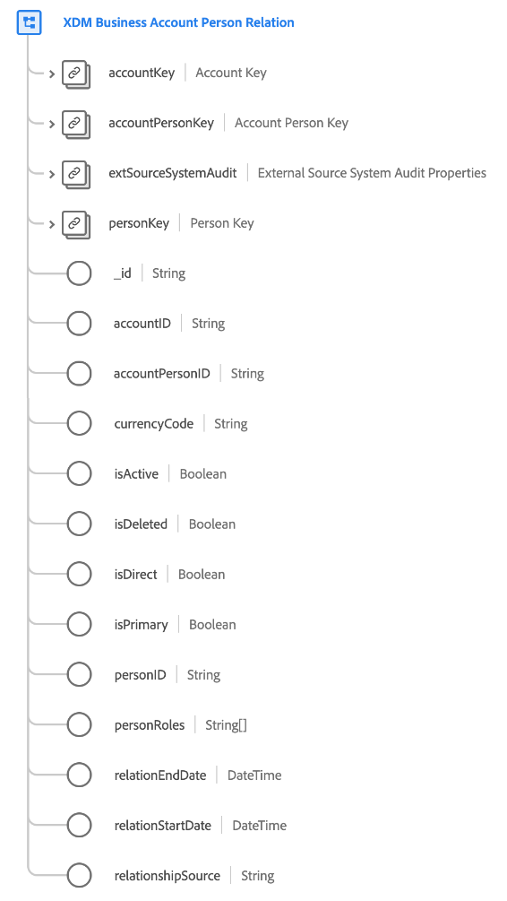

# [!UICONTROL Classe di ] relazione tra persone dell&#39;account aziendale XDM (Beta)

>[!IMPORTANT]
>
>Questa classe è disponibile come parte di Real-time Customer Data Platform B2B Edition, attualmente in versione beta. La documentazione e le funzionalità sono soggette a modifiche.

[!UICONTROL XDM Business Account Persona ] Relationship è una classe XDM (Experience Data Model) standard che acquisisce le proprietà minime richieste di una persona associata a un account aziendale.

| Proprietà | Tipo di dati | Descrizione |
| --- | --- | --- |
| `accountKey` | [[!UICONTROL Origine B2B]](../../data-types/b2b-source.md) | Identificatore composito per l&#39;account nella relazione account-persona. |
| `accountPersonKey` | [[!UICONTROL Origine B2B]](../../data-types/b2b-source.md) | Identificatore composito per l&#39;entità relazione conto-persona. |
| `extSourceSystemAudit` | [[!UICONTROL Attributi di controllo del sistema di origine esterna]](../../data-types/external-source-system-audit-attributes.md) | Se la relazione account-persona proviene da un sistema di origine esterno, questo oggetto acquisisce gli attributi di controllo per tale sistema. |
| `personKey` | [[!UICONTROL Origine B2B]](../../data-types/b2b-source.md) | Identificatore composito per la persona nella relazione account-persona. |
| `_id` | Stringa | Identificatore univoco del record. Si tratta di un valore generato dal sistema e separato dagli altri campi ID acquisiti dalla classe . |
| `accountID` | Stringa | Identificatore univoco per l&#39;account nella relazione account-persona. |
| `accountPersonID` | Stringa | Identificatore univoco per l&#39;entità relazione conto-persona. |
| `currencyCode` | Stringa | Codice valuta ISO 4217 utilizzato per il rapporto tra il conto e la persona. |
| `isActive` | Booleano | Indica se la relazione tra l&#39;account e la persona è attiva. |
| `isDirect` | Booleano | Indica se si tratta di una relazione diretta tra l&#39;account e la persona. |
| `isPrimary` | Booleano | Indica se la persona è il contatto principale su questo account. |
| `personID` | Stringa | Identificatore univoco per la persona nella relazione account-persona. |
| `personRole` | Stringa | Il ruolo della persona nella relazione account-persona. |
| `relationEndDate` | DateTime | Data di fine del rapporto tra l’account e la persona. |
| `relationStartDate` | DateTime | Data di inizio della relazione tra l&#39;account e la persona. |

{style=&quot;table-layout:auto&quot;}

Consulta la guida sulle [relazioni di schema in Real-time CDP B2B Edition](../../tutorials/relationship-b2b.md) per scoprire come questa classe si relaziona concettualmente alle altre classi B2B e come stabilire tali relazioni nell&#39;interfaccia utente di Adobe Experience Platform.
