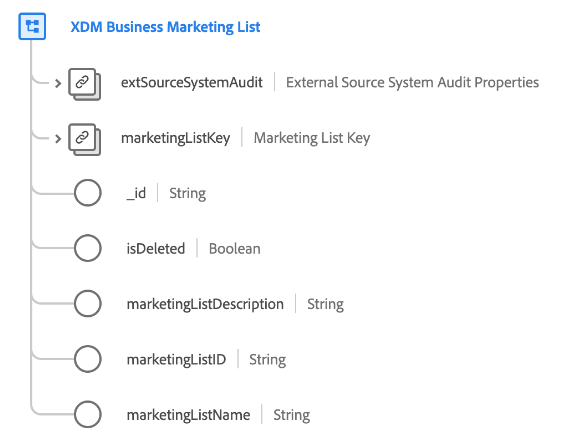

# [!UICONTROL Elenco di marketing aziendale XDM] Classe

>[!IMPORTANT]
>
>Questa classe è destinata ad essere utilizzata dalle organizzazioni con accesso [Real-time Customer Data Platform B2B Edition](../../../rtcdp/b2b-overview.md). È necessario avere accesso a Real-time CDP B2B Edition per consentire a questa classe di partecipare [Profilo cliente in tempo reale](../../../profile/home.md).

[!UICONTROL Elenco di marketing aziendale XDM] è una classe standard Experience Data Model (XDM) che acquisisce le proprietà minime richieste di un elenco di marketing. Gli elenchi di marketing ti consentono di assegnare priorità ai clienti potenziali che hanno più probabilità di acquistare il tuo prodotto.

| Proprietà | Tipo di dati | Descrizione |
| --- | --- | --- |
| `extSourceSystemAudit` | [[!UICONTROL Attributi di controllo del sistema di origine esterna]](../../data-types/external-source-system-audit-attributes.md) | Se l’elenco di marketing proviene da un sistema di origine esterno, questo oggetto acquisisce gli attributi di controllo per tale sistema. |
| `marketingListKey` | [[!UICONTROL Origine B2B]](../../data-types/b2b-source.md) | Identificatore composito per l&#39;entità elenco marketing. |
| `_id` | Stringa | Identificatore univoco del record. Si tratta di un valore generato dal sistema e separato dal `marketingListID`. |
| `marketingListDescription` | Stringa | Descrizione dell’elenco di marketing. |
| `marketingListID` | Stringa | Un ID univoco per l’entità elenco marketing. |
| `marketingListName` | Stringa | Nome dell&#39;elenco di marketing. |

{style=&quot;table-layout:auto&quot;}

Consulta la guida su [relazioni di schema in Real-time CDP B2B Edition](../../tutorials/relationship-b2b.md) per scoprire come questa classe si relaziona concettualmente alle altre classi B2B e come stabilire tali relazioni nell’interfaccia utente di Adobe Experience Platform.
