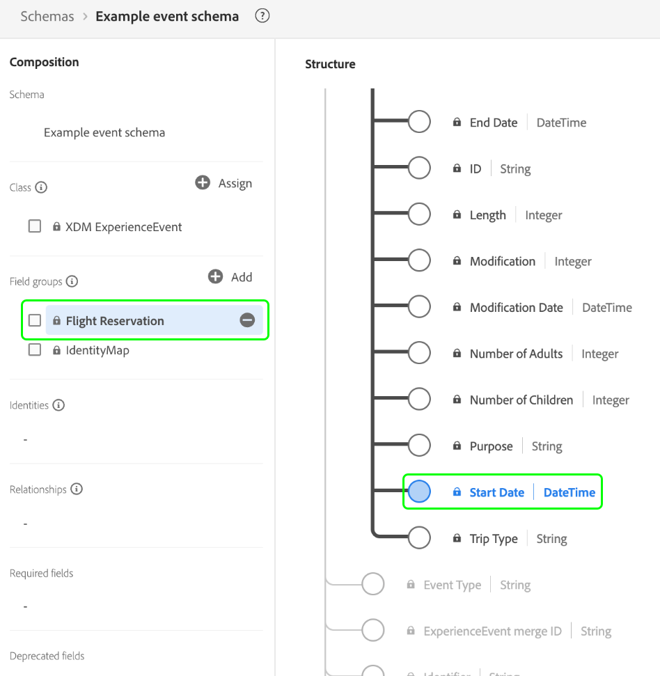

# [!DNL XDM ExperienceEvent] Classe

[!DNL XDM ExperienceEvent] è una classe standard Experience Data Model (XDM) che consente di creare un’istantanea con marca temporale del sistema quando si verifica un evento specifico o quando viene raggiunto un determinato set di condizioni.

Un evento di esperienza è un record di fatto di ciò che si è verificato, compreso il momento nel tempo e l&#39;identità dell&#39;individuo coinvolto. Gli eventi possono essere espliciti (azioni umane direttamente osservabili) o impliciti (generati senza un&#39;azione umana diretta) e sono registrati senza aggregazione o interpretazione. Per ulteriori informazioni di alto livello sull’utilizzo di questa classe nell’ecosistema della piattaforma, consulta la [panoramica XDM](../home.md#data-behaviors).

La classe [!DNL XDM ExperienceEvent] fornisce a uno schema diversi campi relativi alle serie temporali. I valori di alcuni di questi campi vengono compilati automaticamente al momento dell’acquisizione dei dati:

| Proprietà | Descrizione |
| --- | --- |
| `_id` | Identificatore stringa univoco per l&#39;evento. Questo campo viene utilizzato per tenere traccia dell’univocità di un singolo evento, per impedire la duplicazione dei dati e per cercare l’evento nei servizi a valle. In alcuni casi, `_id` può essere un [identificatore univoco universale (UUID)](https://tools.ietf.org/html/rfc4122) o [Identificatore univoco globale (GUID)](https://docs.microsoft.com/en-us/dotnet/api/system.guid?view=net-5.0).  Se trasferisci dati da una connessione di origine o acquisisci direttamente da un file Parquet, devi generare questo valore concatenando una determinata combinazione di campi che rendono l’evento unico, ad esempio un ID principale, una marca temporale, un tipo di evento e così via. Il valore concatenato deve essere una stringa in formato `uri-reference`, il che significa che è necessario rimuovere eventuali caratteri di due punti. In seguito, il valore concatenato deve essere dotato di hash utilizzando SHA-256 o un altro algoritmo scelto.  È importante distinguere che  **questo campo non rappresenta un&#39;identità correlata a una persona**, ma piuttosto il record dei dati stessi. I dati di identità relativi a una persona devono essere relegati a [campi di identità](../schema/composition.md#identity) forniti dai gruppi di campi compatibili. |
| `eventMergeId` | Se si utilizza [Adobe Experience Platform Web SDK](../../edge/home.md) per l’acquisizione dei dati, questo rappresenta l’ID del batch acquisito che ha causato la creazione del record. Questo campo viene compilato automaticamente dal sistema al momento dell’inserimento dei dati. L’utilizzo di questo campo al di fuori del contesto di un’implementazione SDK per web non è supportato. |
| `eventType` | Una stringa che indica il tipo o la categoria per l&#39;evento. Questo campo può essere utilizzato se desideri distinguere diversi tipi di eventi all’interno dello stesso schema e dello stesso set di dati, ad esempio distinguere un evento di visualizzazione prodotto da un evento add-to-shopping-cart per una società di vendita al dettaglio.  I valori standard per questa proprietà sono forniti nella sezione [ dell&#39;](#eventType)appendice, con le descrizioni del relativo caso d&#39;uso previsto. Questo campo è un enum estensibile, il che significa che puoi utilizzare anche stringhe del tipo di evento personalizzate per classificare gli eventi che stai tracciando.  `eventType` ti limita a utilizzare un solo evento per hit sull&#39;applicazione e devi quindi utilizzare campi calcolati per informare il sistema dell&#39;evento più importante. Per ulteriori informazioni, consulta la sezione sulle [best practice per i campi calcolati](#calculated). |
| `producedBy` | Valore stringa che descrive il produttore o l&#39;origine dell&#39;evento. Questo campo può essere utilizzato per filtrare alcuni produttori di eventi se necessario a scopo di segmentazione.  Alcuni valori consigliati per questa proprietà sono forniti nella sezione  [dell&#39;appendice](#producedBy). Questo campo è un enum estensibile, il che significa che è possibile utilizzare anche le proprie stringhe per rappresentare diversi produttori di eventi. |
| `identityMap` | Campo mappa che contiene un set di identità con spazi dei nomi per l’individuo a cui si applica l’evento. Questo campo viene aggiornato automaticamente dal sistema durante l’acquisizione dei dati di identità. Per utilizzare correttamente questo campo per [Profilo cliente in tempo reale](../../profile/home.md), non tentare di aggiornare manualmente il contenuto del campo nelle operazioni sui dati.  Per ulteriori informazioni sul relativo caso d’uso, consulta la sezione sulle mappe di identità nelle  [nozioni di base sulla ](../schema/composition.md#identityMap) composizione degli schemi . |
| `timestamp` | Una marca temporale ISO 8601 di quando si è verificato l’evento, formattata in base alla sezione 5.6](https://tools.ietf.org/html/rfc3339#section-5.6) della RFC 3339. [ Questa marca temporale deve essere presente in passato. Per le best practice sull’utilizzo di questo campo, consulta la sezione seguente sulle [marche temporali](#timestamps) . |

{style=&quot;table-layout:auto&quot;}

## Best practice per la modellazione degli eventi

Le sezioni seguenti descrivono le best practice per la progettazione degli schemi Experience Data Model (XDM) basati su eventi in Adobe Experience Platform.

### Marca temporale {#timestamps}

Il campo principale `timestamp` di uno schema evento può **solo** rappresentare l&#39;osservazione dell&#39;evento stesso e deve verificarsi nel passato. Se i casi di utilizzo della segmentazione richiedono l’uso di marche temporali che possono verificarsi in futuro, questi valori devono essere vincolati altrove nello schema Evento esperienza.

Ad esempio, se un&#39;azienda nel settore dei viaggi e dell&#39;ospitalità sta modellando un evento di prenotazione del volo, il campo a livello di classe `timestamp` rappresenta il momento in cui è stato osservato l&#39;evento di prenotazione. Gli altri timestamp relativi all’evento, ad esempio la data di inizio della prenotazione, devono essere acquisiti in campi separati forniti da gruppi di campi standard o personalizzati.

Mantenendo la marca temporale a livello di classe separata dagli altri valori datetime correlati negli schemi di evento, puoi implementare casi d’uso di segmentazione flessibili mantenendo un account con marca temporale dei percorsi cliente nell’applicazione di esperienza.

### Uso dei campi calcolati {#calculated}

Alcune interazioni nelle applicazioni di esperienza possono causare più eventi correlati che condividono tecnicamente la stessa marca temporale dell’evento e possono quindi essere rappresentati come un singolo record di eventi. Ad esempio, se un cliente visualizza un prodotto sul sito web, può verificarsi un record evento con due potenziali valori `eventType`: un evento &quot;visualizzazione prodotto&quot; (`commerce.productViews`) o un evento generico &quot;visualizzazione pagina&quot; (`web.webpagedetails.pageViews`). In questi casi, puoi utilizzare i campi calcolati per acquisire gli attributi più importanti quando più eventi vengono acquisiti in un singolo hit.

[Adobe Experience Platform Data ](../../data-prep/home.md) Preppiede consente di mappare, trasformare e convalidare i dati da e verso XDM. Utilizzando le funzioni di mappatura [disponibili](../../data-prep/functions.md) fornite dal servizio, è possibile richiamare operatori logici per assegnare la priorità, trasformare e/o consolidare i dati dai record con più eventi durante l&#39;acquisizione in Experience Platform. Nell’esempio precedente, puoi designare `eventType` come campo calcolato che dà priorità a una &quot;visualizzazione prodotto&quot; rispetto a una &quot;visualizzazione pagina&quot; ogni volta che si verificano entrambe.

Se acquisisci manualmente i dati in Platform tramite l’interfaccia utente, consulta la guida sulla [mappatura di un file CSV in XDM](../../ingestion/tutorials/map-a-csv-file.md) per passaggi specifici su come creare i campi calcolati.

Se i dati vengono inviati in streaming a Platform tramite una connessione sorgente, è possibile configurare l’origine in modo da utilizzare i campi calcolati. Per istruzioni su come implementare i campi calcolati durante la configurazione della connessione, consulta la [documentazione relativa alla specifica origine](../../sources/home.md) .

## Gruppi di campi dello schema compatibili {#field-groups}

>[!NOTE]
>
>I nomi di diversi gruppi di campi sono cambiati. Per ulteriori informazioni, consulta il documento sugli [aggiornamenti dei nomi dei gruppi di campi](../field-groups/name-updates.md) .

Adobe fornisce diversi gruppi di campi standard da utilizzare con la classe [!DNL XDM ExperienceEvent] . Di seguito è riportato un elenco di alcuni gruppi di campi di uso comune per la classe:

* [[!UICONTROL Dettagli di marketing per le campagne]](../field-groups/event/campaign-marketing-details.md)
* [[!UICONTROL Dettagli canale]](../field-groups/event/channel-details.md)
* [[!UICONTROL Dettagli Commerce]](../field-groups/event/commerce-details.md)
* [[!UICONTROL Dettagli ID utente finale]](../field-groups/event/enduserids.md)
* [[!UICONTROL Dettagli dell&#39;ambiente]](../field-groups/event/environment-details.md)
* [[!UICONTROL Dettagli Web]](../field-groups/event/web-details.md)

## Appendice

La sezione seguente contiene informazioni aggiuntive sulla classe [!UICONTROL XDM ExperienceEvent] .

### Valori accettati per `eventType` {#eventType}

La tabella seguente illustra i valori accettati per `eventType`, insieme alle relative definizioni:

| Valore | Definizione |
| --- | --- |
| `advertising.completes` | Una risorsa multimediale temporizzata è stata controllata al completamento. Questo non significa necessariamente che lo spettatore abbia guardato l&#39;intero video, dato che lo spettatore avrebbe potuto saltare in avanti. |
| `advertising.timePlayed` | Descrive il tempo trascorso da un utente su una specifica risorsa multimediale temporizzata. |
| `advertising.federated` | Indica se è stato creato un evento esperienza tramite la federazione di dati (condivisione di dati tra i clienti). |
| `advertising.clicks` | Fai clic su azioni su un annuncio. |
| `advertising.conversions` | Azioni predefinite eseguite da un cliente che attivano un evento per la valutazione delle prestazioni. |
| `advertising.firstQuartiles` | Un annuncio video digitale ha riprodotto fino al 25% della sua durata a velocità normale. |
| `advertising.impressions` | Impressioni di un annuncio pubblicitario per un cliente con il potenziale di essere visualizzato. |
| `advertising.midpoints` | Un annuncio video digitale ha riprodotto fino al 50% della sua durata a velocità normale. |
| `advertising.starts` | È iniziata la riproduzione di un annuncio video digitale. |
| `advertising.thirdQuartiles` | Un annuncio video digitale ha riprodotto fino al 75% della sua durata a velocità normale. |
| `web.webpagedetails.pageViews` | Una pagina web ha ricevuto una o più visualizzazioni. |
| `web.webinteraction.linkClicks` | Un collegamento è stato selezionato una o più volte. |
| `commerce.checkouts` | Si è verificato un evento di pagamento per un elenco di prodotti. Se in un processo di pagamento sono presenti più passaggi, può essere presente più di un evento di pagamento. Se sono presenti più passaggi, la marca temporale e la pagina/esperienza di riferimento per ogni evento vengono utilizzati per identificare ogni singolo evento (passaggio), rappresentato nell’ordine. |
| `commerce.productListAdds` | Un prodotto è stato aggiunto all’elenco dei prodotti o al carrello. |
| `commerce.productListOpens` | È stato inizializzato o creato un nuovo elenco di prodotti (carrello acquisti). |
| `commerce.productListRemovals` | Una o più voci di prodotto sono state rimosse da un elenco di prodotti o dal carrello. |
| `commerce.productListReopens` | Un cliente ha riattivato un elenco di prodotti (carrello acquisti) che non era più accessibile (abbandonato), ad esempio tramite un’attività di remarketing. |
| `commerce.productListViews` | Una o più visualizzazioni sono state ricevute da un elenco di prodotti o dal carrello acquisti. |
| `commerce.productViews` | Un prodotto ha ricevuto una o più visualizzazioni. |
| `commerce.purchases` | Un ordine è stato accettato. Questa è l’unica azione richiesta in una conversione di e-commerce. A un evento di acquisto deve essere fatto riferimento a un elenco di prodotti. |
| `commerce.saveForLaters` | Un elenco di prodotti è stato salvato per un utilizzo futuro, ad esempio un elenco dei desideri del prodotto. |
| `delivery.feedback` | Eventi di feedback per una consegna, ad esempio una consegna e-mail. |
| `message.feedback` | Eventi di feedback come sent/bounce/error per i messaggi inviati a un cliente. |
| `message.tracking` | Tracciamento di eventi come azioni aperte/clic/personalizzate sui messaggi inviati a un cliente. |

{style=&quot;table-layout:auto&quot;}

### Valori consigliati per `producedBy` {#producedBy}

La tabella seguente illustra alcuni valori accettati per `producedBy`:

| Valore | Definizione |
| --- | --- |
| `self` | Self |
| `system` | Sistema |
| `salesRef` | Rappresentante commerciale |
| `customerRep` | Rappresentante |
