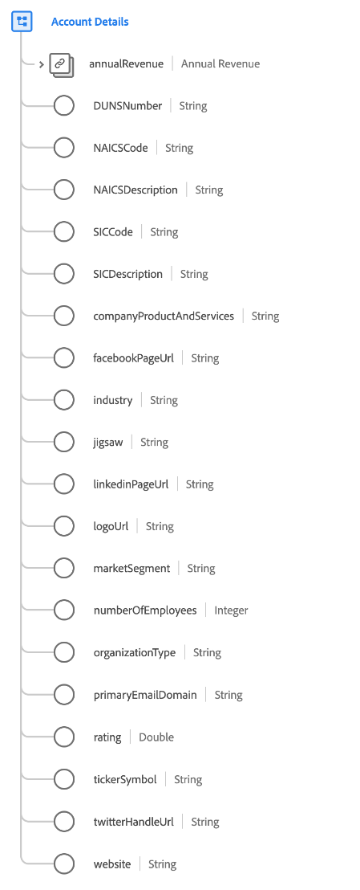

# [!UICONTROL Dettagli account] tipo di dati

[!UICONTROL Dettagli account] è un tipo di dati Experience Data Model (XDM) standard che descrive i dettagli relativi a un’organizzazione aziendale.

| Proprietà | Tipo di dati | Descrizione |
| --- | --- | --- |
| `annualRevenue` | [[!UICONTROL Valuta]](./currency.md) | Importo stimato delle entrate annuali dell’organizzazione. |
| `DUNSNumber` | Stringa | Numero D-U-N-S Dun &amp; Bradstreet dell’organizzazione. Si tratta di un numero non indicativo di nove cifre assegnato a ciascuna sede aziendale nel database di Dun &amp; Bradstreet con un’operazione univoca, separata e distinta ed è gestito esclusivamente da Dun &amp; Bradstreet. |
| `NAICSCode` | Stringa | La classificazione dell’organizzazione all’interno del North American Industry Classification System. |
| `NAICSDescription` | Stringa | Breve descrizione della linea di business di un’organizzazione, basata sul relativo codice NAICS. |
| `SICCode` | Stringa | Il codice SIC (Standard Industrial Classification) dell’organizzazione. Si tratta di un codice a quattro cifre che categorizza il settore a cui appartengono le aziende in base alle loro attività commerciali. |
| `SICDescription` | Stringa | Breve descrizione della linea di business di un’organizzazione, basata sul suo codice SIC. |
| `companyProductAndServices` | Stringa | I prodotti e i servizi che l’organizzazione tratta o in cui opera. |
| `facebookPageUrl` | Stringa | Un collegamento web all’account Facebook dell’organizzazione. |
| `industry` | Stringa | Il settore di cui questa organizzazione fa parte. Questo è un campo in formato libero ed è consigliabile utilizzare un valore strutturato per le query o utilizzare il `xdm:classifier` proprietà. |
| `jigsaw` | Stringa | La chiave Data.com dell’organizzazione. |
| `linkedinPageUrl` | Stringa | Un collegamento web all’account LinkedIn dell’organizzazione. |
| `logoUrl` | Stringa | Un percorso da combinare con l’URL di un’istanza Salesforce (ad esempio, `https://yourInstance.salesforce.com/`) per generare un URL per richiedere l&#39;immagine del profilo del social network associata all&#39;organizzazione. L&#39;URL generato restituisce un reindirizzamento HTTP (codice 302) all&#39;immagine del profilo del social network dell&#39;organizzazione. |
| `marketSegment` | Stringa | Il pubblico di mercato denominato a cui l’organizzazione partecipa. Questo è un campo in formato libero ed è consigliabile utilizzare un valore strutturato per le query o utilizzare il `xdm:identifier` proprietà. |
| `numberOfEmployees` | Intero | Il numero di dipendenti dell&#39;organizzazione. |
| `organizationType` | Stringa | Etichetta che descrive il tipo di organizzazione. |
| `primaryEmailDomain` | Stringa | Il dominio e-mail principale utilizzato dall’organizzazione per il proprio personale. |
| `rating` | Doppio | Il punteggio calcolato o la valutazione in stelle per questa organizzazione. `1` indica il punteggio massimo possibile, e `0` è la valutazione minima possibile. |
| `tickerSymbol` | Stringa | Il simbolo del mercato azionario per questo account. Massimo 20 caratteri. |
| `twitterHandleUrl` | Stringa | Collegamento a un sito web dell’handle di twitter dell’organizzazione. |
| `website` | Stringa | L’URL del sito web dell’organizzazione. |

{style="table-layout:auto"}

Per ulteriori dettagli sul tipo di dati, consulta l’archivio XDM pubblico:

* [Esempio compilato](https://github.com/adobe/xdm/blob/master/components/datatypes/b2b/account-organization.example.1.json)
* [Schema completo](https://github.com/adobe/xdm/blob/master/components/datatypes/b2b/account-organization.schema.json)
