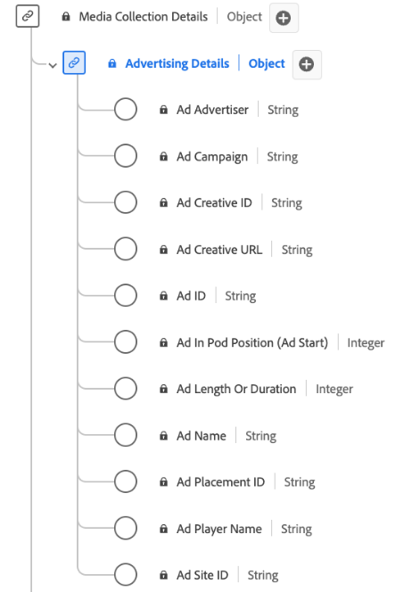

# Tipo di dati della raccolta [!UICONTROL Advertising Details]

La raccolta [!UICONTROL Advertising Details] è un tipo di dati XDM (Experience Data Model) standard che acquisisce gli attributi chiave relativi agli annunci pubblicitari. Include informazioni quali ID dell’annuncio, ID dell’inserzionista e della campagna, lunghezza, posizione all’interno di una sequenza, dettagli sul rendering dell’annuncio da parte del lettore e così via. Puoi utilizzare questo tipo di dati per monitorare e analizzare vari aspetti delle prestazioni e del coinvolgimento degli annunci, e fornire informazioni su come i tipi di pubblico interagiscono con e rispondono a diversi annunci pubblicitari. Queste informazioni vengono utilizzate per tenere traccia dei dati di streaming.

+++Selezionare questa opzione per visualizzare un diagramma del tipo di dati Raccolta dettagli di Advertising.

+++

>[!NOTE]
>
>Ogni nome visualizzato contiene un collegamento per ulteriori informazioni sui parametri audio e video. Le pagine collegate contengono dettagli sui dati degli annunci video raccolti da Adobe, i valori di implementazione, i parametri di rete, il reporting e considerazioni importanti.

| Nome visualizzato | Proprietà | Tipo di dati | Obbligatorio | Descrizione |
|-----------------------------------------------------------------------------------------------------------------------------------------------------------------|-----------------|-----------|----------|-----------------------------------------------------------------------------------------------------------------------|
| [[!UICONTROL Ad Advertiser]](https://experienceleague.adobe.com/docs/media-analytics/using/implementation/variables/ad-parameters.html#advertiser) | `advertiser` | stringa | No | Azienda o marchio il cui prodotto è presentato nell’annuncio. |
| [[!UICONTROL Ad Campaign]](https://experienceleague.adobe.com/docs/media-analytics/using/implementation/variables/ad-parameters.html#campaign-id) | `campaignID` | stringa | No | ID della campagna pubblicitaria. |
| [[!UICONTROL Ad Creative ID]](https://experienceleague.adobe.com/docs/media-analytics/using/implementation/variables/ad-parameters.html#creative-id) | `creativeID` | stringa | No | ID della creatività dell’annuncio. |
| [[!UICONTROL Ad Creative URL]](https://experienceleague.adobe.com/docs/media-analytics/using/implementation/variables/ad-parameters.html#creative-url) | `creativeURL` | stringa | No | URL della creatività dell’annuncio. |
| [[!UICONTROL Ad In Pod Position (Ad Start)]](https://experienceleague.adobe.com/docs/media-analytics/using/implementation/variables/ad-parameters.html#ad-start) | `podPosition` | intero | Sì | L’indice dell’annuncio all’interno dell’inizio dell’annuncio principale, ad esempio, il primo annuncio ha indice 0 e il secondo annuncio ha indice 1. |
| [[!UICONTROL Ad Length Or Duration]](https://experienceleague.adobe.com/docs/media-analytics/using/implementation/variables/ad-parameters.html#ad-length) | `length` | intero | Sì | La lunghezza dell’annuncio video in secondi. |
| [[!UICONTROL Ad Name]](https://experienceleague.adobe.com/docs/media-analytics/using/implementation/variables/ad-parameters.html#ad-name) | `friendlyName` | stringa | Sì | Nome leggibile dell’annuncio. Nella generazione rapporti, &quot;Nome annuncio&quot; è la classificazione e &quot;Nome annuncio (variabile)&quot; è l’eVar. |
| [[!UICONTROL Ad Placement ID]](https://experienceleague.adobe.com/docs/media-analytics/using/implementation/variables/ad-parameters.html#placement-id) | `placementID` | stringa | No | ID di posizionamento dell’annuncio. |
| [[!UICONTROL Ad Player Name]](https://experienceleague.adobe.com/docs/media-analytics/using/implementation/variables/ad-parameters.html#ad-player-name) | `playerName` | stringa | Sì | Nome del lettore responsabile del rendering dell’annuncio. |
| [[!UICONTROL Ad Site ID]](https://experienceleague.adobe.com/docs/media-analytics/using/implementation/variables/ad-parameters.html#site-id) | `siteID` | stringa | No | ID del sito dell’annuncio. |

{style="table-layout:auto"}
